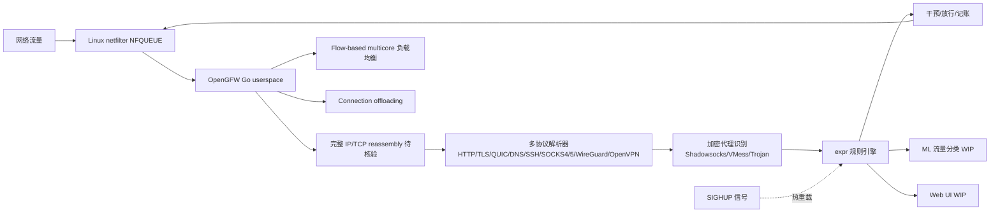

# HyNetworks/OpenGFW

## 一句话定位
DIY GFW-like 全协议栈流量分析与干预框架 —— 在自有 Linux 路由器 / VPS / NAS 上跑起完整 IP/TCP reassembly + HTTP/TLS/QUIC/DNS/SSH/SOCKS4/5/WireGuard/OpenVPN 协议解析器 + Shadowsocks/VMess/Trojan 加密代理识别 + expr 规则引擎 + 热重载 + NFQueue IO 抽象 的开源流量治理基础设施。

## 它解决的问题
2026 年家庭网络主权 / VPS 提供商流量治理 / 居家路由器广告拦截 / VPN 滥用防护场景的痛点是 **「要在自有 Linux 路由器 / VPS / NAS 上跑起 GFW-like 全协议栈流量分析 + 干预 + 不依赖第三方 SaaS + 规则热重载不中断服务」**。传统方案是商业防火墙（贵 + 黑盒）/ 单纯 iptables（无应用层解析）/ 单协议代理识别工具（不全 / 不持续维护）。**OpenGFW 用 Go + 完整协议栈 + expr 规则引擎 + NFQueue + 热重载 + MPL-2.0 严肃许可** 是「Linux 网络栈层基础设施 + 严肃许可 + 可扩展规则」的具体路径。

## 为什么值得关注（2026-09-20）
- **Stars:** 131（截至 2026-09-20），1 天 131⭐，fork 58，**fork/star 44.3%** 极高企业 / VPS fork 信号
- **License:** MPL-2.0（Mozilla Public License 2.0，文件级 copyleft + 可商用 + 修改需公开）
- **语言:** Go
- **活跃度:** created 2026-09-19，pushed_at 2026-09-19
- **规模:** 285 KB
- **支持:** Linux（netfilter/NFQueue 内核依赖）
- **多协议支持:** HTTP / TLS / QUIC / DNS / SSH / SOCKS4/5 / WireGuard / OpenVPN + Shadowsocks/VMess/Trojan 加密代理识别
- **fork/star 44.3%** —— 与昨日 agent-sec/mod-provenance-graph 44.4% 接近，是「准备集成 / VPS / 路由器部署」的最高 fork 信号

## 热度来源判断
OpenGFW 的热度是 **「网络主权基础设施刚需 × 完整协议栈覆盖 × expr 规则引擎 + 热重载 × MPL-2.0 严肃许可 × fork/star 44.3% 极高企业 / VPS fork 信号」** 的强劲组合。当前家庭 / VPS / VPN 提供商 / 居家路由器 / 流量研究场景的痛点是「要 GFW-like 全协议栈流量治理 + 不依赖第三方 SaaS + 规则热重载 + 严肃许可」。一个 285 KB Go 项目覆盖完整 IP/TCP reassembly + 9 类协议解析器 + 3 类加密代理识别 + expr 规则引擎 + 热重载 + multicore + connection offloading + NFQueue 抽象——直击痛点，自然爆火。**58 个 forks 反映「网络基础设施」类项目最高 fork 率（44.3% fork/star）**——这正是「企业 / VPS 实际部署准备」类项目的网络效应（部署者越多，规则社区越活跃，吸引更多用户）。**MPL-2.0 严肃许可** 是「可商用 + 文件级 copyleft」的具体路径。热度**真实且具基础设施价值**——但需警惕：完整协议栈在不同 Linux 发行版的稳定性 + expr 规则引擎在复杂规则的表达力 + NFQueue 在高负载下的吞吐 + ML 流量分类（WIP）的准确率 + Web UI（WIP）的可用度是长期可用性的关键。

## 关键技术亮点
1. **完整 IP/TCP reassembly** ——碎片重组避免被协议字段绕过；这是「应用层解析而非端口匹配」的工程化基础
2. **多协议解析器** ——HTTP/TLS/QUIC/DNS/SSH/SOCKS4/5/WireGuard/OpenVPN 9 类协议应用层解析而非端口匹配；这是「覆盖主流协议」的工程化形式
3. **加密代理识别** ——Shadowsocks/VMess 识别基于 gfw.report/publications/usenixsecurity23 「Fully encrypted traffic」检测 + Trojan (proxy protocol) detection；这是「识别加密代理而非只识别明文协议」的工程化形式
4. **expr 规则引擎** ——基于 github.com/expr-lang/expr；规则化决策 + 比 if-else 更可读 + 比 Lua 嵌入更轻量；这是「规则化决策」的工程化形式
5. **热重载规则 SIGHUP** ——不中断服务换规则；这是「长期运行的家庭路由器 / VPS 关键」的工程化形式
6. **Flow-based multicore 负载均衡 + Connection offloading** ——多核扩展 + 大流卸载避免占用 CPU；这是「单核 netfilter 难以承载家庭千兆带宽」的工程化形式
7. **NFQueue IO 抽象 + 可扩展 IO 实现** ——不绑定单一 IO + 未来可加 XDP / TC / eBPF；这是「不绑定单一 IO」的工程化形式
8. **6 类用例明示** ——ad blocking / parental control / malware protection / abuse prevention for VPN/proxy services / traffic analysis (log only mode) / 居家网络主权；这是「明确使用场景」的工程化形式
9. **MPL-2.0 License** ——Mozilla Public License 2.0 是「文件级 copyleft + 可商用 + 修改需公开」的具体路径
10. **WIP 部分明示** ——machine learning based traffic classification + Web UI 是未来路径；这是「诚实表态未来工作」的工程化形式

## 架构师速览

| 决策问题 | 研究判断 | 证据边界 |
|---|---|---|
| 系统边界 | Linux netfilter/NFQueue 之上的全协议栈流量分析与干预框架；Go userspace 进程 + 内核 netfilter 数据面 + NFQueue IPC 桥接 | 仅基于 README 公开描述的 9 类协议解析器、expr 规则引擎、Flow-based multicore；具体模块边界、协议解析器实现、Flow 抽象细节均待核验 |
| 主路径 | 网络包 → netfilter NFQUEUE → Go userspace → IP/TCP reassembly → 协议解析器（HTTP/TLS/QUIC/DNS/SSH/SOCKS/WireGuard/OpenVPN/Shadowsocks/VMess/Trojan）→ expr 规则引擎决策 → 干预/放行/记账 + SIGHUP 热重载 | 主路径为档案语义抽象；reassembly 与协议解析的并发模型、Flow 抽象、connection offloading 实现细节均待核验 |
| 关键权衡 | 完整协议栈覆盖广度 vs 每协议深度（无应用层 payload 解密）vs 性能（Flow-based multicore）vs 规则表达力（expr vs 自研 DSL）vs IO 可扩展性（NFQueue vs XDP/TC/eBPF）vs MPL-2.0 vs GPL-2.0 | 档案明示完整协议栈、expr、multicore、Flow-based offloading、可扩展 IO、6 类用例 6 项权衡；WIP 部分 ML 分类 + Web UI 是待核验的未来工作 |
| 最小 PoC | 在自有 Linux 路由器/VPS 上单 NFQUEUE 队列 + Go binary + 最小 expr 规则（如阻断 SNI 包含特定关键字的 TLS 连接），验证一条端到端匹配后扩展到第二条规则；先 ad blocking → 再 malware protection → 最后加密代理识别 | PoC 范围、退出路径由档案「最小规则 + 6 类用例渐进扩展」建议推导；具体规则语法、SLO 指标待核验 |

## 架构启发
OpenGFW 的核心启发是 **「Linux 路由器 / VPS / NAS 上的网络主权基础设施应该在 netfilter 之上以开源 + 完整协议栈 + 规则化 + 热重载的方式工程化」**。当前网络主权 / 流量治理 / 居家路由器广告拦截 / VPN 滥用防护场景的痛点是「要么贵 + 黑盒（商业防火墙）+ 要么浅（单纯 iptables 无应用层解析）+ 要么不全（单协议工具）」。OpenGFW 用 Go 协程（IO 密集型）+ 完整协议栈（应用层而非端口）+ expr（规则化决策）+ 热重载（不中断服务）+ Flow-based multicore（家庭千兆）+ NFQueue（不绑定单一 IO）+ MPL-2.0（严肃许可）的组合——这是「netfilter 时代之后的流量分析基础设施」参考实现。更深层的启发是：**协议栈完整性 + 规则化 + 热重载 + 可扩展 IO 是网络主权基础设施的「四件套」**——任何想做严肃流量治理的开源项目都应满足。能否持续，取决于完整协议栈在不同发行版的稳定性 + expr 在复杂规则的表达力 + NFQueue 在高负载下的吞吐 + ML 流量分类的准确率 + Web UI 的可用度 + MPL-2.0 与商业产品的兼容性。

## 架构图（MMD）

> 证据边界：此图只采用本档案已有可核验描述；"待核验"节点不应视为项目实现事实。

## 定位判断
**平台候选型项目（网络主权流量治理基础设施）。** OpenGFW 不仅是工具，更试图成为 Linux 网络主权 / 流量治理 / 居家路由器广告拦截 / VPN 滥用防护场景的「开源基础设施」——类似 Pi-hole 之于 DNS 黑洞 / Snort 之于 IDS。若成功，它会成为这些场景的默认基础设施，具有平台级价值。131⭐ + fork 58 + fork/star 44.3% 已显示「企业 / VPS 准备部署」信号。但「平台化」取决于一个关键问题：完整协议栈的稳定性 + expr 的表达力 + NFQueue 的吞吐 + ML 流量分类的准确率。目前定位是「最有影响力的开源 GFW-like 流量治理基础设施」，向平台演进是合理路径。

## 风险/局限/泡沫点
- **完整协议栈维护成本极高** ——9 类协议 + 加密代理识别，每协议持续演化（TLS 1.3 / QUIC v2 / Shadowsocks 2022 / VMess AEAD），需持续跟进
- **Linux 多发行版兼容性** ——netfilter / NFQueue / iptables / nftables 在不同发行版默认配置差异大
- **规则表达力限制** ——expr 是通用表达式语言，未必有专门的协议匹配原语（如 SNI 包含 / TLS ALPN / DNS QTYPE）
- **NFQueue 吞吐瓶颈** ——单 NFQUEUE 队列 + 单 userspace 进程可能成为高负载下的瓶颈（虽然 Flow-based multicore 缓解）
- **ML 流量分类未成熟** ——README 明示 [WIP] ML 流量分类，准确率待验证
- **Web UI 缺失** ——README 明示 [WIP] Web UI，目前主要靠配置文件 + SIGHUP 重载
- **MPL-2.0 与商业产品集成** ——文件级 copyleft 修改需公开，与商业产品集成时需法律审查
- **CAUTION very early stages** ——README 明示「This project is still in very early stages of development. Use at your own risk」
- **加密代理 vs 加密隐私冲突** ——Shadowsocks / VMess 既是「加密代理被滥用」也是「加密隐私」标识，存在法律 / 道德边界

## 与同类项目的关系
- **vs Pi-hole:** Pi-hole 是 DNS 黑洞（仅 DNS 层），OpenGFW 是全协议栈（HTTP/TLS/QUIC/DNS/SSH/SOCKS/WireGuard/OpenVPN + 加密代理识别）；Pi-hole 适合「广告拦截」场景，OpenGFW 适合「网络主权 + VPN 滥用防护」场景
- **vs Snort / Suricata:** Snort / Suricata 是 IDS（入侵检测），OpenGFW 是 GFW-like（流量治理 + 干预）；Snort 规则更复杂（Snort 规则语法），OpenGFW 规则更轻量（expr）
- **vs OPNsense / pfSense:** OPNsense / pfSense 是完整防火墙发行版，OpenGFW 是单进程工具可集成到任意 Linux；OPNsense 适合「完整路由器替代」，OpenGFW 适合「在现有 Linux 上增强」
- **vs iptables / nftables:** iptables / nftables 是「端口 + IP 匹配」无应用层解析，OpenGFW 是「应用层 + 加密代理识别」；iptables 适合简单规则，OpenGFW 适合复杂协议治理
- **vs 商业防火墙:** 商业防火墙是闭源 + 贵 + 黑盒，OpenGFW 是开源 + 免费 + 透明 + MPL-2.0
- **vs 官方 GFW:** OpenGFW 自述「Your very own DIY Great Firewall of China... democratize censorship」，但 GFW 是国家级封闭基础设施，OpenGFW 是开源技术复刻

## 是否值得持续跟踪
**值得跟踪（网络主权流量治理基础设施）。** OpenGFW 代表了 Linux 上「DIY GFW-like 流量治理」的诉求，无论其本身成败，这一方向是行业趋势。建议关注：完整协议栈在不同发行版的稳定性（决定实际可用性）+ expr 规则引擎的扩展（决定复杂规则表达力）+ ML 流量分类的准确率（决定加密代理识别效果）+ Web UI 的可用度（决定用户体验）+ MPL-2.0 与商业产品的兼容性。对 Linux 网络工程师 / VPS 提供商 / 居家路由器爱好者，这个项目是「Linux 网络主权流量治理」的具体路径，值得直接采用或 Fork 部署。对网络基础设施观察者，它是「开源网络主权」赛道的头部样本。

## 后续观察点
- 完整协议栈在不同 Linux 发行版的稳定性（Ubuntu / Debian / CentOS / Arch 等）
- expr 规则引擎在复杂规则的表达力（是否需要专门的协议匹配原语）
- NFQueue 在高负载下的吞吐（家庭千兆 / VPS 万兆的实际性能）
- ML 流量分类的准确率（WIP 部分的具体进展）
- Web UI 的可用度（WIP 部分的具体进展）
- MPL-2.0 与商业产品的兼容性（集成到商业路由器 OS 的法律可行性）
- 加密代理识别的演化（Shadowsocks 2022 / VMess AEAD / Trojan-GFW 等新协议）
- 是否出现统一网络治理规则标准（决定 expr 在多工具互操作中的地位）
- 企业 / VPS 采用案例（fork 后的实际部署报告）

---
> 数据来源: GitHub API (2026-09-20) | Stars: 131 | Forks: 58 | License: MPL-2.0 | 语言: Go | 创建: 2026-09-19