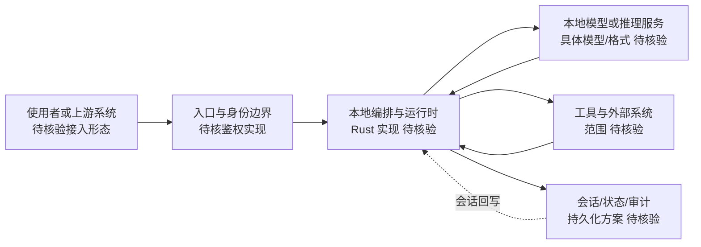

# OpenHuman

## 一句话定位
个人 AI 超级智能系统，私有、简单、极其强大，Rust 构建的全本地部署方案。

## 它解决的问题
用户对云端 AI 的数据隐私日益担忧，同时希望拥有强大的个人 AI 助手。OpenHuman 试图提供全本地运行的「个人超级智能」，兼顾隐私和能力。

目标用户：隐私敏感的技术用户、个人知识管理者、本地优先（local-first）倡导者。

## 为什么值得关注（2026-05-19）

16.9K⭐，Rust 实现，GitHub Trending 今日上榜。「个人 AI 超级智能」的叙事宏大，但项目描述过于抽象。Rust 技术栈选择值得关注——表明对性能和资源效率的重视。

## 热度来源判断
热度 40% 真实需求 + 60% 概念驱动。「个人 AI 超级智能」的定位过于模糊，缺少具体功能描述。需要看实际交付物来判断。

## 关键技术亮点亮点
1. **Rust 全栈**：性能和内存安全，适合本地部署场景
2. **隐私优先设计**：全本地运行，数据不离开设备
3. **1.5K forks**：有一定社区参与度

## 架构师速览

| 决策问题 | 研究判断 | 证据边界 |
|---|---|---|
| 系统边界 | 入口/身份层、本地编排运行时、外部工具与数据源之间的边界；当前为研究抽象，未由源码确认 | 依据项目分类、Rust 语言、tags 与档案描述，组件实现细节待核验 |
| 主路径 | 请求 → 入口与身份 → 本地编排运行时 → 模型推理与工具调用 → 状态/会话/审计回写 | 主路径为本档案架构启发推导，非源码核验 |
| 关键权衡 | 本地隐私/算力上限 vs 全栈个人 AI 雄心，以及与 Ollama / Jan.ai / LM Studio 的差异化定位 | 基于档案"风险/局限"及"与同类项目的关系"段 |
| 最小 PoC | 单入口、单模型权重、最小工具集、可审计日志；先验证本地算力可行性与隐私边界，再扩接入 | 来自"采用建议"段；具体模型选型与硬件门槛待核验 |

## 架构启发
- Local-first AI 是值得关注的趋势，但技术成熟度远未到生产级
- Rust 在 AI 基础设施中的渗透持续加速

## 架构图（MMD）

> 证据边界：此图只采用本档案已有可核验描述；“待核验”节点不应视为项目实现事实。

## 定位判断
概念验证阶段。定位为「个人 AI」但功能边界不清晰。可能演化方向：本地 AI 助手框架 / 个人知识管理系统 / 端侧 AI 运行时。

## 风险 / 局限 / 泡沫点
1. **概念模糊**：「超级智能」没有明确定义，无法评估交付质量
2. **本地算力瓶颈**：个人设备运行复杂 AI 模型的能力有限
3. **与 Ollama/LM Studio 重叠**：本地 LLM 运行已有成熟方案

## 与同类项目的关系
- **vs Ollama**：Ollama 专注模型运行，OpenHuman 试图做完整个人 AI 系统
- **vs Jan.ai**：Jan 也是本地 AI 助手，更成熟
- **vs LM Studio**：LM Studio 专注模型管理和推理，不做 Agent 能力

## 是否值得持续跟踪
**观察。** 概念吸引人但需要看到具体交付。下次出现时重点检查功能实现。

## 后续观察点
1. 是否能展示具体的个人 AI 功能（而非泛泛的「超级智能」）
2. 与 Ollama 等 Local LLM 生态的关系
3. Rust AI 生态中是否能形成独特定位

---
*首次记录：2026-05-19*
