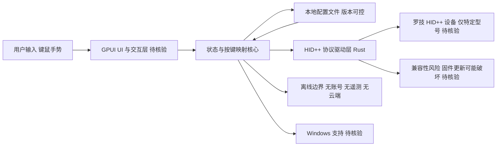

# OpenLogi

## 一句话定位
Rust 实现的 Logitech Options+ 本地替代，通过 HID++ 协议直接驱动罗技鼠标，无账号、无遥测、无云端。

## 它解决的问题
Logitech Options+ 强制账号登录 + 云端同步 + 遥测追踪，用户丧失外设控制权和数据隐私。开发者、隐私敏感用户需要本地优先的硬件驱动方案。

## 为什么值得关注（2026-06-06）
本地优先运动从软件领域延伸到硬件外设。OpenLogi 用 Rust + HID++ 协议证明：硬件驱动也可以做到本地优先。4K stars + Apache 2.0 + 仅 57 个 issues 说明市场需求真实。

## 热度来源判断
- Logitech Options+ 的强制登录 + 遥测引发用户不满
- Rust 语言在系统编程领域的吸引力
- 隐私 / 本地优先运动的持续扩展
- MX Master 系列在开发者中普及率极高
- 4K stars 增长快，话题度持续

## 关键技术亮点亮点
1. **HID++ 协议原生实现**：直接通过 HID 协议与罗技设备通信，不依赖官方驱动
2. **Rust + GPUI 框架**：内存安全 + 原生性能，GPUI 提供 GPU 加速 UI
3. **SmartShift 自动滚轮**：自动检测滚动速度切换自由滚轮/棘轮模式
4. **DPI 调节**：通过 HID++ 命令动态调整鼠标 DPI
5. **按键重映射**：自定义按键功能，不依赖云端配置同步
6. **完全离线**：无账号、无遥测、无自动更新检查

## 架构师速览

| 决策问题 | 研究判断 | 证据边界 |
|---|---|---|
| 系统边界 | 桌面端本地工具，边界落在用户进程内：UI/交互层、配置/HID++ 协议驱动层、本地配置文件；不触达云端或账号系统 | 仅基于 Rust、local-first、HID、隐私、GPUI 标签与档案"无账号/无遥测/无云端"陈述；具体模块切分需源码核验 |
| 主路径 | 用户按键/手势输入 → GPUI UI → 状态与重映射逻辑 → HID++ 直发至罗技设备；DPI/SmartShift/按键映射通过本地配置驱动 | 档案列出 HID++、SmartShift、DPI、按键重映射等能力点，但内部数据流与 IPC 细节属"待核验" |
| 关键权衡 | 完全离线与设备覆盖广度的取舍：牺牲跨平台/全型号覆盖，换取无云、无遥测、无账号 | 档案明确 macOS/Linux 为主、Windows 不确定、设备兼容性受限；bus factor=1；HID++ 协议逆向风险 |
| 最小 PoC | 选一款档案已点名的罗技鼠标，在 macOS/Linux 跑通"DPI 切换 + 单键重映射 + SmartShift 自动滚轮"三项本地配置闭环，验证固件升级后是否失效 | 设备型号支持矩阵、固件兼容窗口、Windows 支持、错误恢复路径在档案中均未给出，属"待核验" |

## 架构启发
本地优先硬件驱动的设计模式：
- **协议层**：HID++ 直通，绕过厂商 SDK
- **驱动层**：Rust 内存安全 + 低延迟
- **UI 层**：GPUI GPU 加速，原生体验
- **配置层**：本地配置文件，版本可控

这个模式可以迁移到其他硬件外设领域（键盘、手柄、显示器）。

## 架构图（MMD）

> 证据边界：此图只采用本档案已有可核验描述；“待核验”节点不应视为项目实现事实。

## 定位判断
**工具型。** 面向特定用户群体的优质工具。不演变为平台或基础设施，但在本地优先运动中有标志性价值。

## 风险 / 局限 / 泡沫点
1. **设备兼容性**：当前只支持特定型号，全罗技产品线覆盖需要大量工作
2. **HID++ 协议逆向**：依赖逆向工程，罗技固件更新可能破坏兼容
3. **单人开发**：AprilNEA 为主开发者，bus factor = 1
4. **平台覆盖**：目前主要支持 macOS/Linux，Windows 支持不确定
5. **法律风险**：虽然不使用官方 SDK，但 HID++ 协议使用可能面临厂商挑战

## 与同类项目的关系
| 项目 | 定位 | 差异 |
|------|------|------|
| Logitech Options+ | 官方驱动 | 强制账号 + 云端，用户不满 |
| Piper | Linux 罗技配置工具 | 只支持 Linux，功能较少 |
| Solaar | Linux 罗技管理 | Python，仅 Linux |

## 是否值得持续跟踪
**是。** 本地优先硬件运动的标杆项目。如果成功，可能激励更多硬件外设的本地替代项目。

## 后续观察点
1. 设备支持范围扩展速度
2. Windows 平台支持是否出现
3. 社区贡献者增长情况（当前 bus factor 风险）
4. 罗技官方反应（限制 vs 默许）

---
*首次记录：2026-06-06*
