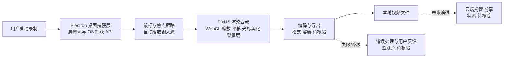

# siddharthvaddem/openscreen

## 一句话定位
开源免费的高质量屏幕录制工具——Screen Studio 的开源替代品，无订阅、无水印、可商用，用 Electron + PixiJS 打造精美录制效果。

## 它解决的问题
Screen Studio 等商业屏幕录制工具提供了精美的录制效果（自动缩放、光标高亮、平滑动画、壁纸背景），但价格昂贵且闭源。开发者/内容创作者需要一个免费、开源、可商用的替代品。OpenScreen 填补了这个空白，用 Electron + PixiJS 实现了接近 Screen Studio 品质的录制体验。

## 为什么值得关注
- **Stars:** 39,861 stars！增速极快，开源录制工具赛道头部
- **Forks:** 3,051
- **完全免费**：无订阅、无水印、可商用
- **Electron + PixiJS**：跨平台（macOS/Windows/Linux）
- **Screen Studio 替代定位**：明确对标，降低用户认知成本
- 高质量录制效果（缩放、光标、背景等）

## 热度来源判断
- **内容创作需求爆发（极高）**：视频教程/演示需求暴增
- **Screen Studio 定价过高（高）**：用户寻找免费替代
- **开源社区推崇（高）**：免费+开源+可商用的组合极具吸引力
- **跨平台需求（中高）**：Screen Studio 仅 macOS，OpenScreen 覆盖全平台

## 关键技术亮点亮点
1. **PixiJS 动画引擎**：用 WebGL 渲染实现流畅缩放/平移/高亮动画
2. **Electron 跨平台**：一套代码覆盖 macOS/Windows/Linux
3. **自动缩放跟随**：录制时自动聚焦鼠标区域，类似 Screen Studio
4. **精美背景**：桌面壁纸/渐变背景增强视觉效果
5. **光标美化**：自定义光标样式和点击动画
6. **可定制**：开源代码允许用户自定义录制效果

## 架构师速览

| 决策问题 | 研究判断 | 证据边界 |
|---|---|---|
| 系统边界 | 桌面端录制工具，UI 层（Electron）与渲染/动画层（PixiJS）耦合于同一进程；输出为本地视频文件，无档案中可证的网络服务依赖 | 仅基于标签 electron / pixijs / screen-capture 与定位描述，未见 README 中的实际 IPC、文件编码或持久化细节 |
| 主路径 | 用户启动 → 屏幕捕获（Electron 桌面捕获 API）→ 鼠标/焦点跟踪 → PixiJS 合成缩放、光标、背景层 → 编码输出 | 主路径末段编码器、容器格式在档案中未证实，标注待核验 |
| 关键权衡 | WebGL 动画效果 vs Electron 内存/CPU 开销；跨平台一致体验 vs 各 OS 捕获 API 差异；本地离线 vs 未来可能的云托管演进 | 性能数据未给出；云托管属“后续观察点”，当前档案无服务化证据 |
| 最小 PoC | 在 macOS/Win/Linux 上分别录制一段含鼠标交互的 1080p 视频，对比自动缩放跟随准确性、CPU/内存峰值、导出文件大小与画质 | 输出格式、码率上限、AI 集成等均未在档案中确认，须以源码核验 |

## 架构启发
- **PixiJS for UI**：不只做游戏，PixiJS 可用于精美 UI 动画
- **开源替代策略**：选一个贵的商业工具做免费开源替代，是高增长策略
- **Electron 仍是跨平台桌面首选**：对于需要丰富动画的工具，Electron 比 Tauri 更合适

## 架构图（MMD）

> 证据边界：此图只采用本档案已有可核验描述；“待核验”节点不应视为项目实现事实。

## 定位判断
**爆款工具型项目**。精准命中"免费 Screen Studio 替代"需求，39k stars 说明市场认可度高。有潜力成为内容创作者的标准工具。

## 风险/局限/泡沫点
- **性能开销**：Electron 应用内存和 CPU 占用较高
- **录制质量**：可能不及 Screen Studio 精致（自动优化算法）
- **维护可持续性**：39k stars 对个人维护者压力大
- **功能差距**：Screen Studio 有成熟的后期编辑功能，OpenScreen 可能不完整
- **竞品涌现**：Cap、Loom 等免费/免费增值工具竞争

## 与同类项目的关系
- **vs Screen Studio**：直接对标，免费开源 vs 付费闭源
- **vs OBS Studio**：OBS 偏直播/专业录制，OpenScreen 偏精美演示
- **vs Cap**：Cap 也是开源录制工具，定位接近
- **vs Loom**：Loom 偏异步视频沟通（含托管），OpenScreen 偏本地录制

## 是否值得持续跟踪
**推荐跟踪。** 作为开源录制工具标杆，其技术实现（PixiJS 动画）和产品策略（免费替代商业工具）都值得学习。

## 后续观察点
- 是否推出云端托管/分享功能（向 Loom 模式演进）
- Windows/Linux 版本的稳定性和录制质量
- 与 AI 工具的集成（如自动生成字幕/摘要）
- 社区贡献的录制效果插件
- 是否有商业化路径（如企业版/托管版）

---
> 数据来源: GitHub API (2026-06-17) | Stars: 39,861 | Forks: 3,051 | 语言: TypeScript
