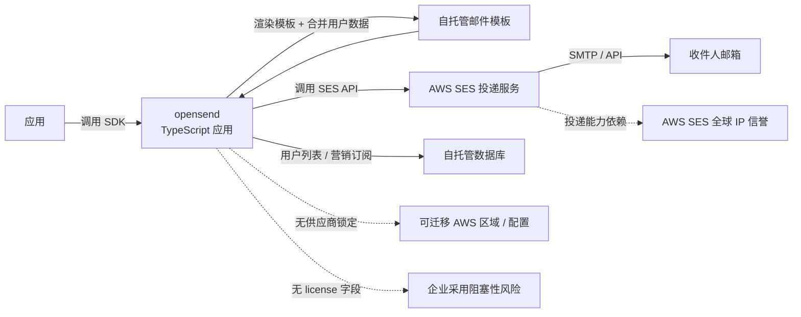

# R44VC0RP/opensend

## 一句话定位
opensend——AWS SES 之上的自托管事务与营销邮件层；TypeScript；不锁死在单一 SaaS 邮件服务商（Resend / SendGrid / Mailgun 等）。

## 它解决的问题
2025-2026 年 SaaS 邮件服务商（Resend / SendGrid / Mailgun / Postmark 等）爆发，但企业 / 开发者面临"邮件数据外发合规 + 营销 / 事务双功能 + 不被单一供应商锁定"的三角困境。**opensend 把「AWS SES 作为底层投递服务 + 自托管事务/营销邮件层 + TypeScript SDK」打包**，让用户在保留 AWS SES 高投递率的同时，拥有自托管邮件层的灵活性。

## 为什么值得关注（2026-09-12）
- 3 天 117⭐ / fork 7
- TypeScript + Node.js
- 2.3 MB 仓库 size
- README 自述 "self-hosted transactional & marketing email layer on top of aws ses"
- 仓库无 license 字段（**潜在合规风险信号**）

## 热度来源判断
SaaS 邮件服务商在 2026 年爆发（Resend 估值飙升 / Postmark 被 ActiveCampaign 收购 / Mailgun 私有化），"被锁定"的焦虑在开发者圈上升。**opensend 切入"邮件投递 + 数据自托管"细分**——AWS SES 提供底层投递能力，自托管层提供事务 + 营销双功能。**热度来源是「邮件 SaaS 锁定焦虑 × AWS SES 投递能力认可 × TypeScript 开发者基数 × 自托管合规刚需」四因素叠加**。但 117⭐ / fork 7 反映早期阶段，主要是被"自托管邮件"理念吸引的用户群。**热度真实但属于细分市场**，且**无 license 字段是关键风险信号**。

## 关键技术亮点
1. **AWS SES 作为投递后端**：利用 AWS SES 高投递率与全球 IP 信誉
2. **事务 + 营销双功能**：一个平台同时支持事务邮件（OTP / 通知 / 重置）和营销邮件（newsletter / campaign / drip）
3. **自托管架构**：邮件数据、模板、用户列表全部自托管，不外发到 SaaS 服务商
4. **TypeScript + Node.js**：现代技术栈，易于二次开发
5. **无供应商锁定**：用户可随时切换 SES 配置或迁移到其他 AWS 区域

## 架构师速览

| 决策问题 | 研究判断 | 证据边界 |
|---|---|---|
| 系统边界 | TypeScript 应用 + AWS SES SDK + 自托管邮件模板与用户列表；用户部署到自有服务器 | 仅基于 README + GitHub 元数据；具体部署形态（Docker / Vercel / 自建 Node）、数据库选型、API 形态均待核验 |
| 主路径 | 应用调用 opensend SDK → opensend 渲染模板 + 合并用户数据 → 调用 AWS SES 投递 → SES 投递到收件人 | 主路径为 README 语义抽象；模板引擎、用户列表 schema、投递失败重试机制、追踪与 unsubscribe 均待核验 |
| 关键权衡 | 自托管合规 vs 部署运维成本 vs AWS SES 依赖 vs 无 license 法律风险 vs 事务/营销双功能深度 vs 早期阶段生态 | 档案明示「自托管 + AWS SES 后端 + 不锁定」三点；license 缺失对企业采用是阻塞性风险；具体 SPF/DKIM/DMARC 配置、退信处理、垃圾邮件评分监测均待核验 |
| 最小 PoC | 用 AWS SES sandbox 模式部署 opensend；发送一封事务邮件（如注册验证）和一封营销邮件（如 newsletter）；检查 (a) 模板渲染 (b) AWS SES 投递日志 (c) opensend 控制台可观测性 | PoC 范围与退出路径由档案"先 AWS SES sandbox、最小化发送、可审计"原则推导；具体 DNS 配置、IP 预热流程、suppression list 同步机制待核验 |
| 依赖与红线 | 依赖 AWS SES 账户 + 域名验证 + SPF/DKIM/DMARC 配置；**仓库无 license 字段——企业采用前需先补 license 声明**；早期阶段生态 | 依赖与红线均来自 README + GitHub 元数据；具体部署文档、Docker 镜像、AWS CDK / Terraform IaC 支持均待核验 |

## 架构图（MMD）

> 证据边界：此图只采用本档案已有可核验描述；“待核验”节点不应视为项目实现事实。

## 架构启发
opensend 的核心启发是 **「自托管邮件层 + 第三方投递服务的解耦架构」**——把"邮件投递"和"邮件模板 / 用户数据 / 营销"分层，前者交给 AWS SES 这种高投递率专业服务，后者留给自托管。**更深层的启发是「事务 + 营销双功能合一」**——避免开发者同时维护两套邮件服务。**最值得警惕的是「无 license 字段」**——这是开源项目对企业采用的阻塞性风险。

## 定位判断
**工具型项目（自托管邮件层）。** opensend 与 Resend / Postmark / Mailgun / SendGrid 处于"邮件 SaaS 服务"赛道，但走"自托管 + AWS SES 后端"差异化路线。**真正的差异化是「数据自托管 + 无供应商锁定」**——精准切入 SaaS 锁定焦虑。能否扩展取决于：(a) 仓库补 license 声明（决定企业采用）；(b) 部署文档与 Docker 镜像完善度（决定入门门槛）；(c) SPF/DKIM/DMARC 一键配置（决定实际可用性）；(d) 事务 / 营销双功能深度（决定是否替代双 SaaS）。当前定位是"早期阶段的自托管邮件层"，向主流邮件 SaaS 替代演进需要解决 license 与部署门槛。

## 风险 / 局限 / 泡沫点
- **无 license 字段**：**这是企业采用的阻塞性风险**——需要作者先补 license 声明（建议 Apache-2.0 或 MIT）
- **AWS SES 依赖**：投递能力依赖 AWS SES 全球 IP 信誉；如果用户 SES 账户被封，所有功能停摆
- **早期阶段**：117⭐ / fork 7 反映用户基础小，部署文档与生态尚未成熟
- **事务 / 营销双功能深度**：双功能合一但任一深度可能不及专用工具
- **SPF / DKIM / DMARC 配置**：自托管邮件投递率高度依赖 DNS 配置，新手容易踩坑
- **AWS 账户合规**：AWS SES 有发送额度限制与政策合规审查，企业账户开通有摩擦

## 与同类项目的关系
- **vs Resend / Postmark / Mailgun / SendGrid**：这些是 SaaS 邮件服务商；opensend 是自托管邮件层
- **vs Listmonk / Mautic / Sendy**：这些是开源邮件营销平台；opensend 是 AWS SES 之上的轻量层
- **vs AWS SES 直接调用**：直接调用 SES 缺乏模板与营销功能；opensend 提供层
- **vs React Email / MJML**：那些是邮件模板框架；opensend 是邮件投递平台
- **vs 自托管 SMTP（如 Postal）**：Postal 是自托管 SMTP 服务器；opensend 是 AWS SES 之上的应用层

## 是否值得持续跟踪
**值得短期观察（自托管邮件层 + AWS SES 集成）。** opensend 代表了"邮件 SaaS 锁定焦虑"的产品回应，无论其本身成败，这一方向会持续影响邮件服务赛道。建议关注：(a) 仓库是否补 license 声明（决定企业采用）；(b) 部署文档与 Docker 镜像完善度（决定入门门槛）；(c) SPF/DKIM/DMARC 一键配置（决定实际可用性）。**对邮件合规敏感用户 / AWS 用户，这是值得评估的项目**。对邮件 SaaS 观察者，它是"自托管邮件层"的代表样本。

## 后续观察点
- 仓库是否补 license 声明（Apache-2.0 或 MIT）
- 是否提供 Docker 一键部署
- 是否支持 AWS CDK / Terraform IaC
- SPF/DKIM/DMARC 是否提供一键配置脚本
- 事务 / 营销双功能是否分别提供专用 dashboard
- AWS SES 投递失败重试与 suppression list 同步机制

---

*首次记录：2026-09-12*
