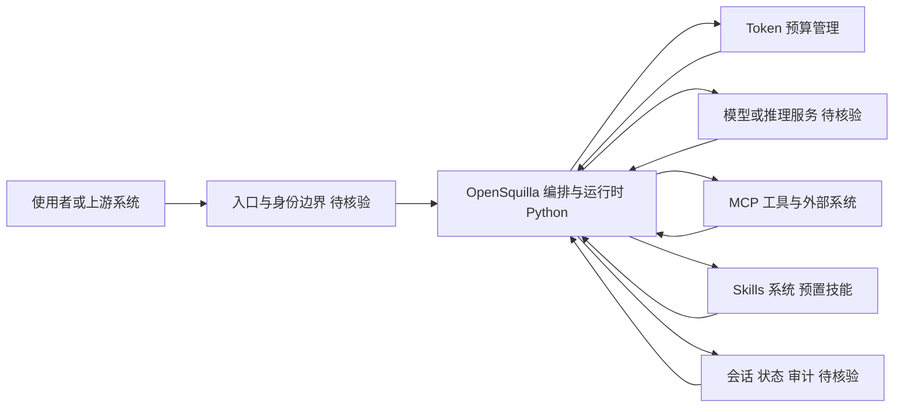

# OpenSquilla

## 一句话定位
Token 高效的 AI Agent，在相同的 Token 预算下实现更高的智能密度。

## 它解决的问题
Agent 应用中 Token 消耗是主要成本和延迟来源。现有 Agent 框架（ReAct、Reflexion）往往消耗大量 Token 但产出质量不成比例。OpenSquilla 试图在不降低输出质量的前提下大幅减少 Token 消耗。

## 为什么值得关注（2026-05-17）
- "Token 效率" 是 Agent 工程从 demo 到生产的关键瓶颈
- 提出了"智能密度"概念 — 衡量每 Token 的决策质量
- 893 stars 表明社区对效率问题的关注
- 支持 MCP 和 Skills 集成

## 热度来源判断
- Agent 成本优化是生产落地的真实痛点
- 概念新颖但需要实际 benchmark 支撑
- 泡沫风险中等 — "智能密度"缺乏标准化度量

## 关键技术亮点亮点
1. **Token 预算管理** — 在固定 Token 预算内优化决策路径
2. **MCP 集成** — 通过工具调用减少推理 Token 消耗
3. **Skills 系统** — 预置技能减少重复推理

## 架构师速览

| 决策问题 | 研究判断 | 证据边界 |
|---|---|---|
| 系统边界 | 一个 Python 编写的 Agent 编排层，位于入口渠道、模型供应商、MCP 工具与 Skills 之间，承担 Token 预算管理以提高“智能密度” | 仅有分类、Language=Python 与标签（Agent、Token效率、智能密度、MCP、Skills）；具体协议、部署形态、持久化方案档案未证实 |
| 主路径 | 请求进入入口与身份边界 → 编排与运行时在 Token 预算内做决策 → 调用模型推理服务与 MCP/工具 → 写回会话、状态与审计 | 主路径来自档案描述的 Token 预算管理、MCP 集成、Skills 系统；具体调度算法、消息格式、控制流须以源码核验 |
| 关键权衡 | 在 Token 效率优先下，于工具扩展速度、权限边界、可观测性与供应商耦合之间取舍；档案未给出量化指标 | 档案仅有“与 ReAct 更注重效率而非能力”等定性陈述；性能数字、SLO、兼容性矩阵档案未证实 |
| 最小 PoC | 在单一入口、最小 MCP 工具权限、可审计日志下，固定 Token 预算验证“决策质量/Token”比值后再扩面 | “智能密度”无标准化度量，档案明确标注项目较新、社区验证不足，不宜直接用于生产结论 |

## 架构启发
- Agent 系统设计需要考虑 Token 效率作为一等公民
- 智能密度（Token/Decision Quality）可能成为 Agent 评估的新维度

## 架构图（MMD）

> 证据边界：此图只采用本档案已有可核验描述；“待核验”节点不应视为项目实现事实。

## 定位判断
观察型项目。概念有启发性，但需要更多工程验证。目前不适合生产使用。

## 风险 / 局限 / 泡沫点
1. **"智能密度"缺乏标准化度量** — 难以客观评估效果
2. **893 stars，项目较新** — 社区验证不足
3. **与主流 Agent 框架的集成深度有限**

## 与同类项目的关系
- vs **ReAct Agent**：OpenSquilla 更注重效率而非能力
- vs **FrugalGPT**：学术方向类似，OpenSquilla 更偏工程实现

## 是否值得持续跟踪
**低优先级跟踪。** 关注其 benchmark 方法和 Token 效率指标的设计。

## 后续观察点
1. 是否发布标准化的 Token 效率 benchmark
2. 是否有生产环境使用案例
3. Star 增速是否持续

---
*首次记录：2026-05-17*
