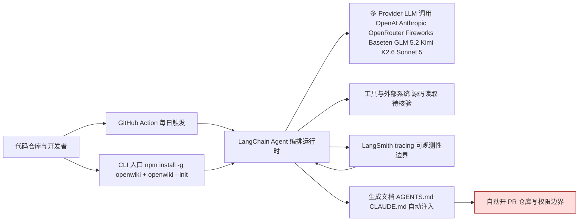

# OpenWiki

## 一句话定位
LangChain 出品的 CLI 工具，用 Agent 自动生成和维护代码库文档，自动注入 AGENTS.md，让 Coding Agent 直接消费。

## 它解决的问题
代码文档是软件工程中最痛苦的环节之一：人不想写、写了不想更新、更新了没人看。随着 Coding Agent 成为常态，文档的消费者从「人」扩展到「Agent」——Agent 需要理解代码库的结构、约定和上下文，但现有文档对人都不友好，对 Agent 更不友好。OpenWiki 让文档从人写人读变为 Agent 写 Agent 读。

## 为什么值得关注
- **LangChain 出品**：对 Agent 生态理解深厚
- **14 天 5K⭐**：2026-06-22 创建，增速稳定
- **GitHub Action 自动化**：每日自动开 PR 更新文档，零人工维护
- **AGENTS.md 自动注入**：生成的文档自动被 Coding Agent 发现和引用
- **Multi-LLM 支持**：GLM 5.2、Kimi K2.6、Sonnet 5、OpenRouter 等开箱即用
- **LangSmith tracing**：文档生成过程可追踪可调试

## 热度来源判断
- LangChain 品牌效应（Agent 生态核心玩家）
- 文档自动化是普遍痛点
- AGENTS.md 标准的推广让 Agent 消费文档有了标准接口
- GitHub Action 的 CI/CD 集成降低了 adoption 门槛

## 关键技术亮点亮点
1. **CLI 优先**：`npm install -g openwiki` → `openwiki --init` → 文档生成，极简流程
2. **GitHub Action 持续更新**：每日自动 PR，文档与代码同步
3. **AGENTS.md/CLAUDE.md 自动注入**：无需手动配置，Coding Agent 自动发现文档
4. **多 Provider 架构**：OpenRouter/Fireworks/Baseten/OpenAI/Anthropic 全覆盖
5. **LangSmith 集成**：文档生成过程可视化，支持成本和质量追踪

## 架构师速览

| 决策问题 | 研究判断 | 证据边界 |
|---|---|---|
| 系统边界 | 入口 CLI（npm install -g openwiki + openwiki --init）与 GitHub Action 双入口；模型层横跨 OpenAI、Anthropic、OpenRouter、Fireworks、Baseten、GLM 5.2、Kimi K2.6、Sonnet 5；产物为 AGENTS.md/CLAUDE.md 注入到仓库。 | 仅以档案列出的 provider 名为准；CLI 命令、Action 触发频率与产物文件名来自档案描述，组件实现细节未审计。 |
| 主路径 | 代码仓库 → CLI/Action 触发 → LangChain Agent 编排 → 调用多 Provider LLM → 读取源码生成文档 → 自动开 PR 注入 AGENTS.md，过程中走 LangSmith 做 tracing。 | LangSmith 仅在档案中作为"可视化/追踪"提及，trace 字段与采样策略未在档案中描述。 |
| 关键权衡 | 文档新鲜度（每日自动 PR） vs API 成本与文档质量；通用多 Provider 接入 vs 各 Provider 行为差异导致的不可控；AGENTS.md 自动注入 vs 用户对仓库文件的写权限扩大。 | 风险点属档案明确列出的"局限"，成本量级、权限模型、Provider 差异未量化。 |
| 最小 PoC | 在单一小型仓库上启用 GitHub Action，限定单 Provider（如 OpenAI），关闭/限制每日触发，仅启用 LangSmith tracing 比对文档质量与 token 成本，验收项：PR 可审计、成本可解释、AGENTS.md 被目标 Agent 实际读取。 | PoC 步骤基于档案的"CLI 优先 + GitHub Action + 多 Provider + LangSmith"四项特征组合，不引入档案未提及的网关或中间件。 |

## 架构启发
文档不再是一次性产物，而是持续更新的 Agent 基础设施。文档的消费者从人变成 Agent，文档的生成者从人变成 Agent——人只需要审查 PR。这种范式转变对内部文档平台有直接参考价值。

## 架构图（MMD）

> 证据边界：此图只采用本档案已有可核验描述；“待核验”节点不应视为项目实现事实。

## 定位判断
**工具型** — 实用工具，与 codebase-memory-mcp（代码理解）形成互补。不是通用文档生成器，不是代码搜索工具，是 Agent 时代的代码库文档基础设施。

## 风险/局限/泡沫点
- **LangChain 项目维护历史**：LangChain 系项目有「快速爆发后维护放缓」的模式
- **文档质量依赖 LLM**：生成的文档质量上限受模型能力限制
- **成本问题**：大代码库每日自动生成文档的 API 成本不可忽视
- **与 AGENTS.md 标准强耦合**：如果 AGENTS.md 标准演进，需要跟进

## 与同类项目的关系
| 项目 | 定位 | 关系 |
|------|------|------|
| codebase-memory-mcp | 代码理解（AST+知识图谱） | 互补：理解代码 vs 维护文档 |
| Mintlify | API 文档生成 | 不同：对外 API doc vs 对内 Agent doc |
| Docusaurus | 文档站点构建 | 不同层次：展示层 vs 生成层 |

## 是否值得持续跟踪
**是** — Agent 文档自动化的先行者，关注与 codebase-memory-mcp 等项目的整合。

## 后续观察点
- 与 codebase-memory-mcp 等代码理解工具的整合
- AGENTS.md 标准的演进对项目的影响
- 大型代码库的 API 成本控制方案
- LangChain 对该项目的长期维护承诺
