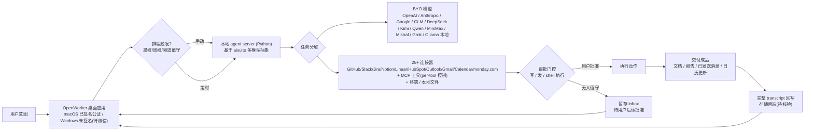

# andrewyng/openworker

## 一句话定位
Andrew Ng 出品的开源本地 AI Coworker——运行在你的桌面上，交付**成品**（文档、报告、已发送消息、整理过的日历），而不是聊天。

## 它解决的问题
目标用户是希望用 AI 真正完成日常工作的知识工作者与团队。痛点是：现有 AI 助手只给「聊天建议」和「待办清单」，用户仍需自己复制粘贴、跨工具搬运、手动执行最后一步；且数据进入第三方云端存在合规风险。

OpenWorker 把「最后一步执行」也交给 AI，但所有有后果的动作（发消息、改日历、跑命令）都经过审批门控。

## 为什么值得关注（2026-07-29）
- Andrew Ng（吴恩达）亲自出品，7 天内近万星、1307 fork，个人品牌 + 真实产品力的双重信号。
- 它把「AI 交付成品而非对话」这一范式做成了可下载的桌面应用（macOS 签名公证 + Windows）。
- 明确支持 BYO 模型（OpenAI/Anthropic/Google/GLM/DeepSeek/Kimi/Qwen/MiniMax/Mistral/Grok + Ollama 全本地），数据只通过你选择的模型离开机器。

## 热度来源判断
热度来自三重叠加：① Andrew Ng 的个人号召力；② 「交付成品」击中用户对 chat-only AI 的疲劳；③ 本地优先 + 数据不出域击中企业合规刚需。这是**真实需求驱动**而非纯炒作——但 1307 fork 也意味着大量人想自己改/学，未必都是生产使用。

## 关键技术亮点亮点
1. **审批门控架构（approval-gated）**：写操作、发送、shell 命令执行前必须用户批准；无人值守任务把待批准项暂存 inbox。这是 Agent 信任建模的工程化设计。
2. **本地 agent server（Python）+ aisuite**：引擎/工具/连接器构建在 Andrew Ng 自家的多模型抽象层 aisuite 之上，模型可随时切换。
3. **25+ 连接器 + MCP**：GitHub/Slack/Jira/Notion/Linear/HubSpot/Outlook/monday.com/Gmail/Google Calendar + 终端和本地文件；任何 MCP 工具可插入，且 per-tool 控制。
4. **调度自动化**：晨报、周报、频道值守等周期性任务可排程，运行结果带完整 transcript 落回应用。

## 架构师速览

| 决策问题 | 研究判断 | 证据边界 |
|---|---|---|
| 系统边界 | OpenWorker 是桌面端 Agent 编排层，外侧为模型供应商（OpenAI/Anthropic/Google/GLM/DeepSeek/Kimi/Qwen/MiniMax/Mistral/Grok + Ollama）与 25+ 连接器/MCP，内侧为审批门控 + 本地文件系统/inbox | 连接器数量、模型清单、MCP 支持来自档案；具体 IPC、持久化、加密落盘策略未在档案中描述 |
| 主路径 | 用户意图 → OpenWorker 桌面应用（macOS/Win） → 本地 Python agent server（aisuite） → 分解步骤 → 模型推理 + 工具调用 → 审批门控（写/发/shell） → 执行或在 inbox 暂存 → 交付成品（文档/报告/已发送消息/日历更新） | 调度（晨报/周报/频道值守）以排程方式重入主路径；transcript 回写为档案所述，具体存储后端未描述 |
| 关键权衡 | BYO 模型换来的供应商自由度 vs 25+ 连接器与 MCP 在企业环境中的认证/限流/异常鲁棒性风险；本地执行的合规收益 vs Windows 未签名（SmartScreen 警告）与 aisuite 抽象层"最小公分母"导致的跨模型质量退化 | 均为档案中的明确风险/权衡；未做实测验证 |
| 最小 PoC | 单用户 macOS + 单连接器（如 GitHub 或 Gmail）+ Ollama 本地模型 + 仅开读权限 + 启用审批门控与 transcript 日志；验收项：审批触发率、日志可审计性、模型切换成本、连接器限流行为、退出路径（清除本地状态） | PoC 设计基于档案所述能力；连接器认证细节、限流阈值、SLO 指标需源码/文档核实 |

## 架构启发
核心启发是**「模型是可换的，信任模型是不可换的」**。OpenWorker 把模型层彻底解耦（BYO key），而把信任与控制层（审批门控、per-tool 权限、本地执行）做成了应用的核心骨架。这与「把某个模型绑死」的产品形成鲜明对比——对企业架构师而言，**模型供应链自主**是比模型能力本身更值得投入的设计决策。

## 架构图（MMD）

> 证据边界：此图只采用本档案已有可核验描述；“待核验”节点不应视为项目实现事实。

## 定位判断
在 Agent 应用层定位为**平台候选**。它不是单一工具，而是一个带连接器生态、调度能力、信任模型的本地 Agent 运行环境。若 25+ 连接器稳定性和 aisuite 成熟度跟上，有平台化潜力。

## 风险 / 局限 / 泡沫点
1. **工程成熟度仍处 beta**：Windows 版未代码签名（SmartScreen 警告），官方说「actively polishing rough edges」。生产可用性未经验证。
2. **连接器稳定性未规模化验证**：25+ 连接器的认证、限流、异常处理在真实企业环境下的鲁棒性存疑。
3. **个人品牌驱动的热度**：Andrew Ng 品牌带来高初始关注，但能否沉淀为长期工程投入需观察（fork 数高也可能是「学习/模仿」而非「使用」）。
4. **aisuite 抽象层的成熟度**：多模型抽象的「最小公分母」问题——各家模型能力差异可能导致某些连接器/任务在某些模型下退化。

## 与同类项目的关系
- **vs openclaw（384K⭐）**：同为本地优先 AI 助手，openclaw 更偏通用 assistant 定位、生态更大；OpenWorker 更聚焦「交付成品 + 审批门控」的工作流范式，工程叙事更清晰。
- **vs hermes-agent（221K⭐）**：hermes-agent 偏可自进化的 Agent 框架；OpenWorker 偏终端用户桌面产品。一个面向开发者/架构师，一个面向知识工作者。
- **vs n8n（198K⭐）**：n8n 是可视化工作流自动化平台；OpenWorker 是对话驱动的 Coworker。两者在「自动化交付」上交集，但交互范式不同。

## 是否值得持续跟踪
**是，深度跟踪 + 建议 PoC。** 它代表 Agent 应用层的正确形态（本地、可换模型、动作授权、交付成品），对企业数据合规和模型供应链自主有直接价值。

## 后续观察点
1. 连接器在真实企业环境的稳定性与认证流程成熟度（尤其是 Outlook/Gmail/Calendar 类高频集成）。
2. aisuite 抽象层是否暴露「最小公分母」问题——不同模型下任务完成质量差异。
3. 是否从桌面 Coworker 演进为带团队协作/权限/审计的企业平台（平台化信号）。

---
*首次记录：2026-07-29* · *数据来源: GitHub Search API (gh CLI) + README*
