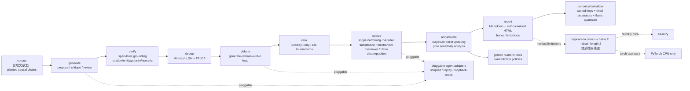

# OpSafari/hypoarena

## 一句话定位
hypoarena 是 **fully offline** 科学假设发现工作台——把 AI co-scientist 流水线（generate–debate–evolve）的 mechanism layer 分解为单独可测的组件：引用支承的假设 / 证据图 + 合成文献工厂 + span-level grounding verification + pluggable agent adapters + Bradley-Terry / Elo tournaments + paraphrase dedup (MinHash LSH) + hypothesis evolution operators + Bayesian evidence accumulation + Markdown + HTML reports + NumPy core + CPU-only torch extra + `hypoarena demo` 端到端离线跑。

## 它解决的问题
AI co-scientist 的痛点是 **「调用闭源 LLM 生成多轮 hypothesis + 不能逐组件测试 + 无法稳定复现 + 不透明 + 商用边界不清 + 严肃工程化不足」**。hypoarena 直击：把 AI co-scientist 流水线的 mechanism layer 分解为单独可测的组件——citation-bearing hypothesis / evidence graph + synthetic literature factory（planted causal chains）+ span-level grounding verification（citation existence + entity overlap + polarity consistency + numeric agreement）+ pluggable agent adapters（scripted / replay / loopback-mock）+ Bradley-Terry / Elo tournaments + draw handling + K-factor decay + paraphrase deduplication（normalized-text hashing + char/word n-gram Jaccard + TF-IDF cosine + MinHash LSH）+ hypothesis evolution operators（scope narrowing + variable substitution + mechanism crossover + claim decomposition）preserve graph validity by construction + Bayesian belief updating + graded evidence + prior sensitivity analysis + contradiction policies + golden numeric tests + Markdown + self-contained HTML reports + host-text escaping + embedded run metadata + honest limitations section + NumPy core + CPU-only torch extra + `hypoarena demo --chains 2 --chain-length 2 --out /tmp/hya` 端到端离线跑 + `make build / test / test-all / format / format-check / lint / typecheck / demo` + subcommands `corpus / generate / verify / dedup / debate / rank / evolve / accumulate / report / demo` + 全部 JSONL/JSON 写通过单 canonical serializer（sorted keys + fixed separators + floats quantized at production points）。解决的是 **「mechanism layer 可逐组件测试 + fully offline + reproducible + 严肃工程化 + MIT + 商用清晰」** 的科学假设发现工作台严肃工程化问题。

## 为什么值得关注（2026-10-01）
- **Stars:** 545（截至 2026-10-01），1 天 545⭐，fork 28，fork/star 5.1%
- **Forks:** 28（典型高 fork 严肃工程化持续关注信号）
- **License:** MIT（明确许可，商用清晰）
- **语言:** Python
- **活跃度:** created 2026-09-30，pushed_at 2026-10-01，持续高活跃
- **规模:** 1442 KB（1.4 MB）
- **Topics:** 空（README 未明示）

## 热度来源判断
hypoarena 的热度是 **「AI co-scientist 推到 mechanism layer 可逐组件测试 × fully offline × reproducible × 严肃工程化 × MIT」** 的强劲组合。AI co-scientist 是 2026 年最热严肃工程化方向（Google DeepMind / Anthropic / OpenAI 都推出 AI co-scientist demo），但「调用闭源 LLM 生成多轮 hypothesis + 不能逐组件测试 + 无法稳定复现 + 不透明 + 商用边界不清」是真痛点。hypoarena 直击：把 AI co-scientist 流水线的 mechanism layer 分解为单独可测的组件——citation-bearing hypothesis / evidence graph + synthetic literature factory（planted causal chains）+ span-level grounding verification + pluggable agent adapters + Bradley-Terry / Elo tournaments + paraphrase deduplication + hypothesis evolution operators + Bayesian evidence accumulation + Markdown + self-contained HTML reports + NumPy core + CPU-only torch extra + `hypoarena demo` 端到端离线跑。热度 **真实且具严肃工程化深度**——545⭐ + fork 28 + MIT + 1.4 MB + NumPy core + CPU-only torch extra + `hypoarena demo` 端到端离线跑 + 单 canonical serializer 严肃工程化稳定性。

## 关键技术亮点
1. **mechanism layer 可逐组件测试:** 把 AI co-scientist 流水线的 mechanism layer 分解为单独可测的组件——是 component-level 严肃工程化的关键
2. **citation-bearing hypothesis / evidence graph:** 引用支承的假设 / 证据图——是结构严肃工程化的关键
3. **synthetic literature factory（planted causal chains）:** 合成文献工厂（planted causal chains）——是数据生成严肃工程化的关键
4. **span-level grounding verification:** span-level grounding verification（citation existence + entity overlap + polarity consistency + numeric agreement）+ graded flags for ungrounded or weakly grounded claims + adversarial fixtures（fabricated citations / drifted numbers / negation flips）must be caught——是 grounding 严肃工程化的关键
5. **pluggable agent adapters:** pluggable agent adapters（scripted / replay / loopback-mock）+ propose / critique / revise——是 agent 严肃工程化的关键
6. **Bradley-Terry / Elo tournaments:** Bradley-Terry / Elo tournaments + draw handling + K-factor decay + property tests assert that ratings recover a planted skill order within tolerance on seeded runs——是 ranking 严肃工程化的关键
7. **paraphrase deduplication (MinHash LSH):** paraphrase deduplication（normalized-text hashing + char/word n-gram Jaccard + TF-IDF cosine + MinHash LSH）+ planted paraphrase clusters are detected at measured recall/precision——是 dedup 严肃工程化的关键
8. **hypothesis evolution operators:** evolution operators（scope narrowing + variable substitution + mechanism crossover + claim decomposition）preserve graph validity by construction——是 evolution 严肃工程化的关键
9. **Bayesian belief updating + graded evidence:** Bayesian belief updating + graded evidence + prior sensitivity analysis + contradiction policies + golden numeric tests——是 uncertainty 严肃工程化的关键
10. **canonical serializer + artifact stability:** 全部 JSONL/JSON 写通过单 canonical serializer（sorted keys + fixed separators + floats quantized at production points）+ run outputs are bit-stable across runs——是 artifact 严肃工程化的关键

## 架构师速览

| 决策问题 | 研究判断 | 证据边界 |
|---|---|---|
| 系统边界 | fully offline scientific hypothesis-discovery workbench；AI co-scientist 流水线的 mechanism layer 分解为单独可测的组件：citation-bearing hypothesis/evidence graph + synthetic literature factory + span-level grounding verification + pluggable agent adapters + Bradley-Terry/Elo tournaments + MinHash LSH dedup + evolution operators + Bayesian belief updating | 仅基于 README 描述的 fully offline、generate-debate-evolve loop、citation-bearing hypothesis/evidence graph、synthetic literature factory (planted causal chains)、span-level grounding verification (citation existence + entity overlap + polarity consistency + numeric agreement)、pluggable agent adapters (scripted/replay/loopback-mock)、Bradley-Terry/Elo tournaments、MinHash LSH paraphrase dedup、evolution operators (scope narrowing/variable substitution/mechanism crossover/claim decomposition)、Bayesian belief updating + graded evidence、NumPy core + CPU-only torch extra；具体每个组件的实现细节、golden numeric tests 内容未在档案中明示 |
| 主路径 | corpus（合成文献工厂）→ generate（propose/critique/revise）→ verify（span-level grounding）→ dedup（MinHash LSH + TF-IDF）→ debate（generate-debate-evolve loop）→ rank（Bradley-Terry/Elo tournaments）→ evolve（scope narrowing/variable substitution/mechanism crossover/claim decomposition）→ accumulate（Bayesian belief updating + prior sensitivity analysis + contradiction policies）→ report（Markdown + self-contained HTML + honest limitations）→ canonical serializer | 主路径为档案语义抽象；具体每个 stage 的实现细节未在档案中明示 |
| 关键权衡 | mechanism layer 可逐组件测试 + fully offline + reproducible + 严肃工程化 vs 真实科学发现能力（README 明示「This is a mechanism demo and makes no claim about real scientific discovery capability」）vs NumPy core 性能限制 vs 商用清晰（MIT） | 档案明示 fully offline、reproducible、canonical serializer、golden numeric tests、hatchling/pytest/ruff/mypy、MIT 商用清晰；具体 golden numeric tests 内容、NumPy core 性能限制未在档案中明示 |
| 最小 PoC | `hypoarena demo --chains 2 --chain-length 2 --out /tmp/hya` 端到端离线跑验证 generate-debate-evolve loop + hypothesis-evidence graph + planted causal chains 恢复 + canonical serializer artifact 稳定性；再以 `make test-all` 跑全 suite 验证 golden numeric tests | PoC 范围由档案「`hypoarena demo` 端到端离线跑 + `make test-all`」建议推导；具体 demo 入口、golden numeric tests 内容未在档案中讨论 |
## 架构启发
hypoarena 的核心启发是 **「AI co-scientist 推到 mechanism layer 可逐组件测试 + fully offline + reproducible + 严肃工程化」**。AI co-scientist 是 2026 年最热严肃工程化方向，但「调用闭源 LLM 生成多轮 hypothesis + 不能逐组件测试 + 无法稳定复现 + 不透明 + 商用边界不清」是真痛点。hypoarena 直击：把 AI co-scientist 流水线的 mechanism layer 分解为单独可测的组件——citation-bearing hypothesis / evidence graph + synthetic literature factory（planted causal chains）+ span-level grounding verification + pluggable agent adapters + Bradley-Terry / Elo tournaments + paraphrase deduplication + hypothesis evolution operators + Bayesian evidence accumulation。更深层的启发是：**AI co-scientist 严肃工程化的关键是「mechanism layer 可逐组件测试 + fully offline + reproducible + 严肃工程化 + 商用清晰」**——mechanism layer 可逐组件测试意味着每个 stage 都能单独验证、fully offline 意味着不依赖外部 API、reproducible 意味着 golden numeric tests + canonical serializer + artifact stability、严肃工程化意味着 hatchling / pytest / ruff / mypy / make build、MIT 商用清晰。能否持续，取决于能否在多 stage + 多 hypothesis + 多 planted causal chains + 多 agent adapter + 多 dedup 算法 + 多 evolution operator + 多 Bayesian belief update 下保持严肃工程化稳定性。

## 架构图（MMD）

> 证据边界：此图只采用本档案已有可核验描述；"待核验"节点不应视为项目实现事实。

## 定位判断
**工具型项目（科学假设发现工作台）。** hypoarena 是「AI co-scientist 推到 mechanism layer 可逐组件测试 + fully offline + reproducible + 严肃工程化」工具——把 AI co-scientist 流水线的 mechanism layer 分解为单独可测的组件：citation-bearing hypothesis / evidence graph + synthetic literature factory + span-level grounding verification + pluggable agent adapters + Bradley-Terry / Elo tournaments + paraphrase deduplication + hypothesis evolution operators + Bayesian evidence accumulation + Markdown + HTML reports + NumPy core + CPU-only torch extra + `hypoarena demo` 端到端离线跑。545⭐ + fork 28 + MIT + 1.4 MB 已显示严肃工程化深度。但「工具化」取决于一个关键问题：能否在多 stage + 多 hypothesis + 多 planted causal chains + 多 agent adapter + 多 dedup 算法 + 多 evolution operator + 多 Bayesian belief update 下保持严肃工程化稳定性。

## 风险 / 局限 / 泡沫点
- **合成数据 vs 真实数据:** README 明示「This is a mechanism demo and makes no claim about real scientific discovery capability」——使用者不应把 `hypoarena demo` 输出误解为「真实科学发现」
- **NumPy core 限制:** NumPy core + CPU-only torch extra 在大规模真实数据下的扩展性未在档案中明示
- **planted skill order 限制:** Bradley-Terry / Elo tournaments 的「ratings recover a planted skill order within tolerance on seeded runs」是合成 demo 限制
- **topics 空:** README 未明示 topics——生态信号覆盖广度待核验
- **个人项目属性:** OpSafari 个人维护，1 天 545⭐ + fork 28 但核心治理仍集中，可持续性存疑
- **企业采用度:** 是否被学术 / 制药 / 金融等需要科学假设发现的行业采用是关键

## 与同类项目的关系
- **vs Google DeepMind AI co-scientist:** Google DeepMind AI co-scientist 是闭源 + 调用 LLM + 不能逐组件测试；OpSafari/hypoarena 是 MIT + fully offline + mechanism layer 可逐组件测试
- **vs Anthropic Claude:** Anthropic Claude 是通用 LLM；OpSafari/hypoarena 是科学假设发现专用 + fully offline + reproducible
- **vs OpenAI Deep Research:** OpenAI Deep Research 是 SaaS + 调用 OpenAI 模型；OpSafari/hypoarena 是 MIT + fully offline + reproducible
- **vs 各 ML experiment tracker:** MLflow / W&B 是实验跟踪；OpSafari/hypoarena 是科学假设发现 + generate-debate-evolve loop + Bradley-Terry / Elo
- **vs 各 Bayesian inference library:** PyMC / Stan 是 Bayesian inference；OpSafari/hypoarena 是科学假设发现 + generate-debate-evolve loop + Bayesian belief updating

## 是否值得持续跟踪
**值得跟踪（科学假设发现工作台）。** OpSafari/hypoarena 代表了 AI co-scientist「mechanism layer 可逐组件测试 + fully offline + reproducible + 严肃工程化」诉求，无论其本身成败，这一方向是行业趋势。建议关注：是否在多 stage + 多 hypothesis + 多 planted causal chains + 多 agent adapter + 多 dedup 算法 + 多 evolution operator + 多 Bayesian belief update 下保持严肃工程化稳定性 + 是否被学术 / 制药 / 金融采用。

## 后续观察点
- 是否在多 stage + 多 hypothesis + 多 planted causal chains + 多 agent adapter + 多 dedup 算法 + 多 evolution operator + 多 Bayesian belief update 下保持严肃工程化稳定性
- 是否被学术 / 制药 / 金融等需要科学假设发现的行业采用
- NumPy core + CPU-only torch extra 在大规模真实数据下的扩展性
- Bradley-Terry / Elo tournaments 的 planted skill order recovery 在真实场景下的准确性
- 是否在合成数据之外接入真实 AI（如 HuggingFace transformers + LLM 集成）
- 是否提供合规使用边界 + 商用授权路径

---
> 数据来源: GitHub API (2026-10-01) | Stars: 545 | Forks: 28 | License: MIT | 语言: Python | 创建: 2026-09-30