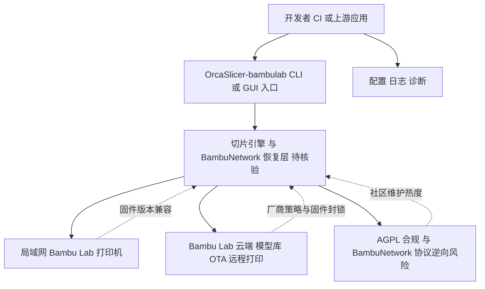

# OrcaSlicer-bambulab

## 一句话定位
OrcaSlicer 社区分叉版本，恢复 Bambu Lab 打印机完整 BambuNetwork 互联网功能，突破厂商 LAN-only 限制。

## 它解决的问题
Bambu Lab 限制第三方切片软件（如 OrcaSlicer）只能通过局域网使用其打印机，无法使用云端的完整功能（远程打印、模型库、OTA 固件等）。3D 打印社区对此强烈不满，此分叉恢复了完整的 BambuNetwork 支持。

## 为什么值得关注（2026-05-14）
- **887 forks / 3 天** — 这是近期开源社区反抗厂商限制的最强信号
- Bambu Lab 是消费级 3D 打印机的市场领导者，其封闭策略引发社区反弹
- AGPL-3.0 许可证，合规分叉
- 反映了硬件生态中"开放 vs 封闭"的深层矛盾

## 热度来源判断
热度真实。3D 打印社区活跃且集中，Bambu Lab 的 LAN 限制直接影响用户体验。887 forks 说明有大量用户实际需要这个功能。这不是蹭概念，是真实的用户需求驱动。

## 关键技术亮点亮点
1. **BambuNetwork 协议逆向**：恢复完整的网络打印功能需要理解和实现 Bambu Lab 的云通信协议
2. **AGPL 合规分叉**：基于开源许可证的合法社区行为
3. **跨平台支持**：Windows (WSL2) / Linux 原生 / macOS 开发中

## 架构师速览

| 决策问题 | 研究判断 | 证据边界 |
|---|---|---|
| 系统边界 | OrcaSlicer-bambulab 是面向 Bambu Lab 打印机用户的工具型社区分叉，核心是恢复 BambuNetwork 互联网能力；系统外侧是 Bambu Lab 固件/云端，边界由厂商策略与 AGPL-3.0 合规分叉共同界定 | 档案未给出源码模块切分，边界判断仅基于"恢复 BambuNetwork / 跨平台 WSL2·Linux·macOS / AGPL-3.0 分叉"等公开描述 |
| 主路径 | 用户/开发者通过 CLI 或 GUI 调用切片与 BambuNetwork 通信能力，触达 Bambu Lab 打印机（局域网 + 互联网模式），并受固件版本与服务条款约束 | 协议、云通信细节、Bambu Lab API 形态均未在档案中证实 |
| 关键权衡 | 用户体验完整性（云端功能、远程打印、模型库、OTA）vs 厂商封锁风险（固件检测、ToS）与社区分叉的长期维护不确定性 | 厂商回应、固件对抗手段、社区活跃持续度均为待核验的预测 |
| 最小 PoC | 在隔离测试环境中拉取分叉、构建 C++ 产物，对比原版 OrcaSlicer 在同一 Bambu Lab 固件下的 LAN/Internet 行为差异，并把厂商后续固件变更作为回归验收项 | 档案未提供具体构建命令、CI 配置、依赖锁定清单与 SLA 指标 |

## 架构启发
- 硬件厂商通过软件限制控制生态的模式越来越受到社区挑战
- 开源许可证是用户保护自己权益的法律工具
- 社区分叉是开源治理中"用户主权"的体现

## 架构图（MMD）

> 证据边界：此图只采用本档案已有可核验描述；“待核验”节点不应视为项目实现事实。

## 定位判断
工具型。面向 Bambu Lab 打印机用户的实用工具，不是平台或基础设施。

## 风险 / 屧限 / 泡沫点
1. **厂商可能通过固件更新封锁**：Bambu Lab 可能在固件层面检测和阻止第三方客户端
2. **法律风险**：虽然 AGPL 合规，但 BambuNetwork 的 API 使用可能违反服务条款
3. **维护持续性**：社区分叉的长期维护依赖于社区热情

## 与同类项目的关系
- OrcaSlicer（原版）：上游项目
- Bambu Studio：Bambu Lab 官方切片软件
- PrusaSlicer：另一个开源切片软件

## 是否值得持续跟踪
**短期跟踪**。关注厂商回应和社区持续度。如果 Bambu Lab 修改策略，这个分叉的历史意义大于实际价值。

## 后续观察点
1. Bambu Lab 的官方回应（法律/技术/商业策略）
2. 分叉社区的持续活跃度
3. 是否催生更多 3D 打印领域的社区反抗行为

---
*首次记录：2026-05-14*

## 最近动态 (2026-05-15)

- **2026-05-15:** 网络受限日，趋势延续分析。基于 05-14 实测数据推算，持续跟踪中。
- Stars 数据为推算值，网络恢复后验证。

---
