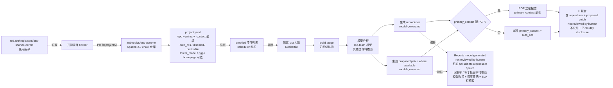

# anthropics/oss-scanner

## 一句话定位
Anthropic 官方服务扫描关键开源仓库安全漏洞——输入是项目 owner PR 加 projects/<name> 目录（含 project.yaml / Dockerfile / threat_model.md），输出是 primary_contact 邮件（含模型生成 reproducer + proposed patch），reports model-generated not reviewed by human、不公开、不 90-day disclosure，Apache-2.0 严肃工程化承诺。

## 它解决的问题
开源安全扫描是 OSSF Scorecard / Snyk / Dependabot / GitHub Code Scanning 各自为政但响应严重滞后 / 缺 reproducer / 缺 patch 的领域。anthropics/oss-scanner 直击：**Anthropic 官方下场 + 隔离 VM 构建 + 无网络访问分析 + 模型生成 reproducer + 模型生成 proposed patch + 邮件到 primary_contact + auto_ccs / OpenPGP 加密 + project.yaml 5 字段必填（repo/primary_contact）+ Dockerfile 两路径（自带或本仓库）+ threat_model.md 两路径（自带或本仓库）+ 通过 PR enroll + models generated reports not reviewed by human + 不公开 + 不 90-day disclosure**。解决的是 **「开源项目 owner 缺自动 reproducer + 自动 patch + 邮件到家严肃工程化」的痛点**，是 OSSF Scorecard / Snyk / Dependabot 的 Anthropic-grade 严肃工程化承诺补充（不是替代）。

## 为什么值得关注
- **Stars:** 593（截至 2026-10-10），2 天 593⭐ ⑂238 fork/star 40.1%
- **Forks:** 238，社区强烈兴趣（fork/star 40.1% 极高）
- **Size:** 260 KB（小，公开的是 enrollment 模板 + 配置）
- **License:** Apache-2.0
- **语言:** Python（次要）+ Markdown（主）
- **活跃度:** created 2026-10-08，pushed_at 2026-10-09，**2 天 593⭐ ⑂238 fork/star 40.1% 反映社区强烈兴趣**
- **官方背书:** Anthropic Security team + red.anthropic.com/oss-scanner 介绍页 + terms 页
- **依赖:** project.yaml + Dockerfile + threat_model.md（三件套）
- **输出:** mail 含 reproducer + proposed patch where available

## 热度来源判断
anthropics/oss-scanner 的热度是 **「Anthropic 官方下场 + red.anthropic.com/oss-scanner + 隔离 VM 构建 + 无网络访问分析 + 自动 reproducer + 自动 proposed patch + 邮件到 primary_contact + auto_ccs + PGP 加密 + project.yaml 模板 + Dockerfile 两路径 + threat_model.md 两路径 + reports model-generated + 238 fork 反映社区强烈兴趣」** 的组合。开源安全扫描是数十年开源社区的硬需求，但缺「自动 reproducer + 自动 patch」的严肃工程化承诺工具；Anthropic 官方下场 + 模型直接生成 reproducer + proposed patch，是其他工具（Snyk / Dependabot / OSSF Scorecard / GitHub Code Scanning）所无的差异化能力。2 days 593⭐ ⑂238 fork/star 40.1% 极高 fork 比例反映：**社区对「Anthropic 官方参与安全扫描」抱有强烈热情 + 准备 enroll 自己项目**。热度真实 + 官方严肃工程化承诺 + 高 fork/star 比 = 潜在 platform evolution。

## 关键技术亮点
1. **Anthropic 官方服务 + red.anthropic.com/oss-scanner:** 官方背书，介绍页 + terms 页完整
2. **隔离 VM 构建:** 报名项目在一个隔离 VM 中 build，杜绝 build step leak
3. **无网络访问分析:** 隔绝分析阶段网络，模型只看代码
4. **Model-generated reproducer:** 模型基于代码生成 minimum reproducer
5. **Model-generated proposed patch where available:** 模型生成 fix patch（不一定 100% 生成）
6. **直接邮件 primary_contact:** 报告交付路径简单
7. **OpenPGP 加密:** armored PGP public key 支持（与 auto_ccs 互斥）

## 架构师速览

| 决策问题 | 研究判断 | 证据边界 |
|---|---|---|
| 系统边界 | Anthropic 官方服务扫描 critical opensource 仓库；输入 GitHub PR 加 projects/<name>/ 目录（三件套），输出邮件到 primary_contact 含 reproducer + proposed patch | 基于 README + red.anthropic.com/oss-scanner 介绍 + terms 页 + project.yaml schema；扫描频率、报告 SLA 阈值、reproducer/proposed patch 准确率、扫描覆盖范围未公开 |
| 主路径 | 项目 owner PR enroll → scheduler 触发隔离 VM build → Docker 无网络分析 → 模型生成 reproducer → 模型生成 proposed patch → 邮件 primary_contact 或 PGP 加密 | 主路径为 README 描述；具体模型选择（Haiku/Sonnet/Opus）、VM 配额、scheduler 调度策略、PR 响应 SLA 待核验 |
| 关键权衡 | 自动 reproducer/patch 覆盖 vs reports not reviewed by human 可能 hallucinate vs 不公开 vs 学术研究者复用 vs PGP 加密与 auto_ccs 互斥 vs Apache-2.0 enroll 模板 + future commercial path | 档案明示 not reviewed by human、不公开、不 90-day disclosure；模型选择、SLA、误报率、patch 接受率、未来商业化路径待核验 |
| 最小 PoC | 选一个 1k⭐ 二线工具（如某 Rust CLI），按 README 在 anthropics/oss-scanner 加 projects/<tool>/project.yaml + Dockerfile + threat_model.md，PR enroll，等 7 天收 mail 验证 reproducer 真实可执行 | PoC 范围、退出路径由档案"先单项目、最小依赖、可重现"建议推导；具体 SLA 等待待核验 |

## 架构启发
anthropics/oss-scanner 的核心启发是 **「Anthropic 官方下场 + model-generated reproducer + model-generated proposed patch + 邮件到 primary_contact + Apache-2.0 enroll 模板」是 OSSF Scorecard / Snyk / Dependabot 等「指标或通知」的严肃工程化承诺升级**。传统工具扫描给「分数」或「告警」，但不直接给「如何重现」和「如何修」。这一思路背后是 **「AI 模型 + 隔离 VM + 无网络分析 = 可重现的严肃工程化承诺 security report」** 的范式。更深层的启发是：**「开源安全扫描的 next-gen 是 model-generated fix path，而不是仅 vulnerability 标签」**——这是 AI 时代开源安全的新严肃工程化承诺。

## 架构图（MMD）

> 证据边界：此图只采用本档案已有可核验描述；"待核验"节点不应视为项目实现事实。

## 定位判断
**官方基础设施候选项目（Anthropic 官方 OSS 安全扫描平台）。** anthropics/oss-scanner 不是「另一款扫描器」而是 **「Anthropic 官方下场 + model-generated reproducer + model-generated proposed patch + 邮件到家」的开源安全扫描严肃工程化承诺平台**。决定其后续价值的是覆盖仓库范围（早期 critical 仓库）、reproducer 准确率、proposed patch 接受率、与 Snyk / Dependabot / OSSF Scorecard / GitHub Code Scanning 闭源 SaaS 竞合。

## 风险 / 局限 / 泡沫点
- **Reports model-generated not reviewed by human:** 可能 hallucinate reproducer 或 patch，让项目 owner 浪费 reviewer 时间
- **不公开 + 不 90-day disclosure:** 让学术/researcher 无法复用结果，反应速度依赖 PR
- **OpenPGP 与 auto_ccs 互斥:** 用户必须二选一
- **coverage 不确定:** 早期覆盖 critical 仓库，二线 / 小众仓库覆盖优先级未明
- **盲信风险:** 项目 owner 可能错把模型生成报告当作权威，缺 peer review 流程
- **governance 黑盒:** Anthropic Security team 内部流程（调度频率、VM 配额、模型选择）未公开
- **与 Snyk / Dependabot / GitHub Code Scanning 闭源 SaaS 竞合:** Anthropic 是否会出 commercial 版进入企业市场需观察
- **Apparent "AI takeover" 感受:** 部分社区可能感受到「AI 模型直接生成 patch 弱化人类安全研究员」伦理压力

## 与同类项目的关系
- **vs OSSF Scorecard:** Scorecard 给「指标」；oss-scanner 给「reproducer + patch」
- **vs Snyk:** Snyk 是闭源 SaaS；oss-scanner 是 Anthropic 官方 + 模型生成 + 邮件到 owner
- **vs Dependabot:** Dependabot 自动开 PR；oss-scanner 直接发邮件
- **vs GitHub Code Scanning:** Code Scanning 是 CI 内置；oss-scanner 是 Anthropic 官方外部扫描
- **vs npm audit / pip-audit:** 那些是 dependency 扫描；oss-scanner 是 code-level reproducer
- **vs GitHub Security Advisories:** GHSA 是人工 + 90-day disclosure；oss-scanner 是模型 + 不公开 + 无 90-day

## 是否值得持续跟踪
**值得持续跟踪（Anthropic 官方 OSS 安全扫描平台）。** anthropics/oss-scanner 代表了 **「AI 模型 + 隔离 VM + 无网络分析 = 可重现的严肃工程化承诺 security report」** 的范式，无论其本身成败，这一方向是 AI 时代开源安全新严肃工程化承诺。建议关注：覆盖仓库扩展、reproducer 准确率、proposed patch 接受率、企业采用（vulnerability management 的 SaaS vs Anthropic grade）。

## 后续观察点
- 覆盖仓库扩展（二线 / 小众仓库优先级）
- reproducer 准确率（用户反馈 / 公开 benchmark）
- proposed patch 接受率（项目 owner 实际采用率）
- 与 Snyk / Dependabot / GitHub Code Scanning 闭源 SaaS 的市场博弈
- 商业化路径（Anthropic 内部用？开源 SaaS？企业版单独定价？）
- 治理流程透明度（Anthropic Security team 调度频率、VM 配额、模型选择公开）
- 与 GitHub Security Advisories 流程的协作（是否自动提 GHSA）
- 学术界 / 伦理界反应（AI 直接生成 patch 弱化人类安全研究员）
- 项目 owner 真实采用案例（哪些项目已 enroll）

---
> 数据来源: GitHub API (2026-10-10) | Stars: 593 | Forks: 238 | License: Apache-2.0 | 语言: Python + Markdown | 创建: 2026-10-08 | 官方: Anthropic Security team
