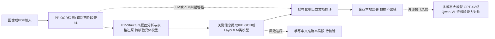

# PaddlePaddle/PaddleOCR

## 一句话定位
百度开源的多语言 OCR 工具库，支持文字检测、识别、版面分析、表格提取和文档翻译，是中文 OCR 场景的事实标准。

## 它解决的问题
OCR（光学字符识别）是文档数字化的基础能力，但传统 OCR 引擎（Tesseract）对中文、复杂版面、手写体支持差，而商业 API（ABBYY、百度云）成本高且数据不可控。PaddleOCR 提供了一系列高质量预训练模型，覆盖检测→识别→版面分析→信息提取全链路，支持本地部署，数据不出企业，同时针对中文场景做了深度优化。

## 为什么值得关注
- **Stars:** 87,186 stars，OCR 领域 Star 数第一
- **中文 OCR 最优:** 在中文场景的准确率远超 Tesseract，接近商业 API 水平
- **全链路覆盖:** 文字检测 → 文字识别 → 版面分析 → 表格识别 → 关键信息提取（KIE）→ 文档翻译
- **多语言:** 支持 80+ 语种，含中英日韩阿等主要语言
- **部署友好:** 提供轻量模型（<10MB）、量化压缩、ONNX 导出，适合移动端和边缘设备

## 热度来源判断
PaddleOCR 的热度来自三个因素叠加：(1) 填补了开源中文 OCR 的空白——Tesseract 对中文支持极差，PaddleOCR 是第一个达到实用水平的开源方案；(2) 百度品牌背书——大厂出品给人以质量保证；(3) 实用性极强——发票识别、合同数字化、证件 OCR 等场景需求巨大，企业大量使用。热度是刚需驱动，非概念炒作。

## 关键技术亮点亮点
- **PP-OCR 系列模型:** 经过 4 代迭代（PP-OCR → PP-OCRv2 → v3 → v4），检测 + 识别模型均优化到轻量级
- **版面分析:** PP-Structure 模块支持版面区域分类（文字/表格/图片/标题）和表格结构还原
- **关键信息提取（KIE）:** 基于图神经网络（GCN）或 LayoutLM 类模型，从票据/表单中提取字段
- **SLM（小语言模型）增强:** 2024-2025 版本引入 LLM/VLM 进行文档理解和纠错
- **训练 / 评估 / 推理工具链:** 完善的数据标注 → 训练 → 部署工具链

## 架构师速览

| 决策问题 | 研究判断 | 证据边界 |
|---|---|---|
| 系统边界 | PaddleOCR 是文档数字化的 OCR 工具库，覆盖检测→识别→版面分析→KIE→文档翻译全链路；输入是图像/PDF，输出结构化文本与版面；本地部署为主 | 边界由档案"全链路覆盖"与"本地部署，数据不出企业"得出；具体输入输出 schema、API 协议档案未给出 |
| 主路径 | 图像输入 → PP-OCR 检测+识别两阶段管线 → PP-Structure 版面/表格还原 → KIE（GCN/LayoutLM 类）抽取字段 → 翻译/SLM 纠错 | 主路径基于档案"关键技术亮点"；SLM/VLM 增强仅在 2024-2025 版本被提及，具体接入方式未证实 |
| 关键权衡 | 中文准确率与 PaddlePaddle 框架深度绑定的代价；轻量部署优势 vs 多模型链路运维复杂度；本地化数据可控 vs 多模态大模型（GPT-4V/Qwen-VL）一体化替代风险 | 权衡来自档案"风险/局限"与"与同类项目的关系"；PaddlePaddle 耦合程度、量化后精度损失档案未量化 |
| 最小 PoC | 单语种（中文）+ 单场景（票据或证件）+ PP-OCR 轻量模型 + CPU 推理；验收项含准确率、推理时延、模型体积，并预设多模态 LLM 备选路径 | PoC 设计基于档案"轻量模型<10MB""发票/合同/证件 OCR 场景"；具体硬件吞吐、量化方案细节档案未提供 |

## 架构启发
PaddleOCR 的架构启发在于"工具链思维"——不只是一个模型，而是一套从数据准备到部署的完整工具链。其"检测 + 识别"两阶段管线设计已成为 OCR 领域的标准架构。PP-Structure 将版面分析从"仅提取文字"升级为"理解文档结构"，这一思路在文档 AI 领域影响深远。其模型压缩策略（剪枝 + 量化 + 蒸馏）使大模型能在移动端运行。

## 架构图（MMD）

> 证据边界：此图只采用本档案已有可核验描述；“待核验”节点不应视为项目实现事实。

## 定位判断
**工具型项目（成熟期）。** PaddleOCR 是一个成熟的 OCR 工具库，在开源 OCR 领域占据主导地位。它的定位是"OCR 基础设施"，而非端到端文档 AI 平台。当前演进方向是向文档理解（PP-Structure + LLM）扩展，从"识别文字"升级为"理解文档"。

## 风险 / 局限 / 泡沫点
- **PaddlePaddle 依赖:** 深度绑定百度 PaddlePaddle 框架，PyTorch 用户使用不便（虽有 ONNX 导出）
- **手写体局限:** 对手写中文的识别准确率仍有较大提升空间
- **部署复杂度:** 完整工具链部署涉及多个模型，对运维有要求
- **LLM 时代挑战:** 多模态大模型（GPT-4V、Qwen-VL）可以直接做 OCR + 理解，可能侵蚀部分场景

## 与同类项目的关系
- **vs Tesseract:** Tesseract 是传统 OCR（基于模板匹配），PaddleOCR 是深度学习 OCR，准确率差距巨大
- **vs EasyOCR:** EasyOCR 基于 PyTorch，更易安装但中文准确率不如 PaddleOCR
- **vs Surya:** Surya 是新兴的多语言 OCR，基于 Transformer，架构更现代
- **vs 商业 API（百度云 / 腾讯云 OCR）:** PaddleOCR 提供本地部署能力，数据安全可控
- **vs 多模态 LLM:** GPT-4V / Qwen-VL 可以做 OCR + 理解，但成本高、速度慢

## 是否值得持续跟踪
**是。** PaddleOCR 在文档 AI 领域仍有重要地位。值得关注的是：与多模态 LLM 的融合（LLM 增强 OCR vs OCR 喂给 LLM）、PP-Structure 的版面理解能力提升、以及是否提供 PyTorch 原生支持以降低使用门槛。

## 后续观察点
- 与多模态大模型的融合策略（VLM 直接 OCR vs 传统 OCR + LLM 理解）
- 是否提供 PyTorch 原生版本以扩大用户群
- 表格识别和复杂版面的准确率提升
- 端侧 / 移动端模型的进一步轻量化
- 文档翻译能力的完善程度

---
> 数据来源: GitHub API (2026-08-07) | 首次发现: 2026-07-21
