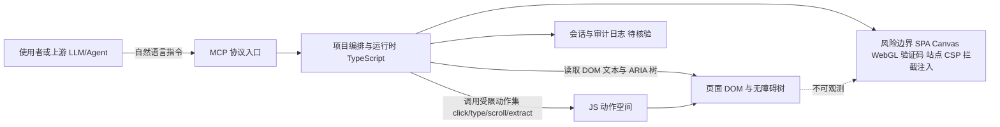

# alibaba/page-agent

## 一句话定位
JavaScript in-page GUI agent——零依赖注入式 DOM 控制，用自然语言驱动网页操作，不需要截图和多模态 LLM，成本极低。

## 它解决的问题
传统网页自动化（Selenium/Playwright）需要手写选择器和脚本，维护成本极高；而新型 GUI agent（如 UI-TARS、computer-use）依赖截图+多模态模型，每次操作都要发图，token 消耗大、延迟高。page-agent 走了第三条路：直接注入 JS 到页面，用 DOM 文本节点作为"眼睛"，用 JS API 作为"手"，纯文本驱动，无需视觉模型即可完成表单填写、点击导航、数据提取等操作。

## 为什么值得关注
- **Stars:** 28,493 stars，一个月内从 19k 涨到 28k，增速约 48%
- **Forks:** 2,517，社区参与度高
- **语言:** TypeScript，对前端开发者友好
- 支持 MCP 协议，可直接接入 Claude、Cursor 等 AI 工具
- 阿里巴巴官方维护，有持续工程投入
- 浏览器自动化赛道最热门项目之一，且与主流"截图派"路线形成差异化

## 热度来源判断
- **真实需求驱动（高）**：传统 RPA/测试自动化确实存在高维护成本痛点
- **AI agent 浪潮（高）**：MCP 生态扩张带动所有网页操作类工具
- **技术差异化（高）**：不需要多模态模型这一点，大幅降低了部署门槛和成本
- **阿里品牌背书（中）**：企业用户对大厂项目信任度更高

## 关键技术亮点亮点
1. **零截图架构**：通过 DOM MutationObserver 和 accessibility tree 感知页面状态，纯文本输入输出
2. **MCP 协议原生支持**：可作为 MCP server 被任意 AI agent 调用
3. **浏览器扩展 + 脚本注入双模式**：既可做 Chrome 扩展长期运行，也可一次性注入
4. **动作空间设计**：将网页操作抽象为有限的 JS 函数集（click、type、scroll、extract），比自由坐标点击更可靠
5. **无障碍树优化**：利用 ARIA 树做元素定位，天然兼容无障碍场景

## 架构师速览

| 决策问题 | 研究判断 | 证据边界 |
|---|---|---|
| 系统边界 | page-agent 是 TypeScript 编写的 in-page GUI agent，定位为浏览器内 JS 注入层，向上游 LLM/agent 提供 DOM 级执行能力，通过 MCP 协议被消费；不托管模型，也不替代浏览器本身 | 证据：标签 in-page-agent/gui-agent/mcp、语言 TypeScript、定位"零依赖注入式 DOM 控制"；具体入口形态（扩展 vs 一次性脚本）与持久化机制未在档案中给出 |
| 主路径 | 用户自然语言指令 → MCP 入口 → 编排层用 DOM MutationObserver/accessibility tree 感知页面 → 调用受限 JS 动作集（click/type/scroll/extract） → DOM 改写结果回写到页面 | 证据来自"关键技术亮点"条目；动作集的完整 API 表面、是否含等待/重试、会话是否被持久化属于"待核验" |
| 关键权衡 | 走 DOM/无障碍树而非多模态视觉路线，牺牲 SPA/Canvas/WebGL/登录墙场景的覆盖率，换取无需视觉模型、token 与延迟更低的部署门槛 | 证据：风险/局限条目直接列出 SPA/Canvas/WebGL、验证码、JS 注入被站点拦截等失效边界；多模态对比在"vs UI-TARS-desktop/Browser Use"段落 |
| 最小 PoC | 在单浏览器扩展形态下，对一个静态/服务端渲染的表单页（如简单登录后 CRUD 表单）跑通"自然语言 → 点击/输入/提取"端到端，并把 DOM MutationObserver 触发频率、动作失败率、token 消耗作为验收指标 | 证据：双模式（扩展+注入）、MCP server、有限动作集均来自档案；具体部署形态、SLO 阈值、撤销路径在档案中未给出 |

## 架构启发
- **"非视觉"GUI agent 路线被验证**：证明了纯 DOM/语义驱动可以覆盖大量网页自动化场景，不必走多模态重路线
- **agent 能力下沉到浏览器**：将 agent 逻辑注入页面而非远程控制浏览器，减少网络往返
- **MCP 作为标准接口**：page-agent 的 MCP server 模式是 agent-native 工具的典型范例

## 架构图（MMD）

> 证据边界：此图只采用本档案已有可核验描述；“待核验”节点不应视为项目实现事实。

## 定位判断
**差异化工具型项目**。不是通用 agent 平台，而是网页操作这个垂直场景的专用执行器。在 MCP 生态中扮演"手"的角色，与负责"看"和"想"的 LLM 形成互补。

## 风险/局限/泡沫点
- **动态网页兼容性**：SPA、Canvas、WebGL 内容无法通过 DOM 操作
- **验证码/登录墙**：无法处理需要人工验证的场景
- **阿里项目治理风险**：内部优先级变化可能导致维护放缓（历史上有先例）
- **与 Playwright MCP 的竞争**：Playwright 也推出了 MCP server，可能蚕食市场
- **依赖页面 JS 可用**：某些安全策略严格的网站会阻止注入

## 与同类项目的关系
- **vs UI-TARS-desktop**：后者走多模态视觉路线，page-agent 走 DOM 路线，互补而非直接竞争
- **vs Playwright MCP**：Playwright 更偏编程控制，page-agent 更偏自然语言驱动
- **vs Browser Use**：Browser Use 走截图+视觉路线，定位接近但技术路线不同
- **vs Skyvern**：Skyvern 也是 LLM 驱动网页自动化，但更重，走云端 API

## 是否值得持续跟踪
**是，高度推荐跟踪。** 作为"非视觉"网页 agent 路线的标杆项目，其 MCP 集成模式值得所有 agent 工具开发者学习。若阿里持续投入，有成为网页自动化事实标准的潜力。

## 后续观察点
- Star 增速是否突破 50k（判断是否破圈）
- 是否出现企业级落地案例和成功故事
- MCP 生态中 page-agent 被引用的频率
- 对复杂 SPA（如 Google Maps、复杂后台管理系统）的实际成功率
- 阿里内部是否将其用于电商自动化（淘宝/天猫场景验证）

---
> 数据来源: GitHub API (2026-08-05) | Stars: 28,493 | Forks: 2,517 | 语言: TypeScript
