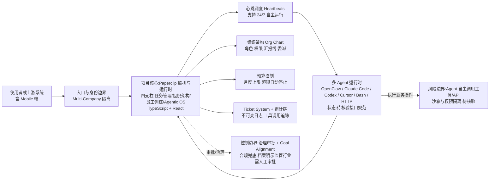

# Paperclip — 管理 AI Agent 团队的开源编排平台

## 一句话定位
开源的 AI Agent 团队编排平台——"如果 OpenClaw 是员工，Paperclip 是公司"，用类似任务管理器的界面管理多 Agent（OpenClaw/Claude Code/Codex/Cursor）协同工作，内置组织架构图、预算控制、治理审批和自主运行。

## 它解决的问题
企业内部大量流程仍需人工介入，而 AI Agent 的使用也面临管理混乱——"同时开 20 个 Claude Code 终端，完全不知道每个在做什么"。Paperclip 解决的是**Agent 团队的管理和编排问题**：如何给 Agent 分配角色和目标？如何追踪工作进度和成本？如何设置审批和治理？如何让不同 Agent（OpenClaw、Codex、Claude Code、Cursor）协同？Paperclip 把这些抽象成一个类似任务管理器（Linear/Jira）的界面，但底层是组织架构图、预算、治理和 Agent 协调引擎。

## 为什么值得关注（2026-08-11）
- **Stars:** 76,794（截至 2026-08-11），4 个月内从 58.8K 增至 76.8K
- **Forks:** 14,222，极高——说明有大量严肃工程采纳
- **Watchers:** 380，核心开发者深度关注
- **License:** MIT
- **语言:** TypeScript（Node.js 后端 + React UI）
- **Open Issues:** 5,093（高，反映社区活跃度和复杂性）
- **活跃度:** created 2026-03-02，pushed_at 2026-08-11（当天仍在更新）
- **四支柱架构:** Agentic Task Manager / Org Chart / Agent Training / Agentic OS
- **多 Agent 兼容:** OpenClaw、Claude Code、Codex、Cursor、Bash、HTTP——"能接收心跳的都是员工"

## 热度来源判断
Paperclip 的热度是**"'零人类公司'概念击中市场想象 × 多 Agent 编排刚需 × 14K forks 的工程采纳信号 × MIT 开源"**的组合。"如果 OpenClaw 是员工，Paperclip 是公司"的定位极其精准——它不是又一个 Agent 框架，而是**Agent 组织的管理层**。76K stars 中确实有概念追捧的成分（"零人类公司"是热词），但 **14,222 个 forks 不是概念能解释的**——这代表大量开发者真正 fork 并尝试使用。380 个 watchers 说明有严肃的工程团队在深度跟踪。5,093 个 open issues 反映项目复杂度高 + 用户基数大。热度**以概念为引，但有真实工程采纳支撑**。

## 关键技术亮点
1. **Bring Your Own Agent:** 任何 Agent（OpenClaw/Claude Code/Codex/Cursor/Bash/HTTP）只要能接收"心跳"就可纳入组织——跨 Agent 运行时编排
2. **组织架构图 (Org Chart):** 混合人类 + Agent 的组织架构——角色、权限、汇报线、委派、专业化，不是扁平的 Agent 列表
3. **Goal Alignment (目标对齐):** 每个任务可追溯到公司使命，Agent 知道"做什么"和"为什么"
4. **Heartbeats (心跳调度):** Agent 按计划唤醒、检查工作、行动——支持 24/7 自主运行，委派在组织架构中上下流转
5. **预算控制:** 每个 Agent 月度预算上限，超限自动停止——防止成本失控
6. **Multi-Company:** 一个部署管理多个"公司"（项目/业务线），完全数据隔离
7. **Ticket System + 审计链:** 每次对话可追溯、每个决策有解释、完整的工具调用追踪和不可变审计日志
8. **Skill Studio:** 设计、训练、评估 AI 员工——技能评估、测试运行、主动学习循环
9. **Mobile Ready:** 手机端管理和监控自主业务

## 架构师速览

| 决策问题 | 研究判断 | 证据边界 |
|---|---|---|
| 系统边界 | 入口渠道、多 Agent 运行时（OpenClaw/Claude Code/Codex/Cursor）与工具/数据源之间的编排与治理层，TypeScript/Node.js + React，MIT | 仅基于档案分类、标签与文字描述，未审计源码；具体进程边界与部署形态待核验 |
| 主路径 | 心跳调度 → 组织架构内任务委派 → Agent 运行时执行 → 预算/审批/审计回写 | "Heartbeats / Org Chart / 预算控制 / Ticket System + 审计链"为档案明确条目；消息协议与持久化方案待核验 |
| 关键权衡 | 多 Agent 兼容性广度（OpenClaw/Claude Code/Codex/Cursor/Bash/HTTP） vs 各运行时接口差异带来的持续维护成本；自主性 vs 审批/合规兜底 | 维护成本与合规风险由档案明示，性能/可靠性指标无公开数据 |
| 最小 PoC | 单 Agent（建议 OpenClaw 或 Claude Code）+ 单一工具权限 + 月度预算上限 + 审计日志开启，验证心跳委派、预算熔断、审计可追溯三条最小路径 | 5,093 个 open issues 表明复杂度高；缺真实生产案例，PoC 须把退出路径与 SLO 列为验收项 |

## 架构启发
Paperclip 的核心启发是**"把组织管理概念应用到 Agent 编排"**。传统 Agent 框架（CrewAI、LangGraph）关注 Agent 间的任务流转，而 Paperclip 引入了**组织架构、预算、治理、审计**等企业级管理概念。这是从"Agent 框架"到"Agent 组织"的范式跃迁。

更深层的启发是**"审批"应建模为 Agent 间的消息传递，而非人类 UI 操作**。Paperclip 不是模拟人类在 UI 上点击"审批"按钮，而是将审批建模为组织架构中的消息流——这从根本上重新定义了企业流程自动化。

对企业的直接启发：**如果要让 Agent 参与业务流程，先建立组织架构和治理框架，而非先选 Agent 框架**。管理框架比执行框架更重要。

## 架构图（MMD）

> 证据边界：此图只采用本档案已有可核验描述；“待核验”节点不应视为项目实现事实。

## 定位判断
**平台候选（强）。** Paperclip 试图成为**AI Agent 组织的管理平台**——类似 Jira/Linear 之于人类团队，但面向 Agent。76K stars + 14K forks 已显示强劲需求。如果"Agent 组织"成为企业标配（这是 AI 深度采纳的必然结果），Paperclip 有成为标准管理平台的潜力。四支柱架构（任务管理 + 组织架构 + 员工训练 + 基础设施）覆盖完整，Mobile Ready 说明产品化程度高。

## 风险 / 局限 / 泡沫点
- **"零人类"合规风险:** 在金融/医疗/法律等监管行业，完全自主的 Agent 决策多数不合规——仍需人工审批兜底
- **5093 个 open issues:** 反映项目复杂度极高，bug 和功能请求积压严重
- **LLM 可靠性瓶颈:** Agent 自主决策的质量上限取决于底层 LLM，关键环节仍需人工介入
- **多 Agent 兼容的维护成本:** 每种 Agent（OpenClaw/Claude Code/Codex/Cursor）的接口和行为不同，保持兼容是持续工程负担
- **概念泡沫:** "零人类公司"在实际商业中极为罕见，多数场景是"Agent 辅助人类"而非"Agent 替代人类"
- **安全边界:** Agent 自主执行业务操作（如发送邮件、修改数据、调用 API）的风险极高，需要强大的沙箱和审计

## 与同类项目的关系
- **vs OpenClaw:** OpenClaw 是单个 Agent 运行时（员工）；Paperclip 是多 Agent 管理平台（公司）——互补关系，Paperclip 明确定位为 OpenClaw 的上层
- **vs n8n:** n8n 是通用工作流自动化（连接 API）；Paperclip 专注 Agent 组织编排——不同抽象层级
- **vs CrewAI / LangGraph:** CrewAI/LangGraph 是 Agent 编排框架（代码级）；Paperclip 是产品化的管理平台（UI + 治理）——更高层抽象
- **vs Langflow / Flowise:** 偏 Agent 构建和流程设计；Paperclip 偏组织管理和治理
- **vs Mercury Agent:** Mercury 是单 Agent 运行时；Paperclip 是多 Agent 编排——不同层级

## 是否值得持续跟踪
**是（高优先级）。** Paperclip 代表了"Agent 组织管理"这一新方向，无论其本身成败，这个方向是 AI 深度采纳的必然需求。建议：对探索 Agent 自动化的企业，做 PoC 验证在合规框架下的半自动化流程。对 Agent 生态观察者，它是"Agent 管理平台"赛道的头部样本。14K forks 的工程采纳信号不应忽视。

## 后续观察点
1. **真实企业案例:** 是否有公开的企业生产使用案例（超越 demo 级别）
2. **合规/审计能力:** 是否推出满足金融/医疗监管要求的审计和合规插件
3. **Agent 平台深度集成:** OpenClaw / Claude Code / Codex 是否官方推荐 Paperclip 作为管理层
4. **issue 积压处理:** 5093 个 open issues 的处理速度反映项目健康度
5. **被收购/集成可能性:** 是否被大型平台（如 Anthropic、OpenAI）收购或深度集成
6. **安全事件:** 是否出现 Agent 自主操作导致的重大事故

---
> 数据来源: GitHub API (2026-08-11) | Stars: 76,794 | Forks: 14,222 | License: MIT | 语言: TypeScript | 创建: 2026-03-02
