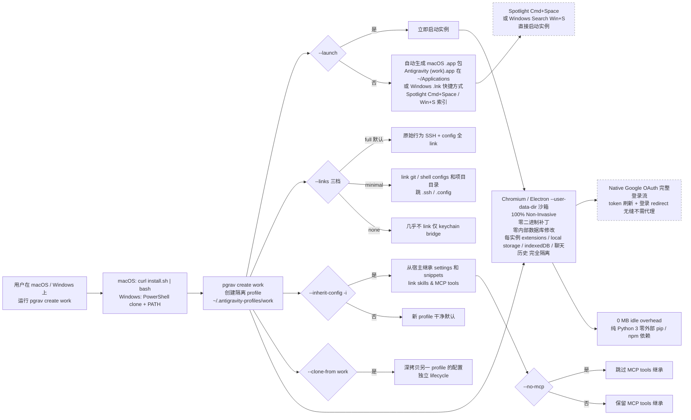

# edison-land/paragravity

## 一句话定位
Google Antigravity 多账号并行沙箱管理器 ——「Native, non-invasive parallel multi-account & sandbox manager for Google Antigravity」：基于 Chromium / Electron `--user-data-dir` 多账号并行 + Native Google OAuth 完整登录流 + 自动生成 macOS .app 包 / Windows .lnk + Spotlight 索引 + 0 MB idle overhead + 纯 Python 3 零外部依赖 + 三档 `--links` 链接策略 + `--inherit-config -i` 继承 + `--no-mcp` 排除。

## 它解决的问题
开发者 / 测试者有多个 Google 账号 + 不能并排开多个 Antigravity 窗口 + 切账号要重启 + Chromium user-data-dir 隔离要手动 + 不想破坏官方 Electron app + 不想要后台 daemon 吃 RAM + 不想装额外 pip / npm 依赖 + 不想 hack 官方登录流 + 想要 Spotlight 一键启动。它解决的是「Google Antigravity 多账号并行 + 隐私 / 安全边界 + 跨平台 + 桌面集成 + 零依赖」五件事一次解决的真痛点。

## 为什么值得关注
- **Stars:** 186（截至 2026-09-24），2 天突破 186，增速较快
- **Forks:** 16，社区贡献较活跃
- **Watchers/Subscribers:** 1（公开 API 字段）
- **Open Issues:** 0，维护良好
- **License:** MIT
- **语言:** Python（含 README_zh.md 中文 README）
- **活跃度:** created 2026-09-22，pushed_at 2026-09-23，持续高活跃
- **规模:** 136KB，极小 Python 项目（含 install.sh + bin/ + README）
- **Topics:** 无（未填写 GitHub topics）

## 热度来源判断
edison-land/paragravity 的热度是 **「Chromium / Electron `--user-data-dir` 多账号并行刚需 × Native Google OAuth 完整登录流 × 自动生成 macOS .app 包 / Windows .lnk × Spotlight 索引 × 0 MB idle overhead × 纯 Python 3 零外部依赖 × 三档 `--links` 链接策略 × `--inherit-config` 继承 × `--no-mcp` 排除」** 的强劲组合。Google Antigravity 是 2026 年新兴 Coding Agent，多账号并行是真痛点——开发者 / 测试者常需多账号 side-by-side 但官方不支持。一个 **严格基于 Chromium / Electron 官方 `--user-data-dir` 沙箱** + **Native Google OAuth 完整登录流** + **0 MB idle overhead** + **纯 Python 3 零外部依赖** 的多账号并行沙箱管理器直击痛点。热度**真实且具 Chromium / Electron 严肃工程化跨平台潜力**——但需警惕：Chromium / Electron `--user-data-dir` 沙箱在多 Antigravity 版本的稳定性 + 完整 OAuth 流在多账号并行的兼容性 + 自动 .app / .lnk 集成在 Spotlight / Windows Search 的索引速度 + 0 MB idle overhead 在长期运行的稳定性 + 纯 Python 3 零依赖在多 Python 版本的兼容性 + 三档 `--links` 链接策略在多用户配置的实用性 + 跨平台 acceptance-test 进度。

## 关键技术亮点
1. **100% Non-Invasive** —— 严格基于 Chromium / Electron 官方 `--user-data-dir` 沙箱；零二进制补丁；零内部数据库修改；零账号安全风险
2. **True Parallel Concurrency** —— 多 Google Gemini Pro 账号 side-by-side 独立窗口同时运行不重启 / 不切会话
3. **Native Google OAuth** —— 完整未触碰的 Google Cloud 认证流；token 刷新 + 登录 redirect 无缝不需代理
4. **Native Desktop Integration** —— 自动生成独立 macOS .app 包（Spotlight 索引）或 Windows Desktop & Start Menu 快捷方式 (.lnk)；直接通过 **Spotlight (`Cmd + Space`)** 或 **Windows Search (`Win + S`)** 启动
5. **Zero-Footprint & Ultra-Lightweight** —— 无后台 daemon 吃 RAM（0 MB idle overhead）；纯 Python 3 + 零外部 pip / npm 依赖
6. **Total Workspace Isolation** —— 每实例 extensions / local storage / indexedDB / 聊天历史 完全隔离，防止工作区污染
7. **macOS 一行安装** —— `curl -fsSL https://raw.githubusercontent.com/edison-land/paragravity/main/install.sh | bash`
8. **Windows PowerShell clone** —— `$HOME\.paragravity` + PATH + `pgrav create work`
9. **`--links` 三档** —— `full`（默认，原始行为）/ `minimal`（link git / shell configs 和项目目录，跳 .ssh / .config）/ `none`（几乎不 link，仅 keychain bridge）
10. **`--inherit-config -i`** —— 从宿主继承 settings 和 snippets + link skills & MCP tools
11. **`--clone-from`** —— 深拷贝另一 profile 的配置（独立 lifecycle）
12. **`--no-mcp`** —— 跳过 MCP tools 继承
13. **Git Bash (MSYS2) 完全支持** —— `bin/pgrav` 是真 POSIX script 不是 symlink，能在 Windows 默认 `core.symlinks=false` clone 下存活
14. **Homebrew Tap Coming Soon** —— `brew tap edison-land/tap && brew install paragravity`

## 架构师速览

| 决策问题 | 研究判断 | 证据边界 |
|---|---|---|
| 系统边界 | Python 3 CLI + install.sh + bin/ + Chromium / Electron `--user-data-dir` 沙箱 + macOS .app 包生成 + Windows .lnk 生成；0 MB idle overhead；零外部 pip / npm 依赖；三档 `--links` 链接策略；`--inherit-config` / `--clone-from` / `--no-mcp` 继承排除 | 仅基于 README 公开摘录 + GitHub Search API 元数据；具体 bin/ 目录结构、install.sh 流程、.app / .lnk 自动生成实现、三档 `--links` 实际行为、继承与克隆的具体配置项未在档案中给出 |
| 主路径 | 用户运行 `pgrav create work` → 创建隔离 profile `~/.antigravity-profiles/work` → 启动时调 Chromium / Electron `--user-data-dir` 指向新 profile → 自动生成 macOS .app 包 `Antigravity (work).app` 在 `~/Applications` 或 Windows .lnk 快捷方式 → Spotlight / Windows Search 索引 → 用户直接启动实例 | 主路径为 README 语义抽象；profile 创建与 Chromium / Electron 集成细节、.app / .lnk 自动生成的实现机制、Spotlight / Windows Search 索引速度、`--inherit-config` / `--clone-from` / `--no-mcp` 的具体行为均待核验 |
| 关键权衡 | 100% Non-Invasive 基于 Chromium / Electron 官方沙箱 vs 多 Antigravity 版本稳定性 vs 完整 OAuth 流在多账号并行兼容性 vs 0 MB idle overhead 长期运行稳定性 vs 纯 Python 3 零依赖兼容性 vs 三档 `--links` 实用性 vs `--inherit-config` / `--clone-from` / `--no-mcp` 可用度 vs macOS Apple Silicon / Intel 与 Windows 10/11 多版本 acceptance-test | 档案明示「100% Non-Invasive 严格基于 Chromium / Electron 官方 `--user-data-dir` 沙箱」 + 「0 MB idle overhead」 + 「纯 Python 3 零外部依赖」三点权衡；具体 Chromium 沙箱稳定性、OAuth 兼容性、跨平台 acceptance-test 进度未证实 |
| 最小 PoC | 在 macOS Apple Silicon 上 `curl install.sh | bash` → `pgrav create work` 验证 .app Spotlight 索引 + `--launch` 立即启动 + `--links minimal / none` 三档验证 → Windows 10/11 PowerShell clone 验证 PATH + `.lnk` Win + S 索引（需用户提供 Windows 测试机） → `--inherit-config -i` 验证继承宿主 settings + `--no-mcp` 验证排除 MCP | PoC 范围、退出路径由档案「先 macOS acceptance-test、Windows 需用户测试机、三档 `--links` 渐进、继承 / 排除渐进」建议推导；具体 .app 索引速度、OAuth 兼容性、跨平台稳定性、SLA 指标待核验 |

## 架构启发
edison-land/paragravity 的核心启发是 **「100% Non-Invasive 严格基于 Chromium / Electron 官方 `--user-data-dir` 沙箱 + 0 MB idle overhead + 纯 Python 3 零外部依赖」是 Chromium / Electron 多账号并行严肃工程化的「安全 / 轻量 / 零依赖三件套」**。当前所有 Chromium / Electron 多账号方案要么 hack 官方二进制（账号安全风险）要么后台 daemon 吃 RAM（资源浪费）要么装大量 pip / npm 依赖（部署复杂）。paragravity 尝试做「Chromium / Electron 多账号并行严肃工程化的最佳实践」，严格基于官方沙箱 + 0 MB idle + 纯 Python 3 零依赖。更深层的启发是：**「自动生成 macOS .app 包（Spotlight 索引）+ Windows .lnk（Win + S 索引）」是 macOS / Windows 桌面集成的严肃工程化路径** ——把每个 Antigravity 实例变成原生桌面应用，通过 Spotlight / Windows Search 直接启动，是「用户操作 → 系统集成」的转化层。再深一层：**「三档 `--links` 链接策略 + `--inherit-config -i` 继承 + `--no-mcp` 排除」是严肃工程化个人开发者工具的关键标志** —— 提供 full / minimal / none 三档 SSH / config 链接策略 + 继承 / 克隆 / 排除三种配置继承方式，是「工具灵活性 → 用户控制」的转化层。

## 架构图（MMD）

> 证据边界：此图只采用本档案已有可核验描述；"待核验"节点不应视为项目实现事实。

## 定位判断
**工具型项目（Google Antigravity 多账号并行沙箱管理器）。** edison-land/paragravity 不仅是一个 CLI 工具，更试图成为 **Chromium / Electron 多账号并行严肃工程化的最佳实践** ——100% Non-Invasive 基于官方 `--user-data-dir` 沙箱 + 完整 OAuth 流 + 自动 .app / .lnk 集成 + Spotlight + 0 MB idle + 纯 Python 3 零依赖 + 三档 `--links` 链接策略 + 继承 / 排除 MCP。186⭐ + 16 forks 已显示「Chromium / Electron 严肃工程化跨平台」的早期形态。能否持续，取决于一个关键问题：**Chromium / Electron `--user-data-dir` 沙箱在多 Antigravity 版本的稳定性 + 完整 OAuth 流在多账号并行的兼容性 + 跨平台 acceptance-test 进度**。目前定位是「Google Antigravity 多账号并行沙箱管理器的严肃工程化实现」，向更多 Chromium / Electron 应用（VS Code / Cursor / Discord / Slack 等）扩展是合理路径。

## 风险 / 局限 / 泡沫点
- **Antigravity 依赖**：强依赖 Google Antigravity，若 Antigravity 调整 API 或 Electron 框架，所有扩展需同步调整
- **Chromium / Electron 沙箱稳定性**：`--user-data-dir` 沙箱在多 Antigravity 版本的稳定性依赖 Chromium / Electron 官方保证
- **完整 OAuth 兼容性**：Native Google OAuth 在多账号并行的兼容性依赖 Google Cloud 认证流不变
- **0 MB idle overhead**：依赖无后台 daemon 设计，长时间运行的稳定性待验证
- **纯 Python 3 零依赖**：依赖 Python 3.8+ 在 macOS / Windows 多版本的兼容性
- **跨平台 acceptance-test**：Homebrew Tap Coming Soon；macOS Intel / Apple Silicon 与 Windows 10/11 跨平台 acceptance-test 进度待跟进
- **Git Bash (MSYS2) 兼容性**：`bin/pgrav` 是真 POSIX script 不是 symlink，能在 Windows 默认 `core.symlinks=false` clone 下存活，但 CMD / PowerShell 自动用 bundled `pgrav.cmd`
- **个人开发者属性**：edison-land 个人维护，16 forks 但核心治理仍集中，可持续性存疑

## 与同类项目的关系
- **vs SewCabinSpout/cleanupper**（09-24）：后者是「macOS 终端清理 CLI 替代 CleanMyMac」；paragravity 是「Google Antigravity 多账号并行沙箱管理器」，都是 macOS / Windows 严肃工程化个人开发者工具
- **vs unreallabsai/unreal-agent**（09-23）：后者是「async-first Go harness 八组件」；paragravity 是「Python 3 CLI + Chromium / Electron `--user-data-dir`」，都是严肃工程化个人开发者工具
- **vs jev-chat 系列**（09-22 ~ 09-23）：后者是「Jev + 微信 / macOS / Windows」；paragravity 是「Chromium / Electron 多账号并行」，都是严肃工程化个人开发者工具
- **vs freestylefly/WeChatBridge**（09-23）：后者是「macOS 微信 Share Extension + Developer ID + Apple 公证」；paragravity 是「Chromium / Electron + 自动 .app / .lnk 集成」，都是 macOS native 严肃工程化
- **vs kryvora-network/kryvora-node**（09-22 ~ 09-23 出现）：后者是「Reference client daemon and verification worker for Kryvora Network nodes」；paragravity 是「Python 3 CLI + 0 MB idle + 零依赖」，都是 Go / Python 严肃工程化

## 是否值得持续跟踪
**值得跟踪（Chromium / Electron 多账号并行严肃工程化）。** edison-land/paragravity 代表了 Chromium / Electron 多账号并行严肃工程化的诉求，无论其本身成败，这一方向是行业趋势。建议关注：Chromium / Electron 沙箱稳定性 + 完整 OAuth 兼容性 + 自动 .app / .lnk 索引速度 + 0 MB idle overhead 长期稳定性 + 纯 Python 3 零依赖兼容性 + 三档 `--links` 实用性 + 跨平台 acceptance-test 进度 + 是否扩展到更多 Chromium / Electron 应用（VS Code / Cursor / Discord / Slack 等）+ 是否商业化（Sponsor / 网站 / Homebrew tap）。对 Google Antigravity 多账号用户，这个项目是「并排开多个 Antigravity 窗口 + 完整 OAuth + 自动 .app / .lnk + Spotlight + 0 MB idle + 纯 Python 3 零依赖」的具体实现路径，值得直接采用。对 Chromium / Electron 严肃工程化跨平台工具观察者，它是「安全 / 轻量 / 零依赖三件套」赛道的头部样本。

## 后续观察点
- Chromium / Electron `--user-data-dir` 沙箱在多 Antigravity 版本的稳定性
- 完整 OAuth 流在多账号并行的兼容性
- 自动 .app / .lnk 集成在 Spotlight / Windows Search 的索引速度
- 0 MB idle overhead 在长期运行的稳定性
- 纯 Python 3 零依赖在多 Python 版本的兼容性
- 三档 `--links` 链接策略在多用户配置的实用性
- --inherit-config / --clone-from / --no-mcp 在多场景的可用度
- macOS Apple Silicon / Intel 与 Windows 10/11 多版本 acceptance-test 进度
- 是否扩展到更多 Chromium / Electron 应用（VS Code / Cursor / Discord / Slack 等）
- 是否商业化（Sponsor / 网站 / Homebrew tap）

---
> 数据来源: GitHub API (2026-09-24) | Stars: 186 | Forks: 16 | License: MIT | 语言: Python | 创建: 2026-09-22