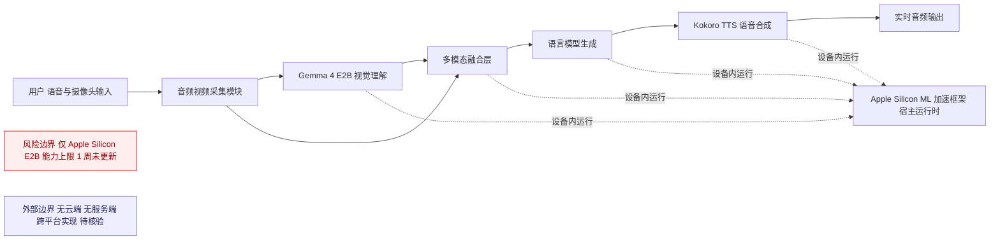

# parlor — 端侧实时多模态 AI 对话

## 一句话定位

完全本地运行的实时多模态 AI 对话系统，基于 Gemma 4 E2B + Kokoro，Apple Silicon 原生。

## 它解决的问题

在设备端实现自然的语音+视觉 AI 对话，不依赖云端 API，保护隐私。

## 为什么值得关注

1. **完全本地化**：Gemma 4 E2B（视觉）+ Kokoro（语音），零云端依赖
2. **Apple Silicon 原生**：针对 M 系列芯片优化
3. **实时交互**：非离线批处理，而是实时对话体验

## 热度来源判断

1,551 stars，热度合理。端侧 AI 是当前明确趋势，项目技术栈选型合理。

## 关键技术亮点亮点

- Gemma 4 E2B 多模态模型
- Kokoro TTS 语音合成
- Apple Silicon ML 加速框架集成
- 实时音视频流处理

## 架构师速览

| 决策问题 | 研究判断 | 证据边界 |
|---|---|---|
| 系统边界 | 端侧封闭系统：UI/CLI → 核心（Gemma 4 E2B 视觉 + Kokoro TTS）→ Apple Silicon ML 加速框架；无云端、无服务端、无持久化层在档案中明确出现 | 仅档案明示的 Gemma 4 E2B、Kokoro、ML 加速框架、实时音视频流；具体模块拆分、IPC、线程模型未证实 |
| 主路径 | 用户语音/视频输入 → 多模态模型推理（设备本地）→ 语言模型融合 → Kokoro TTS → 实时音频输出；全链路在设备内完成 | "视觉模型 → 融合层 → 语言模型 → TTS → 实时输出"为档案启发式描述，非经过验证的数据流图 |
| 关键权衡 | 隐私/延迟收益 vs 硬件锁定 + 模型能力天花板 + 生态封闭；档案明示不支持非 Apple 平台 | 硬件依赖、E2B 能力上限、Apple 生态绑定均出自档案风险段；性能基准/功耗未给出 |
| 最小 PoC | 在 M 系列 Mac 上以单会话短对话验证：响应延迟、TTS 自然度、视觉上下文接入成功率、回退行为；不投入生产路径 | 项目被档案标注"不建议企业 PoC"；最远只到"短期关注" |

## 架构启发

端侧多模态 AI 的架构模式：视觉模型 → 融合层 → 语言模型 → TTS → 实时输出。这正在成为端侧 AI 应用的标准 pipeline。

## 架构图（MMD）

> 证据边界：此图只采用本档案已有可核验描述；“待核验”节点不应视为项目实现事实。

## 定位判断

**工具型**。面向消费者的端侧 AI 应用，技术栈有参考价值但不具备平台化能力。

## 风险/局限/泡沫点

1. **硬件依赖**：仅支持 Apple Silicon，受众有限
2. **模型能力上限**：E2B 参数量级的多模态能力有天花板
3. **最后推送 4/7**：一周未更新，活跃度需关注
4. **生态封闭**：与 Apple 生态绑定，不利于跨平台推广

## 与同类项目的关系

- **vs LiteRT**：LiteRT 是 Google 端侧 ML 框架（基础设施），parlor 是端侧 AI 应用
- **vs dflash-mlx**：dflash-mlx 提供推理加速（引擎层），parlor 是应用层

## 是否值得持续跟踪

**短期关注。** 端侧多模态方向值得跟踪，但 parlor 本身可能只是过渡性项目。

## 是否值得企业 PoC

**❌ 不建议。** 消费级应用，非企业基础设施。

## 后续观察点

1. 是否持续更新
2. 多模态对话质量的用户反馈
3. 是否有类似的非 Apple 平台实现出现
