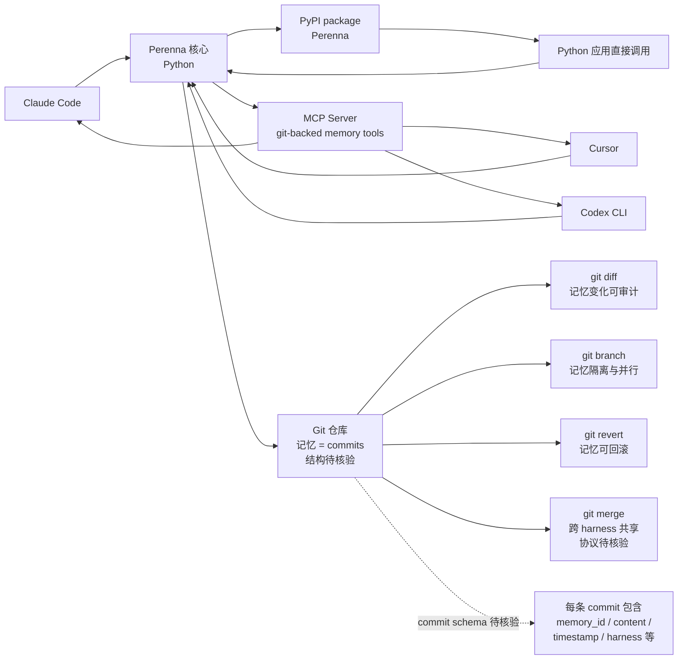

# scarletkc/Perenna

## 一句话定位
**Lightweight, Git-backed permanent memory for AI agents** ——把 agent 长期记忆以 **git commit 形式持久化**，提供 PyPI 包 + MCP server。可 diff / branch / revert / 跨 harness 共享。

## 它解决的问题
Agent 长期记忆的三痛点：(1) **版本化缺失**——传统向量库 / 数据库无法 diff 记忆变化；(2) **跨 harness 不可移植**——Claude Code 写、Cursor 读不了；(3) **可回滚性差**——记忆一旦污染无法 revert。**Perenna 把"agent 记忆 = git commits"作为产品哲学**：天然支持版本化 / 共享 / 审计 / diff / branch / revert。命名"Perenna"（一种能长存的植物）暗示设计哲学：**记忆应该像植物一样在多个季节存活**。

## 为什么值得关注（2026-08-26）
- **4 天 33⭐ / 1 fork**：agent-memory 赛道早期信号，但 star 数仍低
- **MIT 许可 / Python**：降低集成门槛
- **Git-backed 设计哲学**：与 8-24 backpass 同代但更彻底——backpass 只改 AGENTS.md 一个文件，Perenna 把整个记忆库当 git repo 管
- **PyPI package + MCP server**：双重分发形态
- **509KB size**（极小）：暗示是简洁实现，可能利用了 git 作为存储引擎
- **topic 完整**：agent-memory / ai-memory / git-backed / mcp / self-hosted 全部覆盖

## 热度来源判断
热度来自 **"agent 记忆可审计化 × 跨 harness 共享 × Git 作为通用存储"** 的组合：(1) Git 是开发者最熟悉的版本化工具，把 agent 记忆建在 git 上零学习成本；(2) 跨 harness 共享需求真实存在（同一个开发者可能用 Claude Code + Cursor + Codex）；(3) 8-24 backpass 的 AGENTS.md 改写是同方向但单文件，Perenna 把整个记忆库 git 化是更彻底的形态。**主要风险：** 33⭐/1 fork 表明社区关注度尚未形成；git 作为 agent 记忆是否真能 scale 到 10k+ commits 级别（性能 / 体积）需观察。

## 关键技术亮点
1. **Git 作为 agent 记忆的存储引擎**：天然支持 diff / branch / revert / merge
2. **PyPI + MCP server 双重分发**：Python 生态与 Claude Code / Cursor 等 agent 双覆盖
3. **509KB 极小 size**：利用 git 而非自建存储引擎
4. **"Perenna"命名哲学**：长存植物暗示设计意图——记忆应该能跨季节存活
5. **与 8-24 backpass 互补**：backpass 改 AGENTS.md 单文件；Perenna 改整个记忆库
6. **Self-hosted**：不依赖任何云服务，完全本地优先

## 架构师速览

| 决策问题 | 研究判断 | 证据边界 |
|---|---|---|
| 系统边界 | PyPI package `Perenna` + MCP server；git-backed 持久化；每个 agent 一个 git repo 还是每个会话一个 branch 未明示 | 边界由 README + topic + PyPI 描述确认；具体 git 仓库结构、commit schema、跨 harness 共享协议需源码核验 |
| 主路径 | Agent 操作 → Perenna 接收 → git commit 形式持久化记忆 → diff/branch/revert 能力 → MCP server 暴露给其他 harness | 主路径为档案语义抽象；具体每条 commit 的内容 schema、merge 冲突处理、跨 harness 共享协议未公开 |
| 关键权衡 | Git 作为存储 vs 数据库（diff/branch 是优势但 commit 性能是弱点）；自建 vs 复用 git 基础设施；每 agent 一个 repo vs 每个会话一个 branch | 取舍由 README "Git-backed permanent memory" 描述确认；具体性能基准、commit 频率、merge 策略未公开 |
| 最小 PoC | pip install Perenna → run Perenna init → 让 Claude Code 写入一条记忆 → 验证 git log 显示 commit → 让 Cursor 通过 MCP server 读取 → 验证跨 harness 可访问 | PoC 流程由 PyPI + MCP 描述推导；具体 init 命令、commit schema、跨 harness 协议未公开 |
| 证据边界 | README + topic + GitHub API；具体 git 结构、commit schema、跨 harness 协议、MCP tool 列表均需源码核验 | 已核验事实来自 GitHub API 与 topic；其他来自语义推断 |

## 架构图（MMD）

> 证据边界：此图只采用本档案已有可核验描述；"待核验"节点不应视为项目实现事实。

## 架构启发
Perenna 的核心启发是 **"Git 是 agent 记忆最被低估的存储引擎"** ——天然支持 diff / branch / revert / merge，与开发者最熟悉的工具链一致，零学习成本。更深层的启发：**"agent 记忆 = git commits" 让记忆可审计化、可版本化、可跨 harness 共享** ——Claude Code 写、Cursor 读、Codex CLI 都能接入同一 git 仓库，相当于 "agent 记忆的 GitHub"。再深一层：**"轻量 + Git-backed + MCP server" 三件套** 是 8-24 backpass（AGENTS.md 改写）方向的更彻底形态 ——backpass 只改单文件，Perenna 改整个记忆库，12 月内可能成为 agent memory 跨 harness 共享的事实标准。

## 定位判断
**agent-memory 工具型项目（Git-backed 方向）。** Perenna 是 "agent 记忆 = git commits" 的具体实现，把"agent 长期记忆"从数据库 / 向量库抽象回到 git 仓库。**核心差异化是 "Git 作为天然审计与版本化引擎"**：与所有数据库 / 向量库方案对比，git 提供了开发者最熟悉的 diff / branch / revert / merge 工具。**主要风险：** 33⭐/1 fork 仍属早期；git 在 10k+ commits 时的性能与体积；与 8-24 backpass 的差异化（backpass 改 AGENTS.md，Perenna 改整个记忆库）。

## 风险 / 局限 / 泡沫点
- **早期信号弱**：33⭐ / 1 fork / 0 watchers 表明社区关注度尚未形成
- **Git 性能边界**：10k+ commits 的 git 仓库性能（log / diff / clone）需观察
- **存储体积**：每个 agent 记忆 = git commits，长期运行的体积膨胀需管理策略
- **跨 harness 共享协议未明示**：如何让 Claude Code 写、Cursor 读的具体协议需源码核验
- **与现有方案竞争**：向量数据库（ChromaDB / Pinecone） / 文件系统（markdown notes） / 8-24 backpass（AGENTS.md 改写）都是同类方案
- **PyPI 安全审查**：作为 PyPI 包发布需通过 PyPI 安全审计

## 与同类项目的关系
- **vs 8-24 backpass**：backpass 是 "AGENTS.md 自动改写"（单文件）；Perenna 是 "整个记忆库 git 化"——更彻底
- **vs 8-24 spectrum-ts / ctx**：spectrum-ts 与 ctx 是其他 agent memory 形态（可能是 graph / KV）
- **vs ChromaDB / Pinecone**：向量数据库；Perenna 是 git 仓库——本质不同的存储选择
- **vs markdown notes 形态**：开发者手写 .md 笔记；Perenna 是 agent 自动 commit
- **vs 8-26 heimdall**：heimdall 是 "跨 repo 检索"（检索层）；Perenna 是 "记忆持久化"（存储层）——互补

## 是否值得持续跟踪
**值得跟踪（agent memory Git-backed 方向）。** Perenna 是 5 天内 3 个 agent memory 新项目中**唯一采用 Git 作为存储引擎的形态**——这是显著差异化（其他用向量数据库 / KV / 文件）。**建议关注：** (a) 6-12 月内是否被任何 coding agent 平台默认集成；(b) 与 backpass / heimdall 是否形成 "memory 三件套"（自改进层 + 检索层 + 存储层）；(c) Git 作为 agent 记忆的实际扩展性。**对个人开发者：** 可直接试用 PyPI package。**对关注 agent 基础设施的开发者：** 12 月内持续观察是否跑通。

## 后续观察点
- 是否被 Claude Code / Cursor / Codex CLI 官方集成
- PyPI 下载量趋势（package 实际采用度）
- Git 仓库结构（每 agent 一个 repo / 每会话一个 branch / 全局 repo）
- 跨 harness 共享协议（具体 merge 策略）
- 长期运行的 commit 体积管理与压缩策略
- 与 backpass / heimdall 的生态整合可能性
- 商业模式（开源 + SaaS？纯开源？商业版？）

---
> 数据来源: GitHub API (2026-08-26) | Stars: 33 | Forks: 1 | License: MIT | 语言: Python | 创建: 2026-08-21 | Pushed: 2026-08-25 | Homepage: https://pypi.org/project/Perenna