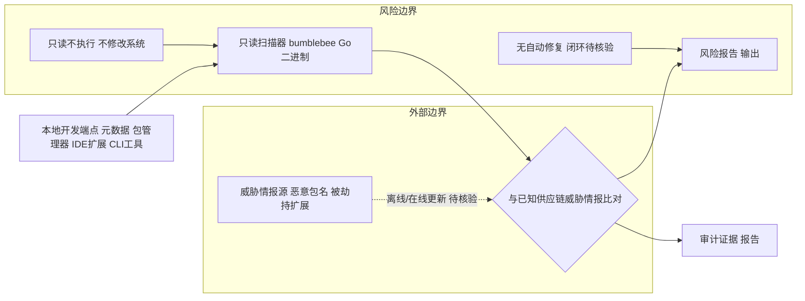

# perplexityai/bumblebee

## 一句话定位
Perplexity AI 开源的**只读开发者端点扫描器**——扫描本地磁盘上的包、扩展、开发工具元数据，检测它们是否暴露于已知的软件供应链安全威胁，用 Go 编写，以"只读、无副作用"的安全设计降低开发机的供应链风险。

## 它解决的问题
软件供应链攻击（如依赖包被植入恶意代码、开发工具扩展被劫持）是近年来最严重的安全威胁之一。开发者的本地机器上堆积了大量包管理器元数据（npm/pip/maven）、IDE 扩展（VS Code 插件、JetBrains 插件）、CLI 工具配置——这些"开发端点"每个都可能成为攻击入口。但开发者缺乏工具去盘点"我机器上到底装了什么、哪些版本有已知漏洞、哪些扩展来源可疑"。bumblebee 直击这一盲区：它扫描本地开发环境的包/扩展/工具元数据，与已知供应链威胁情报比对，报告暴露面。解决的是 **"开发机供应链安全缺乏自动化盘点与检测工具"** 这一被忽视的防御缺口。

## 为什么值得关注
- **Stars:** 4,894（截至 2026-08-07），3 个月近 5k，安全工具中增长快
- **Forks:** 433，安全社区参与
- **Watchers/Subscribers:** 18
- **Open Issues:** 36，活跃反馈
- **License:** Apache-2.0
- **语言:** Go（安全工具常用，性能与分发友好）
- **活跃度:** created 2026-05-20，pushed_at 2026-07-16，持续迭代
- **规模:** 217KB，精炼工具
- **背书:** Perplexity AI 官方组织，知名 AI 公司出品安全工具，话题性强
- **Topics:** golang / package-inventory / supply-chain-security，定位精准

## 热度来源判断
bumblebee 的热度是 **"供应链安全热点 × Perplexity 品牌跨界 × 只读安全设计"** 驱动。供应链攻击（如 xz-utils 后门事件）近年频发，"开发者端点安全"成为新焦点——安全意识提升带来工具需求。Perplexity AI 以 AI 搜索闻名，跨界出安全工具有话题性，吸引关注。只读设计（不改系统、只扫描报告）降低了采用心理门槛——开发者更愿意跑一个"只看不改"的安全工具。热度**真实但有品牌加成**——4.9k stars 中，部分来自"Perplexity 出品"的好奇围观，实际部署率需观察。作为安全工具，其价值取决于威胁情报的覆盖度与更新及时性。

## 关键技术亮点亮点
1. **只读扫描（Read-only）:** 核心安全设计——只读取元数据、不修改系统、不执行被扫描内容，杜绝"扫描器反而触发攻击"的风险
2. **多包管理器覆盖:** 扫描 npm/pip/maven/brew 等多种包管理器的本地元数据与已安装包
3. **开发工具扩展盘点:** 检测 IDE 扩展（VS Code、JetBrains）、CLI 工具配置等"开发端点"
4. **已知威胁比对:** 与已知供应链威胁情报（恶意包名、被劫持扩展）比对，报告暴露面
5. **Go 单二进制:** 编译为单文件，下载即用，无依赖，适合在开发机快速运行
6. **报告导向:** 输出清晰的风险报告，便于安全团队据此整改

## 架构师速览

| 决策问题 | 研究判断 | 证据边界 |
|---|---|---|
| 系统边界 | bumblebee 划在"本地开发端点（包管理器元数据、IDE 扩展、CLI 工具配置）"与"已知供应链威胁情报"之间，只读扫描器形态，单 Go 二进制分发 | 档案明示"只读、本地磁盘、Go 单二进制"；CI/CD、生产镜像、SBOM 流程未提及 |
| 主路径 | 本地元数据采集 → 与已知恶意包/被劫持扩展情报比对 → 输出风险报告（无自动修复/隔离） | 档案列出"扫描→比对→报告"，未提阻断、自动修复或闭环执行 |
| 关键权衡 | 检测覆盖度（多包管理器/IDE 扩展） vs 217KB 工具体量下的实现深度；读取丰富度 vs "只读不执行"的安全边界 | 档案明确"有覆盖深度 vs 工具体积"矛盾与"只读设计"取舍 |
| 最小 PoC | 在单台开发机运行 `bumblebee` 二进制，针对 npm+VS Code 扩展做一次扫描，对照输出与人工已知威胁清单验证信噪比；不接 CI、不接阻断 | 档案给出"只读工具+报告导向"特性，部署/接入 CI/远端聚合未证实 |

## 架构启发
bumblebee 的核心启发是 **"供应链安全的盲区在'开发端点'，而非仅仅是'生产依赖'"**。传统供应链安全工具聚焦 CI/CD（扫描依赖树、SBOM）或生产环境（容器镜像扫描），但忽略了开发者的本地机器——那里堆积着更多元、更少审计的"开发端点"（IDE 扩展、CLI 工具、本地包）。bumblebee 把防御边界扩展到开发机，这是对供应链安全视角的重要补充。更深层的启发是 **"只读设计是安全扫描器的最佳实践"**——扫描器若有写/执行能力，本身就成为攻击面；只读从架构上消除了这类风险。这一原则值得所有安全工具借鉴。

## 架构图（MMD）

> 证据边界：此图只采用本档案已有可核验描述；“待核验”节点不应视为项目实现事实。

## 定位判断
**工具型安全产品（细分品类开创者）。** bumblebee 定位于"开发端点供应链扫描"这一细分安全品类，目前无直接同规模竞品，有品类开创者优势。作为工具，它的价值取决于威胁情报质量与扫描覆盖度。Perplexity 背书提供了初始可信度，但长期需证明其在安全领域的持续投入（Perplexity 主业是 AI 搜索，安全是跨界）。4.9k stars 显示早期成功，是否会从"工具"成长为"平台"（如云端聚合、企业版）取决于 Perplexity 的战略。目前是值得关注的安全工具新星。

## 风险/局限/泡沫点
- **威胁情报依赖:** 扫描价值取决于已知威胁数据库的覆盖与时效，情报滞后则漏报
- **Perplexity 跨界投入:** Perplexity 主业是 AI 搜索，安全工具是否长期维护存疑
- **只读局限:** 只能"发现问题"，修复仍需人工，闭环不完整
- **竞争涌现:** 供应链安全是热门赛道，大型安全厂商可能推出类似功能
- **覆盖度:** 217KB 体量说明功能聚焦，对冷门包管理器/扩展的覆盖可能不足
- **采用门槛:** 开发者安全意识参差，"主动跑扫描"的用户基数有限

## 与同类项目的关系
- **vs Trivy/Grype（漏洞扫描）:** 那些扫描依赖漏洞（CVE）；bumblebee 聚焦供应链威胁（恶意包/劫持），维度不同
- **vs Snyk/Dependabot:** 云端依赖安全管理平台；bumblebee 是本地端点扫描，更轻量
- **vs Syft（SBOM 生成）:** Syft 生成软件物料清单；bumblebee 检测威胁暴露，目的不同
- **vs osquery:** 通用端点查询框架；bumblebee 专精供应链，开箱即用
- **vs socket.dev:** npm 供应链分析平台；bumblebee 扩展到多语言+IDE 扩展，本地优先

## 是否值得持续跟踪
**值得跟踪（安全视角 + 新品类）。** bumblebee 开创了"开发端点供应链扫描"这一细分视角，无论其本身成败，该方向值得重视。建议关注：威胁情报的覆盖广度与更新频率、Perplexity 对安全工具线的持续投入信号、以及是否演化出企业版（团队开发机统一盘点）。对安全意识强的开发团队，bumblebee 值得纳入开发机安全基线。对安全工具观察者，它是"供应链安全从 CI/CD 延伸到开发端点"趋势的代表。

## 后续观察点
- 威胁情报库的规模与更新频率（决定检测有效性）
- Perplexity 是否将安全工具产品化（独立产品线信号）
- 扫描覆盖的扩展（更多包管理器、更多 IDE、shell 配置）
- 是否支持企业批量扫描/云端聚合（从个人工具到团队平台）
- 是否与现有 SBOM/CI 安全工具集成（互补而非孤立）

---
> 数据来源: GitHub API (2026-08-07) | Stars: 4,894 | Forks: 433 | License: Apache-2.0 | 语言: Go | 创建: 2026-05-20
