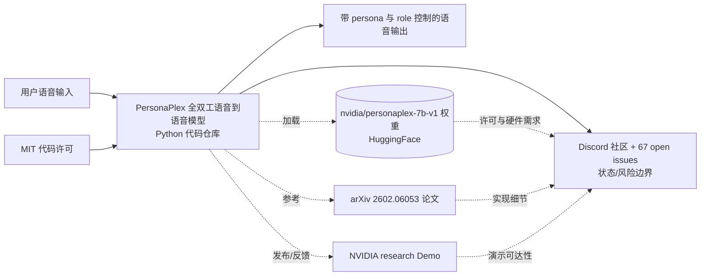

# NVIDIA/personaplex — PersonaPlex code.

## 一句话定位

PersonaPlex code.。主要使用 Python 编写，当前 10,338 stars / 1,444 forks / 100 subscribers。

## 它解决的问题

**目标用户**：使用 python 生态的开发者、工程师。

**痛点**：该项目解决的核心问题是 PersonaPlex code.。从 README 来看，项目提供了 # PersonaPlex: Voice and Role Control for Full Duplex Conversational Speech Models  **
4. **[](https://research.nvidia.com/labs/adlr/personapl**
5. **[](https://discord.gg/5jAXr**
6. **PersonaPlex is a real-time, full-duplex speech-to-speech conversational model that enables persona c**

## 架构师速览

| 决策问题 | 研究判断 | 证据边界 |
|---|---|---|
| 系统边界 | 边界落在 NVIDIA 的 PersonaPlex-7b-v1 权重（HuggingFace）、arXiv 论文 2602.06053、NVIDIA 官方 Demo 与 Discord 社区之间，仓库代码负责"PersonaPlex code"——核心 Python 实现，消费侧由权重与模型服务承担。 | 权重/Demo/Discord 链接来自 README badge；模型内部组件、协议、部署形态未在档案中给出。 |
| 主路径 | 实时全双工语音输入 → PersonaPlex 模型推理（语音到语音，带 persona/role 控制）→ 输出语音；旁路包含模型权重分发（HF）、研究演示（NVIDIA research）与社区反馈（Discord/GitHub issues）。 | "real-time, full-duplex speech-to-speech conversational model with persona control" 仅来自 README 标题片段；具体输入编码、流式协议与运行时依赖未证实。 |
| 关键权衡 | 在"实时全双工 + persona/role 控制"的交互质量与开源可复现/可部署之间取舍：仓库只承诺代码（"PersonaPlex code."），权重与论文/Demo 由 NVIDIA 单独托管，存在模型版本、推理栈与硬件门槛三方耦合风险。 | License 为 MIT 仅覆盖代码；模型权重许可、推理性能、显存/延迟均未在档案中量化。 |
| 最小 PoC | 先克隆仓库核对代码与最小运行依赖，拉取 nvidia/personaplex-7b-v1 权重按 HF 卡片说明运行单轮语音→语音用例，验证 persona/role 切换是否生效；验收项含可复现脚本、首次响应延迟、失败回退路径与权重 license 复核。 | 权重卡片的硬件需求、推理接口细节、示例数据均未在本档案中给出，需"待核验"。 |

## 架构启发

从 NVIDIA/personaplex 的设计来看，核心思路是 **"PersonaPlex code."**。这反映了 Python 生态中 开发者工具 的演进方向——降低集成复杂度、提供开箱即用的能力。开源 License (MIT) 降低了采用门槛。

## 架构图（MMD）

> 证据边界：此图只采用本档案已有可核验描述；“待核验”节点不应视为项目实现事实。

## 定位判断

**工具型**。在生态中定位为PersonaPlex code.方向的工具。Stars 10338 说明已有一定社区基础。

## 风险 / 局限 / 泡沫点

1. **规模风险**：10,338 stars，但 fork 1444 说明有实际部署
2. **维护风险**：最后 push 时间 2026-03-02，更新频率待观察
3. **Open Issues**：67 个 open issues，活跃社区反馈
4. **License**：MIT（宽松许可，适合商用）

## 与同类项目的关系

- 与同 Python 生态的同类工具形成竞争/互补关系。具体竞品对比需参考社区讨论。
- 从 topics () 来看，与关注 该领域 的其他项目有交叉。

## 是否值得持续跟踪

**观察。** 项目有一定关注度但规模和活跃度需要进一步验证。

## 后续观察点

1. Star 增速是否可持续（当前 10,338）
2. Fork 增长趋势（当前 1,444）
3. 功能迭代频率（最后更新 2026-03-02）
4. 社区活跃度（subscribers 100, open issues 67）

---
> 数据来源: GitHub API (2026-03-02) | Stars: 10,338 | Forks: 1,444 | License: MIT | 语言: Python | 创建: 2026-01-05
