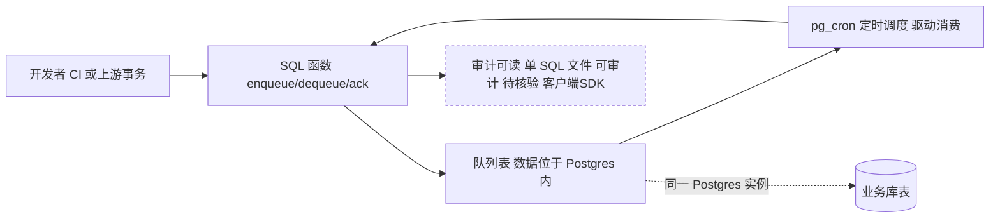

# PgQue

## 一句话定位
零臃肿的 Postgres 消息队列——一个 SQL 文件安装，pg_cron 驱动，不需要额外基础设施。

## 它解决的问题
目标用户是已经使用 Postgres 的中小团队。痛点是：需要消息队列时，引入 Redis/RabbitMQ/Kafka 意味着新增基础设施、运维复杂度、团队学习成本。而绝大多数内部工具场景的消息量，Postgres 完全扛得住。

## 为什么值得关注（2026-04-22）
在云原生和微服务大潮中，PgQue 代表了"适度架构"的反趋势。913 star 说明很多开发者共鸣这个理念：不要为了架构而架构，用已有的工具解决问题。

## 热度来源判断
真实需求驱动。PLpgSQL 项目能到 900+ star 说明切中了大量中小团队"不想多引入一个中间件"的痛点。不是泡沫，是务实主义。

## 关键技术亮点亮点
1. **单 SQL 文件安装**：`psql -f pgque.sql` 即完成部署，零外部依赖
2. **pg_cron 驱动**：利用 Postgres 原生定时任务机制驱动队列消费
3. **SQL-only 接口**： enqueue/dequeue/ack 都是 SQL 函数调用，与现有事务天然一致
4. **审计透明**：所有逻辑在一个 SQL 文件中，完全可审计

## 架构师速览

| 决策问题 | 研究判断 | 证据边界 |
|---|---|---|
| 系统边界 | PgQue 边界以单 SQL 文件为锚——所有逻辑进入 Postgres 实例，外部仅保留调用方与 pg_cron 调度；不存在独立服务进程、无独立部署单元 | 档案仅证实 "单 SQL 文件安装"、"pg_cron 驱动"、"SQL-only 接口"，无独立 runtime 进程描述；客户端 SDK、连接池、监听器等组件未提及 |
| 主路径 | 开发者/上游事务 → SQL 函数（enqueue/dequeue/ack）→ Postgres 内的队列表 → pg_cron 触发消费 → 同事务回执；无独立 broker、无独立传输层 | 仅 SQL 函数名与 "psql -f pgque.sql" 部署被证实；具体表结构、消息格式、pg_cron 周期表达式、并发消费模型均 "待核验" |
| 关键权衡 | 用 Postgres 单体复用换运维极简与事务一致性，代价是吞吐上限、特性缺失（死信/延迟/优先级）、以及故障半径与业务库耦合 | 吞吐限制、特性缺失、单点依赖三项来自档案"风险/局限"原文；具体性能数据、特性矩阵、故障隔离方案未给出 |
| 最小 PoC | 在沙箱 Postgres 安装 pgque.sql，验证：①enqueue 与业务事务原子性 ②pg_cron 调度周期与幂等 ③ack/失败语义 ④与现有表/索引的锁竞争 | 档案未提供版本号、pg_cron 依赖版本、Postgres 版本下限；这些是 PoC 准入门槛，须在源码核验 |

## 架构启发
- **同质基础设施复用**：既然已经有 Postgres，为什么不用它做队列？这挑战了"一个关注点一个系统"的微服务教条
- **事务一致性**：消息入队与业务操作在同一事务中，避免了分布式事务问题
- **极简主义的运维优势**：少一个组件 = 少一个故障点

## 架构图（MMD）

> 证据边界：此图只采用本档案已有可核验描述；“待核验”节点不应视为项目实现事实。

## 定位判断
在消息队列生态中，PgQue 定位在"你已经有了 Postgres，再加一个文件就行"的位置。不是 Redis/RabbitMQ 的替代品，而是它们在中小场景的"不需要"。

## 风险 / 局限 / 泡沫点
1. **大规模吞吐未验证**：Postgres 在高并发队列场景的性能上限不明确
2. **缺少企业级特性**：死信队列、延迟消息、优先级队列等可能不支持或有限
3. **单点依赖**：队列和业务共用 Postgres，故障影响面更大

## 与同类项目的关系
- vs **Redis Streams**：Redis 吞吐更高但需额外基础设施
- vs **RabbitMQ**：功能更丰富但运维复杂度显著更高
- vs **Graphile Worker**：同样基于 Postgres，但用 Node.js 而非纯 SQL

## 是否值得持续跟踪
**是**。代表了一种值得关注的架构思潮，且可能在中小团队中快速普及。

## 后续观察点
1. 是否有生产环境使用案例和性能报告
2. 是否逐步添加企业级特性（死信队列等）
3. 社区是否形成贡献者群体

---
*首次记录：2026-04-22*
