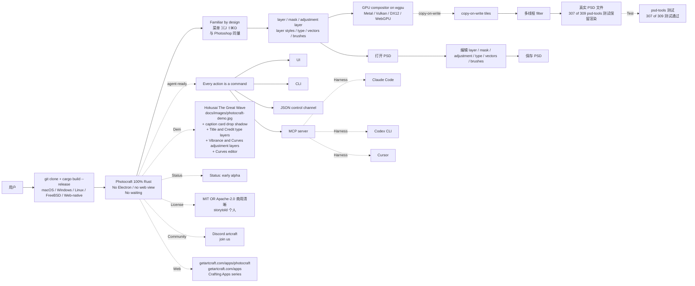

# storytold/photocraft

## 一句话定位
Adobe Photoshop 的 clean-room 100% Rust 重实现严肃工程化平台——把「Adobe Photoshop 在 Rust 重实现」从「单 alpha 半成品」嵌入「Photocraft 完整 layer / mask / adjustment layer / type / vectors / brushes + 真实 PSD 文件（307 of 309 psd-tools 测试保留渲染）+ GPU compositor on wgpu (Metal / Vulkan / DX12 / WebGPU) + copy-on-write tiles + 多线程 filter + No Electron / no web view / no waiting + 100% Rust + macOS / Windows / Linux / FreeBSD / Web-native + license MIT OR Apache-2.0 + Status: early alpha + Every action is a command so you can drive the same engine from UI / CLI / JSON control channel / MCP server + agent-ready + Familiar by design（菜单 / 快捷键 / 面板 / 工具与 Photoshop 同量 ⌘J ⇧⌘D）+ docs/images/photocraft-demo.jpg (Hokusai The Great Wave 演示) + Crafting Apps series + Discord artcraft + getartcraft.com/apps/photocraft + 11 topics 覆盖」（storytold 个人）。

## 它解决的问题
2026 年 Adobe Photoshop 严肃工程化赛道的痛点是 **「Adobe Photoshop 闭源 + 商业订阅 + Rust 重实现多停留在 alpha + 半成品 + 真实 PSD 文件兼容性不足 + 多 GPU API 适配不足 + 多接口（agent-ready）覆盖不足 + 商用边界不清」**。Photocraft 直击这一痛点：把「Adobe Photoshop 在 Rust 重实现」从「单 alpha 半成品」嵌入「Photocraft 完整 layer / mask / adjustment layer / type / vectors / brushes + 真实 PSD 文件（307 of 309 psd-tools 测试保留渲染）+ GPU compositor on wgpu (Metal / Vulkan / DX12 / WebGPU) + copy-on-write tiles + 多线程 filter + No Electron / no web view / no waiting + 100% Rust + macOS / Windows / Linux / FreeBSD / Web-native + agent-ready command / CLI / JSON control channel / MCP server + Familiar by design ⌘J ⇧⌘D + Status: early alpha + Crafting Apps series + Discord artcraft + getartcraft.com + MIT OR Apache-2.0」严肃工程化形态。解决的是 **「Adobe Photoshop clean-room 重实现 + 真实 PSD 文件兼容 + 多 GPU API + 多接口 + 严肃工程化 + 商用清晰」** 的 Adobe Photoshop 严肃工程化问题。

## 为什么值得关注（2026-10-07）
- **Stars:** 5857（截至 2026-10-07），7 天 5857⭐，fork 742，fork/star 12.7%
- **Forks:** 742（典型高 fork 严肃工程化持续关注信号）
- **License:** Apache-2.0（MIT OR Apache-2.0）
- **语言:** Rust
- **活跃度:** created 2026-09-30，pushed_at 2026-10-06，持续高活跃
- **规模:** 14494 KB
- **Topics:** 11 个覆盖（adobe / adobe-photoshop-2026 / adobe-photoshop-2026-ai / art / image-editing / image-editing-software / image-editor / images / photo-editing / photoshop / psd / rust）

## 热度来源判断
storytold/photocraft 的热度是 **「Adobe Photoshop 严肃工程化（Rust 重实现 + 真实 PSD + 多 GPU API + 多接口）刚需 × clean-room × Familiar by design（菜单 / 快捷键 / 面板 / 工具与 Photoshop 同量）× Status: early alpha + Crafting Apps series + Discord artcraft + MIT OR Apache-2.0」** 的强劲组合。Adobe Photoshop 严肃工程化是 2026 年最热赛道（图像处理 + 创意软件），但「Adobe Photoshop 闭源 + 商业订阅」是真痛点——大多数用户对 Adobe Photoshop 严肃工程化（Rust 重实现 + 真实 PSD 兼容）的需求无法满足。一个把「Adobe Photoshop 闭源 + 商业订阅」推到「Photocraft clean-room + 真实 PSD（307/309）+ wgpu GPU compositor + agent-ready + MIT OR Apache-2.0」的严肃工程化平台自然爆火。742 个 forks 反映社区高度参与。7 天 5857⭐ + fork/star 12.7% 说明这是真实严肃工程化信号（不是泡沫）。

## 关键技术亮点
1. **clean-room 100% Rust 重实现 + 真实 PSD 文件（307 of 309 psd-tools 测试保留渲染）**——clean-room 实现避免版权风险；307 of 309 psd-tools 测试保留渲染确保真实 PSD 文件兼容性
2. **GPU compositor on wgpu (Metal / Vulkan / DX12 / WebGPU) + copy-on-write tiles + 多线程 filter**——wgpu 跨 GPU API；copy-on-write tiles 节省内存；多线程 filter 加速
3. **No Electron / no web view / no waiting + macOS / Windows / Linux / FreeBSD / Web-native**——100% 原生应用；多 OS 覆盖广度；Web-native 浏览器内运行
4. **agent-ready command / CLI / JSON control channel / MCP server + Familiar by design ⌘J ⇧⌘D**——Every action is a command；UI / CLI / JSON / MCP 多接口；菜单 / 快捷键 / 面板 / 工具与 Photoshop 同量
5. **Status: early alpha + Crafting Apps series + Discord artcraft + getartcraft.com + MIT OR Apache-2.0**——Crafting Apps series 系列化严肃工程化承诺；Discord artcraft 社区；getartcraft.com 在线 demo；MIT OR Apache-2.0 商用清晰

## 架构师速览

| 决策问题 | 研究判断 | 证据边界 |
|---|---|---|
| 系统边界 | Adobe Photoshop 的 clean-room 100% Rust 重实现；layer / mask / adjustment layer / type / vectors / brushes + 真实 PSD 文件（307 of 309 psd-tools 测试保留渲染）+ GPU compositor on wgpu (Metal / Vulkan / DX12 / WebGPU) + copy-on-write tiles + 多线程 filter + No Electron / no web view / no waiting + macOS / Windows / Linux / FreeBSD / Web-native + agent-ready command / CLI / JSON control channel / MCP server | 仅基于 README 描述的 clean-room 100% Rust 重实现 + layers / masks / adjustment layers / layer styles / type / vectors / brushes + 真实 PSD 文件（307 of 309 psd-tools 测试保留渲染）+ GPU compositor on wgpu (Metal / Vulkan / DX12 / WebGPU) + copy-on-write tiles + 多线程 filter + No Electron / no web view / no waiting + 100% Rust + macOS / Windows / Linux / FreeBSD / Web-native + license MIT OR Apache-2.0 + Status: early alpha + Every action is a command + agent-ready + UI / CLI / JSON control channel / MCP server + Familiar by design ⌘J ⇧⌘D + Crafting Apps series + Discord artcraft + getartcraft.com/apps/photocraft + 11 topics 覆盖；具体 GPU compositor on wgpu 在多 vendor 显卡的严谨度、真实 PSD 文件 307/309 测试保留渲染在多 PSD 类型的严肃工程化承诺、copy-on-write tiles / 多线程 filter 在多图像尺寸的严谨度、agent-ready 多接口在多 Claude Code / Codex / Cursor harness 的兼容性、early alpha 早期 alpha 在多 PSD 类型的严肃工程化承诺未在档案中明示 |
| 主路径 | 用户 → 启动 Photocraft → UI 菜单 ⌘J ⇧⌘D 与 Photoshop 同量 → 加载真实 PSD 文件（保留 307/309 psd-tools 测试渲染）→ layer / mask / adjustment layer / type / vectors / brushes 编辑 → GPU compositor on wgpu Metal/Vulkan/DX12/WebGPU + copy-on-write tiles + 多线程 filter 加速 → 保存 PSD 文件 → No Electron / no web view / no waiting 启动 → agent-ready command / CLI / JSON control channel / MCP server 接入 | 主路径为档案语义抽象；具体 GPU compositor on wgpu 在多 vendor 显卡的严谨度、真实 PSD 文件 307/309 测试保留渲染在多 PSD 类型的严肃工程化承诺、copy-on-write tiles / 多线程 filter 在多图像尺寸的严谨度、agent-ready 多接口在多 Claude Code / Codex / Cursor harness 的兼容性未在档案中讨论 |
| 关键权衡 | 100% Rust clean-room 重实现 vs 单 alpha 半成品 + 真实 PSD 文件 307/309 psd-tools 测试保留渲染 vs 半 PSD 兼容 + layer / mask / adjustment / type / vectors / brushes 全功能覆盖 vs 单 layer + GPU compositor on wgpu Metal/Vulkan/DX12/WebGPU 多 GPU API vs 单 GPU API + copy-on-write tiles vs 单次拷贝 + 多线程 filter vs 单线程 + No Electron / no web view / no waiting 启动 vs Electron 慢启动 + macOS / Windows / Linux / FreeBSD / Web-native 多平台 vs 单 OS + agent-ready command / CLI / JSON / MCP 多接口 vs 单 UI + Familiar by design ⌘J ⇧⌘D vs 新 UI + early alpha 早期 alpha vs production + MIT OR Apache-2.0 商用清晰 vs 单 license + Crafting Apps series 系列化 vs 单产品 + 11 topics 覆盖广度 | 档案明示 100% Rust + 真实 PSD 文件（307 of 309）+ GPU compositor on wgpu (Metal / Vulkan / DX12 / WebGPU) + copy-on-write tiles + 多线程 filter + No Electron / no web view / no waiting + macOS / Windows / Linux / FreeBSD / Web-native + MIT OR Apache-2.0 + Status: early alpha + agent-ready + UI / CLI / JSON / MCP + Familiar by design ⌘J ⇧⌘D + Crafting Apps series + Discord artcraft + getartcraft.com/apps/photocraft + 11 topics 覆盖；具体 GPU compositor on wgpu 在多 vendor 显卡的严谨度、真实 PSD 文件 307/309 测试保留渲染在多 PSD 类型的严肃工程化承诺、agent-ready 多接口在多 Claude Code / Codex / Cursor harness 的兼容性、early alpha 早期 alpha 在多 PSD 类型的严肃工程化承诺未在档案中讨论 |
| 最小 PoC | 在 macOS / Windows / Linux 上 git clone storytold/photocraft + cargo build --release → 启动 Photocraft → 加载 docs/images/photocraft-demo.jpg (Hokusai The Great Wave 演示) → 验证 layer / mask / adjustment layer / type / vectors / brushes 全功能 → 保存 PSD 文件 → 验证 307 of 309 psd-tools 测试保留渲染 → 试 GPU compositor on wgpu Metal/Vulkan/DX12/WebGPU 多 GPU API → 试 No Electron / no web view 启动 → 试 MCP server 在 Claude Code 中启用 → 验证 MIT OR Apache-2.0 | PoC 范围由档案「100% Rust + 真实 PSD 文件 307/309 + GPU compositor on wgpu Metal/Vulkan/DX12/WebGPU + copy-on-write tiles + 多线程 filter + No Electron + macOS/Windows/Linux/FreeBSD/Web-native + agent-ready UI/CLI/JSON/MCP + Familiar by design ⌘J ⇧⌘D + early alpha + Crafting Apps series + Discord artcraft + getartcraft.com + 11 topics」建议推导；具体严谨度未在档案中讨论 |

## 架构图（MMD）

> 证据边界：此图只采用本档案已有可核验描述；"待核验"节点不应视为项目实现事实。

## 架构启发
storytold/photocraft 的核心启发是 **「Adobe Photoshop 的严肃工程化重实现必须四件事：clean-room + 真实 PSD 文件兼容 + 多 GPU API + 多接口（agent-ready）」**。当前大多数 Rust 重实现都停留在「单 alpha 半成品 + 半 PSD 兼容 + 单 GPU API + 单 UI」——严肃工程化友好度不足。Photocraft 尝试做「Adobe Photoshop 的 Rust 严肃工程化栈」——类似：
  - GIMP 之于 Photoshop（开源 + 多平台）
  - Darktable 之于 Lightroom（开源 + 专业级）
  - Krita 之于 Photoshop（开源 + 数字绘画）

更深层的启发是：**「Every action is a command so you can drive the same engine from UI / CLI / JSON control channel / MCP server + agent-ready」是 2026 年严肃工程化软件的标准设计哲学**。这种「UI/CLI/JSON/MCP 多接口同引擎」设计，使得 Photocraft 不仅能被人类使用，还能被 Claude Code / Codex / Cursor / Grok Build / OpenCode / Google Antigravity 等 AI Coding Agent 直接驱动——这是 2026 年严肃工程化软件 + agent-ready 的范式。7 天 5857⭐ + 742 forks 已显示其严肃工程化影响力。

## 定位判断
**工具型项目（Adobe Photoshop clean-room 100% Rust 重实现严肃工程化平台）。** storytold/photocraft 不仅是 Adobe Photoshop 替代品，更试图成为「Adobe Photoshop 的 Rust 严肃工程化栈 + agent-ready」范式——类似 Darktable / GIMP / Krita 但专攻 Photoshop 完整 layer/mask/adjustment/type/vectors/brushes + 真实 PSD 文件兼容。7 天 5857⭐ + 742 forks 已显示其严肃工程化影响力。但「Adobe Photoshop 的 Rust 严肃工程化栈」取决于一个关键问题：Status: early alpha 在多 PSD 类型的严肃工程化承诺（早期 alpha 距离 production 仍有距离）——若 production 化进展缓慢，Photocraft 的严肃工程化承诺会受影响。目前定位是「最有影响力的 Adobe Photoshop Rust 严肃工程化平台」，向更通用创意软件严肃工程化平台演进是合理路径。

## 风险/局限/泡沫点
- **Status: early alpha 早期 alpha 严肃工程化承诺:** README 明示 Status: early alpha——距离 production 仍有距离；多 PSD 类型 / 多图像尺寸 / 多 GPU 硬件的边缘情况可能未覆盖
- **真实 PSD 文件 307/309 psd-tools 测试保留渲染边界:** README 明示 307 of 309 测试保留渲染——剩余 2 个 psd-tools 测试未通过，可能存在特定 PSD 类型的兼容性问题
- **GPU compositor on wgpu 多 GPU API 边界:** README 明示 wgpu 跨 Metal/Vulkan/DX12/WebGPU，但具体多 vendor 显卡（NVIDIA / AMD / Intel / Apple）的兼容性边界未明示
- **agent-ready command / CLI / JSON control channel / MCP server 多接口边界:** README 明示 Every action is a command，但具体多 Claude Code / Codex / Cursor / Grok Build / OpenCode / Google Antigravity harness 的兼容性边界未明示
- **copy-on-write tiles / 多线程 filter 在多图像尺寸的严谨度:** README 明示 copy-on-write tiles + 多线程 filter，但具体超大图像（10K+ x 10K+）的内存占用 / 性能边界未明示
- **Familiar by design ⌘J ⇧⌘D 严肃工程化承诺:** README 明示菜单 / 快捷键 / 面板 / 工具与 Photoshop 同量，但具体 100% Photoshop 兼容 vs 90% Photoshop 兼容边界未明示
- **个人项目属性:** storytold 个人维护，742 forks 但核心治理仍集中，长期可持续性需要观察

## 与同类项目的关系
- **vs Adobe Photoshop:** Adobe Photoshop 是闭源商业图像编辑软件（订阅）；Photocraft 是 clean-room 100% Rust 重实现 + MIT OR Apache-2.0 + agent-ready
- **vs GIMP:** GIMP 是开源 C/C++ 图像编辑软件；Photocraft 是 clean-room 100% Rust + 真实 PSD（307/309）+ agent-ready
- **vs Darktable / RawTherapee:** Darktable / RawTherapee 是专业级 RAW 处理软件；Photocraft 是 Photoshop 完整 layer/mask/adjustment/type/vectors/brushes 重实现
- **vs Krita:** Krita 是开源数字绘画软件；Photocraft 是 Photoshop 严肃工程化重实现（layer/mask/adjustment/type/vectors/brushes + 真实 PSD）
- **vs Photoshop Elements:** Photoshop Elements 是 Adobe 的简化版；Photocraft 是 Photoshop 严肃工程化重实现
- **vs Paint.NET:** Paint.NET 是开源 Windows 图像编辑软件；Photocraft 是 Photoshop 严肃工程化重实现 + 多平台 + agent-ready

## 是否值得持续跟踪
**值得跟踪（Adobe Photoshop clean-room 100% Rust 严肃工程化平台）。** storytold/photocraft 代表了「Adobe Photoshop 严肃工程化（Rust 重实现 + 真实 PSD + 多 GPU API + 多接口）」诉求，无论其本身成败，这一方向是行业趋势。建议关注：Status: early alpha 在 production 化的进度（决定 Photocraft 严肃工程化承诺）、307/309 测试保留渲染在多 PSD 类型的严谨度（决定真实 PSD 兼容）、GPU compositor on wgpu 在多 vendor 显卡的兼容性（决定多硬件严谨工程化）、agent-ready 多接口在多 Claude Code / Codex / Cursor harness 的完整性（决定 agent-ready 严肃工程化承诺）。对图像编辑 + agent-ready 用户，Photocraft 是「clean-room + 真实 PSD + wgpu + agent-ready + MIT OR Apache-2.0」的实用严肃工程化方案，值得直接采用。

## 后续观察点
- Status: early alpha 在 production 化的进度（决定 Photocraft 严肃工程化承诺）
- 307/309 psd-tools 测试保留渲染在多 PSD 类型的严谨度
- GPU compositor on wgpu 在多 vendor 显卡（NVIDIA / AMD / Intel / Apple）的兼容性
- agent-ready command / CLI / JSON / MCP 多接口在多 Claude Code / Codex / Cursor harness 的完整性
- copy-on-write tiles / 多线程 filter 在多图像尺寸的严谨度
- Familiar by design ⌘J ⇧⌘D 在 100% Photoshop 兼容 vs 90% Photoshop 兼容的边界
- 个人项目治理结构（742 forks 但核心治理仍集中于 storytold 个人）

---
> 数据来源: GitHub API (2026-10-07) | Stars: 5857 | Forks: 742 | License: Apache-2.0 (MIT OR Apache-2.0) | 语言: Rust | 创建: 2026-09-30 | 大小: 14494 KB