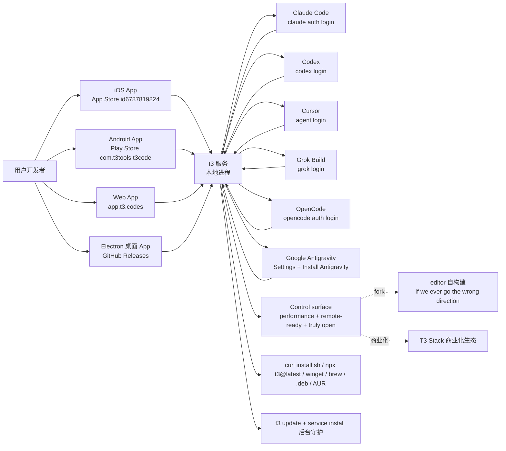

# pingdotgg/t3code

## 一句话定位
T3 Stack 作者 Theo（pingdotgg）的 T3 Code——一个 agent harness control surface（多 Coding Agent 远程/桌面/CLI 跨设备控制面），支持 Claude Code / Codex / Cursor / Grok Build / OpenCode / Google Antigravity 六大主流 Coding Agent，覆盖 iOS / Android / Web / Electron 桌面 4 端，MIT 开源，包管理器全配（winget / brew / .deb / AUR），移动应用已上架 App Store / Play Store。

## 它解决的问题
2026 年 Coding Agent 生态碎片化严重：每个 Coding Agent（Claude Code / Codex / Cursor / Grok Build / OpenCode / Google Antigravity）都有独立的桌面/远程控制方案——Codex Desktop、Conductor、Claude Desktop、Cursor Glass 等彼此割裂，用户要为不同 Agent 切换不同 UI，远程控制方案（手机/平板控制本地 Agent）极度稀缺。T3 Code 直击这一痛点：它提供一个 **6 Agent 适配层 + 4 端 UI + MIT 开源**的统一控制面，让开发者从任意设备连接任意 Coding Agent，类似 NVIDIA GeForce NOW 把「GPU 算力」抽象为流媒体，但这次抽象的是「Coding Agent 控制权」。解决的是 **「Coding Agent 控制面碎片化、跨端不连通、远程控制稀缺」** 的生态痛点。

## 为什么值得关注（2026-10-05）
- **Stars:** 25,115（截至 2026-10-05），4 个月突破 2.5 万，fork/star 25.9%（极高贡献活跃度）
- **Forks:** 6,507，社区贡献极其活跃（控制面天然适合贡献）
- **License:** MIT，商用清晰
- **语言:** TypeScript（含 Electron 桌面 + Node 服务 + 各端适配层）
- **规模:** 433,650 KB（含 4 端 + 安装脚本 + AUR packaging + desktop app）
- **活跃度:** created 2026-02-08，pushed_at 2026-10-04，持续高活跃
- **背书:** pingdotgg（T3 Stack 作者 Theo）官方组织背书
- **跨平台覆盖:** iOS app (id6787819824) + Android app (com.t3tools.t3code) + web app (app.t3.codes) + Electron 桌面 + CLI (t3)
- **包管理器全配:** winget / brew / .deb / AUR (stable + nightly)
- **Topics:** 0 个覆盖（README 未明示）

## 热度来源判断
t3code 的热度是 **「Coding Agent 控制面碎片化刚需 × 6 Agent 全适配 × 4 端统一控制 × T3 Stack 作者品牌 × fork/star 25.9% 极高贡献活跃度」** 的强劲组合。Coding Agent 是 2026 年最热赛道，但控制面碎片化是真痛点——开发者要在 6 个 Agent 之间切换，每个 Agent 的桌面/远程方案不统一。T3 Code 直击痛点，且由 T3 Stack 作者 Theo（pingdotgg）背书，技术声誉 + 品牌信任双重叠加。fork 6,507（fork/star 25.9%）反映社区贡献者极度活跃——这是「平台化」类项目的网络效应信号（贡献者越多，Agent 适配越广，吸引更多用户）。热度 **真实且具平台化潜力**——但需警惕：6 Agent 适配层的维护成本极高（每个 Agent 都在快速演进），控制面平台的可持续性取决于「是否能在 Agent 格式分化中维持兼容」。

## 关键技术亮点
1. **6 Agent 适配层:** 单一控制面同时兼容 Claude Code / Codex / Cursor / Grok Build / OpenCode / Google Antigravity 六大 Coding Agent，每个 Agent 通过其原生 CLI 认证（codex login / claude auth login / agent login / grok login / opencode auth login / Antigravity Settings）
2. **4 端统一 UI:** iOS / Android / Web / Electron 桌面四端共用一个本地 t3 服务，避免数据从云端绕一圈（performance + remote-ready）
3. **包管理器全配:** winget (Windows) / brew (macOS) / .deb (Debian/Ubuntu) / AUR (Arch, stable + nightly) 四个主流包管理器覆盖
4. **三特性严肃工程化承诺:** performance + remote-ready + truly open，README 明示「If we ever go the wrong direction, you have everything you need to fork and build the editor that you want」
5. **t3 CLI 命令集:** `t3`（启动服务 + 打开本地 web app）+ `t3 service install`（后台守护）+ `t3 update`（升级）+ `t3 --help`（全部参考）
6. **一次性试用:** `npx t3@latest` 无需安装即可试用

## 架构师速览

| 决策问题 | 研究判断 | 证据边界 |
|---|---|---|
| 系统边界 | 6 Coding Agent 远程/桌面/CLI 跨设备控制面；1 个本地 `t3` 服务进程 + 4 端 UI（iOS/Android/Web/Electron）+ 6 Agent 适配层 | 仅基于 README 描述的 1 服务 6 Agent + 4 端 + control surface + `curl install.sh` + `npx t3@latest` + `t3 service install` + `t3 update` + winget/brew/.deb/AUR + App Store/Play Store 已发布；具体 t3 服务进程模型、Agent 适配层实现、control surface API 形态未在档案中给出 |
| 主路径 | 用户在 4 端（iOS/Android/Web/Electron）打开 → 连接到本地 t3 服务 → t3 启动已认证的 Agent（Claude Code / Codex / Cursor 等）→ 控制 → 输出流式回到端 | 主路径为档案语义抽象；具体 t3 服务 ↔ Agent Harness 通信协议（stdio / IPC / HTTP / gRPC）、4 端 ↔ t3 服务的认证 / 加密机制未在档案中明示 |
| 关键权衡 | 6 Agent 覆盖广度 vs 单 Agent 优化深度 + 4 端稳定性 vs 服务进程模型 + 性能 remote-ready truly open 三特性 vs 商业化边界 + MIT 商用清晰 vs 各 Agent 子许可兼容性 | 档案明示 Inspired by Codex desktop app / Conductor / Claude Desktop / Cursor Glass + performance + remote-ready + truly open + If we ever go the wrong direction, you have everything you need to fork；具体 6 Agent 子许可边界、fork 后商业化路径未在档案中讨论 |
| 最小 PoC | 在 macOS 上装 t3（`curl -fsSL https://t3.codes/install.sh \| sh`），先连 Codex 或 Claude 上任一已完成 auth 的 Agent；再开 iOS App 通过 t3 服务连接到同一 Agent 验证 remote-ready；最后试 Grok Build / OpenCode / Antigravity 验证 6 Agent 覆盖广度；fork 后 build 自己的 editor 验证 truly open | PoC 范围由档案「control surface + 6 Agent + 4 端 + 性能 + remote-ready + truly open」建议推导；具体 demo 入口、winget/brew/.deb/AUR 跨平台覆盖广度验证未在档案中讨论 |

## 架构图（MMD）

> 证据边界：此图只采用本档案已有可核验描述；"待核验"节点不应视为项目实现事实。

## 架构启发
t3code 的核心启发是 **"Coding Agent 控制权应该跨端跨 Agent 可移植，正如 Git 仓库跨平台可 clone"**。当前每个 Coding Agent 平台都在建自己的封闭控制方案（Codex Desktop / Conductor / Claude Desktop / Cursor Glass），但这违背开发者利益——没人想为 6 个 Agent 切换 6 个 UI，没人想让远程控制卡在「iOS 只控制 Codex，Android 只控制 Cursor」上。t3code 尝试做"Coding Agent 控制的跨平台统一层"，类似 GitHub Desktop 之于 Git（统一多个 Git 服务的桌面端）。更深层的启发是：**控制面类项目的价值在于「控制权抽象」而非 UI 复杂度**。T3 Stack 作者 Theo 的品牌 + MIT 开源 + 4 端统一 + 6 Agent 全适配，使 t3code 成为 Coding Agent 控制面领域的「通用适配层」候选。

## 定位判断
**控制面候选平台项目（多 Coding Agent 跨端控制中心）。** t3code 不仅是一个跨端 UI 工具，更试图成为 Coding Agent 生态的"控制面分发枢纽"——类似 Spotify 之于音乐流媒体。若成功，它会成为开发者远程控制 Coding Agent 的默认入口，具有平台级价值。fork 6,507 + fork/star 25.9% 已显示网络效应雏形。但"平台化"取决于一个关键问题：6 Agent 适配层能否持续——若任一 Agent 格式大幅变更或官方推出控制面，维护成本可能压垮项目。目前定位是"Coding Agent 控制面领域的统一头部项目"，向平台演进是合理路径。

## 风险 / 局限 / 泡沫点
- **6 Agent 适配层维护成本:** 6 个 Agent 格式各异且持续演进（Claude Code / Codex / Cursor / Grok Build / OpenCode / Google Antigravity），保持同步是巨大工程负担
- **依赖各 Agent 官方 CLI:** T3 Code 不是独立 Agent，而是控制已存在的 Agent（依赖 codex login / claude auth login 等），若任一 Agent 官方变更 CLI，T3 Code 立即失效
- **平台官方化威胁:** 6 个 Agent 平台可能各自推出官方控制面（如 Codex Desktop 已存在），挤压第三方空间
- **iOS/Android 上架审核风险:** 移动应用依赖 Apple App Store / Google Play Store 上架，审核标准变化可能影响可用性
- **三特性承诺 vs 商业化边界:** README 明示「performance + remote-ready + truly open」三特性，但商业化路径（如付费控制面、企业版）未明示
- **topics 0 个覆盖:** README 未明示 topics，发现性可能受限

## 与同类项目的关系
- **vs Codex Desktop:** Codex 官方桌面端，仅控制 Codex Agent；t3code 跨 6 Agent + 4 端
- **vs Conductor:** 单一控制方案；t3code MIT 开源 + 跨 6 Agent
- **vs Claude Desktop:** Anthropic 官方控制端，仅控制 Claude Code；t3code 跨 6 Agent
- **vs Cursor Glass:** Cursor 官方控制端，仅控制 Cursor；t3code 跨 6 Agent
- **vs SSH + tmux:** 传统远程控制方案，需手动配置；t3code 自动化 4 端 + 6 Agent
- **vs VS Code Remote:** VS Code 远程方案，主要面向开发环境；t3code 专攻 Coding Agent

## 是否值得持续跟踪
**值得跟踪（Coding Agent 控制面候选平台）。** t3code 代表了 Coding Agent「控制权统一化」的诉求，无论其本身成败，这一方向是行业趋势。建议关注：6 Agent 适配层的维护频率（决定其平台化命运）、各 Agent 平台官方控制面的反应（决定其"适配层"命运）、移动应用的审核稳定性。对 Coding Agent 用户，t3code 是获取 4 端统一控制面的实用工具，值得直接试用。对 Agent 生态观察者，它是"Coding Agent 控制面"赛道的头部样本。

## 后续观察点
- 6 Agent 适配层是否能在各 Agent 快速演进中维持兼容
- 是否演化为独立平台/网站（从 GitHub 仓库升级为控制面门户）
- 各 Agent 平台是否联合推出统一控制面（标准化威胁）
- 移动应用是否扩展到 iPadOS / Android tablet（控制面跨 device 深度）
- 企业版/付费版是否推出（商业化路径）
- 4 端 UI 是否开源（truly open 承诺的兑现程度）

---
> 数据来源: GitHub API (2026-10-05) | Stars: 25,115 | Forks: 6,507 | License: MIT | 语言: TypeScript | 创建: 2026-02-08 | fork/star 25.9%