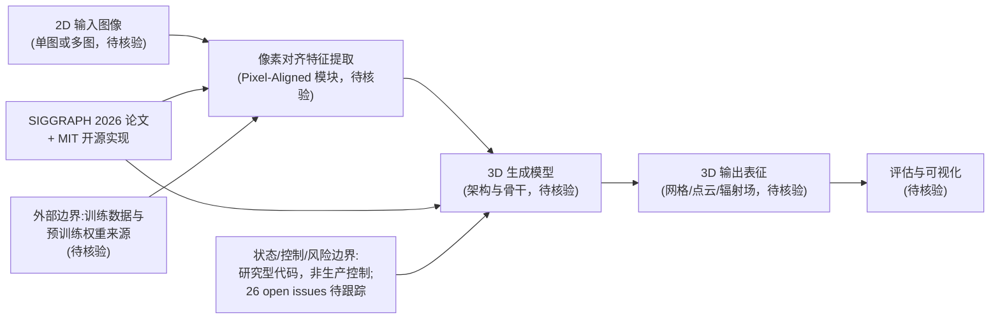

# TencentARC/Pixal3D — [SIGGRAPH 2026] Pixal3D: Pixel-Aligned 3D Generation from Images

## 一句话定位

[SIGGRAPH 2026] Pixal3D: Pixel-Aligned 3D Generation from Images。主要使用 Python 编写，当前 2,098 stars / 207 forks / 25 subscribers。

## 它解决的问题

**目标用户**：使用 python 生态的开发者、工程师。

**痛点**：该项目解决的核心问题是 [SIGGRAPH 2026] Pixal3D: Pixel-Aligned 3D Generation from Images。从 README 来看，项目提供了 
 # Pixal3D: Pixel-Aligned 3D Generation from Images <h3>SIGGRAPH 2026</h3> <small>[Dong-Yang Li](https://ldyang694.github.io/)¹ · [Wang Zhao](https://thuzhaowang.github.io/)²* · [Y。

**场景**：适用于需要 该类型工具 的开发场景。

## 为什么值得关注（2026-05-14）

1. **Stars 增长**：2,098 stars，207 forks——fork/star 比为 9.9% （正常范围）
2. **活跃度**：创建于 2026-05-10，最后更新 2026-06-23，26 open issues
3. **技术栈**：Python，License: MIT
4. **生态定位**：无 topics 标注

## 热度来源判断

**真实需求信号**：forks 207（高部署意愿），subscribers 25（深度关注）。

## 关键技术亮点

1. **
**
2. **# Pixal3D: Pixel-Aligned 3D Generation from Images**
3. **<h3>SIGGRAPH 2026</h3>**
4. **<small>[Dong-Yang Li](https://ldyang694.github.io/)¹ · [Wang Zhao](https://thuzhaowang.github.io/)²***
5. **¹Tsinghua University (BNRist) &nbsp;&nbsp; ²Tencent ARC Lab &nbsp;&nbsp; ³Victoria University of Wel**
6. ***Project lead &nbsp;&nbsp; ✉Corresponding author**

## 架构师速览

| 决策问题 | 研究判断 | 证据边界 |
|---|---|---|
| 系统边界 | Pixal3D 的边界是"2D 输入图像"与"3D 生成输出"之间的像素对齐映射边界，不涉及可信/不可信输入或安全域划分。 | 档案仅明确"Pixel-Aligned 3D Generation from Images"标题与 Python 实现；具体输入模态（单图/多图）、输出形态（网格/点云/NeRF）均未在档案中证实。 |
| 主路径 | 图像 → 像素对齐特征提取 → 3D 表征生成。档案未给出模型架构分阶段命名。 | 论文级摘要被截断（"[Dong-Yang Li]..."），内部模块拆分与管线细节无档案证据。 |
| 关键权衡 | 像素对齐精度 vs 3D 一致性/泛化，研究型项目在 SIGGRAPH 发表。 | 来自标题"SIGGRAPH 2026"标注；具体权衡维度（速度、显存、数据规模）档案未提供。 |
| 最小 PoC | 在隔离环境用 Python 复现论文示例，复用 MIT 许可的开源实现，验证单图到 3D 的最小端到端路径。 | 部署形态、依赖、硬件要求、推理时延均"待核验"，档案未给出。 |

## 架构启发

从 TencentARC/Pixal3D 的设计来看，核心思路是 **"[SIGGRAPH 2026] Pixal3D: Pixel-Aligned 3D Generation from Im"**。这反映了 Python 生态中 开发者工具 的演进方向——降低集成复杂度、提供开箱即用的能力。开源 License (MIT) 降低了采用门槛。

## 架构图（MMD）

> 证据边界：此图只采用本档案已有可核验描述；“待核验”节点不应视为项目实现事实。

## 定位判断

**研究型**。在生态中定位为[SIGGRAPH 2026] Pixal3D: Pixel-Aligned 3方向的工具。Stars 2098 说明已有一定社区基础。

## 风险 / 局限 / 泡沫点

1. **规模风险**：2,098 stars，但 fork 207 说明有实际部署
2. **维护风险**：最后 push 时间 2026-06-23，更新频率待观察
3. **Open Issues**：26 个 open issues，活跃社区反馈
4. **License**：MIT（宽松许可，适合商用）

## 与同类项目的关系

- 与同 Python 生态的同类工具形成竞争/互补关系。具体竞品对比需参考社区讨论。
- 从 topics () 来看，与关注 该领域 的其他项目有交叉。

## 是否值得持续跟踪

**是。** 2098 stars + 活跃更新说明项目有持续价值。建议关注后续版本迭代和社区增长。

## 后续观察点

1. Star 增速是否可持续（当前 2,098）
2. Fork 增长趋势（当前 207）
3. 功能迭代频率（最后更新 2026-06-23）
4. 社区活跃度（subscribers 25, open issues 26）

---
> 数据来源: GitHub API (2026-06-23) | Stars: 2,098 | Forks: 207 | License: MIT | 语言: Python | 创建: 2026-05-10
