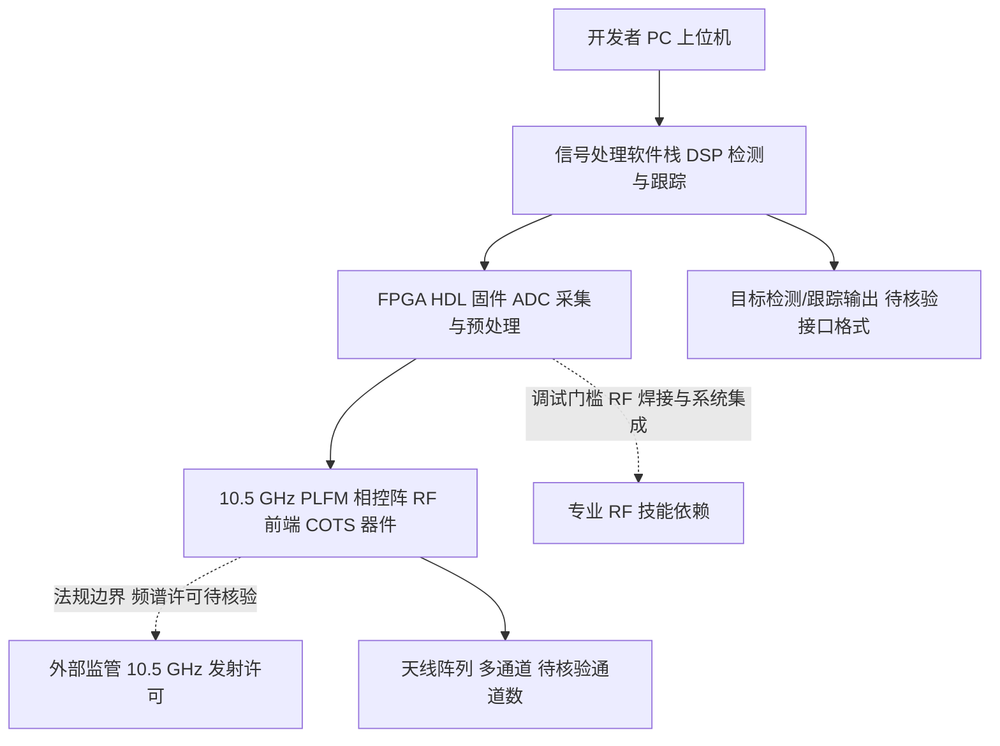

# NawfalMotii79/PLFM_RADAR

## 一句话定位
开源的 10.5 GHz PLFM（调频连续波）相控阵雷达系统，提供从硬件设计到信号处理的完整低成本雷达方案。

## 它解决的问题
相控阵雷达传统上属于军事和高端工业领域，成本动辄数万美元，普通研究者、创客和小型机构完全无法接触。PLFM_RADAR 面向硬件爱好者、RF 工程师、学术研究者，提供了一个成本极低（数百美元级）的开源相控阵雷达参考设计，包含完整的硬件原理图、PCB 设计、FPGA 固件和信号处理软件。

## 为什么值得关注
- **Stars:** 23,427 stars，在开源硬件项目中属于极高关注度
- **技术门槛突破:** 将相控阵雷达的成本从数万美元降至数百美元级别
- **完整开源方案:** 从硬件到软件的完整技术栈，不只是代码而是完整的系统设计
- **交叉领域价值:** 连接 RF 硬件、FPGA、信号处理和机器学习多个领域

## 热度来源判断
热度来自开源硬件社区对「高端技术平民化」的持续热情——类似于 HackRF 和 BladeRF 当年降低 SDR 门槛建立的热度。PLFM 相控阵雷达是雷达技术中最实用的波形之一，将其开源化具有技术和教育双重价值。23K stars 中包含大量硬件爱好者和教育机构的关注，具有真实需求基础。但也需注意开源硬件项目中实际能完成组装和使用的人数远少于 stars 数。

## 关键技术亮点亮点
1. **10.5 GHz PLFM 波形:** 使用调频连续波（FMCW）技术，兼顾距离分辨率和探测范围，适合短中程探测
2. **相控阵波束成形:** 多天线阵列配合数字波束成形，实现电子扫描而非机械旋转
3. **完整设计文件开源:** 包含 PCB Gerber 文件、BOM 清单、FPGA HDL 代码和 DSP 处理算法
4. **低成本 COTS 器件:** 核心器件使用市售通用芯片（而非定制 RF 芯片），降低采购门槛
5. **信号处理软件栈:** 提供从原始 ADC 数据到目标检测/跟踪的完整信号处理流程

## 架构师速览

| 决策问题 | 研究判断 | 证据边界 |
|---|---|---|
| 系统边界 | 边界在 RF 硬件阵列（10.5 GHz PLFM/FMCW 相控阵）与 FPGA 固件 + DSP 软件之间；硬件层输出原始 ADC 数据，软件栈负责波束成形、检测与跟踪 | 档案仅描述组件类别，未给出具体接口协议、采样率或数据格式 |
| 主路径 | 上位机/PC → FPGA HDL（ADC 采集与预处理） → DSP/信号处理软件（波束成形、目标检测） → PCB 天线阵列（10.5 GHz 收发） | 协议、链路层与传输介质（USB/Ethernet/自定义）未在档案中证实 |
| 关键权衡 | 低成本 COTS 器件 vs RF 性能；数字信号处理补偿 vs 模拟硬件精度；开源完整栈 vs 组装/调试门槛与法规合规 | 性能指标（距离、角分辨率）未量化，权衡仅为档案定性描述 |
| 最小 PoC | 单通道 FMCW 收发链路回环 + FPGA 数据采集 + 离线 DSP 处理，验证探测距离/角分辨率基线，再扩展为多通道相控阵 | 档案未给出参考 BOM 替代、调试流程与合规许可要求，需进一步核验 |

## 架构启发
PLFM_RADAR 的架构体现了「用数字处理弥补模拟硬件不足」的设计思路——传统雷达依赖昂贵的模拟器件保证信号质量，而低成本方案通过更强的数字信号处理算法来补偿硬件性能不足。这种「数字补偿」的思路在软件定义无线电（SDR）领域已被广泛验证。

## 架构图（MMD）

> 证据边界：此图只采用本档案已有可核验描述；“待核验”节点不应视为项目实现事实。

## 定位判断
属于开源硬件/创客生态的高端项目。在雷达技术领域，PLFM_RADAR 定位为「教育级和原型级」方案，无法与专业雷达系统竞争性能，但填补了入门和教育市场的空白。

## 风险 / 局限 / 泡沫点
1. **实际组装门槛高:** 即使有完整设计文件，PCB 制造、器件焊接和系统调试仍需要专业 RF 技能
2. **法规合规风险:** 10.5 GHz 频段的主动发射在多数国家需要许可证，实际使用面临法规障碍
3. **性能限制明显:** 低成本方案的探测距离、角度分辨率和抗干扰能力远不如专业雷达
4. **维护活跃度:** 个人项目性质，长期维护和技术支持不确定

## 与同类项目的关系
- **HackRF/BladeRF:** 开源 SDR 平台，可接收雷达信号但不具备发射和波束成形能力
- **MIT OpenRADAR:** 麻省理工的开源雷达教育项目，定位类似但技术路线不同
- **krakenrf/krakenSDR:** 开源 RF 方向查找系统，同属低成本 RF 开源生态

## 是否值得持续跟踪
**选择性跟踪。** 对于 RF/硬件领域的观察者，PLFM_RADAR 代表了开源硬件向高端技术延伸的趋势。但对于软件/AI 方向的研究者，相关性较低。

## 后续观察点
- 关注项目是否衍生出商业产品或教育套件
- 观察是否有基于此平台的应用研究（如无人机探测、汽车辅助感知）
- 跟踪相关法规对开源雷达设备的态度变化

---
> 数据来源: GitHub API (gh cli) | 更新: 2026-08-07 | Stars: 23,427 | Language: PLSQL | Forks: 5,422
