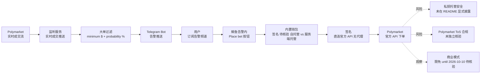

# techcomet122583/Polymarket-Telegram-Bot

## 一句话定位
**Polymarket 鲸鱼告警 Telegram Bot** ——直连 Polymarket 实时成交流，几秒内推送大单告警，并提供**内置钱包一键签名下单**（绕开官方 UI 的确认弹窗卡顿）。**链上信号 + 即时跟单**的预测市场变体。

## 它解决的问题
Polymarket 交易者面临三类痛点：(1) **鲸鱼大单难以及时发现**——手动盯盘成本高；(2) **官方 UI 确认弹窗卡顿**——README 明确指出 "Polymarket's own UI ... that confirmation popup can lag, glitch, or just not show up, so the trade signs late or not at all"；(3) **大单跟单需要快速签名**——错过窗口价格已变。Polymarket-Telegram-Bot 直击这三点：实时大单告警 + 内置钱包一键签名 + 直连官方 API（不经代理）。

## 为什么值得关注（2026-08-27）
- **1 天 125⭐ + 96 forks**：反映"鲸鱼跟单"赛道的真实交易者刚需
- **96 forks / 125 stars（fork/star 比 0.77）**：大量用户进入 fork 模式，暗示"自部署 + 修改信号阈值"的需求
- **MIT 许可**：商用友好
- **73 KB 极小 size**：bot 内核 + 简单脚本，可能是 webhook receiver + signal broadcaster
- **官方 Bot + 告警频道**：提供 [t.me/polyprediction1_bot](https://t.me/polyprediction1_bot)（"Use the bot for free — until 10.10.2026"，限时免费）与 [t.me/whalealerts_polymarket](https://t.me/whalealerts_polymarket)（告警频道）
- **直连官方 API**：README 强调 "Balance activation and signing go straight through the official Polymarket API, without extra proxy steps"

## 热度来源判断
热度来自 **"鲸鱼跟单刚需 × UI 卡顿痛点 × 一键签名稀缺体验"** 的组合：(1) Polymarket 是当前最大的预测市场，鲸鱼大单对市场情绪影响显著；(2) 官方 UI 的确认弹窗卡顿是真实 UX 痛点（README 描述具体到 "lag, glitch, or just not show up"）；(3) Bot 内置钱包直连官方 API 是稀缺体验（多数交易 bot 需用户自己接入私钥）。**主要风险：** bot 内置钱包的私钥归属（用户自托管 vs Bot 服务端托管）未在 README 显式说明；与 Polymarket 官方 ToS 的兼容性（是否允许第三方 Bot 内置钱包）；"until 10.10.2026" 限免的商业化路径未披露。

## 关键技术亮点
1. **实时鲸鱼告警**：直连 Polymarket 实时成交流，几秒内推送大单告警
2. **内置钱包一键签名**：绕开官方 UI 的确认弹窗，签名瞬时完成
3. **直连官方 API**：不经代理（"Balance activation and signing go straight through the official Polymarket API"）
4. **告警配置**：用户自设 minimum amount（$）与 probability range（%），Start/Stop 一键开关
5. **Telegram Bot 双形态**：交互 bot + 告警频道
6. **Fast deposits & withdrawals**：通过 bot 或 Polymarket 网站任一渠道充值 / 提现，均为同一余额

## 架构师速览

| 决策问题 | 研究判断 | 证据边界 |
|---|---|---|
| 系统边界 | 一个 Telegram Bot 服务 + （推测）Polymarket 官方 API 监听 + 内置钱包层 | 仅基于 README "plugged directly into Polymarket's live trade feed" 与 "wallet lives inside the bot"；后端监听架构、钱包托管架构、签名实现路径均未在档案中明示 |
| 主路径 | Polymarket 实时成交 → 大单告警触发 → Telegram 推送给订阅者 → 用户点击告警内"Place bet"按钮 → 内置钱包签名 → 官方 API 直连下单 | 主路径来自 README "Catches whale trades" 与 "Signs instantly, every time" 段落；签名私钥归属（用户/服务端）、签名失败回退未证实 |
| 关键权衡 | UX 流畅度 vs 私钥托管安全 vs ToS 合规边界 vs 商业模式（限免 vs 订阅 vs 抽佣） | 档案明示 "until 10.10.2026" 限免与内置钱包设计；私钥托管安全、ToS 合规、商业化路径均未披露 |
| 最小 PoC | 用小金额测试钱包接入 → 设置低 minimum 触发一次告警 → 验证一键签名 → 立即提现验证资金安全 | PoC 范围由"先小金额、立即提现、可审计"原则推导；具体私钥验证路径、签名审计日志待核验 |

## 架构启发
Polymarket-Telegram-Bot 的核心启发是 **"Web3 UX 仍比 Web2 慢"**——链上交易在签名确认 / 弹窗 / MetaMask 弹窗等环节仍有显著摩擦，**第三方 Bot 的核心价值是"补 UX 摩擦"**。更深层的启发是：**"信号 + 一键跟单"模式在传统股票市场早已成熟（跟单 ETF / 跟单社区），但链上版本需要叠加"内置钱包"才能做到真正一键**——这是链上跟单的稀缺创新。**但核心风险点**——bot 内置钱包的私钥归属——README 没明示，需要源码核验才能评估。

## 架构图（MMD）

> 证据边界：此图只采用本档案已有可核验描述；"待核验"节点不应视为项目实现事实。

## 定位判断
**工具型项目（onchain trading bot）。** Polymarket-Telegram-Bot 不做协议，只做"信号监听 + 告警推送 + 一键签名跟单"——这是工具型定位。**核心竞争壁垒：** "内置钱包直连官方 API + 绕开 UI 弹窗"的稀缺体验 + 1 天 125⭐ / 96 forks 的社区热度。**主要风险：** 私钥托管安全 + ToS 合规 + 限免商业化路径未明。若持续维护 + 明确私钥托管方案 + ToS 合规，**12 月内有可能成为 Polymarket 跟单赛道的标杆**。

## 风险 / 局限 / 泡沫点
- **私钥托管安全**：bot 内置钱包的私钥归属（用户自托管 vs Bot 服务端托管）未在 README 显式说明——**核心风险点**
- **Polymarket ToS 合规**：是否允许第三方 Bot 内置钱包未独立核验
- **限免商业化路径**："until 10.10.2026" 限免的商业化路径（订阅费 / 抽佣 / 增值功能）未披露
- **96 forks / 125 stars（fork/star 比 0.77）**：高 fork/star 比暗示"自部署 + 修改信号阈值"需求，可能与"用户对 hosted bot 的私钥托管不信任"有关
- **鲸鱼大单的双面性**：跟单鲸鱼可能放大市场操纵风险（README 未声明是否对"已知的可疑大单"做屏蔽）
- **1 天新项目**：维护持续性待观察
- **最小 size 73 KB**：极小 size 暗示可能不含完整后端服务（依赖 Telegram webhook + 第三方托管）

## 与同类项目的关系
- **vs Polymarket 官方 Web UI**：官方 UI 的确认弹窗卡顿是 Bot 存在的核心理由
- **vs 传统股票跟单 Bot**：跟单逻辑一致，但叠加 "crypto wallet 内置" 与 "绕过 UI 弹窗"
- **vs 其他链上交易 Bot**（如 GMX / dYdX Bot）：Bot 模式可复用，但 "绕开 UI 弹窗" 的差异化定位需对照
- **vs Polymarket 官方 API 客户端**：官方 API 客户端是 SDK；Bot 是产品化封装
- **vs 其他预测市场 Bot**（如 Kalshi / Limitless）：Bot 模式可复用，但市场数据源依赖各自官方 API

## 是否值得持续跟踪
**值得跟踪（链上信号 Bot 的 UX 创新样本）。** Polymarket-Telegram-Bot 1 天 125⭐ + 96 forks 体现产品吸引力，但 **核心风险点——私钥托管——README 没明示**。**对开发者采用：** 在源代码明确披露私钥管理机制前，不应把大额钱包接入此类 bot。**对链上产品经理：** 这是 "Web3 UX 仍比 Web2 慢" 的强证据，链上产品仍有 UI 摩擦，第三方 Bot 有"补 UX" 的真实市场。建议关注：(1) 私钥托管机制是否在源码 / 文档明确；(2) Polymarket 官方是否对 Bot 内置钱包表态；(3) 商业化路径是否清晰（订阅 / 抽佣 / 增值）。

## 后续观察点
- 私钥托管机制（自托管 vs 服务端托管）是否在源码 / 文档明示
- Polymarket 官方 ToS 对第三方 Bot 内置钱包的立场
- 商业化路径（"until 2026-10-10" 之后是订阅 / 抽佣 / 增值？）
- 是否扩展到其他链上交易平台（Hyperliquid / dYdX / Jupiter）
- 鲸鱼告警算法是否包含"已知的可疑大单"屏蔽

---
> 数据来源: GitHub API (2026-08-27) | Stars: 125 | Forks: 96 | License: MIT | 语言: JavaScript | 创建: 2026-08-26 | 数据截至 2026-08-27 19:30 UTC