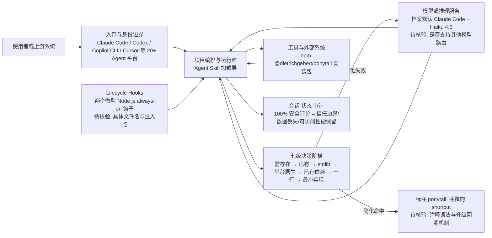

# DietrichGebert/ponytail — 让 AI Agent 像最懒的资深工程师一样思考

## 一句话定位
Ponytail 是一个 Agent Skill，让 AI 编程代理在写代码前先问"这真的需要存在吗？"——实测平均减少 54% 代码量（最高 94%）、22% token 消耗、27% 执行时间，同时保持 100% 安全性。

## 它解决的问题
AI Agent 普遍存在"过度工程"倾向——让它做个日期选择器，它会安装 flatpickr、写 wrapper 组件、加 stylesheet、讨论时区。ponytail 让 Agent 在写代码前先经过一个七级决策阶梯，只在所有简化路径都走不通时才写最小实现。这不是偷懒，而是精准的"必要代码量"判断。

## 为什么值得关注（2026-08-11）
- **100,395 stars**（截至 2026-08-11），MIT 许可，60 天内突破 10 万星
- **5,528 forks**，社区高度参与
- **250 subscribers**，核心开发者群体深度关注
- **严谨的 Agentic Benchmark**：同一 agent（Claude Code + Haiku 4.5），12 个真实功能任务，n=4，对 FastAPI+React 真实代码库的 git diff 评分
- **唯一在所有维度都下降且保持 100% 安全的对照组**：LOC -54%、tokens -22%、cost -20%、time -27%
- 支持 20+ Agent 平台：Claude Code、Codex、GitHub Copilot CLI、Cursor 等
- 官方网站 ponytail.dev 已上线，商业平台化路径清晰

## 热度来源判断
**真实价值驱动。** benchmark 数据是关键——不是概念营销，而是有严谨的量化对比实验，且作者公开承认了早期 single-shot 数据的偏差并发布了修正版 agentic benchmark。100K stars 中有热度追逐成分，但核心价值是"用工程方法解决 Agent 过度生成代码"这一真实痛点。npm 包 `@dietrichgebert/ponytail` 已发布，有真实安装量。

## 关键技术亮点亮点
1. **七级决策阶梯**：需要存在吗？→ 代码库已有？→ Stdlib 能做吗？→ 平台原生支持？→ 已有依赖能做？→ 一行能搞定吗？→ 最后才写最小实现
2. **懒惰但非疏忽**：信任边界验证、数据丢失处理、安全、可访问性永远不会被砍掉——100% 安全评分证明了这点
3. **可升级性标记**：每个 shortcut 都用 `ponytail:` 注释标记升级路径，如 `<!-- ponytail: browser has one -->`
4. **多 Agent 平台支持**：Claude Code `/plugin install`、Codex `codex plugin add`、Copilot CLI 等均原生支持
5. **Lifecycle Hooks**：Claude Code 和 Codex 插件运行两个微型 Node.js 生命周期钩子，实现 always-on 激活

## 架构师速览

| 决策问题 | 研究判断 | 证据边界 |
|---|---|---|
| 系统边界 | ponytail 作为 Agent Skill 插件层，介于 Agent 运行时（Claude Code/Codex/Copilot CLI/Cursor）与模型推理之间，承担"决策前置"职责 | 边界判断基于项目分类=工具型、语言=JavaScript、标签=agent-skill/yagni/code-quality/claude-code 及"支持 20+ Agent 平台"的官方说法；具体插件协议、manifest 格式与持久化机制未在档案中给出，需源码核验 |
| 主路径 | 用户请求 → Agent 运行时加载 Skill → 触发七级决策阶梯 → 仅在所有简化路径失败后调用模型生成最小实现 → `ponytail:` 注释标记升级路径 | 主路径描述来自档案中"七级决策阶梯"与"可升级性标记"两段；生命周期钩子（Claude Code/Codex 的两个微型 Node.js 钩子实现 always-on 激活）描述具体，但模型调用协议、上下文注入机制未述 |
| 关键权衡 | "必要代码量"最小化 vs 信任边界/安全/可访问性硬约束——档案明确 100% 安全评分成立，但 benchmark 仅 12 任务 × Haiku 4.5 × FastAPI+React 单代码库，且作者承认 GPT-5.5 等推理模型上效果可能反转 | 权衡分析综合档案"为什么值得关注"、"懒惰但非疏忽"、"风险/局限"三段；除上述 benchmark 维度外的泛化结论缺乏证据 |
| 最小 PoC | 在 Claude Code 单渠道、固定 Haiku 4.5 模型、单一 FastAPI+React 子模块中复现 12 任务 agentic benchmark（n=4），对比 LOC/tokens/cost/time 与安全评分；同步验证两个 Node.js 生命周期钩子的 always-on 行为与 `ponytail:` 注释回溯 | PoC 设计依据档案"严谨的 Agentic Benchmark"段与"Lifecycle Hooks"段；具体 hook 文件名、注入点、模型切换成本均未披露，标注"待核验" |

## 架构启发
ponytail 本质上实现了一种"决策前置层"——在代码实现之前先做"要不要做"和"做多少"的决策。这与 Agent 领域的 Advisor-Executor 分离模式形成互补：
- **improve 类工具**：在架构层面做决策（"哪些问题值得修复"）
- **ponytail**：在代码层面做决策（"这个功能需要多少代码"）

两者结合可能形成更完整的 Agent 决策栈。更深层的启发是：Agent 的输出质量不仅取决于"写得对"，还取决于"写得少"——而"写得少"是可以被规则化训练的。

## 架构图（MMD）

> 证据边界：此图只采用本档案已有可核验描述；“待核验”节点不应视为项目实现事实。

## 定位判断
**工具型，单一但精致。** 不太可能平台化，但作为 Agent Skill 生态中的高质量组件，有持续价值。官方网站 ponytail.dev 和 waitlist 暗示作者有商业化计划。在 Agent Skill 赛道，ponytail 代表了从"能做"到"做精"的演进方向。

## 风险 / 局限 / 泡沫点
1. **适用范围有限**：YAGNI 思想在某些场景（如研究型代码、原型验证、复杂业务逻辑）可能过于保守
2. **Benchmark 的局限**：12 个任务、单一模型（Haiku 4.5）、单一代码库（FastAPI+React），代表性有限
3. **模型依赖性**：作者承认在 GPT-5.5 等推理模型上效果可能相反——模型在思考 token 上花费更多反而增加成本
4. **Agent Skill 同质化**：每天涌现新的 Skill（caveman、yagni-oneliner 等），市场分化
5. **100K stars 增速过快**：可能含大量"先 star 后用"的观望用户

## 与同类项目的关系
- **vs caveman**：caveman 是"写更少的代码"（terse-prose），ponytail 是"写必要的代码"（decision-ladder）——ponytail 在 tokens/cost/time 上全面优于 caveman
- **vs "YAGNI + one-liners" 简单提示**：简单提示能达到 -33% LOC 但安全评分降至 95%，ponytail 保持 100% 安全的同时达到 -54% LOC
- **vs shadcn/improve**：improve 管架构决策，ponytail 管代码决策，互补关系
- **vs superpowers**：superpowers 是技能框架，ponytail 是单一精品技能

## 是否值得持续跟踪
**是。** 它代表了 Agent Skill 从"能做"到"做精"的演进方向，其量化验证方法（agentic benchmark + 公开复现）值得整个 Agent Skill 社区学习。商业化路径（ponytail.dev）也值得关注。

## 后续观察点
1. 商业平台 ponytail.dev 的发布和定价模式
2. 社区是否基于 ponytail 模式创造更多"极简主义 Skill"
3. benchmark 是否扩展到更多模型（GPT-5.5、Gemini 等）和场景
4. "决策阶梯"概念是否能抽象为通用 Agent 模式
5. 在大型企业代码库中的实际效果验证

---
> 数据来源: GitHub API (2026-08-11) | Stars: 100,395 | Forks: 5,528 | License: MIT | 语言: JavaScript | 创建: 2026-06-12
