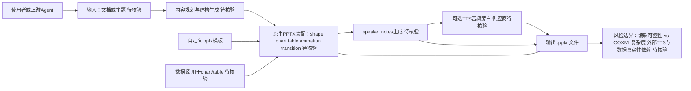

# hugohe3/ppt-master — AI turns documents or topics into real, native PowerPoint decks—with native shap

## 一句话定位

AI turns documents or topics into real, native PowerPoint decks—with native shapes, transitions and animations, data-backed charts and tables on demand, audio narration from speaker notes, and support for your own .pptx templates. · by Hugo He。主要使用 Python 编写，当前 44,662 stars / 3,653 forks / 92 subscribers。

## 它解决的问题

**目标用户**：使用 python 生态的开发者、AI Agent 构建者。

**痛点**：该项目解决的核心问题是 AI turns documents or topics into real, native PowerPoint decks—with native shapes, transitions and animations, data-backed charts and tables on demand, audio narration from speaker notes, and support for your own .pptx templates. · by Hugo He。从 README 来看，项目提供了 # PPT Master — AI generates native PowerPoint from any document [](https://github.com/hugohe3/ppt-master/。

**场景**：适用于需要 ai-agent, aippt, office 的开发场景。

## 为什么值得关注（2026-05-06）

1. **Stars 增长**：44,662 stars，3,653 forks——fork/star 比为 8.2% （正常范围）
2. **活跃度**：创建于 2025-12-10，最后更新 2026-08-11，6 open issues
3. **技术栈**：Python，License: MIT
4. **生态定位**：Topics: ai-agent, aippt, office, powerpoint, powerpoint-generation

## 热度来源判断

**真实需求信号**：forks 3653（高部署意愿），subscribers 92（深度关注）。

**品类时机**：从 topics 来看，ai-agent, aippt, office 是当前社区关注的方向。

## 关键技术亮点

1. **# PPT Master — AI generates native PowerPoint from any document**
2. **[](ht**
3. **[](https://opensource.org/licens**
4. **[](https://github.com/hug**
5. **[](https://atomgit.com/hugohe**
6. **[](https://ww**

## 架构师速览

| 决策问题 | 研究判断 | 证据边界 |
|---|---|---|
| 系统边界 | ppt-master 是一个面向 ai-agent / office 场景的生成式工具，README 表明其核心能力为「由文档或主题生成原生 PowerPoint」，包含原生形状、转场动画、按需的数据图表与表格、speaker notes 音频旁白、自定义 .pptx 模板支持；外部边界至少涵盖：用户/上游输入、自定义 .pptx 模板、TTS 音频合成、数据源（用于 chart/table）以及最终输出 .pptx 文件 | 档案只描述了 README 标题与功能描述，未给出模块拆分、依赖矩阵或部署形态；具体组件划分须以源码核验 |
| 主路径 | 主体流程推断为：输入（文档/主题）→ 内容规划/结构生成 → 原生 PPTX 元素装配（shape、chart、table、animation、transition）→ speaker notes 生成 → 可选音频旁白（TTS）→ 输出 .pptx；模板与数据源作为配置注入而非必经主路径 | 档案未明确各阶段实现方式，所列步骤均为 README 描述能力的合理映射，非源码确认 |
| 关键权衡 | 主要权衡集中在「原生 PowerPoint 表达力」与「实现复杂度/可控性」之间：选择 native shapes + animations + transitions 而非图片/HTML 截图，可保留可编辑性但增加对 OOXML/python-pptx 能力的依赖；引入 TTS 与按需 chart/table 又带来外部服务依赖与版权/数据真实性风险 | 文档/主题生成质量、TTS 供应商、数据图表面向何种后端（pandas? 自建?）均未在档案中说明 |
| 最小 PoC | 建议以「单文档 → 单主题模板 → 输出 1 页含 1 个原生 shape + 1 张 chart + speaker notes（不开 TTS）」作为最小验收，关闭音频与动画以隔离风险；优先验证 python-pptx 兼容性与模板占位符契约 | 模板占位符约定、chart 数据接入方式、TTS 是否可选等关键 PoC 参数在档案中均未证实 |

## 架构启发

从 hugohe3/ppt-master 的设计来看，核心思路是 **"AI turns documents or topics into real, native PowerPoint de"**。这反映了 Python 生态中 Agent / AI 工具链 的演进方向——降低集成复杂度、提供开箱即用的能力。开源 License (MIT) 降低了采用门槛。

## 架构图（MMD）

> 证据边界：此图只采用本档案已有可核验描述；“待核验”节点不应视为项目实现事实。

## 定位判断

**生产可用**。在生态中定位为AI turns documents or topics into real, 方向的工具。Stars 44662 说明已有一定社区基础。

## 风险 / 局限 / 泡沫点

1. **规模风险**：44,662 stars，但 fork 3653 说明有实际部署
2. **维护风险**：最后 push 时间 2026-08-11，活跃维护中
3. **Open Issues**：6 个 open issues，问题量可控
4. **License**：MIT（宽松许可，适合商用）

## 与同类项目的关系

- 与同 Python 生态的同类工具形成竞争/互补关系。具体竞品对比需参考社区讨论。
- 从 topics (ai-agent, aippt, office) 来看，与关注 ai-agent 的其他项目有交叉。

## 是否值得持续跟踪

**是。** 44662 stars + 活跃更新说明项目有持续价值。建议关注后续版本迭代和社区增长。

## 后续观察点

1. Star 增速是否可持续（当前 44,662）
2. Fork 增长趋势（当前 3,653）
3. 功能迭代频率（最后更新 2026-08-11）
4. 社区活跃度（subscribers 92, open issues 6）

---
> 数据来源: GitHub API (2026-08-11) | Stars: 44,662 | Forks: 3,653 | License: MIT | 语言: Python | 创建: 2025-12-10
