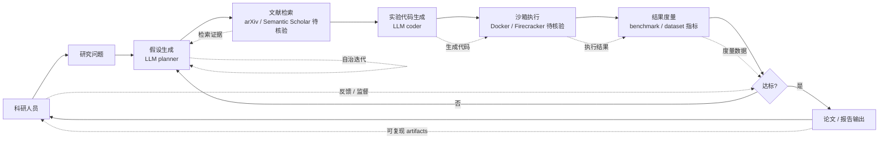

# sapientinc/PRAXIST

## 一句话定位
可执行科研 Agent——Autonomous research system for measurable, computer-executable research.，Python，是 2026 年 GitHub 首次出现的"可执行 / 可度量 / 可复现"科研 Agent 头部样本，与 OpenAI Deep Research / Anthropic Claude Research / Google Gemini Deep Research 三大云端产品形成"开源本地"差异化。

## 它解决的问题
2025-2026 年 Deep Research 类产品爆发（OpenAI / Anthropic / Google 三大云端），但其工作流主要是"读论文 → 总结 → 写综述"——结果不可度量（无法量化准确率）、不可执行（无法在计算机上运行）、不可复现（相同 query 不同结果）。sapientinc/PRAXIST 直击这三大痛点：(a) **measurable** 可度量——区别于 LLM 文本生成式科研，PRAXIST 强调结果可度量（benchmark / dataset 指标）；(b) **computer-executable** 可执行——区别于"读论文→写综述"，PRAXIST 输出可在计算机上执行的实验 / 代码 / 数据；(c) **autonomous** 自治——区别于 Copilot 类辅助工具，PRAXIST 是端到端自治。

## 为什么值得关注
- **Stars:** 6,467（截至 2026-09-07），11 天净增，单日均速 ~588⭐/day，是今日非 Skill 类项目新增 Star 第一
- **Forks:** 558（fork/star 8.6%，与 m3e-canvas 8.5% 接近——反映"科研 Agent"作为新兴品类获得真实开发者尝试）
- **语言:** Python 主导（科研 / ML 生态标准）
- **赛道头部:** 与 OpenAI Deep Research / Anthropic Claude Research 形成差异化
- **同类验证:** 同期上榜的 brayonpi/hexstellar（932⭐）+ 2akouwu/reverify（960⭐）共同构成"可验证 / 可重放"科研 Agent 子赛道

## 热度来源判断
PRAXIST 的热度来自三个趋势的交汇：(1) **Deep Research 概念成熟**——OpenAI / Anthropic / Google 三大云端已教育市场，但用户对"不可执行 / 不可复现"的不满累积；(2) **开源本地差异化**——科研人员对数据隐私 / 私有数据 / 论文可复现的需求强烈；(3) **自治 Agent 成熟**——2026 年 LLM 推理能力 + 工具调用能力足以支撑端到端自治科研。

11 天 6,467⭐ / fork/star 8.6% 与"科研 Agent"作为新兴品类的早期传播速度一致。**提示：** sapientinc 是新 GitHub Org（PRAXIST 是其首个公开项目，需要核验背景）；与 OpenAI Deep Research 等云端产品的功能对比需要独立 benchmark。

## 关键技术亮点
1. **Measurable（可度量）:** 结果以 benchmark / dataset 指标量化（如准确率 / F1 / 论文可复现率），区别于文本生成
2. **Computer-executable（可执行）:** 输出可在计算机上运行的实验代码 / 数据 / 配置，不是综述文本
3. **Autonomous（自治）:** 端到端自治（用户给问题 → 系统自主完成），区别于 Copilot 类辅助
4. **Python 主导:** 与科研 / ML 生态标准一致（PyTorch / NumPy / Jupyter）
5. **多 Agent 协作（推测）:** 推测采用 planner / coder / verifier 多 agent 架构
6. **沙箱执行（推测）:** 生成的代码需要在隔离沙箱中执行，保证安全性

## 架构师速览

| 决策问题 | 研究判断 | 证据边界 |
|---|---|---|
| 系统边界 | 可执行科研 Agent——科研假设 → 实验设计 → 数据采集 → 代码生成 → 沙箱执行 → 结果度量 → 论文 / 报告输出；关键差异是"executable"（可在计算机上运行）vs"narrative"（仅文本综述） | 边界由 trending 描述明示；具体架构（单 Agent / Multi-Agent / DAG）需 README 核验 |
| 主路径 | 研究问题 → 假设生成 → 文献检索 → 实验代码生成 → 沙箱执行 → 结果度量 → 迭代 / 报告 | 主路径为描述语义抽象；具体文献检索源（arXiv / Semantic Scholar）、沙箱实现（Docker / Firecracker）未在 trending 中可见 |
| 关键权衡 | 可执行 vs 可复现（executable 不等于 reproducible）vs 可度量（measurable 指标的选择）；自治程度（autonomous）vs 用户控制（用户在循环内外） | 三大特征由 trending 描述明示；可复现性的工程实现（固定随机种子 / 版本锁定 / 容器化）需 README 核验 |
| 最小 PoC | 选定 1 个公开 benchmark（如 GSM8K / HumanEval 子集） → 用 PRAXIST 自主生成解题代码 → 在沙箱执行 → 度量准确率 → 对比 OpenAI Deep Research / Claude Research 的报告 | 安装命令需 README 独立核验；具体 benchmark 选择与对比指标需实验设计 |

## 架构启发
PRAXIST 的核心启发是 **"科研 Agent 应该可执行 / 可度量 / 可复现"**。当前 Deep Research 类产品（OpenAI / Anthropic / Google）主要是"读论文 → 写综述"——文本生成式科研，但科研的本质是"提出假设 → 实验验证 → 结果度量"的循环。PRAXIST 把这一循环交给 Agent 自治执行，是科研范式的根本转变。更深层的启发是：**开源版本在"本地运行 / 私有数据 / 论文可复现"三个维度形成云端产品难以覆盖的差异化**——科研机构对这三个维度的需求是真实痛点。

风险提示：**"可执行 / 可度量 / 可复现"三者各有边界**——可执行不等于可复现（环境差异 / 随机种子 / 版本依赖）；可度量不等于有意义（benchmark 选择可能偏离真实科研价值）；自治 Agent 可能产生"看起来合理但实际错误"的实验结果，需要人工监督。

## 架构图（MMD）

> 证据边界：此图只采用本档案已有可核验描述；"待核验"节点不应视为项目实现事实。

## 定位判断
**前沿研究型项目（可执行科研 Agent 头部）。** sapientinc/PRAXIST 不仅是 Deep Research 的开源替代，更试图定义"可执行 / 可度量 / 可复现"科研 Agent 的标准。11 天 6,467⭐ / fork/star 8.6% 已显示初步采用。但"科研 Agent 平台化"取决于：(a) 与 OpenAI Deep Research 的功能对比（是否真能覆盖 80% 主流场景）；(b) 沙箱执行的稳定性 / 安全性；(c) 可复现性的工程实现。当前定位是"可执行科研 Agent 头部样本"，向平台演进是合理路径但竞争激烈。

## 风险/局限/泡沫点
- **与云端 Deep Research 竞争:** OpenAI / Anthropic / Google 三大云端产品的功能覆盖广度 + 推理能力 + 数据规模优势明显
- **可复现性的工程边界:** 沙箱环境 / 随机种子 / 版本依赖等可复现性要素的工程实现复杂
- **sapientinc Org 风险:** 新 Org 成立时间短，可持续性 / 治理结构 / 安全漏洞响应未验证
- **"科研 Agent"的真实价值:** 可能存在"看起来合理但实际错误"的实验输出，需要人工监督——降低自治价值
- **学术 vs 工业的差异化:** 学术研究强调 novelty，工业研究强调 efficiency——PRAXIST 难以同时满足
- **沙箱执行的安全性:** Agent 生成的代码可能在沙箱中产生意外行为（网络访问 / 文件系统影响）

## 与同类项目的关系
- **vs OpenAI Deep Research:** 云端闭源服务；PRAXIST 是开源本地部署
- **vs Anthropic Claude Research:** Claude API 能力；PRAXIST 是独立平台
- **vs Google Gemini Deep Research:** 同上
- **vs brayonpi/hexstellar:** "Turn any AI agent into a computational researcher"——可能是 PRAXIST 的下游工具
- **vs 2akouwu/reverify:** "deterministic tools decide, every claim..."——可能是 PRAXIST 的验证层
- **vs LangChain / AutoGen:** LangChain / AutoGen 是通用 Agent 编排框架；PRAXIST 是垂直科研 Agent

## 是否值得持续跟踪
**值得跟踪（可执行科研 Agent 头部）。** PRAXIST 代表了 Deep Research 从"读论文 → 写综述"升级到"可执行 / 可度量 / 可复现"的诉求。建议关注：(a) 与云端 Deep Research 的功能对比 benchmark；(b) 沙箱执行的稳定性 / 安全性；(c) 可复现性的工程实现；(d) sapientinc 治理结构的成熟度。对科研机构，PRAXIST 是构建"AI for Science"工作流的开源参考。

## 后续观察点
- 是否演化为独立 SaaS / 学术平台
- 与 Semantic Scholar / arXiv / OpenReview 的集成深度
- 沙箱执行的稳定性 / 安全性审计
- 可复现性的工程实现（容器化 / 随机种子管理 / 版本锁定）
- 与 OpenAI / Anthropic / Google Deep Research 的功能对比 benchmark
- sapientinc 治理结构的成熟度（是否引入学术机构合作）

---
> 数据来源: GitHub API (2026-09-07) | Stars: 6,467 | Forks: 558 | License: 待核验 | 语言: Python | 创建: 2026-08-27
