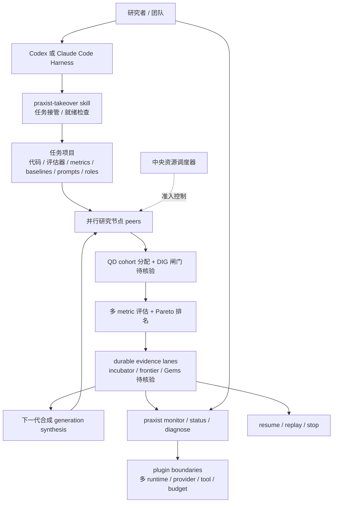

# sapientinc/PRAXIST

## 一句话定位
面向"可测量、可计算机执行"研究的自治研究系统——把 research 建模成"长期可监控、可恢复、可重放"的进程，通过 Codex / Claude Code skill 集合接入主流 Coding Agent Harness，配合 PyPI 发布包与 arXiv 论文（2608.25955）。

## 它解决的问题
企业级 ML/DL 研究团队的研发自动化长期被困在三类痛点里：(1) **一次性 agent**（GPT Researcher / STORM / DeepResearch 类）跑完即丢，缺乏"代际学习"与证据持久化；(2) **多 peer 并行**受限于单机 / 单 harness，缺乏中央资源调度；(3) **可恢复性差**——任何一次崩溃就丢失上下文与候选。PRAXIST 直接把这三类问题工程化：用 skill pack 接管现有任务项目 + 用 multi-generation synthesis 把跨代经验固化 + 用 durable evidence lanes 保留最优候选 + 用 resume/replay/monitor 保障可恢复。

## 为什么值得关注（2026-08-29）
- **Stars:** 1451（截至 2026-08-29），**2 天起步**，处于"早期爆发"阶段
- **Forks:** 待核验（API 检索未单独返回，本档案以 stars 为主指标）
- **License:** README 自述"Fair Source License"——非纯 OSI 许可证，下游商业使用前需读 LICENSE 文件
- **语言:** Python 3.11+
- **活跃度:** created 2026-08-27，pushed_at 2026-08-28，2 天内快速进入 1451⭐ 区间
- **规模:** 含完整 docs/ + AGENTS.md + .github/CONTRIBUTING.md + templates/ + rocket_booster_recovery / rocket_booster_recovery_rust 两个可写示例
- **发布渠道:** PyPI `praxist[agents,codex]` + 文档站 praxist.sapient.inc + arXiv 2608.25955 + Discord
- **接入面:** Codex-native mode（用已保存的 Codex 订阅，无 API key）+ Claude Code host-specific one-line 安装

## 热度来源判断
PRAXIST 的热度是 **"企业研发自动化痛点 × 完整开源产品化 × 主流 Coding Agent Harness 集成 × 学术论文背书"** 的强组合——OpenAI/DeepMind/Anthropic 内部都有 research agent，但完整开源 + skill pack + CLI + PyPI + arXiv 论文的一体化实现，在公开生态非常稀缺。1451⭐/2 天说明"自治研究系统"是企业 ML 实验室的"沉默刚需"。但需警惕：Fair Source License 限制商业采用；2 天数据不足以判断长期采用曲线；与 8-26 memory 类项目（heimdall/Perenna）的对比有待观察。

## 关键技术亮点
1. **七大研究编排原语**（README 表格明示）：parallel research peers / multi-generation synthesis / durable evidence lanes / multi-metric evaluation（含 Pareto-optimal）/ Quality-Diversity (QD) + optional Deep Innovation Gate (DIG) / central resource scheduling / resume, replay, monitoring / plugin boundaries
2. **研究 / 任务边界严格解耦**：README 表格 **"Praxist owns / The task project owns"** 明示——Praxist 拥有研究编排/生命周期/证据协议/重放/调度/扩展接口；任务项目拥有研究目标/可执行代码/评估器/metrics/baselines/prompts/roles/领域约束。"Praxist contains no task-specific scientific assumptions. A task remains the single source of truth for what should be tested and what counts as valid evidence."
3. **完整 skill 集合**：9 个 skill——`praxist-takeover` / `praxist-takeover-codex` / `praxist-onboarding` / `praxist-task-initialization` / `praxist-interactive-task-init` / `praxist-control` / `praxist-diagnostic` / `praxist-scientific-research` / `praxist-runtime-install` / `terminal-line-plot`
4. **CLI 完备**：`praxist setup --interactive --install-skills codex` / `praxist examples list` / `praxist examples install rocket_booster_recovery` / `praxist status --json` / `praxist --monitor --latest` / `praxist stop <run_id>` / `praxist resume <run_dir>` / `praxist doctor` / `praxist docs`
5. **多 harness 集成**：Codex-native mode（无 API key，用已保存 Codex 登录）+ Claude Code host-specific 安装 + 第三方 provider API key；CLI 直接操作无需任一 harness
6. **QD + DIG 算法**：Quality-Diversity 维持多样性 + Deep Innovation Gate 控制探索深度（README 明示 docs/guides/qdig-cohort-allocator.md + docs/guides/deep-innovation-gate.md）

## 架构师速览

| 决策问题 | 研究判断 | 证据边界 |
|---|---|---|
| 系统边界 | Praxist 拥有研究编排/生命周期/证据协议/重放/调度/扩展接口；任务项目拥有研究目标/代码/评估器/metrics/baselines/prompts/roles/领域约束 | "Praxist owns / The task project owns" 表是 README 明确表述；具体调度器实现、evidence lane 的存储后端、QD/DIG 算法参数未在公开文档给出 |
| 主路径 | 任务项目（已可运行）→ `praxist-takeover` skill 接管 → 并行研究节点 + QD/DIG 探索 → 多代合成 → durable evidence lane 保留最优候选 → `praxist --monitor` 监控 + 可 resume/replay | takeover / status / stop / resume / monitor 命令在 README 中明示；并行节点的具体调度模型（轮询 / 锦标赛 / 进化）待核验 |
| 关键权衡 | 跨 harness 覆盖广度 vs 单一 harness 集成深度；evidence lane 持久性 vs 存储成本；QD 探索 vs 计算开销；Fair Source License vs 商业可采用性 | 跨 harness、QD/Fair Source License 在 README 自述；license 具体条款（哪些使用受限制）需 LICENSE 文件独立核验 |
| 最小 PoC | 拿一个 README 中明示的 rocket_booster_recovery / rocket_booster_recovery_rust 模板（`praxist examples install`），禁用 literature search + QD + DIG，仅跑 baseline + 1 个 peer 验证端到端 PoC；通过后切换到真实 ML 任务 | examples 列表在 README 明示；模板可在仓库 `templates/tasks/` 找到；端到端真实 ML 任务的 baseline 选择需结合领域知识 |

## 架构启发
PRAXIST 的核心启发是 **"研究 = 长期进程（persistent process）≠ 一次性 prompt"**。当前大多数 AI Research Agent（GPT Researcher / STORM / DeepResearch）都是"跑完即丢"的一次性脚本，缺乏跨代学习、证据持久化、可恢复性。PRAXIST 把"研究"建模成"可监控、可恢复、可重放、可中断后继续"的进程——这是把软件工程中"long-running service"的成熟范式引入研究自动化的关键一步。更深层的启发是 **"Praxist owns / The task project owns" 的边界设计**——把研究方法论（编排、生命周期、证据协议）与领域知识（评估器、metrics、baselines、prompts）严格解耦，让 Praxist 不绑定任何特定 ML 任务，可移植到 ML 系统 / 数据科学 / 实验科学 / 经济建模等任何"已有可运行项目 + 可测量目标"的领域。这与 Kubernetes 把"应用"与"基础设施"解耦的设计哲学一脉相承。1451⭐/2 天的爆发力说明企业 ML 实验室的"沉默刚需"被击中。

## 架构图（MMD）

> 证据边界：此图只采用本档案已有可核验描述；"待核验"节点不应视为项目实现事实。

## 定位判断
**基础设施候选项目（autonomous research system）**。PRAXIST 试图成为"企业研发自动化的研究编排底座"——类似 Kubernetes 之于容器化应用。1451⭐/2 天的爆发力 + 完整 skill pack + CLI + PyPI + arXiv 论文 + Discord + 文档站的一体化发布，证明这不是个人副业项目，而是 Sapient Inc. 的产品级布局。但"自治研究系统"赛道的成功取决于：(1) Fair Source License 的商业边界（决定是否能进入大型企业）；(2) 长期采用曲线（2 天数据不足以判断）；(3) 与 OpenAI / Anthropic 内部研究 agent 的开源对应物竞争。

## 风险 / 局限 / 泡沫点
- **Fair Source License 商业边界**：README 自述"Fair Source License"——非纯 OSI 许可证，对商业使用的具体限制需 LICENSE 文件独立核验；下游企业采用前必须法务审阅
- **2 天数据的采用曲线**：1451⭐/2 天处于"早期爆发"阶段，需观察 30/60/90 天的曲线是稳定上升还是昙花一现
- **依赖 Codex / Claude Code 订阅**：Codex-native mode + Claude Code host-specific 安装均依赖用户已有 Harness 订阅；若主流 Harness 政策变化（限速 / API 价格上涨），Praxist 体验直接受冲击
- **并行节点调度模型未公开**：README 提到"parallel research peers"但具体是轮询 / 锦标赛 / 进化 / 拍卖模型未明示，企业大规模采用需源码核验
- **QD + DIG 算法在 ML 任务的实际收益**：README 引用 docs/guides/qdig-cohort-allocator.md 与 docs/guides/deep-innovation-gate.md，但实际 ML 任务上 QD + DIG 是否真优于简单 baseline 仍待独立 benchmark
- **概念新而术语陌生**："evidence lanes" / "Gems" / "DIG" 等术语需要文档站独立消化；学习曲线可能陡峭

## 与同类项目的关系
- **vs OpenAI Deep Research / Anthropic 内置 research agent**：官方研究 agent 闭源 + 不开放扩展；PRAXIST 开源 + skill pack + 跨 harness 接入 + plugin boundaries
- **vs GPT Researcher / STORM / DeepResearch 等一次性 agent**：Praxist 把研究建模成 persistent process（多代 + evidence lane + resume），而非一次性脚本
- **vs heimdall / Perenna（8-26 memory 类项目）**：heimdall/Perenna 解决"agent memory 持久化"，Praxist 解决"research process 持久化"——是上一阶的抽象
- **vs rome-os/rome（8-25 agent OS）**：rome 把 agent runtime 推到 OS 层，Praxist 把 research orchestration 推到 orchestration 层——两者是不同切面但都朝"agent 基础设施"方向走
- **vs Aider / Claude Code / Codex 自身**：Praxist 不替代它们，而是接管研究编排并通过 skill 与 CLI 集成

## 是否值得持续跟踪
**值得跟踪（企业研发自动化基础设施候选）**。PRAXIST 代表了"自治研究系统 = 长期进程"的产品化方向，与 Kubernetes 把应用建模为"long-running service"一脉相承，是企业 ML 实验室被低估的赛道。建议关注：Fair Source License 商业边界、30/60/90 天采用曲线、QD + DIG 在 ML 任务的独立 benchmark 复现、企业 ML 团队采用案例、与 OpenAI/Anthropic 官方 research agent 的差异点。对 ML 团队，这是值得试验的研究编排底座（先跑 rocket_booster_recovery 模板验证端到端 PoC）。

## 后续观察点
- 30/60/90 天 stars / forks / contributors 曲线（判断是否进入长期采用）
- Fair Source License 具体条款（决定商业采用边界）
- 公开 ML 团队采用案例（学术 / 工业界论文引用）
- 与 OpenAI Deep Research / Anthropic 内置 research agent 的功能差距
- QD + DIG 算法在 ML 任务的独立 benchmark 复现
- "evidence lanes" 在不同任务领域的具体存储后端
- plugin boundaries 的多 provider / 多 tool 接入能力

---
*首次记录：2026-08-29*
