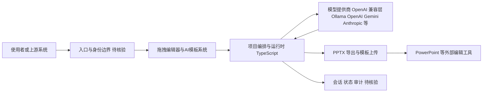

# presenton/presenton

## 一句话定位
开源 AI 演示文稿生成器和 API——支持从提示词或文档一键生成可编辑的 PPT，自带拖拽编辑器和模板系统，是 Gamma、Canva、Beautiful AI 等商业工具的开源替代。

## 它解决的问题
AI 演示文稿生成是一个强需求场景（商业提案、产品演示、教学课件），但现有方案几乎都是 SaaS 产品（Gamma、Beautiful AI、Decktopus），存在订阅费用、数据隐私、模板定制受限等问题。presenton 提供了完整的开源替代方案：支持完全自托管（Docker 部署），允许使用任意 AI 模型提供商（OpenAI、Gemini、Ollama 本地模型等），生成完全可编辑的 PPTX 文件而非锁定在平台内。

## 为什么值得关注（2026-05-25）
- 9,414 stars，1,470 forks——创建于 2025-05-10，一年内增长到近万 stars，增速稳定
- Apache 2.0 许可证，TypeScript 技术栈，支持 Docker / Windows / macOS / Linux 全平台
- 同时提供桌面应用和 Docker Web 版，满足个人和团队场景
- 支持丰富的模型提供商：Ollama、LM Studio、OpenAI、Gemini、Vertex AI、Azure OpenAI、Amazon Bedrock、Fireworks、Together AI、Anthropic 或任何 OpenAI 兼容 API
- 自带 AI 演示模板系统和完全可编辑的 PPTX 导出

## 热度来源判断
**真实需求 + 开源 AI 工具浪潮**。presenton 的热度来自两个驱动：(1) AI 演示生成是高频刚需——每个知识工作者都需要做 PPT，Gamma 等商业产品已验证了市场需求；(2) 开源 AI 工具浪潮——2025 年以来大量开发者倾向于自托管 AI 工具以保护数据隐私，presenton 完美契合这一趋势。Ollama 本地模型支持的加入进一步降低了使用门槛。9K stars 对于一个垂直场景工具来说是健康的增长曲线。

## 关键技术亮点亮点
1. **多模型提供商架构**：通过统一的 OpenAI 兼容接口层，支持从云端（OpenAI、Gemini、Anthropic）到本地（Ollama、LM Studio）的任意模型。用户可以"自带 API Key"或完全使用本地模型，这极大增强了灵活性。
2. **完全可编辑 PPTX 导出**：生成的演示文稿不仅可在线编辑，还能导出为完全可编辑的 PowerPoint 文件（.pptx），用户可以在 Microsoft PowerPoint 中继续编辑。这避免了平台锁定——一个常见的开源 AI 工具痛点。
3. **拖拽式幻灯片编辑器**：自带可视化编辑器，用户可以在 AI 生成后微调每一页的布局、文字和设计。这解决了纯 AI 生成缺乏精细控制的问题。
4. **AI 演示模板系统**：内置多种模板（商业报告、产品提案、教学课件等），用户也可以上传自己的 PowerPoint 设计作为模板，AI 会按照自定义设计生成内容。

## 架构师速览

| 决策问题 | 研究判断 | 证据边界 |
|---|---|---|
| 系统边界 | presenton 是 AI 演示文稿生成场景下的编排与运行时层，承上接使用者/上游请求，对下兼容多类模型提供商（OpenAI、Gemini、Anthropic、Vertex AI、Azure OpenAI、Amazon Bedrock、Fireworks、Together AI、Ollama、LM Studio 或任意 OpenAI 兼容 API），并通过 PPTX 导出与模板系统对接 PowerPoint。 | 仅基于项目档案列出的提供商清单与"模型无关架构"措辞，不涉及具体协议、SDK 版本、鉴权方式。 |
| 主路径 | 入口（桌面应用或 Docker Web）→ 自带拖拽编辑器与模板系统 → 通过统一 OpenAI 兼容接口调用所选模型 → 生成可在线编辑内容并导出为可编辑 PPTX。 | 主路径基于"提示词/文档 → 一键生成 → 可编辑 PPTX"的功能描述；未含会话状态、审计、缓存等持久化细节。 |
| 关键权衡 | 模型自由度与生成质量的权衡：本地小模型（Ollama 等）降低隐私与成本风险，但项目档案明确指出本地 7B 级模型质量可能远不如 GPT-4 级；模板/设计与商业产品（Gamma）存在美感差距，是开源项目自身天花板。 | 权衡结论来自档案中"模型质量依赖"与"模板和设计质量的天花板"两条风险说明；非性能基准实测。 |
| 最小 PoC | 单渠道入口（Docker Web）、最小模型配置（OpenAI 或 Ollama 单一提供方）、最小模板集合，验证生成—编辑—导出 PPTX 的端到端闭环，并预留切换提供方与切换至自托管模型的退出路径。 | PoC 范围由档案中"全平台 Docker/Windows/macOS/Linux""模型可切换""可编辑 PPTX 导出"三条事实推导；具体资源占用、并发、SLO 未在档案中给出。 |

## 架构启发
presenton 的架构选择反映了开源 AI 工具的最佳实践：(1) 模型无关——不绑定任何 AI 提供商，让用户自由选择；(2) 自托管优先——Docker 一键部署，数据完全在用户掌控中；(3) 开放格式——导出标准 PPTX 而非私有格式。这三个设计决策共同构成了对商业 SaaS 工具的有效竞争策略。桌面应用 + Docker Web 版的双形态部署也值得学习——满足个人（桌面）和团队（Web/Docker）两种场景。

## 架构图（MMD）

> 证据边界：此图只采用本档案已有可核验描述；“待核验”节点不应视为项目实现事实。

## 定位判断
presenton 定位为 **AI 演示生成的开源标杆**。在开源生态中，它可能是目前最完整的 AI PPT 生成方案（从生成到编辑到导出）。与 Gamma 等 SaaS 产品相比，它的差异化在于自托管、数据隐私和模型自由度。在 GitHub 趋势研究中，它代表的是"商业 AI 工具的开源化"这一更广泛的趋势。

## 风险 / 局限 / 泡沫点
1. **模板和设计质量的天花板**：演示文稿的核心价值很大程度上在于设计美感，开源项目的模板库和设计质量很难与 Gamma 等有专业设计团队的产品竞争。AI 生成的排版可能仍显"模板化"。
2. **维护者规模**：创建仅一年，核心团队规模和长期维护能力有待验证。如果团队精力不足，功能迭代可能放缓。
3. **模型质量依赖**：演示文稿质量高度依赖底层 LLM 的能力，本地小模型（如 Ollama 7B）的生成质量可能远不如 GPT-4 级别模型。

## 与同类项目的关系
- **Gamma (gamma.app)**：商业 AI 演示工具，presenton 的直接对标产品。Gamma 在设计美感和流畅度上领先，但不开源、不支持自托管。
- **slidev (slidevjs/slidev)**：面向开发者的 Markdown 演示工具（约 38K stars），侧重于代码演示和技术分享，不做 AI 生成。与 presenton 的场景不同。
- **reveal.js**：经典的 HTML 演示框架，纯手动编写，无 AI 能力。

## 是否值得持续跟踪
**值得跟踪，作为"开源 AI 办公工具"赛道的代表项目**。如果关注 AI 如何改变办公文档生产方式，presenton 是一个优秀的观察样本。特别是其"模型无关 + 自托管"的架构策略，可能成为开源 AI 工具的标准范式。

## 后续观察点
1. **模板生态的发展**：是否会有社区贡献的高质量模板库出现，以及是否有第三方设计师参与设计
2. **企业采用案例**：是否有企业级团队在内部部署 presenton 替代商业工具的公开案例
3. **协作功能的加入**：是否会增加多人协作编辑能力（类似 Google Slides），这将极大扩展其适用场景

---
*首次记录：2026-05-25*
