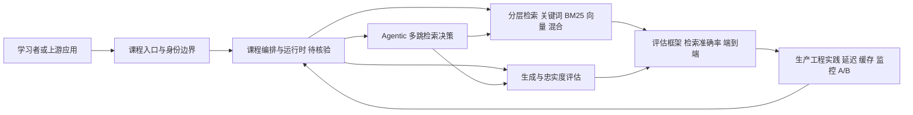

# jamwithai/production-agentic-rag-course

## 一句话定位
面向生产环境的 Agentic RAG（基于智能体的检索增强生成）实战课程，系统教授如何构建可投产的 RAG 系统。

## 它解决的问题
大量开发者通过教程学会了基础 RAG（文档 → 向量 → LLM 生成），但在生产环境中遇到评估困难、延迟过高、检索不准确、Agent 工作流复杂等实际问题。现有教程多为 Demo 级别，缺少生产级最佳实践。本课程面向需要将 RAG 系统推向生产的 ML 工程师和 AI 应用开发者，提供了从架构设计到评估优化的完整实战指南。

## 为什么值得关注
- **Stars:** 8,278 stars，在 AI 课程类仓库中属于高质量内容
- **实战导向:** 不是理论讲解，而是面向真实生产场景的工程实践
- **Agentic RAG 前沿:** 覆盖了从基础 RAG 到 Agentic RAG 的演进——这是 RAG 技术的最新方向
- **MIT 开源:** 课程内容完全开放，可自由使用和修改

## 热度来源判断
热度来自 RAG 技术在生产环境中的大规模部署需求——几乎所有企业 AI 应用都需要 RAG，但从 Demo 到生产的鸿沟巨大。这门课程恰好填补了这个知识缺口。8K stars 是合理水平——AI 教育内容在 GitHub 上有稳定的关注度，特别是来自有实践经验的讲师。

## 关键技术亮点亮点
1. **分层 RAG 架构:** 从简单的关键词检索到混合检索（向量+BM25），再到 Agentic 多跳检索的渐进式架构
2. **评估框架:** 系统介绍 RAG 系统的评估方法论——包括检索准确率、生成忠实度、端到端评估的自动化工具
3. **Agentic RAG 模式:** 讲解如何让 LLM Agent 自主决定何时检索、检索什么、如何综合多轮检索结果
4. **生产工程实践:** 覆盖延迟优化、缓存策略、A/B 测试、监控告警等生产环境必备技能
5. **端到端 Notebook:** 使用 Jupyter Notebook 提供可运行的完整代码示例

## 架构师速览

| 决策问题 | 研究判断 | 证据边界 |
|---|---|---|
| 系统边界 | 课程定位为生产级 Agentic RAG 教学仓库，覆盖分层检索（关键词→混合检索→Agentic 多跳）、评估框架、缓存/监控/A/B 等生产工程实践；不替代具体运行时实现 | 基于档案"分层 RAG 架构"与"生产工程实践"陈述；具体框架绑定（LangChain/LlamaIndex）未在档案中指明，须核验 |
| 主路径 | 线索性问题 → 检索质量评估 → 生成忠实度/端到端评估 → 延迟与成本优化回路；Agent 自主决定检索时机与策略 | 基于档案"评估框架"与"Agentic RAG 模式"描述；检索/生成比例与控制流细节未在档案中给出 |
| 关键权衡 | 检索召回质量与系统延迟/成本之间的平衡；Agent 自主性与可观测性、可审计性之间的张力 | 档案明确列出"延迟优化、缓存策略、监控告警"为生产必备技能，并指出"工具迁移成本高"风险 |
| 最小 PoC | 复制仓库，以单一 Notebook 为入口跑通最小检索–生成链路，接入可审计日志与基础评估指标，再扩展到混合检索与 Agent 多跳 | 档案指明"端到端 Notebook"提供可运行代码；但未给出具体 Notebook 列表、依赖版本或硬件要求 |

## 架构启发
课程的核心思想是「RAG 不是一个函数调用，而是一个系统」——生产级 RAG 需要考虑检索质量评估、生成质量保障、性能优化、成本控制等多个维度。Agentic RAG 的关键洞察是：将检索决策交给 Agent，让 Agent 根据问题复杂度动态调整检索策略，而非使用固定的检索-生成管道。

## 架构图（MMD）

> 证据边界：此图只采用本档案已有可核验描述；“待核验”节点不应视为项目实现事实。

## 定位判断
属于 AI 应用开发教育生态的优质内容。在 RAG 教育领域，与 LangChain Academy、LlamaIndex 文档形成互补——本课程更偏实战和生产工程。

## 风险 / 局限 / 泡沫点
1. **技术快速迭代:** RAG 和 Agent 技术发展极快，课程内容可能在 6-12 个月内部分过时
2. **依赖特定工具链:** 课程示例可能深度绑定特定框架（如 LangChain/LlamaIndex），工具迁移成本高
3. **缺少认证体系:** 作为 GitHub 课程没有正式认证，在简历中的权重不如官方认证
4. **维护可持续性:** 课程仓库需要持续更新以跟进行业发展，个人维护者的投入持续性存疑

## 与同类项目的关系
- **LangChain Academy:** 官方教育平台，覆盖面更广但偏理论
- **LlamaIndex 文档/教程:** 偏框架使用，本课程更偏生产实践
- **DeepLearning.AI 短课程:** 视频课程形式，交互性更强但深度可能不够

## 是否值得持续跟踪
**值得跟踪。** Agentic RAG 是 AI 应用开发的核心技术，生产级最佳实践极其稀缺。该课程的更新频率和内容质量直接反映了 RAG 工程化的前沿实践。

## 后续观察点
- 关注课程是否增加多模态 RAG（图像、视频检索）的内容
- 观察是否引入最新的 Agent 框架（如 LangGraph 的高级模式）
- 跟踪是否有企业级 RAG 部署案例分享

---
> 数据来源: GitHub API (gh cli) | 更新: 2026-08-07 | Stars: 8,278 | Language: Python | License: MIT | Forks: 1,849
