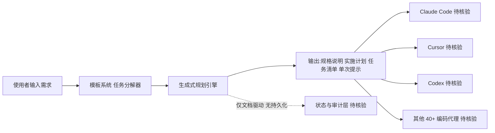

# project-architect

## 一句话定位
文档优先的项目规划代理技能，能生成项目规格说明、实施计划、任务清单和单次提示，兼容 Claude Code、Cursor、Codex 等 40+ 编码代理。

## 它解决的问题
项目启动阶段的规划工作耗时费力：规格说明需要从需求中提炼、实施计划需要分解任务、不同编码代理工具间的协作格式不统一。开发者缺乏一个统一的、文档驱动的项目规划工具来快速完成这些工作。project-architect 专门用于项目启动阶段，通过 AI 驱动的规划生成来解决这一痛点。

## 为什么值得关注
- **需求精准**：填补项目规划 AI 工具空白
- **生态丰富**：支持 40+ 编码代理兼容
- **效率提升**：极大提升项目启动效率
- **易用性强**：单次提示即可完成完整规划
- **文档优先设计**：基于文档的项目规划方法，输出规格说明+实施计划+任务清单
- **MIT License 开源**

## 热度来源判断
- AI 辅助项目管理是长期发展趋势
- 项目规划智能化填补了 Coding Agent 工具链的空白
- 40+ 编码代理兼容降低了 adoption 门槛
- 文档驱动方法与 AGENTS.md 等标准趋势一致

## 关键技术亮点亮点
1. **文档优先设计**：基于文档的项目规划方法，输出结构化的规格说明
2. **多代理兼容**：通过兼容适配器支持 Claude Code、Cursor、Codex 等 40+ 工具
3. **生成式规划**：AI 驱动的项目规划生成，从需求到任务清单的完整闭环
4. **任务分解器**：将项目分解为可执行的细粒度任务
5. **模板系统**：项目规划模板库，支持快速启动

## 架构师速览

| 决策问题 | 研究判断 | 证据边界 |
|---|---|---|
| 系统边界 | 作为文档驱动的代理技能（Markdown 形态），介于需求输入与下游 40+ 编码代理之间，承担规格说明/实施计划/任务清单/单次提示的生成与转译 | 边界仅依据"agent-skill、documentation、specification、project-planning"标签与"兼容 Claude Code、Cursor、Codex 等 40+ 编码代理"描述，未描述运行容器、模型供应商、工具调用协议 |
| 主路径 | 用户需求 → 模板系统/任务分解器 → 规格说明 + 实施计划 + 任务清单 → 输出给目标编码代理执行 | 组件名称（文档优先、模板系统、任务分解器、生成式规划）来自档案"关键技术亮点"；持久化、状态回写、模型调用细节档案未披露 |
| 关键权衡 | 跨 40+ 代理的覆盖面与各代理私有格式/权限模型之间的兼容深度，后者决定真实可用性而非声称数量 | 均为档案陈述，未列出具体兼容适配器、协议层或权限边界；"40+"为档案原话，单独渠道的字段映射未核验 |
| 最小 PoC | 选取 1 个目标编码代理（如 Claude Code 或 Cursor），用单次提示输入一组固定需求，验证 spec/plan/tasklist/提示四件套可被下游代理直接消费，并比对结果一致性 | 缺乏示例产物、模板库清单、token/成本数据，无法预设 SLO 或退出路径 |

## 架构启发
1. **文档驱动架构**：文档作为项目规划的单一事实来源
2. **跨代理协作机制**：不同 Coding Agent 工具间的兼容适配层设计
3. **规划-开发一体化**：从规划到开发的无缝衔接，规划产物直接被 Coding Agent 消费

## 架构图（MMD）

> 证据边界：此图只采用本档案已有可核验描述；“待核验”节点不应视为项目实现事实。

## 定位判断
**工具型** — 作为实用的项目规划工具，提升项目启动效率。无特定编程语言，基于代理技术和 Markdown 文档。

## 风险/局限/泡沫点
1. **质量依赖**：规划质量依赖提示工程，复杂项目支持有限
2. **领域知识**：需要大量领域知识支撑，垂直领域适配成本高
3. **标准化**：规划标准可能不够完善，不同团队需求差异大
4. **规模限制**：大型项目支持有限，高度个性化需求支持有限
5. **动态调整**：项目变更时的动态调整能力有限

## 与同类项目的关系
| 项目 | 定位 | 关系 |
|------|------|------|
| Jira/Trello | 传统项目管理工具 | 不同：AI 驱动 vs 人工驱动 |
| GitHub Copilot/Cursor | AI 编码工具 | 互补：规划阶段 vs 编码阶段 |
| OpenWiki | Agent 文档自动生成 | 互补：文档维护 vs 项目规划 |

## 是否值得持续跟踪
**是** — AI 辅助项目管理工具是重要的软件开发演进方向，文档驱动方法值得关注。

## 后续观察点
- 支持代理工具的数量增长与兼容质量
- 企业级项目管理场景的采纳情况
- 是否从工具演进为项目管理平台
- 与 OpenWiki 等文档工具的集成可能性
