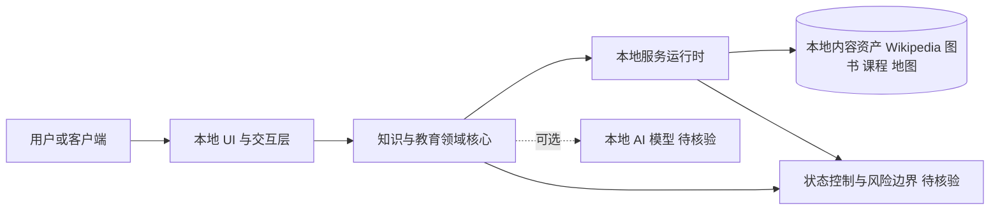

# Crosstalk-Solutions/project-nomad — Project NOMAD is an offline-first knowledge and education server. Wikipedia, tho

## 一句话定位

Project NOMAD is an offline-first knowledge and education server. Wikipedia, thousands of books, courses, maps, and optional local AI, all running on hardware you own with no internet required.。主要使用 TypeScript 编写，当前 35,695 stars / 3,578 forks / 205 subscribers。

## 它解决的问题

**目标用户**：使用 typescript 生态的开发者、工程师。

**痛点**：该项目解决的核心问题是 Project NOMAD is an offline-first knowledge and education server. Wikipedia, thousands of books, courses, maps, and optional local AI, all running on hardware you own with no internet required.。从 README 来看，项目提供了 
  # Project NOMAD ### Knowledge That Never Goes Offline **
6. **[](https://discord.com/invit**

## 架构师速览

| 决策问题 | 研究判断 | 证据边界 |
|---|---|---|
| 系统边界 | 项目定位为离线优先的本地知识与教育服务器，承载 Wikipedia、图书、课程、地图、可选本地 AI 等内容，运行在用户自有硬件上；用户/客户端、UI、领域核心、服务运行时与本地内容/数据依赖构成应用边界。 | 档案明确为"offline-first knowledge and education server"及内容集合，但具体进程模型、端口、存储引擎未在档案中披露，需源码核验。 |
| 主路径 | 客户端 → 本地 UI 与状态层 → 领域核心（知识/教育服务）→ 本地服务/运行时 → 本地数据资产（Wikipedia 快照、图书、课程、地图、可选本地 AI）。 | 主路径由档案"用户自有硬件、无需联网"与内容清单推断；协议、同步机制、AI 模型接入方式未证实。 |
| 关键权衡 | 完全离线可用 vs 内容规模/新鲜度；本地硬件承载 vs 资源占用；可选本地 AI vs 离线一致性；开箱即用 vs 可扩展性。 | 权衡判断来自档案描述的功能集合与"可选 local AI"措辞；性能、容量与硬件门槛未给出数据。 |
| 最小 PoC | 在一台标准 x86 笔记本或迷你主机上，下载镜像后冷启动服务，验证 Wikipedia 检索、图书/课程离线阅读、地图渲染三条用户路径，并测试断网下的功能完整性与可选本地 AI 的启用/关闭。 | 档案未提供官方硬件要求、镜像大小或 AI 模型规格；具体验收指标"待核验"。 |

## 架构启发

从 Crosstalk-Solutions/project-nomad 的设计来看，核心思路是 **"Project NOMAD is an offline-first knowledge and education se"**。这反映了 TypeScript 生态中 开发者工具 的演进方向——降低集成复杂度、提供开箱即用的能力。开源 License (Apache-2.0) 降低了采用门槛。

## 架构图（MMD）

> 证据边界：此图只采用本档案已有可核验描述；“待核验”节点不应视为项目实现事实。

## 定位判断

**工具型**。在生态中定位为Project NOMAD is an offline-first knowle方向的工具。Stars 35695 说明已有一定社区基础。

## 风险 / 局限 / 泡沫点

1. **规模风险**：35,695 stars，但 fork 3578 说明有实际部署
2. **维护风险**：最后 push 时间 2026-08-11，活跃维护中
3. **Open Issues**：64 个 open issues，活跃社区反馈
4. **License**：Apache-2.0（宽松许可，适合商用）

## 与同类项目的关系

- 与同 TypeScript 生态的同类工具形成竞争/互补关系。具体竞品对比需参考社区讨论。
- 从 topics () 来看，与关注 该领域 的其他项目有交叉。

## 是否值得持续跟踪

**是。** 35695 stars + 活跃更新说明项目有持续价值。建议关注后续版本迭代和社区增长。

## 后续观察点

1. Star 增速是否可持续（当前 35,695）
2. Fork 增长趋势（当前 3,578）
3. 功能迭代频率（最后更新 2026-08-11）
4. 社区活跃度（subscribers 205, open issues 64）

---
> 数据来源: GitHub API (2026-08-11) | Stars: 35,695 | Forks: 3,578 | License: Apache-2.0 | 语言: TypeScript | 创建: 2025-06-24
