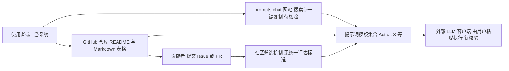

# f/prompts.chat

## 一句话定位
ChatGPT 提示词大全（Awesome ChatGPT Prompts），社区共建的提示词集合，覆盖写作、编程、营销、教育等数十种场景，是 Prompt Engineering 领域最早也是最知名的 awesome-list。

## 它解决的问题
ChatGPT 发布初期，大多数用户不知道如何有效使用——"怎么问"比"问什么"更关键。prompts.chat 提供了大量经过验证的提示词模板，用户可以直接复制使用或作为灵感来源。它降低了 LLM 的使用门槛，让非技术用户也能快速获得高质量的 AI 输出。

## 为什么值得关注
- **Stars:** 166,843 stars，Prompt Engineering 领域 Star 数第一
- **历史意义:** 2022 年 12 月创建，是第一个系统化的 ChatGPT 提示词集合，推动了 Prompt Engineering 概念普及
- **社区驱动:** 100+ 贡献者提交提示词，覆盖角色扮演、内容创作、编程辅助、翻译、教学等场景
- **配套网站:** prompts.chat 网站提供搜索和一键复制功能
- **多语言:** 提示词已被翻译为多种语言版本

## 热度来源判断
prompts.chat 的热度是 ChatGPT 爆发效应的直接产物。2022 年底 ChatGPT 用户从 0 增长到 1 亿仅用 2 个月，这批新用户急需"使用指南"，prompts.chat 在最恰当的时机提供了最需要的内容。Star 数的增长与 ChatGPT 的用户增长曲线高度一致。随着用户逐渐学会自己写 Prompt，以及 Agent 时代的到来（Agent 自动写 Prompt），这类项目的增量热度在递减，但存量 Star 数依然庞大。

## 关键技术亮点亮点
- **角色设定模式:** 大量提示词采用"Act as X"模式，通过角色设定引导 LLM 进入特定语境
- **模板化设计:** 每个提示词是一个可复用的模板，用户替换变量即可使用
- **Markdown 结构:** 提示词以 Markdown 表格组织，便于浏览、搜索和贡献
- **社区筛选机制:** 通过 GitHub Issues 和 PR 进行提示词的提交、讨论和合并

## 架构师速览

| 决策问题 | 研究判断 | 证据边界 |
|---|---|---|
| 系统边界 | 本项目是 GitHub 上的 Markdown 提示词集合，无独立运行时；以 README/awesome-list 形式承载内容，配套网站 prompts.chat 提供浏览与复制入口 | 档案仅描述其作为"知识库项目"和 Markdown 表格组织结构，未证实自有 API、数据库或后端服务 |
| 主路径 | 访问者 → 仓库 Markdown / 网站搜索 → 浏览提示词条目 → 复制粘贴至外部 LLM 客户端使用；贡献者 → GitHub Issue/PR → 社区筛选 → 合并入库 | 流程基于"awesome-list + 配套网站 + PR 流程"的档案描述，具体网站实现与评审规则未核验 |
| 关键权衡 | 作为静态资源型知识库，权衡集中在"内容广度 vs 提示词质量/时效性"与"社区贡献低门槛 vs 缺乏统一评估标准"之间；非传统系统级架构权衡 | 档案明确提到质量参差、面向 GPT-3.5 时代优化、维护更新滞后，但无性能/扩展性数据 |
| 最小 PoC | 无需 PoC 即可采用——直接 fork 仓库或访问 prompts.chat 即可消费提示词；唯一验证动作是抽样若干"Act as X"条目在目标 LLM 上回归输出质量 | 档案定位为"知识资源型项目"，未提供任何部署、集成或测试脚本可作 PoC 依据 |

## 架构启发
prompts.chat 本质上是一个"知识库"项目，其架构启发在于"众包 + 版本控制"的知识管理范式——用 Git 管理 Prompt 内容，用 PR 流程保证质量，用 Issues 讨论改进。这种模式适用于任何"社区共建知识库"场景。其"Act as X"模式也成为 Prompt Engineering 的基础范式之一。

## 架构图（MMD）

> 证据边界：此图只采用本档案已有可核验描述；“待核验”节点不应视为项目实现事实。

## 定位判断
**知识资源型项目。** prompts.chat 不是工具或平台，而是 Prompt 知识的集合。它的价值在于：(1) 作为 Prompt Engineering 的入门教材；(2) 作为 AI 时代的"写作模板库"。随着 AI 能力增强（用户不需要精心设计 Prompt），这类项目的增量价值在下降，但作为历史文档和教育资源仍有意义。

## 风险 / 局限 / 泡沫点
- **时效性风险:** 提示词针对 GPT-3.5 时代优化，在 GPT-4 / Claude 时代可能不是最优
- **Agent 时代挑战:** AI Agent 可以自主生成和优化 Prompt，人工编写 Prompt 的需求减少
- **内容陈旧:** 部分提示词已过时，但维护更新速度跟不上
- **质量参差不齐:** 社区提交的提示词质量差异大，缺乏统一评估标准

## 与同类项目的关系
- **vs Prompt Engineering 指南 (DAIR.AI):** 更学术化、系统性，prompts.chat 更实用导向
- **vs OpenAI Cookbook:** OpenAI 官方示例更技术化（API 调用），prompts.chat 更面向终端用户
- **vs Learn Prompting:** Learn Prompting 是完整课程，prompts.chat 是参考列表
- **vs Agent 时代的 Skill 库:** Skill 库（如 Claude Skills）是"Prompt + 工具"的组合，比纯 Prompt 更强大

## 是否值得持续跟踪
**低优先级。** prompts.chat 作为 Prompt Engineering 的先驱已完成其历史使命。当前增量价值有限。值得关注的是：是否演进为更动态的 Prompt 平台（如支持版本化、A/B 测试、效果评分），或被 Agent / Skill 体系取代。

## 后续观察点
- 是否针对 GPT-4 / Claude / DeepSeek 等新模型优化提示词
- 是否引入提示词效果评分 / 社区投票机制
- 是否向 "Skill" 范式演进（Prompt + 工具 + 验证）
- AI 自动生成 Prompt 对这类手动集合的冲击程度

---
> 数据来源: GitHub API (2026-08-07) | 首次发现: 2026-07-28
