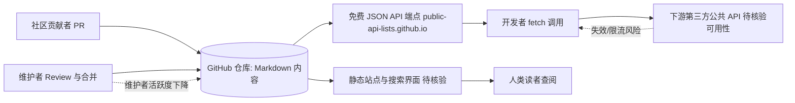

# public-api-lists/public-api-lists

## 一句话定位
一个社区维护的免费公共 API 精选列表，提供可搜索的 Web 界面和免费的 JSON API，是开发者寻找测试/学习用 API 的首选资源库。

## 它解决的问题
开发者在学习编程、做 Side Project、参加 Hackathon 或构建原型时，经常需要各种类型的 API 来获取数据（天气、金融、地理、电影、游戏等）。但找到好用、免费、稳定的公共 API 并不容易——需要逐一搜索、验证可用性、查看文档。public-api-lists 将数百个免费公共 API 按类别整理，并提供可搜索的 Web 界面和机器可读的 JSON API，大大降低了"找 API"的时间成本。

## 为什么值得关注（2026-07-08）
- 15,331 stars，创建于 2020 年，是 public-apis/public-apis（GitHub 上最知名的 API 列表项目，约 330K+ stars）的分叉/继任项目
- MIT 许可证，纯 Markdown 内容项目，社区驱动维护
- 提供免费 JSON API（https://public-api-lists.github.io/public-api-lists/），可直接在代码中调用
- topics 中标记 `hacktoberfest`、`beginner-friendly`，是新手友好的开源贡献入口

## 热度来源判断
**实用刚需 + 替代品效应**。public-api-lists 的热度来自三个因素：(1) 开发者对公共 API 的持续需求——这是学习和原型开发的刚需；(2) 它是 public-apis/public-apis 的社区分叉版本，后者因维护停滞和审核积压（数千个 PR 未处理）导致社区寻求替代品；(3) JSON API 的差异化——不仅仅是一个静态 Markdown 文件，还提供了可编程查询的 API 端点。但需注意，列表型项目的 stars 往往高于其"技术价值"——因为用户 star 更多是作为"书签"而非代码使用。

## 关键技术亮点亮点
1. **社区维护机制**：采用 GitHub 原生的 PR + Review 流程，任何开发者都可以提交新 API。标记 `hacktoberfest` 和 `beginner-friendly` 吸引新贡献者，形成持续更新的良性循环。
2. **免费 JSON API 端点**：除了人类可读的 Markdown 和 Web 界面，还提供机器可读的 JSON API，开发者可以直接在代码中 `fetch` 获取 API 列表数据。这是相比原版 public-apis 的核心差异化。
3. **结构化分类系统**：API 按类别（Animals、Anime、Anti-Malware、Art & Design、Books 等）和子类别组织，支持按 Auth 方式（apiKey、OAuth、无认证）、HTTPS 支持、CORS 支持等维度筛选。

## 架构师速览

| 决策问题 | 研究判断 | 证据边界 |
|---|---|---|
| 系统边界 | 纯 Markdown 策展型项目，无运行时；边界 = GitHub 仓库（Markdown 内容 + PR 流程）+ 静态 Web/JSON 端点。 | 基于 language:Markdown、tags、JSON 端点 URL；未审计仓库内部目录。 |
| 主路径 | 贡献者 PR → 维护者 Review → 合并入 Markdown 列表 → 静态站点构建 → Web/JSON API 端点对外提供。 | 档案描述"社区维护机制（PR+Review）"与"免费 JSON API 端点"；具体构建工具/CI 未证。 |
| 关键权衡 | 策展广度与时效性/质量之间的平衡；低审核门槛（beginner-friendly）有助于更新速度但牺牲单条质量与时效校验。 | 档案明示"信息时效性风险""API 质量参差不齐""维护者依赖"；具体审核 SLA 未给。 |
| 最小 PoC | 拉取仓库 + 抓取 JSON 端点，按类别/Auth/HTTPS/CORS 维度过滤，校验若干 API 可用性并记录失效条目。 | 基于档案"结构化分类系统"与 JSON 端点 URL；性能/速率限制未披露。 |

## 架构启发
public-api-lists 是"策展型开源项目"（curation-driven open source）的典型案例。它的核心价值不是代码，而是经过人工验证的信息。这类项目的关键挑战是：如何保持信息的新鲜度（API 可能下线、变更认证方式、限制速率）和如何处理大量社区贡献请求。public-api-lists 的策略是保持较低的审核门槛（标记 beginner-friendly）+ 活跃的维护者，与原版 public-apis 的审核积压形成对比。

## 架构图（MMD）

> 证据边界：此图只采用本档案已有可核验描述；“待核验”节点不应视为项目实现事实。

## 定位判断
在开发者资源生态中，public-api-lists 定位为**参考型工具资源**——不是被"运行"的项目，而是被"查阅"的资源。它的竞品是各种 awesome-list 和 API 目录网站。15K stars 中绝大多数是"书签式 star"——用户 star 它以便日后查找，而非 fork 或 clone 使用。

## 风险 / 局限 / 泡沫点
1. **信息时效性风险**：列表中的 API 可能随时下线、变更认证方式或开始收费。纯人工维护的列表无法保证 100% 的时效性，使用者仍需逐一验证。
2. **维护者依赖**：虽然有社区贡献，但核心审核依赖少数维护者。如果维护者活跃度下降，项目可能重蹈 public-apis 的覆辙（PR 积压）。
3. **Stars ≠ 技术价值**：作为纯内容项目，15K stars 不能与 yq、kubeflow 等代码项目直接比较。列表项目的"技术含量"在于策展质量而非代码复杂度。
4. **API 质量参差不齐**：列表收录标准相对宽松，部分 API 可能稳定性差、文档不全或有隐藏限制。

## 与同类项目的关系
- **public-apis/public-apis**：最知名的公共 API 列表（330K+ stars），但长期审核积压。public-api-lists 是其社区分叉版本，试图通过更活跃的维护来弥补原版的不足。
- **rapidapi.com**：商业 API 市场平台，提供更丰富的 API 发现和管理工具，但以付费为主。public-api-lists 聚焦免费 API。
- **n0shake/Public-APIs**：另一个 API 列表项目，规模较小，定位类似。

## 是否值得持续跟踪
**作为开发者资源定期查阅，但不需要密切跟踪**。列表型项目的变化频率低，且其价值在于"查阅时有用"而非"跟踪演进"。建议每季度检查一次是否有新增的高质量 API 分类。如果研究重点是 API 生态趋势，可以关注列表中 API 类别的变化（如 AI API 的增长）。

## 后续观察点
1. **AI/LLM API 类别的增长**：列表中 AI 相关 API（OpenAI、Anthropic、HuggingFace 等）的数量和占比变化，反映 AI API 普及趋势
2. **维护健康度**：PR 积压数量、平均合并时间、活跃贡献者数量，评估项目的长期可持续性
3. **是否推出更丰富的发现功能**：如 API 质量评分、使用统计、实时可用性检测等增值功能

---
*首次记录：2026-07-08*
