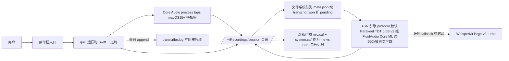

# quill — 极简全本地 macOS 会议录音+转录

## 一句话定位
单 Swift 二进制的 macOS 菜单栏会议录音+转录工具，麦克风+系统音频双轨录制，Parakeet TDT 0.6B 本地转录，数据完全不离机。

## 它解决的问题
会议录音转录工具大多依赖云端（Otter.ai、Google 等），隐私敏感场景（商业机密、个人对话）无法使用。quill 提供全本地替代方案——录音、转录、输出全部在 Mac 上完成，"nothing ever leaves the machine"。

## 为什么值得关注（2026-08-01）

在本周"边缘推理"趋势中，quill 代表了端侧 ASR 的实用产品形态。与 esp32-ai（极端架构验证）不同，quill 是**可立即使用的工具**——用 Parakeet TDT 0.6B v2 经 Core ML 在 Apple Silicon 上做端侧转录（约 20s/小时音频），双轨录制（麦克风 vs 系统音频）实现免费的两方话者分离。它把"本地推理范式"落到了一个高频真实场景（会议记录）。

## 热度来源判断
- **真实需求信号**：8 天 3.2K⭐，fork 193。隐私优先的本地转录是明确痛点（尤其在企业/法律/医疗场景），quill 填补了"比 Otter 更隐私、比 Whisper CLI 更易用"的中间地带。
- **工程品质是加分项**：README 细致（CAF 格式选择理由、双轨设计理由、queue/offset/merge 机制），说明作者有真实使用场景驱动。
- **话题性成分**：local-first AI 是持续热点，quill 受益但不依赖——它的价值在实用工具属性。

## 关键技术亮点亮点

1. **双轨录制 = 免费话者分离**：麦克风和系统音频分别录为两个 track（`mic.caf` + `system.caf`），speech models 在干净单源音频上表现更好，且 mic-vs-system 天然实现 `me` vs `them` 的两方话者分离，无需 speaker-ID 模型。
2. **CAF 格式的容错设计**：刻意选 CAF 而非 m4a，因为 CAF 不需要 finalization pass——"if the process dies mid-meeting, everything already written is still readable"。这对长会议场景（进程可能崩溃）是关键设计。
3. **文件系统即队列**：每个 session 一个目录（`~/Recordings/<yyyy.MM.dd-HHmm>/`），含 `meta.json`（时间戳/偏移）但无 `transcript.json` 的 session 即为 pending。未完成的转录任务在下次启动时自动恢复。失败只 append 到 `transcribe.log`，不阻塞后续任务。
4. **端侧转录 + 引擎协议化**：默认 Parakeet TDT 0.6B v2（经 FluidAudio 的 Core ML 移植），模型约 600MB 首次下载；WhisperKit large-v3-turbo 作为计划中的 fallback。引擎在 protocol 后面，可替换。

## 架构师速览

| 决策问题 | 研究判断 | 证据边界 |
|---|---|---|
| 系统边界 | 单 Swift 二进制 macOS 菜单栏应用；入口仅菜单栏，无 GUI/无服务；依赖 macOS 15+ Core Audio process taps 取系统音频；ASR 通过 protocol 抽象，默认 Parakeet TDT 0.6B v2 经 FluidAudio Core ML 移植，约 600MB 首次下载，WhisperKit 列为计划中 fallback | 模型规模、WhisperKit 集成进度、macOS 版本下界均需源码核验 |
| 主路径 | 启动 → 菜单栏触发 → 双轨录制（mic.caf + system.caf）写入 `~/Recordings/<yyyy.MM.dd-HHmm>/` 并落 `meta.json` → Core ML 引擎（默认 Parakeet TDT）转录 → 产物回写 transcript.json；缺 transcript.json 的 session 在下次启动自动恢复，失败 append 到 transcribe.log 不阻塞队列 | "queue/offset/merge 机制"在 README 中仅是名词提及，具体调度未证 |
| 关键权衡 | 隐私 vs 协作/搜索/跨设备（纯本地 = 数据只在本机文件）；CAF vs m4a（用容错换取可分发性）；双轨天然二分离 vs 真实多人 speaker diarization；0.6B 英文模型速度 vs 多语种/口音/术语准确率；小团队 bus factor 与模型迭代速度 | 多说话人 >2 场景的实际表现、Intel Mac 体验阈值未评测 |
| 最小 PoC | 一台 macOS 15+ Apple Silicon 机；下载 600MB Core ML 模型；菜单栏建一次会议录 30–60 分钟双轨；检查目录产物、transcribe.log、中断后重启是否续跑、英文转录可用率；把 verdict 框在"单用户隐私会议"用例，团队协作明确排除 | 评估局限于个人单语种环境，多人/多语/长会议需扩样本 |

## 架构启发
quill 的设计哲学是"filesystem is the interface"——录音、元数据、转录结果、日志都是普通文件，没有数据库、没有后台服务、没有 GUI 窗口（只有菜单栏图标）。这与本周 vercel/eve 的"filesystem-first agent 框架"异曲同工：**把状态和接口简化为文件系统操作，降低复杂度和故障面**。CAF 的"无需 finalization"选择体现了对失败场景的工程敬畏。

## 架构图（MMD）

> 证据边界：此图只采用本档案已有可核验描述；“待核验”节点不应视为项目实现事实。

## 定位判断
在边缘推理范式家族中，quill 是**已可交付的端侧工具**——介于 esp32-ai（纯架构验证）和 colibri（高性能引擎）之间。它不是基础设施，而是直接面向终端用户的实用工具。归类为"工具型"。

## 风险 / 局限 / 泡沫点

1. **macOS 15+ 限定**：依赖 Core Audio process taps 做系统音频录制（无虚拟设备/无内核扩展），macOS 15 以下不可用。Apple Silicon recommended for transcription speed（Intel Mac 体验会差）。
2. **小团队**：2 contributors，单 Swift 二进制，bus factor 低。sibling 项目 parrot（同 skeleton）暗示作者是个人/小团队持续维护多个工具。
3. **模型能力边界**：Parakeet TDT 0.6B 是英文模型，非英语会议需等 Whisper fallback；0.6B 参数量在嘈杂/口音/专业术语场景的准确率未经大规模评测。
4. **纯本地 = 无协作**：转录结果在本地文件，团队共享/搜索/标注需要额外工具。这对个人用户够用，但团队场景需要配合其他系统。

## 与同类项目的关系

- **vs Whisper（OpenAI）**：Whisper 是通用 ASR 模型/库，quill 是基于端侧 ASR（Parakeet/计划支持 Whisper）的完整会议工具。quill 的价值在"双轨录制 + 文件系统队列 + 菜单栏 UX"的工程整合，而非模型本身。
- **vs Otter.ai / 云端转录**：核心差异是隐私——quill 全本地，云端方案数据出机器。quill 牺牲了云端的协作/搜索/跨设备能力。
- **vs esp32-ai**：同为"边缘推理范式家族"，但 quill 是可用的产品（端侧 ASR），esp32-ai 是架构验证（微控制器 LLM）。

## 是否值得持续跟踪
**是，作为"本地优先 AI 实用工具"的范本。** 关注其引擎协议化设计是否吸引更多 ASR 模型接入，以及 macOS 系统能力（Core Audio taps）的演进。

## 后续观察点
1. **Whisper fallback 的落地**：多语言支持是扩大用户群的关键，观察 WhisperKit 集成的完成度和性能。
2. **社区是否扩展到团队场景**：有人基于 quill 的文件格式（transcript.json）构建共享/搜索/标注层吗？
3. **fork 方向**：是否有人把 quill 的双轨+文件队列设计移植到 Linux/Windows（当前 Swift+Core Audio 是 macOS 限定）。

---
*首次记录：2026-08-01*
