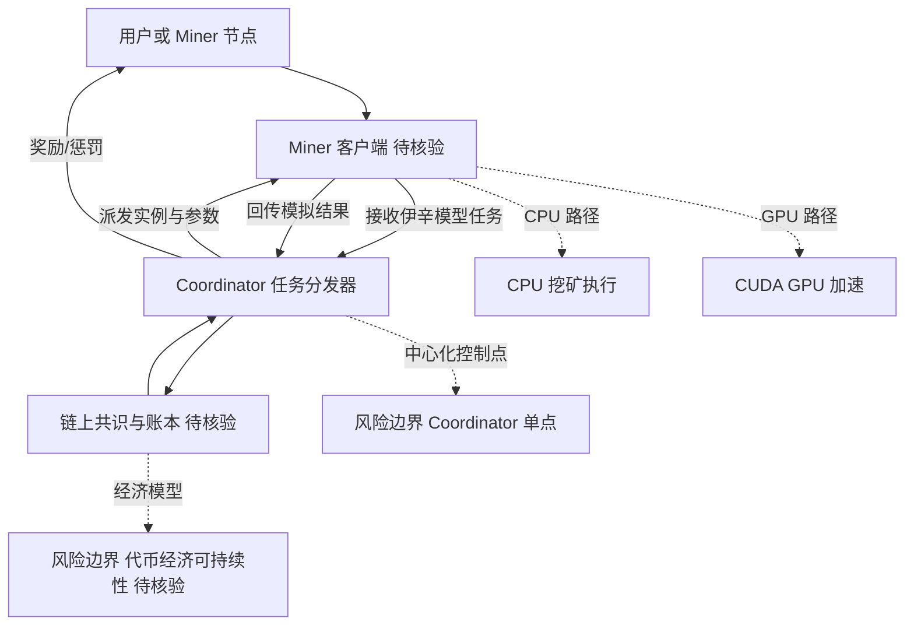

# QuipNetwork/quip-miner

## 一句话定位
Quip 网络的官方挖矿协议栈，基于伊辛模型（Ising Model）的量子退火仿真进行"有用工作量证明"挖矿——将算力用于量子模拟而非无意义的哈希碰撞。

## 它解决的问题
传统加密货币（比特币）的挖矿本质是"浪费电力的 SHA-256 哈希竞赛"，被广泛批评为能源浪费和环境破坏。Quip Network 试图将挖矿算力引导到**有科学价值的计算**上：通过分布式网络模拟量子伊辛模型的退火过程，这些计算可用于材料科学、药物发现、组合优化等真实问题。挖矿不再是"无意义工作"，而是"分布式科学计算"。

## 为什么值得关注
- **Stars:** 11,602（截至 2026-08-07），增长快速
- **Forks:** 160，核心协议控制较紧
- **License:** AGPL-3.0（强 copyleft，强制开源衍生）
- **活跃度:** pushed_at 2026-08-07（当日更新），极度活跃
- **创建时间:** 2026-01-16，半年内达到 11K stars
- **Topics 命中:** quantum / ising-model / quantum-annealing / mining
- **技术新颖性:** "有用 PoW"方向最受关注的实现之一

## 热度来源判断
QuipNetwork 的热度是**"有用工作量证明"叙事 + 量子计算概念热度 + 加密货币投机**三重叠加。它精准踩中三个风口：(1) 反对比特币能源浪费的环保叙事；(2) 量子计算的科幻感；(3) 加密货币的财富效应。当前 11K stars 增速极快（半年），但需警惕**叙事泡沫**——"量子挖矿"的实际科学价值和代币经济可持续性都待验证。

## 关键技术亮点亮点
1. **伊辛模型挖矿:** 用分布式计算模拟 Ising 自旋模型的退火过程，解组合优化问题
2. **Quantum Annealing Simulation:** 经典硬件上模拟量子退火（非真实量子计算）
3. **Coordinator-Miner 架构:** Coordinator 分配任务，Miners 竞争求解，类似传统矿池
4. **CPU + GPU 支持:** 支持 CPU（CPU mining）和 CUDA GPU 加速
5. **AGPL 强制开源:** 所有衍生必须开源，防止商业闭源 fork

## 架构师速览

| 决策问题 | 研究判断 | 证据边界 |
|---|---|---|
| 系统边界 | Quip-miner 是 Coordinator-Miner 架构：Coordinator 分配伊辛模型任务，Miners（CPU/CUDA）在经典硬件上完成量子退火仿真，成果打包上链。系统边界落在"分布式仿真计算 + 区块链账本"，而不是真实量子硬件。 | AGPL-3.0、Coordinator-Miner、CPU+CUDA、经典硬件模拟量子退火均明确；任务协议、链上账本结构、奖励结算细则未在档案中给出。 |
| 主路径 | 主路径：Coordinator 派发伊辛模型实例 → Miners 跑模拟退火求解 → 回传最优自旋构型 → 共识/账本记录工作量。Narrative 上的下游用途声称可服务材料、药物、组合优化，但档案未给出真实科研产出。 | 主路径第一段有原文支持；下游"科学价值"为项目主张，未见独立验证。 |
| 关键权衡 | 三个互相牵制的权衡必须正视：(1) 科学计算价值 vs 算力可信度（"量子"是经典仿真，叙事与实现存在落差）；(2) 有用 PoW vs 代币可持续性（经济模型待证）；(3) AGPL-3.0 强 copyleft 保护开源 vs 阻碍企业 fork 与落地。Coordinator 派单模式带来一个中心化控制点，与分布式信任假设张力明显。 | 五项均在档案"关键技术亮点"或"风险/局限"中明列；具体奖励曲线、惩罚机制、Coordinator 治理方式档案未给出。 |
| 最小 PoC | 建议 PoC 只做一件事：跑通一条提交-验证闭环——本地 Miner 接入公开 Coordinator（若存在）、完成若干伊辛实例、把回传结果与项目方公布的参考解对比，计算误差/延迟，再据此评估真实科研价值与代币经济是否成立。验收项至少包含：算法是否真为量子退火仿真、回传协议是否可审计、AGPL 是否影响二次分发。 | PoC 设计以档案"关键亮点"和"待验证项"为基础；Coordinator 端点、参考解、回传协议细节均"待核验"。 |

## 架构启发
QuipNetwork 的启发是 **"Proof of Useful Work"可以落地**。传统 PoW 的浪费本质是"问题无意义"——如果能将挖矿算力对齐到真实科学问题（如蛋白质折叠、气候模拟、量子模拟），挖矿就从"负外部性"变为"正外部性"。Foldit（蛋白质折叠游戏）、Folding@Home 等项目早已证明分布式科学计算可行，Quip 的创新是用"代币激励"代替"志愿精神"。

## 架构图（MMD）

> 证据边界：此图只采用本档案已有可核验描述；“待核验”节点不应视为项目实现事实。

## 定位判断
**高风险观察型项目。** QuipNetwork 属于"叙事驱动 + 技术实验"型加密项目。它的科学价值（量子模拟）和商业价值（代币经济）都尚未被验证。建议以**观察者**而非**参与者**视角跟踪，尤其警惕代币投机风险。

## 风险/局限/泡沫点
- **泡沫风险极高:** 11K stars 半年内达成，加密叙事热度 > 技术实质
- **"量子"是概念借用:** 实际是经典硬件模拟量子模型，非真实量子计算
- **代币经济存疑:** "有用 PoW"的代币是否能形成正循环，未见可信经济模型
- **中心化风险:** Coordinator 分配任务的架构存在中心化控制点
- **科学价值待验证:** Ising 模型模拟的实际科研产出是否显著，需独立评估
- **AGPL 限制:** 强 copyleft 可能阻碍企业采用

## 与同类项目的关系
- **vs 比特币:** 比特币是"无意义 PoW"（哈希）；Quip 是"有用 PoW"（科学计算）
- **vs Folding@Home:** Folding@Home 是志愿科学计算（无代币）；Quip 是代币激励
- **vs Primecoin:** Primecoin 早期尝试"找素数"作为有用 PoW，但科学价值有限；Quip 更进一步
- **vs Filecoin:** Filecoin 的"有用 PoW"是存储证明；Quip 是计算证明
- **vs 其他量子概念币:** 多数"量子币"是纯营销，Quip 至少有真实算法

## 是否值得持续跟踪
**以风险观察视角跟踪，不建议参与代币。** 关注点是："有用 PoW"作为一种理念是否会持续影响加密行业；以及量子模拟这种具体计算形式的科学产出是否被独立验证。

## 后续观察点
- 是否有独立科学家评估其量子模拟的实际科研价值
- 代币价格与 Star 增速的关联度（判断是否纯投机驱动）
- 是否被监管机构关注（加密合规风险）
- "有用 PoW"理念是否被更主流的区块链项目借鉴
- 是否有真实科研成果（论文）基于 Quip 网络产出

---
> 数据来源: GitHub API (2026-08-07) | Stars: 11,602 | Forks: 160 | License: AGPL-3.0
