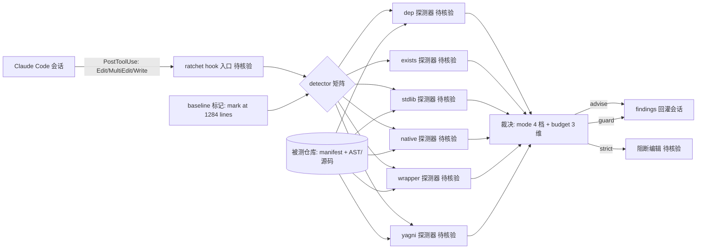

# 0xwilliamortiz/ratchet — 让 agent 的极简规则从"被读取"变成"被检查"

## 一句话定位
一个 Claude Code 的 `PostToolUse` hook：agent 读取极简规则后，这个工具读 agent 的每一次编辑、测量它、并把发现回灌进同一会话——把"开放式规则注入"变成"闭环合规检查"。

## 它解决的问题
所有给 coding agent 的极简规则集（"优先标准库、不加依赖、保持 diff 小"）都是**开环**的：模型读了规则，然后没人检查它是否遵守。合规被默认假设。当模型在长会话中漂移时（而它会漂移），直到 review 才被发现。ratchet 把这个环闭合——`PostToolUse` hook 在 agent 仍工作时测量每次 Edit/MultiEdit/Write，实时报告违规。

## 为什么值得关注（2026-08-04）

在 qm/crm/genoffice 都聚焦"让 agent 做更多"时，ratchet 聚焦**"约束 agent 不做过多"**——这是 agent 工程被忽视的一面。85 fork / **285 watchers**（watchers > stars 的异常比例，说明核心关注者质量高）显示这击中了一个真实痛点：**agent 生成的代码复杂度膨胀**。topics（claude-code/code-quality/yagni/static-analysis/rate-limiting）精准定位 Claude Code 生态。

## 热度来源判断
- **真实痛点信号**：watchers 285（远高于同类 400⭐ 项目的通常 watchers 数），说明这是**被深度关注而非浅层 star**的工具。85 fork 说明有人在真实部署。
- **Claude Code 生态红利**：作为 PostToolUse hook，它直接受益于 Claude Code 用户基数增长。
- **无刷星特征**：85 fork / 285 watchers / 3 open issues，数据形态健康。

## 关键技术亮点亮点
1. **PostToolUse 闭环测量**：每次 Edit/MultiEdit/Write 经 detectors，测量结果回灌同一会话——不依赖模型"被 system prompt 说服"，而是客观测量 + 实时反馈。
2. **六类探测器**：`dep`（package.json/requirements.txt 等新增依赖）、`exists`（归一化同名符号已存在）、`stdlib`（手写标准库已有的东西）、`native`（依赖/代码做了平台已做的事）、`wrapper`（函数体只转发给同参函数）、`yagni`（只有一个实现的接口/抽象类）。
3. **四档模式 + budget**：advise（仅 findings）/ guard（findings + budget 警告，默认）/ strict（超 budget 直接阻断编辑）/ off。budget 维度：新文件数/新依赖数/净增行数。
4. **基线机制**：`ratchet` 接受当前代码为基线（mark at 1284 lines），只对新发现触发——"复杂性只降不升，除非有人明确写下理由反向拧"。

## 架构师速览

| 决策问题 | 研究判断 | 证据边界 |
|---|---|---|
| 系统边界 | 边界即 Claude Code `PostToolUse` hook：监听本会话内的 Edit/MultiEdit/Write，不接管模型、不接管编排；外部仅触及被测仓库（dep 读 manifest、其余 detector 读 AST/源码） | 标签与文档明确为 claude-code / posttooluse-hook；六类 detector 的实现细节、hook 配置 schema 须以源码核验 |
| 主路径 | Claude Code 触发 hook → ratchet 解析工具入参 → 六类 detector 测量本次编辑 → 按当前模式（advise/guard/strict/off）与 budget（新文件/新依赖/净增行）裁决 → findings 回灌同一会话；mark-as-baseline 将当时代码状态固化为基线，新增量触发 | 路径由档案明示；预算阈值默认值、detector 之间的优先级与回写格式未在档案中给出 |
| 关键权衡 | detector 误报面（合法的 wrapper/native/yagni） vs strict 模式对真实编辑流的可用性；以及"以 Claude Code 为单一宿主"换来的 hook 闭环收益 vs 跨 agent 可移植性损失 | 档案仅给出风险描述，无量化误报率或 strict 采用率数据 |
| 最小 PoC | 在一个非生产小仓库上启用 guard（默认），关闭 strict 与 baseline 标记；以一次"加新依赖 + 包一层 wrapper + 写新抽象类"的编辑验证六个 detector 是否触发、findings 是否回到同一会话、budget 是否报警；验收项：误报清单、退出到 off 的开关、strict 阻断时的绕过路径 | 档案未给出 PoC 步骤与回滚细节；ratchetui.exe 与 Windows 路径示例提示跨平台一致性需在 PoC 内一并核验 |

## 架构启发
ratchet 的哲学是 **"ratchet turns one way"（棘轮单向转动）**——复杂性是单调递减或持平的，除非显式反转并记录理由。这是把**软件度量理论**（复杂度度量、依赖治理）注入 agent 工作流的尝试。对架构师的启发：**agent 代码质量的治理不能只靠 prompt 规则，必须有客观测量层 + 闭环反馈**。这与 crm 的"证据账本取代置信度"异曲同工——都拒绝"让模型自评"，转而用客观证据。

## 架构图（MMD）

> 证据边界：此图只采用本档案已有可核验描述；“待核验”节点不应视为项目实现事实。

## 定位判断
属于 **L2 开发范式/工具层**，是 agent 工程治理工具。与 skill-recorder（从观察到技能）正交：skill-recorder 解决"技能从哪来"，ratchet 解决"技能/编辑执行后是否守住质量底线"。两者共同构成 agent 工作流的质量基础设施。

## 风险 / 局限 / 泡沫点
1. **强绑定 Claude Code**：作为 PostToolUse hook，依赖 Claude Code 的 hook 机制；跨 agent（Codex/Cursor）适用性需各自适配。
2. **探测器的误报/漏报**：stdlib/native/wrapper 等启发式判断会有假阳性（合理的 wrapper）和假阴性（复杂违规），实际效果依赖规则调优。
3. **strict 模式的可用性**：直接阻断编辑在真实开发流中可能过度干扰；guard 为默认是合理的，但 strict 的采用门槛高。
4. **Windows 倾斜**：README 示例路径（C:\\your-project）和 ratchetui.exe 自动启动偏 Windows，跨平台一致性待验证。

## 与同类项目的关系
- **vs Claude Code 原生 hooks**：Claude Code 提供 hook 机制但无内置复杂度测量；ratchet 填补这个空白。
- **vs 传统 linter（ESLint/etc）**：linter 检查代码风格/已知反模式，ratchet 检查**agent 引入的增量复杂度**（依赖膨胀、wrapper、yagni）——关注点不同，ratchet 针对 agent 生成代码的特性。
- **vs skill-recorder**：正交互补，skill-recorder 是"人→技能"提取，ratchet 是"agent→质量"约束。

## 是否值得持续跟踪
**是，作为"agent 代码质量治理"品类的早期代表跟踪。** 285 watchers 的高质量关注信号值得重视。重点验证其探测器在真实复杂代码库的误报率。

## 后续观察点
1. **跨 agent 适配**：是否扩展到 Codex/Cursor 等，还是保持 Claude Code 专属。
2. **strict 模式的真实采用**：社区是否报告 strict 在生产流的可用性反馈。
3. **探测器规则演化**：六类探测器是否会扩展，以及社区贡献的规则质量。

## 最近动态（2026-08-05）

- **+7（423→430），几乎持平**：第四日增量极小，但 **285 watchers 保持异常比例**（watchers/star ≈ 66%，远高于常规项目）。这说明 ratchet 的核心使用者群体稳定且深度关注——热度不在量级而在关注质量。
- **三层栈定位巩固**：随 numbat（Perplexity 官方，agent 可观测性）今日加入，ratchet 作为三层栈的"执行约束层"定位进一步明确：skill-recorder（技能提取）→ ratchet（执行约束）→ numbat（可观测/取证/阻断）。ratchet 强绑 Claude Code，numbat 覆盖十余个 agent——广度互补。
- **判断**：score 维持 83。star 增速放缓但 watchers 质量信号强，作为"agent 代码质量治理"品类早期代表继续跟踪。

---
*首次记录：2026-08-04* · *最近更新：2026-08-05（423→430，+7，285 watchers 保持，三层栈定位巩固）*
