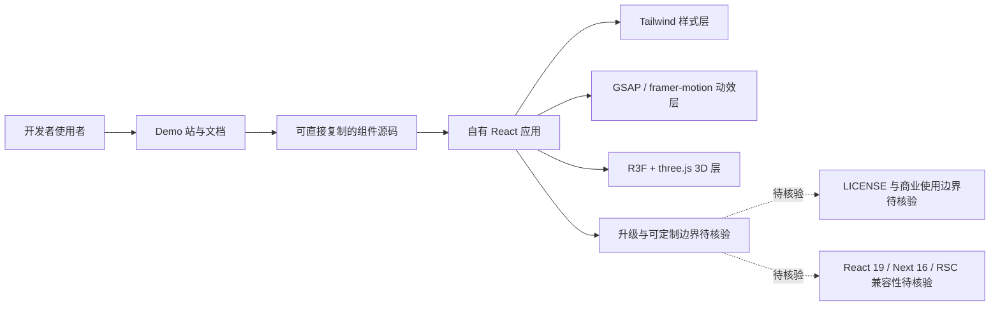

# react-bits

## 一句话定位
"开源 React 动效 / 3D 组件集"——一组完全可定制、动画/交互丰富的 React 组件，专门为打造"有记忆点的网站"打造。

## 它解决的问题
构建有视觉冲击力的 React 页面（带动画、3D 效果）需要：
- 自己写 framer-motion / GSAP / three.js / WebGL 逻辑
- 自己调样式 + 适配响应式
- 时间大量花在"酷炫效果"上

react-bits 提供开箱即用的组件库（含 3D / 文字动画 / 页面切换），用 Tailwind 配合降低样式成本。

## 为什么值得关注（2026-08-14 / 2026-08-15）
被 daily/2026-08-14.md 和 daily/2026-08-15.md 连续两日追踪——这是 daily 2026-08-14 的核心趋势之一。其增长曲线说明"AI 时代开发者更需要在产品上做出视觉差异化"，react-bits 是该趋势的副产品。

## 热度来源判断
热度来源是 **"AI Coding 让更多人能搭网站 → 更需要在视觉层差异化"**。AI Agent 让千行代码的程序随手生成，结果是网站"长得很像"——前端开发者急切寻找能让网站脱颖而出的"视觉弹药库"，react-bits 是这类弹药库的赢家。其 45k stars 2 年内达成，也说明动效组件库稀缺。

## 关键技术亮点
1. **3D + 动画:** R3F + GSAP / framer-motion 内部封装
2. **Tailwind 样式:** 与现代 Tailwind 工具链无缝
3. **完全可定制:** 每个组件可源码改造
4. **覆盖广泛：** Text Animations / Container Animations / 3D Components 三大类
5. **演示站 + 文档：** 在主页提供大量 demo

## 架构师速览

| 决策问题 | 研究判断 | 证据边界 |
|---|---|---|
| 系统边界 | react-bits 是一个面向"视觉差异化"的 React 动效/3D 组件集合，由 demo 站 + 文档站交付，依赖 R3F / GSAP / framer-motion + Tailwind；与 shadcn、Magic UI、Aceternity、Framer Motion 之间存在明确生态位 | 边界仅依据"一句话定位、关键技术亮点、与同类项目的关系"，未做源码审计；LICENSE、React 19/Next 16/RSC 兼容性属待核验 |
| 主路径 | 开发者通过 demo 站查阅效果 → 复制源码到自有项目 → 按需修改样式与动效 → 集成进既有 React + Tailwind 技术栈 | 主路径由"它解决的问题 + 完全可定制 + Tailwind 生态"推出；具体打包方式（ESM/CJS）、SSR/CSR 行为未在档案中证实 |
| 关键权衡 | 可定制深度 vs 升级合并成本；动效潮流的时效性 vs 当前"微动效+3D"红利；视觉冲击 vs 学习曲线（尤其 3D 组件） | 权衡来自档案"风险/局限/泡沫点"与"为什么值得关注"；性能、可访问性、生产稳定性无明确数据 |
| 最小 PoC | 选定 1 个 3D 组件 + 1 个 Text Animation 组件，在纯 Vite + React + Tailwind 的空项目里复刻 demo，验证依赖安装、动效流畅度与移动端响应式；同步确认 LICENSE 再决定是否纳入业务基线 | PoC 设计仅基于档案"技术亮点 + 风险点"，未引用任何未经证实的协议、SLO 或部署目标 |

## 架构启发
"组件库也要追时代潮流"——react-bits 不是把 shadcn/ui 重新打包，而是围绕"AI Coding 时代的视觉差异化"提供专属组件。这是组件库赛道的新方向。

## 架构图（MMD）

> 证据边界：此图只采用本档案已有可核验描述；“待核验”节点不应视为项目实现事实。

## 定位判断
**工具型 / 前端视觉组件库新锐。** 与 shadcn/ui 平行（偏设计系统）但侧重动效/3D。Tailwind 生态下可与 shadcn 共存。在"想做酷炫站点的开发者"群体中是首选参考。

## 风险 / 局限 / 泡沫点
- **License 待核实:** 仓库 LICENSE 文件存在与否需在 fork 前确认，**建议先读 README 顶部**
- **风格浪潮更替:** 动效热点变化快，2025-2026 流行"微动效 + 3D"，2027 后或迅速过时
- **可定制性 vs 维护成本:** 完全可定制的反面是升级时需自行合并
- **学习曲线:** 部分 3D 组件对新手不友好

## 与同类项目的关系
- **vs shadcn/ui:** shadcn 是设计系统基底；react-bits 是动效/3D 加成
- **vs Aceternity UI:** Aceternity 是 react-bits 的核心灵感源；react-bits 在覆盖广度上更强
- **vs Magic UI:** Magic UI 也是动效组件集；react-bits 偏 JavaScript native，Magic UI 偏 Next
- **vs Framer Motion:** Framer Motion 是底层库；react-bits 是组件成品

## 是否值得持续跟踪
**对需要快速搭酷炫站点的开发者强烈推荐。** 跟踪价值中等：组件库赛道变化不快，但 react-bits 处于增长期值得关注。

## 后续观察点
- LICENSE 文件是否补充
- 是否扩展到 React 19 + Next 16
- 与 RSC / Server Components 的兼容性
- 是否发布 Pro 版本（从开源项目延伸商业版）

---
> 数据来源: GitHub API (2026-08-21) | Stars: 45,901 | Forks: 2,194 | License: 待核实 | 语言: JavaScript
