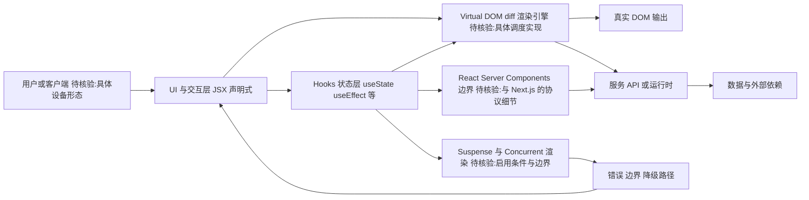

# facebook/react

## 一句话定位
由 Meta（Facebook）维护的声明式、组件化前端 UI 库，是现代 Web 开发的事实标准，定义了过去十年的前端工程范式。

## 它解决的问题
在 React 诞生（2013）之前，前端开发面临 DOM 操作繁琐、状态同步困难、代码难以复用等系统性问题。jQuery 时代的手动 DOM 操作在复杂应用中不可维护，Angular 1 的双向绑定在大规模场景下性能堪忧。React 引入了"声明式 UI + 虚拟 DOM + 单向数据流"的全新范式，将 UI 开发从"命令式操作"升级为"状态驱动的函数式渲染"，彻底改变了前端工程方法。

## 为什么值得关注
- **Stars:** 247,084（截至 2026-08-07），GitHub Top 5 级别的项目
- **Forks:** 51,200，社区生态极其庞大
- **Watchers:** 6,604，关注度极高
- **活跃度:** pushed_at 2026-08-07（当日更新），持续高频维护
- **行业地位:** React 占据前端框架市场份额第一，被 Meta、Netflix、Airbnb 等全球头部企业采用
- **License:** MIT（2017 年从 BSD+Patents 回归）

## 热度来源判断
React 的热度是**真实的行业统治力体现**。247K stars 不是短期炒作，而是 13 年持续积累的结果。它是前端开发者的"必修课"，也是企业前端技术选型的默认选项。热度来源包括：庞大的就业市场需求、丰富的第三方生态（Next.js、React Native、Remix）、以及 Meta 持续的技术投入（React Server Components、Suspense、Concurrent Features）。

## 关键技术亮点亮点
1. **Virtual DOM:** 通过内存中的轻量 DOM 副本进行 diff，批量最小化真实 DOM 操作
2. **JSX:** 将 HTML 模板与 JavaScript 逻辑统一，开创了"UI 即函数"范式
3. **Hooks（2019）:** useState/useEffect 等函数式 API，取代 class 组件，极大简化状态逻辑复用
4. **Concurrent Rendering:** 时间切片（Time Slicing）让大型 UI 更新不阻塞主线程
5. **React Server Components（RSC）:** 服务端组件，将"在服务端渲染"提升到组件粒度，与 Next.js App Router 深度整合
6. **React Native:** 跨平台延伸，同一套 React 编程模型覆盖 iOS/Android

## 架构师速览

| 决策问题 | 研究判断 | 证据边界 |
|---|---|---|
| 系统边界 | React 是前端 UI 库，边界在浏览器侧：用户/客户端 → UI 与状态 → 服务/数据依赖，自身不提供路由、SSR 运行时、服务端持久化或构建系统 | 基于"frontend, javascript, library, ui"标签与定位描述；具体包结构、API 形态未由 README 确认 |
| 主路径 | 声明式渲染：UI = f(state) → 通过 Virtual DOM diff 落到真实 DOM；状态以单向数据流驱动，可选 Hooks（useState/useEffect）封装 | 档案明示 Virtual DOM、JSX、Hooks、单向数据流；具体 diff 算法与 Scheduler 实现未在档案中给出 |
| 关键权衡 | 声明式 + 运行时 diff 换开发效率与心智一致性；代价是约 40KB+ 基础体积、学习曲线因 RSC/Suspense/Concurrent 抬高，与 Next.js 深度绑定带来 SSR 生态锁定 | bundle size、RSC、并发特性、Next.js 耦合均档案明示；性能数字（如 RSC 收益、Compiler 收益）档案未给实测值 |
| 最小 PoC | 以一个真实用户路径验证：状态边界划分、错误恢复（如 Suspense 边界降级）、与服务 API 的依赖契约；不在缺乏 RSC/Compiler 文档证据前将其作为默认承诺 | 档案建议先 PoC 验证状态边界、错误恢复与外部依赖降级；RSC 协议细节与 React 19+ Compiler 行为"待核验" |

## 架构启发
React 的核心架构启发是 **"声明优于命令，函数优于对象"**。Virtual DOM 的本质是将 UI 状态视为 `f(state) = UI` 的纯函数映射，让开发者只需描述"UI 应该是什么样"，框架负责高效地将其转化为 DOM 操作。这种"声明式渲染 + diff 优化"范式已被几乎所有现代前端框架借鉴（Vue、Svelte、Solid 都在变体上使用）。RSC 更进一步，将"渲染边界"从浏览器扩展到服务器，模糊了前后端界限。

## 架构图（MMD）

> 证据边界：此图只采用本档案已有可核验描述；“待核验”节点不应视为项目实现事实。

## 定位判断
**基础设施级头部项目。** React 已超越"库"范畴，成为前端开发的**平台和标准**。它不是"值得关注的新秀"，而是"必须了解的行业基线"。任何前端技术决策都需要以 React 为参照系。

## 风险/局限/泡沫点
- **复杂度增长:** RSC、Suspense、Concurrent 等新特性显著提升了学习曲线，新开发者上手门槛变高
- **bundle size:** React + ReactDOM 基础体积约 40KB+，轻量项目可能用 Preact/Solid 替代
- **Vue/Svelte 竞争:** Vue 在亚洲市场强势，Svelte 在编译时优化方向吸引创新者
- **SSR 碎片化:** RSC 生态尚在成熟中，Next.js 独大带来供应商锁定风险
- **Meta 维护不确定性:** 公司层面战略变化可能影响投入（历史上已有过专利条款争议）

## 与同类项目的关系
- **vs Vue:** Vue 更易上手（模板语法），React 更灵活（JSX）；市场份额 React 全球领先，Vue 在中国/日本强势
- **vs Svelte:** Svelte 编译时优化、零运行时开销，React 运行时更大但生态碾压
- **vs SolidJS:** Solid 采用细粒度响应式、无 Virtual DOM diff，性能更优但生态小
- **vs Angular:** Angular 是全功能框架（含路由/HTTP/表单），React 是轻量库（需搭配生态）
- **vs Next.js:** Next.js 是基于 React 的元框架，React 是底层引擎

## 是否值得持续跟踪
**必须跟踪。** React 是前端领域不可绕过的基础设施。建议关注其 RSC 生态成熟度、与 Next.js 的整合走向、以及 React Native 的新架构（Fabric/TurboModules）落地情况。

## 后续观察点
- React Server Components 是否成为 SSR 新标准
- React 19+ 的 Compiler（自动优化）是否兑现"无需手写 useMemo/useCallback"承诺
- React Native New Architecture 全面落地后的性能表现
- 是否被 Web Components / HTMX 等"回归原生"趋势侵蚀

---
> 数据来源: GitHub API (2026-08-07) | Stars: 247,084 | Forks: 51,200 | License: MIT
