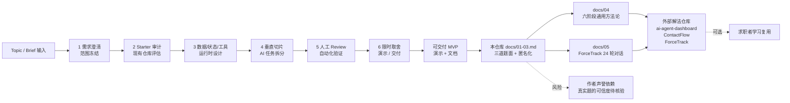

# CHENG-LIANG1/real-company-interview-ai-coding-projects

## 一句话定位
**三道匿名化的真实 AI Coding 面试项目题 + 一套通用解题方法论** ——把"招聘流程知识 × AI Coding 时代"沉淀为可复用的结构化资产。包含三道题面（Computer Use Agent Dashboard / React Native 截图行动 Agent / Jira 风格任务管理系统）、六阶段通用方法论、三道个人解法仓库链接、ForceTrack 项目 24 个真实 AI Coding 对话轮次。

## 它解决的问题
AI Coding 时代求职者面临三类痛点：(1) **题面零散**——AI Coding 类 take-home assignment 的真实题面在公开渠道难以找到；(2) **方法论缺失**——从"模糊要求"到"可交付代码"的全流程方法论缺失；(3) **个人解法参考不足**——多数求职者不知道"好的 AI Coding 解法长什么样"。CHENG-LIANG1/real-company-interview-ai-coding-projects 直击这三点：**结构化题库 + 通用方法论 + 个人解法**。

## 为什么值得关注（2026-08-27）
- **1 天 100⭐**：反映中国大陆技术社区对"AI Coding 面试准备"的强需求
- **三道匿名化题面**：保护隐私的同时保留工程能力信号
- **六阶段通用方法论**：需求澄清 → starter 审计 → 数据/状态/工具/运行时设计 → 垂直切片 + AI 任务拆分 → 人工 review + 自动化验证 → 限时取舍/演示/交付
- **三道个人解法仓库**：每个题目都有对应的个人解法仓库（[ai-agent-dashboard](https://github.com/CHENG-LIANG1/ai-agent-dashboard) / [ContactFlow](https://github.com/CHENG-LIANG1/ContactFlow) / [ForceTrack](https://github.com/CHENG-LIANG1/ForceTrack)）
- **ForceTrack 24 轮对话历史**：从 PRD 到 Repo Wiki 的 24 个真实 AI Coding 对话轮次（[docs/05-forcetrack-ai-coding-conversation-history.md](docs/05-forcetrack-ai-coding-conversation-history.md)）
- **37 KB 极小 size**：纯 Markdown 文档仓库，无代码运行时

## 热度来源判断
热度来自 **"AI Coding 面试准备刚需 × 招聘流程知识沉淀稀缺 × 三件套（题库 + 方法论 + 个人解法）完整性"** 的组合：(1) AI Coding 是当前独立开发者 / 求职者的核心技能；(2) 真实题面 + 通用方法论的组合在公开渠道少见；(3) 1 天 100⭐ 体现中国大陆技术社区的强需求。**主要风险：** "匿名化的真实题"的可信度依赖作者个人声誉（需要进一步核验作者是否真正经历过这些面试）；无 license 阻碍 fork 与商用；1 天新项目维护持续性待观察；与未来的"AI Coding Engineer 认证"等官方化项目可能形成竞争。

## 关键技术亮点
1. **三道匿名化题面**：保护公司 / 面试官 / 招聘人员隐私，保留工程能力信号
2. **六阶段通用方法论**：覆盖从需求澄清到限时取舍的全流程
3. **个人解法仓库分离**：本仓库只保留题面 + 方法论 + 个人解法仓库链接，避免内容重复
4. **ForceTrack 24 轮对话历史**：把"AI Coding 过程"以对话日志形式沉淀，可学习如何与 AI 协作完成从 PRD 到 Repo Wiki 的全过程
5. **每题考察维度明示**：Computer Use 考察 Computer Use / 工具循环 / 会话隔离 / 可观测性；React Native 考察多模态理解 / 结构化 Action / Human-in-the-loop / 原生工具 / Memory；Jira 风格考察需求取舍 / CRUD / 看板 / 本地持久化 / 时间线
6. **三道题共同考察点**：把模糊要求转成可验收的 P0 范围；starter / 现有仓库审计；运行时 / 数据 / 工具设计；垂直切片；限时取舍

## 架构师速览

| 决策问题 | 研究判断 | 证据边界 |
|---|---|---|
| 系统边界 | 一个 Markdown 文档仓库作为结构化知识库，三个解法仓库作为代码实现层，文档与实现解耦 | 仅基于 README 的 "本仓库继续只保留题目复盘和方法论" 与三个外部解法仓库链接；具体文档组织（按 docs/01-05.md 分文件）、是否提供 MCP server 形态、可被 AI agent 检索的结构化程度均未在档案中明示 |
| 主路径 | 求职者 → 阅读题面 docs/01-03.md → 学习通用方法论 docs/04 → 参考个人解法 → 阅读 ForceTrack 24 轮对话历史 → 应对 AI Coding 面试 | 主路径来自 README 与 docs/ 目录结构；具体 ForceTrack 对话历史的完整度（24 轮是否真实无删减）、通用方法论的实操可复用性需阅读 docs/01-05.md 才能评估 |
| 关键权衡 | 题面真实性 vs 隐私保护强度 vs 个人解法参考价值 vs 通用方法论的普适性 | 档案明示匿名化原则与三个解法仓库链接；具体匿名化程度（哪些信息保留 / 改写）、方法论的样本覆盖（仅 3 道 vs 更大样本）、个人解法的代码质量需进一步核验 |
| 最小 PoC | 拿其中一道题（如 Jira 风格任务管理系统）作为 take-home assignment 实操，用 README 的六阶段方法论完整走一遍，验证方法论在独立场景的可复用性 | PoC 范围由"先单题、最小实操、可对照"原则推导；具体题面的复杂程度、独立实操的耗时、退出路径待核验 |

## 架构启发
CHENG-LIANG1/real-company-interview-ai-coding-projects 的核心启发是 **"招聘流程知识 × AI Coding 时代"的稀缺沉淀**——延续 8-22/8-23 的"AI Coding 是当前独立开发者 / 求职者的核心技能"判断，但具体到"如何应对 AI Coding 类 take-home assignment"。**更深层的启发是："知识资产的结构化" 比 "知识资产的总量" 更稀缺**——3 道匿名化题面 + 通用方法论 + 个人解法 + 对话历史的组合，比 100 道零散题目更具长期价值。**与同类项目的关系：** 与 8-25 的 itshen/source-reading-methodology（AI 精读大型开源仓库方法论）、yizhiyanhua-ai/fireworks-open-eli5（交互视觉解释器）共同构成"AI Coding 时代的方法论沉淀"赛道。

## 架构图（MMD）

> 证据边界：此图只采用本档案已有可核验描述；"待核验"节点不应视为项目实现事实。

## 定位判断
**观察型项目（knowledge base）。** CHENG-LIANG1/real-company-interview-ai-coding-projects 不做软件，只做"招聘流程知识 × AI Coding 时代"的结构化沉淀——这是观察型定位。**核心竞争壁垒：** 真实题 + 通用方法论 + 个人解法 + 对话历史四件套的完整性；作者的"真实面试经验"背景（需要进一步核验）。**主要风险：** "匿名化真实题"的可信度依赖作者个人声誉；无 license 阻碍 fork 与商用；1 天新项目维护持续性。若持续维护，**6-12 月内有潜力成为"AI Coding 面试准备"领域的标杆知识库**。

## 风险 / 局限 / 泡沫点
- **作者声誉依赖**："匿名化的真实题"的可信度依赖作者个人是否真正经历过这些面试
- **无 license**：阻碍企业 fork 与商用
- **1 天新项目**：维护持续性待观察
- **样本量有限**：仅 3 道题目，方法论的普适性需要更大样本验证
- **AI Coding 反作弊风险**：未来面试反作弊系统可能反向识别"AI Coding 助手使用痕迹"
- **官方化冲击**：若 Anthropic / OpenAI 发布"AI Coding Engineer"认证，可能反向冲击个人题库价值
- **语言局限**：题目与方法论均为中文，对海外求职者适用性有限

## 与同类项目的关系
- **vs 8-25 itshen/source-reading-methodology**：带 AI 精读大型开源仓库方法论，CHENG-LIANG1 是 AI Coding 面试题 + 方法论，两者共同构成"AI Coding 时代方法论沉淀"
- **vs 8-25 yizhiyanhua-ai/fireworks-open-eli5**：交互视觉解释器，CHENG-LIANG1 是面试题库，两者互补
- **vs awesome-ai-coding-interview 等 awesome 列表**：awesome 列表是资源索引，CHENG-LIANG1 是结构化题库 + 方法论 + 个人解法
- **vs 各类 LeetCode 题库**：LeetCode 是算法题，CHENG-LIANG1 是 take-home assignment，两者互补
- **vs 官方 AI Coding Engineer 认证**：未来若官方化（Anthropic / OpenAI 发布），可能反向冲击个人题库价值

## 是否值得持续跟踪
**值得跟踪（AI Coding 面试准备的结构化资产）。** CHENG-LIANG1/real-company-interview-ai-coding-projects 1 天 100⭐ 体现中国大陆技术社区的强需求，**核心价值是"结构化题库 + 通用方法论 + 个人解法 + 对话历史"四件套的完整性**。**对求职者：** 这是"AI Coding 时代"的备考必备，可直接采用六阶段方法论 + 参考个人解法。**对 AI Coding 培训 / 教育机构：** 12 月内评估此类结构化题库的商业化可能性（订阅 / 一对一辅导 / 课程打包）。建议关注：(1) 作者是否继续补充更多题目（决定知识库规模）；(2) 是否补上 license（决定企业采用）；(3) 是否会被官方 AI Coding Engineer 认证冲击。

## 后续观察点
- 作者是否继续补充更多题目（决定知识库规模）
- 是否补上 license（决定企业采用）
- 是否会被官方 AI Coding Engineer 认证冲击
- 个人解法仓库的代码质量与 star 数（决定参考价值）
- 是否会被翻译为英文 / 其他语言（决定海外求职者适用性）

---
> 数据来源: GitHub API (2026-08-27) | Stars: 100 | Forks: 6 | License: 未声明 | 语言: Markdown 文档为主 | 创建: 2026-08-26 | 数据截至 2026-08-27 19:30 UTC