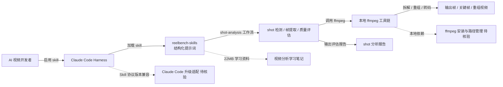

# eternityspring/reelbench-skills

## 一句话定位
AI 视频 shot-analysis 与 ffmpeg Skill 包——学习笔记 + 工具 skill 双层；Claude Code skills 入口；22MB 学习资料 + shot-analysis 工作流 + ffmpeg 工具链；Apache-2.0。

## 它解决的问题
2025-2026 年 AI 视频生成（Runway / Sora / Kling / Veo / Pika 等）爆发，但"如何用 ffmpeg 拆解 / 重组 / 评估视频"的工作流分散在各处——开发者需要把 shot detection、frame extraction、quality metrics 等工具链手动拼装。**reelbench-skills 把 AI 视频工作流打包成 Claude Code skills 形态**——通过结构化提示词 + ffmpeg 工具链 + 22MB 学习资料，让 Claude Code 能直接对视频做 shot analysis、拆解、重组、评估。

## 为什么值得关注（2026-09-12）
- 1 天 152⭐ / fork 21 / fork/star 13.8%
- Apache-2.0——商业友好
- 22.5 MB 仓库 size（学习资料 + skill 资料 + ffmpeg 工具）
- HTML 主目录（README 是完整 HTML 结构，便于直接预览）
- Claude Code skills 入口（与 09-11 viettranx/3dviz-pro-max 同构但垂直于视频）
- 与 09-09 viettranx/3dviz-pro-max（3D）、09-11 mizzlelover/gongwen-gbt9704-skill（公文）一同把"Skill 形态"推向"垂直领域模板库"层

## 热度来源判断
Skill 形态（Claude Code / Codex skills）在 2026 年迅速爆发——从通用工具（3D / 公文 / 工作纪律）到垂直领域（视频 / 配音 / 转场）。**reelbench-skills 是「AI 视频 Skill 垂直化」的首批标杆**。**热度来源是「AI 视频生成爆发 × Claude Code skills 形态成熟 × ffmpeg 工具链刚需 × 22MB 学习资料降低入门」四因素叠加**。fork/star 13.8% 偏高企服信号。**热度真实且属垂直赛道**，能否扩展取决于是否出现"AI 配音 Skill"、"AI 转场 Skill"等同类。

## 关键技术亮点
1. **shot-analysis 工作流**：Claude Code 通过结构化提示词自动对视频做 shot detection、frame extraction、quality assessment
2. **ffmpeg 工具链集成**：内置 ffmpeg 工具链用于视频拆解 / 重组 / 转码 / 滤镜
3. **22MB 学习资料**：远大于 README 体积，是 skill 资料包而非代码库
4. **HTML 主目录**：README 是完整 HTML 结构，便于直接预览 / 嵌入文档站点
5. **Claude Code skills 入口**：与 Anthropic Skills 标准兼容
6. **Apache-2.0**：商业友好，企业可自由采用并修改

## 架构师速览

| 决策问题 | 研究判断 | 证据边界 |
|---|---|---|
| 系统边界 | Claude Code skill 包（提示词 + 工具链 + 学习资料）+ HTML 文档主目录；本地 Claude Code 加载 skill 后可用 | 仅基于 README 与 GitHub 元数据；具体 skill 目录结构、ffmpeg 调用接口、学习资料内容未在档案中给出 |
| 主路径 | 开发者启用 skill → Claude Code 加载结构化提示词 → 用户上传视频 → shot-analysis 工作流 → ffmpeg 拆解 / 重组 → 输出评估报告或新视频 | 主路径为 README 语义抽象；ffmpeg 调用安全边界、视频大小限制、并发任务管理均待核验 |
| 关键权衡 | Skill 提示词通用性 vs ffmpeg 工具链灵活性 vs 学习资料完整度 vs Claude Code 版本兼容 vs 22MB 下载成本 | 档案明示 skill 资料包 + Claude Code skills 入口两点；Claude Code 升级后 skill 兼容机制、ffmpeg 路径管理、视频格式覆盖矩阵均待核验 |
| 最小 PoC | 在 Claude Code 启用 reelbench-skills（按 README 安装指引）；上传一段 10 秒短视频；让 Claude Code 做 shot-analysis 并用 ffmpeg 输出关键帧 | PoC 范围与退出路径由档案"先单视频、最小 ffmpeg 调用、可审计"原则推导；具体 Claude Code 版本、ffmpeg 路径、输出格式均待核验 |
| 依赖与红线 | 依赖 Claude Code + 本地 ffmpeg；Apache-2.0 允许商业衍生；22MB 下载体积对移动端是负担 | 依赖与红线均来自 README + GitHub 元数据；具体 ffmpeg 版本、Claude Code skill 协议版本、平台兼容矩阵需独立核验 |

## 架构图（MMD）

> 证据边界：此图只采用本档案已有可核验描述；“待核验”节点不应视为项目实现事实。

## 架构启发
reelbench-skills 的核心启发是 **「Skill 不只是提示词，是提示词 + 工具链 + 学习资料的复合产品」**——22MB 学习资料 + ffmpeg 工具链 + Claude Code skills 入口，让 AI 视频工作流从"零散工具拼装"升级为"开箱即用 skill 包"。**更深层的启发是「HTML 主目录 + 完整文档化」的发布工程**——README 是完整 HTML 结构，便于直接预览 / 嵌入文档站点。**最值得借鉴的是「Skill 垂直化」的产品哲学**——不追求通用工具，而是把 AI 视频场景做深做透。

## 定位判断
**工具型项目（AI 视频垂直 Skill 包）。** reelbench-skills 与 viettranx/3dviz-pro-max（3D Skill）、mizzlelover/gongwen-gbt9704-skill（公文 Skill）同构——Skill 形态从"通用工具"扩展到"垂直领域模板库"。**真正的差异化是「AI 视频垂直化」**——精准切入 ffmpeg + shot-analysis + AI 视频生成的工作流。能否扩展取决于：(a) 是否出现同类垂直 Skill（配音、转场、配乐、字幕等）；(b) Claude Code 升级后 skill 兼容机制（决定长期可用性）；(c) 22MB 下载体积是否会被拆分为按需加载（决定入门门槛）。当前定位是"AI 视频 Skill 垂直化首批标杆"，向更多垂直领域演进是合理路径。

## 风险 / 局限 / 泡沫点
- **22MB 下载体积**：对移动端或低带宽用户是负担
- **Claude Code 版本兼容**：Claude Code 升级后 skill 协议变化需要同步适配
- **ffmpeg 本地依赖**：用户需先装 ffmpeg，路径管理是潜在 friction
- **垂直场景天花板**：AI 视频是垂直市场，整体用户基数低于通用 IDE Skill
- **22MB 资料包内容质量**：学习资料完整度未在档案中明示，需用户下载后实际评估
- **个人项目属性**：eternityspring 个人维护，长期维护依赖作者持续投入

## 与同类项目的关系
- **vs viettranx/3dviz-pro-max**：3dviz-pro-max 是 3D 创意可视化 Skill；reelbench-skills 是 AI 视频 Skill，同属 Skill 形态
- **vs mizzlelover/gongwen-gbt9704-skill**：gongwen 是中文公文 Skill；reelbench-skills 是英文 AI 视频 Skill，跨语言跨场景
- **vs Anthropics-skills / wshobson/agents**：那些是通用 Skill 市场；reelbench-skills 是垂直场景 Skill
- **vs ffmpeg / shot-detection 等工具**：那些是通用工具；reelbench-skills 是 Claude Code skill 包装
- **vs Runway / Sora / Kling 等 AI 视频生成平台**：那些是生成侧；reelbench-skills 是分析 / 拆解侧

## 是否值得持续跟踪
**值得短期观察（AI 视频 Skill 垂直化首批标杆）。** reelbench-skills 代表了"Skill 形态从通用到垂直"的演进方向，无论其本身成败，这一方向会持续影响 Skill 生态。建议关注：(a) 是否出现同类垂直 Skill（配音、转场、配乐、字幕等）；(b) Claude Code 升级后 skill 兼容机制（决定长期可用性）；(c) 22MB 下载体积是否会被拆分。**对 AI 视频开发者，这是 Claude Code skill 形态参考的好样本**。对 Skill 生态观察者，它是"垂直化 Skill"的代表样本。

## 后续观察点
- 是否出现同类垂直 Skill（配音 / 转场 / 配乐 / 字幕等）
- Claude Code 升级后 skill 协议是否兼容
- 22MB 资料包是否被拆分为按需加载
- ffmpeg 路径管理是否提供一键安装脚本
- 学习资料是否扩展为多语言版本

---

*首次记录：2026-09-12*
