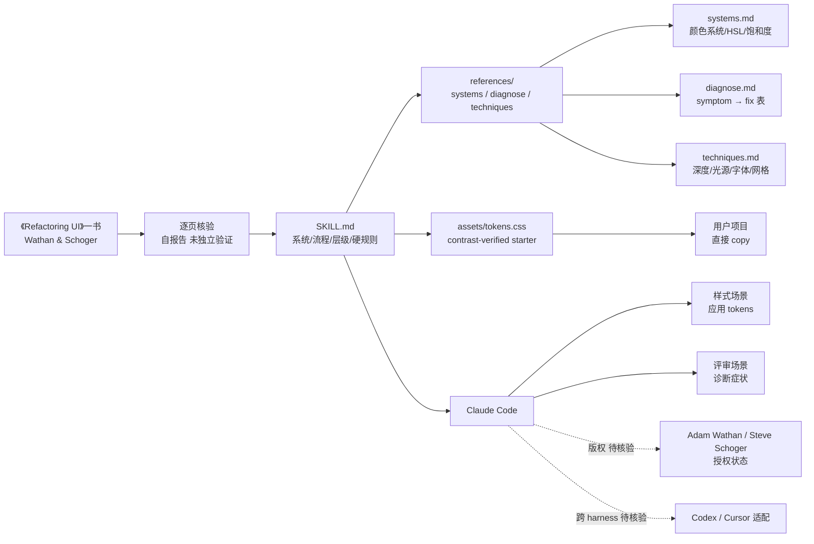

# s0xDk/refactoring-ui-skill

## 一句话定位
把 Adam Wathan 与 Steve Schoger 的 **《Refactoring UI》** 一书"逐页"转写为 Claude Code skill——**约束性设计 token + 字重/颜色层级 + 症状诊断** 三大能力，让 Claude 在样式 / 评审场景下严格应用书中的设计规则。

## 它解决的问题
2026 年下半年 AI Coding（Claude Code / Cursor / Codex）已能生成大量 UI 代码，但面临三类质量痛点：(1) **设计不专业**——AI 生成的 UI 看起来"能用"但不专业（间距随意、字号杂乱、颜色不协调）；(2) **方法论不可复用**——团队的设计 SOP / 内部规范难以直接教给 AI；(3) **评审主观**——"看起来不对 / 廉价"等主观反馈难以转化为可执行修改。refactoring-ui-skill 直击这三点：**把成熟设计书（已出版、已验证）转写为 skill，让 AI 直接应用**。

## 为什么值得关注（2026-08-28）
- **2 天 290⭐ + 27 forks**：把"已出版的成熟设计书"直接转写为 Claude Code skill 是 skill 生态的稀缺样本
- **README 自述逐页核验**："Every rule and CSS value in this skill was cross-checked page-by-page against the book. It's not a summary — it's the book's decisions, made once, ready to apply"
- **结构清晰**：SKILL.md（系统 / 流程 / 层级 / 硬规则）+ references/（systems.md 颜色系统 / diagnose.md 症状诊断 / techniques.md 深度技巧）+ assets/tokens.css（contrast-verified starter token set）
- **核心设计哲学**：约束性 token（固定 spacing/type/color/shadow 阶梯）+ 字重/颜色而非 size 建立层级 + 模拟光源建立深度
- **极小 size**：28 KB，主要是 Markdown + CSS tokens，无依赖
- **示例下载路径**：tokens.css 可直接用于项目

## 热度来源判断
热度来自 **"AI 生成的 UI 不好看 × 成熟设计书的方法论稀缺 × Claude Code skill 形态首次"** 的组合：(1) AI Coding 用户对"AI 生成专业 UI"的强需求；(2) 《Refactoring UI》是 Web 前端设计的事实标准之一（Adam Wathan 是 Tailwind CSS 作者），**有现成的目标用户群**；(3) 把"书"转写为"skill"是首次明确尝试，可能启发其他书籍的 skill 化（其他设计书 / 工程实践书 / 营销方法论书）。**主要风险：** 书的版权（README 没明示是否取得 Adam Wathan / Steve Schoger 授权）；CSS-only 限制使其无法直接用于非 Web 设计场景；强依赖 Claude Code（其他 harness 需 fork 适配）。

## 关键技术亮点
1. **约束性设计 token**：固定 spacing/type/color/shadow 阶梯，避免 AI 生成"随意值"
2. **字重/颜色层级**：通过字重（weight）和颜色（color）而非字号（size）建立视觉层级——这是设计书的核心论点
3. **症状诊断表**：diagnose.md 提供 "symptom → fix" 对照表，把"看起来不对/廉价"等主观反馈转化为可执行修改
4. **模拟光源**：techniques.md 解释如何用 shadow / light 模拟光源建立深度感
5. **完整 tokens.css**：contrast-verified starter token set 可直接 copy 到项目
6. **极小 size**：28 KB，几乎零部署成本

## 架构师速览

| 决策问题 | 研究判断 | 证据边界 |
|---|---|---|
| 系统边界 | 一个 Claude Code skill（SKILL.md + references/ + assets/）——本质是结构化 Markdown + CSS tokens，无 Python/Node 依赖 | 仅基于 README 的 "SKILL.md · references/ · assets/" 结构；具体 Claude Code skill 的安装机制（克隆路径、SKILL.md frontmatter 格式）、是否支持 Codex / Cursor 适配未在档案中明示 |
| 主路径 | 用户在 Claude Code 中加载 skill → Claude 在样式 / 评审场景下读 SKILL.md → 应用 references/ 中的规则 → 用 tokens.css 作为基线 token | 主路径来自 README 的 "Load this skill and Claude will..." 段落；具体 Claude 何时触发 skill、何时调用 diagnose/techniques 未在档案中明示 |
| 关键权衡 | 书的还原度 vs skill 的可执行性 vs 跨 harness 适配 vs 版权边界 vs 维护持续性 | 档案明示逐页核验 + tokens.css + diagnose/techniques；具体逐页核验的证据（PR / 提交历史 / 测试）、版权授权状态、跨 harness 适配路径均待核验 |
| 最小 PoC | 在 Claude Code 中加载 skill → 提交一段"看起来不对"的 HTML/CSS → 验证 Claude 是否能给出 tokens 阶梯内的具体修改 + diagnose 诊断 | PoC 范围由"先单场景、可对照"原则推导；具体诊断质量、tokens 阶梯覆盖度需实测 |

## 架构启发
refactoring-ui-skill 的核心启发是 **"成熟方法论 → Claude Code skill"的商品化路径**——延续 8-26..8-27 的"agent-skills / 单点工作流 × 真实数据"判断，但今日具体到"设计书"。**这意味着任何"已出版的方法论书"都有转写为 skill 的潜力**——包括设计书（Refactoring UI / Design Systems by Alla Kholmatova）、工程实践书（Clean Code / The Pragmatic Programmer）、营销方法论书（Traction / Building a StoryBrand）、销售书（SPIN Selling）等。**更深层的启发是：** skill 形态天然适合承载"成熟方法论"——比 prompt 模板更可审计、更可分享、更可复用。**对内容创作者：** 把"已有方法论书 + skill 双轨发行"可能是 2026 下半年的新商业模式。

## 架构图（MMD）

> 证据边界：此图只采用本档案已有可核验描述；"待核验"节点不应视为项目实现事实。

## 定位判断
**工具型项目（design-system skill）。** refactoring-ui-skill 不做设计工具，不做 AI Coding 框架，只做"设计方法论 skill 化"——这是工具型定位。**核心竞争壁垒：** 《Refactoring UI》一书的成熟方法论 + 逐页核验的承诺 + 完整的 SKILL.md + references/ + tokens.css 结构。**主要风险：** 版权边界（书的二次创作需取得作者授权）；CSS-only 限制（非 Web 设计场景无法直接采用）；强依赖 Claude Code（其他 harness 需 fork 适配）；1 天新项目维护持续性。

## 风险 / 局限 / 泡沫点
- **版权风险**：README 未明示是否取得 Adam Wathan / Steve Schoger 正式授权，"逐页核验"的引用可能涉及二次创作版权
- **CSS-only 限制**：无法直接用于非 Web 设计场景（移动端 / 原生 UI / 嵌入式）
- **强依赖 Claude Code**：未明示是否支持 Codex / Cursor 等其他 harness
- **1 天新项目**：维护持续性待观察（书的方法论更新，skill 是否同步更新？）
- **诊断质量未量化**：diagnose.md 的"symptom → fix"对照表覆盖度与诊断准确度未独立评估
- **NOASSERTION license**：阻碍企业 fork 与商用

## 与同类项目的关系
- **vs Ayueh0102/Ronnier-skill（色度学 skill）**：同样是"专业领域知识 × Claude Code skill"，但 Ronnier 侧重色彩科学方法论，本项目侧重 UI 设计方法论
- **vs Tailwind CSS / shadcn-ui**：是 token 体系的消费端，本项目是 token 体系的生产方法论
- **vs Figma Design Tokens / Style Dictionary**：是 design token 工具，本项目是 token 方法论
- **vs 其他"设计规范 skill"**：目前 Claude Code skill 市场上尚未出现同等完成度的"设计方法论 skill"
- **vs Refactoring UI 原书**：是书的方法论转写形态，可作为"书的 skill 化样本"

## 是否值得持续跟踪
**值得跟踪（"成熟方法论 → Claude Code skill"商品化路径的代表样本）。** refactoring-ui-skill 2 天 290⭐ 体现"AI 时代设计书 + skill 双轨发行"的市场需求，**逐页核验 + tokens.css + diagnose 三大能力是显著加分项**。**对独立开发者：** 12 月内"自己领域的成熟方法论（书 / 课程 / 内部 SOP）"打包成 Claude/Codex 双 harness skill 是最低门槛的发行路径。**对 Claude Code 用户：** 这是"立刻可用"的设计方法论 skill，可在样式 / 评审场景直接套用。建议关注：(1) 版权状态（决定能否被商业采用）；(2) 跨 harness 适配（Codex / Cursor）；(3) 是否会有更多"书 → skill"的转写出现。

## 后续观察点
- 版权状态（是否取得 Adam Wathan / Steve Schoger 授权）
- 跨 harness 适配（是否支持 Codex / Cursor）
- 是否会有更多"成熟方法论书 → skill"的转写（设计书 / 工程书 / 营销书）
- 诊断质量（diagnose.md 在真实场景的诊断准确度）
- 维护持续性（书的方法论更新，skill 是否同步更新）

---
> 数据来源: GitHub API (2026-08-28) | Stars: 290 | Forks: 27 | License: NOASSERTION | 语言: CSS | 创建: 2026-08-26 | 数据截至 2026-08-28 06:00 UTC