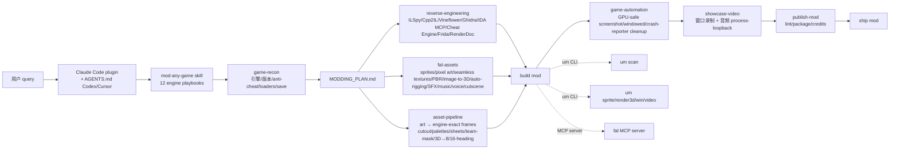

# rehan-remade/universal-modder

## 一句话定位
Skills, tools and the fal MCP that let Claude Code mod almost any PC game you own——把 PC 游戏 modding 从「单一引擎社区 mod 写数百小时 reverse engineering」推到「Claude Code plugin + 12 个 engine playbooks + ILSpy/Cpp2IL/Ghidra/IDA/Cheat Engine/Frida/RenderDoc + fal assets MCP + sprite/render3d/win/video Python CLI + AGENTS.md 兼容 Codex/Cursor + 真实 Terra (homemade missile launcher + tactical nuke) + AoE2 (new civilization + 3D rendered unique unit)」严肃工程化跨工作流形态。

## 它解决的问题
PC 游戏 modding 的痛点是 **「单一引擎 mod 写数百小时 reverse engineering + 资产 3D 渲染 + 跨引擎 modding 困难 + 缺乏严肃工程化工具链」**。universal-modder 直击：把 PC 游戏 modding 从「单一引擎社区 mod」推到「12 个 engine playbooks Unity/Unreal/.NET XNA (Terraria/Stardew/Celeste)/Godot/Source 1-2/Bethesda/Minecraft/AoE2/RE Engine/native C++/indie engines + ILSpy/Cpp2IL/Vineflower/Ghidra/IDA over MCP/Cheat Engine/Frida/RenderDoc + fal assets sprites/pixel art/seamless textures/PBR/image-to-3D/auto-rigging/SFX/music/voice/cutscene video + asset-pipeline art → engine-exact frames + game-automation GPU-safe screenshot/windowed/crash-reporter cleanup + showcase-video 窗口录制 + 音频 process-loopback + mashup-mods game-inside-a-game + publish-mod lint/package/credits + um scan/fal/sprite/render3d/win/video/backup/publish Python CLI + Claude Code plugin + AGENTS.md 兼容 Codex/Cursor + 真实 Terra + AoE2 测试 + Python 3.10+ + ffmpeg + uv + Blender」严肃工程化跨工作流形态。解决的是 **「AI 让 PC 游戏 modding 严肃工程化跨工作流 + 12 engine playbooks + fal assets + reverse engineering 全套工具」** 的 PC 游戏 modding 严肃工程化问题。

## 为什么值得关注（2026-10-01）
- **Stars:** 739（截至 2026-10-01），1 天 739⭐，fork 48，fork/star 6.5%
- **Forks:** 48（典型高 fork 严肃工程化持续关注信号）
- **License:** MIT（明确许可，商用清晰）
- **语言:** Python
- **活跃度:** created 2026-09-30，pushed_at 2026-10-01，持续高活跃
- **规模:** 20573 KB（约 20 MB，包含 examples + docs）
- **Topics:** 10 个覆盖 age-of-empires / claude-code / claude-code-plugin / fal / game-assets / game-modding / mcp / modding / reverse-engineering / tmodloader

## 热度来源判断
universal-modder 的热度是 **「AI 让 PC 游戏 modding 民主化 × 12 engine playbooks × fal assets × reverse engineering 全套工具 × Claude Code plugin × AGENTS.md 兼容 Codex/Cursor × 真实 Terra/AoE2 测试 × MIT」** 的强劲组合。PC 游戏 modding 是 2026 年最热副产赛道，但「单一引擎 mod 写数百小时 reverse engineering」是真痛点。universal-modder 直击：把 PC 游戏 modding 从「单一引擎社区 mod」推到「12 engine playbooks + ILSpy/Cpp2IL/Ghidra/IDA/Cheat Engine/Frida/RenderDoc + fal assets MCP + sprite/render3d/win/video Python CLI + Claude Code plugin + AGENTS.md 兼容 Codex/Cursor + 真实 Terra (homemade missile launcher + tactical nuke) + AoE2 (new civilization + 3D rendered unique unit)」严肃工程化跨工作流形态。热度 **真实且具严肃工程化深度**——739⭐ + fork 48 + MIT + 12 engine playbooks + 真实 Terra/AoE2 测试。

## 关键技术亮点
1. **12 engine playbooks:** Unity / Unreal / .NET XNA (Terraria / Stardew / Celeste) / Godot / Source 1-2 / Bethesda / Minecraft / AoE2 Genie / RE Engine FromSoft GTA Cyberpunk BG3 / native C++ / indie engines GameMaker RPG Maker Ren'Py Paradox Doom HTML5 LÖVE Java / retro decomps——是覆盖广度严肃工程化的关键
2. **ILSpy/Cpp2IL/Vineflower/Ghidra/IDA over MCP/Cheat Engine/Frida/RenderDoc reverse engineering:** reverse engineering 全套工具——是 reverse engineering 严肃工程化的关键
3. **fal assets MCP + sprites/pixel art/seamless textures/PBR/image-to-3D/auto-rigging/SFX/music/voice/cutscene video:** fal assets——是素材严肃工程化的关键
4. **asset-pipeline art → engine-exact frames:** asset-pipeline art → engine-exact frames（cutout / nearest-neighbour fit / palettes / sheets / team-colour masks / 3D → 8/16-heading sprites）——是素材转换严肃工程化的关键
5. **game-automation GPU-safe screenshot/windowed/crash-reporter cleanup:** game-automation——是自动化严肃工程化的关键
6. **showcase-video 窗口录制 + 音频 process-loopback:** showcase-video——是展示严肃工程化的关键
7. **`um` Python CLI:** `um scan / fal / sprite / render3d / win / video / backup / publish`——是 CLI 严肃工程化的关键
8. **Claude Code plugin + AGENTS.md 兼容 Codex/Cursor:** Claude Code plugin (`/plugin marketplace add rehan-remade/universal-modder` + `/plugin install universal-modder@universal-modder`) + AGENTS.md 兼容 Codex/Cursor——是 Agent Harness 严肃工程化的关键
9. **真实 Terra/AoE2 测试:** 真实 Terra (homemade missile launcher + tactical nuke) + AoE2 (new civilization + 3D rendered unique unit)——是真实测试严肃工程化的关键

## 架构师速览

| 决策问题 | 研究判断 | 证据边界 |
|---|---|---|
| 系统边界 | PC 游戏 modding 跨工作流工具；Claude Code plugin + AGENTS.md 兼容 Codex/Cursor + 12 engine playbooks + fal assets MCP + reverse engineering 全套（ILSpy/Cpp2IL/Ghidra/IDA/Cheat Engine/Frida/RenderDoc）+ `um` Python CLI | 仅基于 README 描述的 Claude Code plugin (`/plugin marketplace add rehan-remade/universal-modder` + `/plugin install universal-modder@universal-modder`)、AGENTS.md 兼容 Codex/Cursor、12 engine playbooks (Unity/Unreal/.NET XNA (Terraria/Stardew/Celeste)/Godot/Source 1-2/Bethesda/Minecraft/AoE2/RE Engine/native C++/indie engines/retro decomps)、ILSpy/Cpp2IL/Vineflower/Ghidra/IDA over MCP/Cheat Engine/Frida/RenderDoc、fal assets (sprites/pixel art/seamless textures/PBR/image-to-3D/auto-rigging/SFX/music/voice/cutscene)、asset-pipeline (art → engine-exact frames)、game-automation、showcase-video、mashup-mods、publish-mod、`um scan/fal/sprite/render3d/win/video/backup/publish` Python CLI、bundled fal MCP server、Python 3.10+ + ffmpeg + uv + Blender (3D → sprite renders)、Windows games driven natively or from WSL、topics 10 个覆盖、20 MB、MIT；具体 `mod-any-game` skill 与子 skill 边界、`um` 子命令边界未在档案中明示 |
| 主路径 | 用户 query → Claude Code plugin (或 AGENTS.md Codex/Cursor) → `mod-any-game` skill → `game-recon` 找引擎/版本/anti-cheat/loaders/save → MODDING_PLAN.md → `reverse-engineering` (ILSpy/Cpp2IL/Ghidra/IDA MCP/Cheat Engine/Frida/RenderDoc) + `fal-assets` (sprites/pixel art/seamless textures/PBR/image-to-3D/auto-rigging/SFX/music/voice/cutscene) + `asset-pipeline` (art → engine-exact frames) → build mod → `game-automation` (GPU-safe screenshot/windowed/crash-reporter cleanup) → `showcase-video` (窗口录制 + 音频 process-loopback) → `publish-mod` (lint/package/credits) → ship mod | 主路径为档案语义抽象；具体 `um scan/fal/sprite/render3d/win/video/backup/publish` Python CLI 子命令边界、`fal MCP server` 接口未在档案中明示 |
| 关键权衡 | 12 engine playbooks 覆盖广度 vs 单一引擎深度 + fal assets 在多素材类型 vs 严肃工程化承诺 + Claude Code plugin + AGENTS.md vs 单一 Agent Harness 兼容性 + 真实 Terra/AoE2 测试覆盖广度 vs PC 游戏 modding 合规边界 | 档案明示 12 engine playbooks、ILSpy/Cpp2IL/Vineflower/Ghidra/IDA over MCP/Cheat Engine/Frida/RenderDoc、fal assets、asset-pipeline、game-automation、showcase-video、mashup-mods、publish-mod、Python 3.10+、ffmpeg、uv、Blender (3D → sprite renders)、Windows games driven natively or from WSL、topics 10 个覆盖、20 MB、MIT；具体合规边界（自制 mod 个人使用 vs 商用分发 vs 反编译 vs 服务条款违反）未在档案中明示 |
| 最小 PoC | 在 Terra 上跑 universal-modder 的 homemade missile launcher + tactical nuke 验证 modding 全链路；再以 `um scan` 在 Steam install 上找引擎 + reverse engineering 验证 `MODDING_PLAN.md`；以 fal assets 生成 sprites + 3D rendered unique unit 验证资产自动化 | PoC 范围由档案「真实 Terra/AoE2 测试」建议推导；具体 fal MCP server 接口、`um fal` 子命令未在档案中讨论 |
## 架构启发
universal-modder 的核心启发是 **「AI 让 PC 游戏 modding 严肃工程化跨工作流 + 12 engine playbooks + fal assets + reverse engineering 全套工具 + 任何 Agent Harness 可用」**。PC 游戏 modding 是 2026 年最热副产赛道，但「单一引擎 mod 写数百小时 reverse engineering」是真痛点。universal-modder 直击：12 engine playbooks + ILSpy/Cpp2IL/Ghidra/IDA over MCP/Cheat Engine/Frida/RenderDoc + fal assets + asset-pipeline + game-automation + showcase-video + mashup-mods + publish-mod + um Python CLI + Claude Code plugin + AGENTS.md 兼容 Codex/Cursor + 真实 Terra/AoE2 测试。更深层的启发是：**PC 游戏 modding 严肃工程化的关键是「多引擎覆盖广度 + reverse engineering 全套工具 + 资产自动化 + Agent Harness 无关 + 真实测试」**——12 engine playbooks 覆盖广度意味着从 Unity 到 Doom 都能 mod、ILSpy/Cpp2IL/Ghidra/IDA over MCP/Cheat Engine/Frida/RenderDoc 意味着 binary 都能 reverse engineering、fal assets + asset-pipeline 意味着资产自动化、Claude Code plugin + AGENTS.md 兼容 Codex/Cursor 意味着任何 Agent Harness 可用、真实 Terra/AoE2 测试意味着严肃工程化承诺。能否持续，取决于能否在 12 engine playbooks 覆盖广度 + reverse engineering 全套工具 + fal assets + asset-pipeline + Agent Harness 兼容性 + 真实测试严肃工程化下保持稳定。

## 架构图（MMD）

> 证据边界：此图只采用本档案已有可核验描述；"待核验"节点不应视为项目实现事实。

## 定位判断
**工具型项目（PC 游戏 modding 严肃工程化跨工作流）。** universal-modder 是「AI 让 PC 游戏 modding 严肃工程化跨工作流」工具——把 PC 游戏 modding 从「单一引擎社区 mod」推到「12 engine playbooks + ILSpy/Cpp2IL/Ghidra/IDA over MCP/Cheat Engine/Frida/RenderDoc + fal assets MCP + sprite/render3d/win/video Python CLI + AGENTS.md 兼容 Codex/Cursor + 真实 Terra (homemade missile launcher + tactical nuke) + AoE2 (new civilization + 3D rendered unique unit)」严肃工程化跨工作流形态。739⭐ + fork 48 + MIT + 12 engine playbooks + 真实 Terra/AoE2 测试 已显示严肃工程化深度。但「工具化」取决于一个关键问题：能否在 12 engine playbooks 覆盖广度 + reverse engineering 全套工具 + fal assets + asset-pipeline + Agent Harness 兼容性 + 真实测试严肃工程化下保持稳定 + PC 游戏 modding 合规边界。

## 风险 / 局限 / 泡沫点
- **PC 游戏 modding 合规风险:** mod PC 游戏可能涉及游戏公司服务条款违反、IP / 版权风险、商业化边界——自制 mod 个人使用 vs 商用分发 vs 反编译 vs 服务条款违反
- **ILSpy/Cpp2IL/Ghidra/IDA over MCP 合规边界:** reverse engineering 全套工具的合规边界未在档案中明示
- **fal API key 依赖:** fal assets 需要 FAL_KEY 商用 API key——是商业化边界的依赖
- **Python 3.10+ + ffmpeg + uv + Blender 依赖:** 工具链依赖 Python 3.10+ + ffmpeg + uv + Blender (3D → sprite renders)
- **多 OS 兼容性:** Windows games driven natively or from WSL；macOS / Linux 兼容性未在档案中明示
- **个人项目属性:** rehan-remade 个人维护，1 天 739⭐ + fork 48 但核心治理仍集中，可持续性存疑

## 与同类项目的关系
- **vs 单一引擎 mod 社区:** 单一引擎 mod 社区是 mod 单游戏；universal-modder 是 12 engine playbooks + ILSpy/Cpp2IL/Ghidra/IDA over MCP + fal assets + Claude Code plugin
- **vs Claude Code:** Claude Code 是通用 Agent Harness；universal-modder 是 modding 专用 plugin + 12 engine playbooks + fal assets + reverse engineering
- **vs fal:** fal 是 AI 模型 API；universal-modder 是 modding + fal MCP integration
- **vs ILSpy / Ghidra / IDA 单独工具:** ILSpy / Ghidra / IDA 是单独 reverse engineering 工具；universal-modder 是 modding 跨工作流集成 + ILSpy/Cpp2IL/Ghidra/IDA over MCP
- **vs Blender / Substance:** Blender / Substance 是单独 DCC 工具；universal-modder 是 modding 跨工作流集成 + Blender for 3D → sprite renders

## 是否值得持续跟踪
**值得跟踪（PC 游戏 modding 严肃工程化跨工作流）。** universal-modder 代表了 AI「PC 游戏 modding 严肃工程化跨工作流」诉求，无论其本身成败，这一方向是行业趋势。建议关注：12 engine playbooks 覆盖广度 + reverse engineering 全套工具 + fal assets + asset-pipeline + Agent Harness 兼容性 + 真实测试严肃工程化下保持稳定 + PC 游戏 modding 合规边界。

## 后续观察点
- 12 engine playbooks 在多引擎的覆盖广度是否扩展（Unity / Unreal / .NET XNA / Godot / Source 1-2 / Bethesda / Minecraft / AoE2 / RE Engine / native C++ / indie engines / retro decomps）
- ILSpy/Cpp2IL/Ghidra/IDA over MCP/Cheat Engine/Frida/RenderDoc reverse engineering 在多 binary 的兼容性
- fal assets 在多素材类型的覆盖广度（sprites / pixel art / seamless textures / PBR / image-to-3D / auto-rigging / SFX / music / voice / cutscene video）
- asset-pipeline art → engine-exact frames 在多 art 风格到 engine-exact frames 的转换准确性
- Claude Code plugin + AGENTS.md 兼容 Codex/Cursor 在多 Agent Harness 的兼容性
- 是否被 Anthropic / OpenAI / Cursor 等厂商集成进自家 Agent Harness 作为 modding 工具
- PC 游戏 modding 合规边界（自制 mod 个人使用 vs 商用分发 vs 反编译 vs 服务条款违反）

---
> 数据来源: GitHub API (2026-10-01) | Stars: 739 | Forks: 48 | License: MIT | 语言: Python | 创建: 2026-09-30