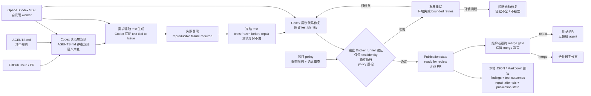

# indada/repopilot

## 一句话定位
验证驱动 AI 软件迭代引擎 —— 基于 OpenAI Codex SDK 的自托管 worker，把 GitHub Issue / PR 转成「需求驱动测试生成 → 失败复现 → 代码修复 → 独立 Docker runner 验证 → 维护者保留 merge 决策」的可追溯闭环。

## 它解决的问题
当前 AI Coding Agent 工具（Claude Code / Codex / Cursor）的痛点是 **「Issue 描述了 bug 但没 regression test / PR 改了行为但旧 test 没覆盖 / AGENTS.md 项目规约 agent 容易漏 / 建议修复没可复现验证 / 环境失败看起来像代码缺陷 / 审查证据散落在 log + patch」** ——RepoPilot 把这 6 个痛点合并成一个闭环：Issue → test → 失败复现 → 修复 → 独立验证 → 报告。修复前冻结测试 + 候选必须通过独立 Docker runner + 维护者保留 merge 决策是「严肃 AI Coding 工具」的三件套工程化形式。

## 为什么值得关注（2026-09-19）
- **Stars:** 95（截至 2026-09-19），1 天 95⭐，严肃工程信号
- **Forks:** 6，fork/star 6.3%（与昨日 thruwire/foreman 6.4% 接近，「严肃 AI Coding 工具」早期 fork 率特征）
- **License:** MIT
- **语言:** TypeScript
- **活跃度:** created 2026-09-18，pushed_at 2026-09-18，持续高活跃
- **规模:** 378 KB（可独立部署的中等规模迭代引擎）
- **双语 README:** 英文 + 中文（README.zh-CN.md）
- **支持:** OpenAI Codex SDK + 自托管 worker + 独立 Docker runner

## 热度来源判断
RepoPilot 的热度是 **「Issue / PR 验证迭代闭环刚需 × OpenAI Codex SDK 严肃采用 × 独立 Docker verifier × 维护者最终 merge gate」** 的组合。2026 Q3 趋势从「单 agent 长会话」演进到「多 agent 编排 + 验证治理」—— 昨日 thruwire/foreman「Jev supervisor」是监管层，今日 indada/repopilot「独立 Docker verifier + 维护者最终 merge gate」是执行层。RepoPilot 独特切入点是「**冻结测试**」—— 修复前 freeze tests + 候选必须保留测试身份 + 通过独立执行 + 通过 policy 重检 是「测试身份不被修复改动」的工程化形式，避免「agent 修代码同时改 test 让 test 永远 pass」的作弊。README 6 项 maintainer problem 对应 6 项 RepoPilot 解决方案（Issue 没 regression test → Codex 提议测试；PR 改行为旧 test 没覆盖 → Codex 生成新测试；AGENTS.md 容易漏 → 静态规则 + 语义审查；建议修复没验证 → 冻结测试 + 独立执行；环境失败像代码缺陷 → 有界重试；审查证据散落 → JSON / Markdown 报告）—— 6 项痛点一一对应 6 项工程化方案。95⭐ / 6 forks + Codex SDK + 独立 Docker runner + 维护者最终 merge gate 反映「严肃仓库级 AI Coding 工具」早期信号。热度**真实且具工程化深度** —— 但需警惕：Codex SDK 持续变化 + Docker runner 在复杂 monorepo 的可靠性 + 冻结测试是否被新 test 绕过 + 维护者是否愿意信任 AI 提议是长期可用性的关键。

## 关键技术亮点
1. **OpenAI Codex SDK + 自托管 worker** —— Codex SDK 是 OpenAI 官方 SDK（与 Codex CLI 同一模型），自托管意味着数据不外传
2. **独立 Docker runner** —— 验证与修复分离的工程化形式，Docker 隔离环境避免污染
3. **修复前冻结测试** —— `tests are frozen before repair` 是「测试身份不变」的工程化形式，避免「agent 修代码同时改 test 让 test 永远 pass」
4. **候选必须保留测试身份 + 通过独立执行 + 通过 policy 重检** —— 三件套：测试身份不变 + 独立进程执行 + 静态规则 + 语义审查
5. **环境失败有界重试** —— 避免「环境 race condition」无限重试
6. **不稳定 / 不完整证据阻断自动修复** —— 「证据不全不修」的工程化形式
7. **本地 JSON / Markdown 报告** —— `findings + test outcomes + repair attempts + publication state` 四类记录可独立审查
8. **AGENTS.md 项目规约静态规则 + Codex 语义审查 + 引用规则 + 代码证据** —— 三件套证据链 + 项目规约集成
9. **维护者保留 merge 决策** —— 「人机协作最终 gate」的工程化形式，agent 提议 + 维护者合并
10. **范围声明** —— README 明确「broader autonomous iteration is a project vision; unattended product development, merging and deployment are not current capabilities」是「严肃边界声明」的关键工程化形式
11. **双语 README（英文 + 中文 README.zh-CN.md）** —— 中国开发者友好
12. **MIT License + TypeScript + 378 KB** —— 可独立部署的中等规模迭代引擎

## 架构师速览

| 决策问题 | 研究判断 | 证据边界 |
|---|---|---|
| 系统边界 | OpenAI Codex SDK + 自托管 worker + 独立 Docker runner + 维护者最终 merge gate；GitHub Issue / PR → 需求驱动测试生成 → 失败复现 → 代码修复 → 独立验证 → 报告；修复前冻结测试；环境失败有界重试；不稳定证据阻断；JSON / Markdown 报告本地保留 | 来自 README 关于「Verification-driven software iteration, powered by the OpenAI Codex SDK and hosted on your own worker」「turns GitHub Issues and pull requests into a bounded cycle of test generation, failure reproduction, code repair and independent verification」「Codex proposes a test tied to the Issue description」「Tests are frozen before repair」「Environment failures receive bounded retries」「unstable or incomplete evidence blocks automatic repair」「Local JSON/Markdown reports retain findings, test outcomes, repair attempts and publication state」的明示；具体 Codex SDK 调用细节、Docker runner 内部架构、冻结测试机制、policy 重检规则、AGENTS.md 解析在仓库源码未展开 |
| 主路径 | GitHub Issue / PR 进入 → Codex 阅读仓库规则 + AGENTS.md → 生成需求驱动 test → 复现失败 → 冻结 test → 提议代码修复 → 独立 Docker runner 跑冻结 test + project policy 重检 → 通过则 publication state = ready for review（draft PR）→ 维护者最终 merge 决策 → JSON / Markdown 报告本地保留 | 主路径来自 README 关于「Codex proposes a test tied to the Issue description; reproducible failure is required before repair」「Tests are frozen before repair; candidates must preserve test identities and pass independent execution and policy rechecks」「Environment failures receive bounded retries; unstable or incomplete evidence blocks automatic repair」「Local JSON/Markdown reports」的描述；具体 Codex prompt schema、test freeze 存储格式、Docker runner 镜像、policy 重检规则、PR draft 生成机制在仓库源码未展开 |
| 关键权衡 | 单 Codex agent vs Codex + 独立 Docker verifier（自审 vs 独立验证）/ 修复前冻结测试 vs 修复后调整测试（测试身份 vs 测试适应）/ 自托管 vs SaaS（数据隐私 vs 零运维）/ 维护者最终 merge gate vs 自动 merge（人类把关 vs 自动化）/ 需求驱动 test vs 任意 test（合规性 vs 灵活性）/ JSON / Markdown 报告 vs 仅最终结果（可审计 vs 简洁） | 权衡 6 因素均从 README + 6 项 maintainer problem 对应表推导；具体 policy 重检规则细节、AGENTS.md 解析、test freeze 存储在仓库源码 + docs/VERIFICATION.md + SECURITY.md 未展开 |
| 最小 PoC | macOS / Linux + Docker 已安装 + OpenAI Codex API key + `git clone https://github.com/indada/repopilot.git` + 配置 Codex SDK + 选定一个含 Issue 的仓库 → RepoPilot 拉 Issue → Codex 生成 test → 复现失败 → 冻结 test → Codex 提议修复 → 独立 Docker runner 验证 → 通过则 draft PR + JSON / Markdown 报告 → 维护者审查 + merge | PoC 由「OpenAI Codex SDK + GitHub Issue / PR + 独立 Docker runner + 冻结测试 + 维护者 merge gate」推导；具体 Codex SDK 配置、Docker runner 镜像、test freeze 存储、policy 重检规则、PR draft 模板在 docs/ARCHITECTURE.md + 仓库源码待核验 |

## 架构图（MMD）

> 证据边界：此图只采用本档案已有可核验描述；"待核验"节点不应视为项目实现事实。

## 架构启发
RepoPilot 的核心启发是 **「AI Coding Agent 的可信度瓶颈不在生成能力而在验证能力」**。当 Codex 能生成代码时，关键问题是「这段代码真的修好了 Issue 吗 / 没破坏其他 test 吗 / 符合项目规约吗」—— 这些都需要独立验证。RepoPilot 用「独立 Docker runner + 冻结测试 + 三件套证据链 + 维护者最终 merge gate」是「AI 生成 + 独立验证 + 人类最终决策」三层分工的工程化形式。**冻结测试** 是关键架构选择 —— 测试身份在修复前 freeze，候选修复必须通过冻结的 test + 独立 Docker 执行 + policy 重检，避免「agent 修代码同时改 test 让 test 永远 pass」的作弊。**维护者最终 merge gate** 是关键边界 —— README 明确「unattended product development, merging and deployment are not current capabilities」，agent 提议 + 维护者合并，避免「AI 自动 merge 引入 bug」。**对企业**：CISO / 合规团队可在不绑 SaaS 前提下用 AI 做仓库级 Issue / PR 验证迭代；**对开源维护者**：可处理「我自己维护不过来的 Issue / PR」+ 保留最终 merge 决策；**对小团队**：可作为「AI 同事」处理 backlog + 维护者合并。

## 定位判断
**工具型项目（仓库级 AI Coding 验证迭代引擎）。** RepoPilot 不是又一个 Coding Agent（那是 Claude Code / Codex / Cursor），而是 **「Issue / PR 验证迭代引擎」** —— 把 AI Coding 从「单 agent 生成代码」升级到「Issue / PR → test → 修复 → 独立验证 → 维护者合并」完整闭环。95⭐ / 6 forks / Codex SDK + 独立 Docker runner + 冻结测试 + 维护者最终 merge gate 反映「严肃仓库级 AI Coding 工具」早期信号。**真正决定长期价值的是「OpenAI Codex SDK 稳定性 + 独立 Docker runner 在多 OS / 多语言项目上的通用性 + 冻结测试机制的可靠性 + 维护者接受度」** —— Codex SDK 持续变化 / Docker runner 在复杂 monorepo 的可靠性 / 冻结测试是否被新 test 绕过 / 维护者是否愿意信任 AI 提议是关键。**对企业平台工程团队**，RepoPilot 是「不绑 SaaS + 严肃 AI Coding + 维护者最终 merge gate」的具体路径；**对开源维护者**，可处理 backlog + 保留最终 merge 决策。

## 风险 / 局限 / 泡沫点
- **OpenAI Codex SDK 单一厂商风险** —— Codex SDK 持续变化 + 定价 + 多模型选择是 RepoPilot 长期可用的关键
- **独立 Docker runner 复杂度** —— 在复杂 monorepo（多语言 / 多 OS / 复杂依赖）的可靠性 + Docker 镜像构建时间 + 资源消耗是关键
- **冻结测试机制可靠性** —— 是否被新 test 绕过 + test 身份不变性保证 + 复杂场景的 test freeze 边界是关键
- **维护者接受度** —— 维护者是否愿意信任 AI 提议 + 审查 AI 生成的 PR + 最终 merge gate 决策负担是关键
- **AGENTS.md 解析范围** —— 不同项目的 AGENTS.md 格式差异 + 复杂项目规约的语义理解准确性是关键
- **policy 重检覆盖度** —— 静态规则 + 语义审查能否覆盖所有项目规约 + 误报 / 漏报率是关键
- **环境失败有界重试阈值** —— 不同项目不同环境的合理重试次数 + 重试期间的状态保存是关键
- **范围声明警告** —— README 明确「broader autonomous iteration is a project vision; unattended product development, merging and deployment are not current capabilities」，不替代人工开发

## 与同类项目的关系
- **vs thruwire/foreman（昨日）：** foreman 是「Jev supervisor + Codex worker」监管层抽象，repopilot 是「Codex SDK 直接做工程迭代 + 独立 Docker verifier + 维护者最终 merge gate」执行层抽象；两者共同点「独立 verifier」—— foreman verifier 是另一个 Codex worker，repopilot verifier 是独立 Docker runner
- **vs clawback/claude-code-cost-ledger（前日）：** cost-ledger 是「session 层成本治理」，repopilot 是「仓库级 Issue / PR 验证迭代闭环」；两者共同点「治理层工具」
- **vs agent-sec/mod-provenance-graph（前日）：** mod-provenance-graph 是「Claude Code Mod 依赖图 + CycloneDX SBOM」，repopilot 是「GitHub Issue / PR 验证迭代引擎」；两者共同点「软件供应链治理」但层面不同
- **vs Claude Code / Codex / Cursor 单 agent：** 那些是「单 agent 生成代码」，repopilot 是「Issue / PR 验证迭代闭环」；repopilot 把单 agent 升级到仓库级闭环
- **vs GitHub Copilot Coding Agent：** Copilot 是 SaaS，repopilot 是自托管；repopilot 强调「hosted on your own worker + independent verification + maintainer merge gate」

## 是否值得持续跟踪
**值得跟踪（仓库级 AI Coding 验证迭代引擎）。** RepoPilot 代表了 AI Coding 从「单 agent 生成代码」演进到「Issue / PR 验证迭代闭环」的诉求，无论其本身成败，这一方向是行业趋势。建议关注：OpenAI Codex SDK 稳定性 + 独立 Docker runner 在多 OS / 多语言项目上的通用性 + 冻结测试机制的可靠性 + 维护者接受度。**对开源维护者**，RepoPilot 是「处理 backlog + 保留最终 merge 决策」的实用工具，值得直接试用（前提是 OpenAI Codex API key + Docker 已装）。**对 AI Coding 生态观察者**，RepoPilot 是「验证治理」赛道的早期样本。

## 后续观察点
- OpenAI Codex SDK 稳定性 + 持续变化 + 定价 + 多模型选择
- 独立 Docker runner 在多 OS / 多语言项目上的通用性 + 复杂 monorepo 可靠性
- 冻结测试机制是否被新 test 绕过 + test 身份不变性保证
- 维护者接受度（是否愿意信任 AI 提议 + 审查 AI 生成的 PR + 最终 merge gate 决策负担）
- AGENTS.md 解析范围（不同项目格式差异 + 复杂项目规约的语义理解准确性）
- policy 重检覆盖度（静态规则 + 语义审查能否覆盖所有项目规约）
- 范围声明是否扩展（broader autonomous iteration 是 project vision，未来可能升级）

---
> 数据来源: GitHub API (2026-09-19) | Stars: 95 | Forks: 6 | License: MIT | 语言: TypeScript | 创建: 2026-09-18 | 规模: 378 KB
