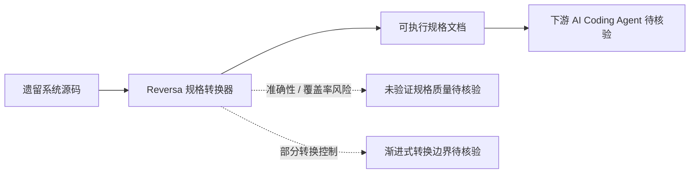

# Reversa

## 一句话定位
将遗留系统转换为 AI Coding Agent 可执行的规格文档，解决技术债务 Agent 化的核心瓶颈。

## 它解决的问题
**目标用户：** 维护大型遗留系统的企业架构师和技术负责人。

**痛点：**
- 企业核心系统往往有 10-20 年的历史，文档严重缺失或过时
- AI Coding Agent 需要清晰的规格才能有效工作，但遗留系统没有规格
- 手动编写规格的成本极高，且容易出错
- 技术债务的累积让系统越来越难维护和迁移

## 为什么值得关注（2026-05-05）
Reversa 尝试解决一个真实的企业级痛点：**如何让 AI Agent 理解和改造遗留系统**。565 stars + 226 forks（40% fork 率）说明有大量开发者在尝试这个方向。

## 热度来源判断
- **企业需求真实** — 技术债务是企业 IT 的永恒痛点
- **AI Agent 生态外溢** — Agent 热潮催生了"让 Agent 理解旧代码"的需求
- **Fork 率异常高** — 40% fork 率暗示很多人在尝试改造为自己的场景
- **炒作成分约 25%** — 自动化规格提取的准确率仍存疑

## 关键技术亮点亮点
1. **遗留代码 → 可执行规格** — 从源代码中提取结构化的功能规格
2. **Agent 兼容格式** — 输出格式专门针对 AI Coding Agent 优化
3. **渐进式转换** — 支持部分转换，不需要一次性重构整个系统

## 架构师速览

| 决策问题 | 研究判断 | 证据边界 |
|---|---|---|
| 系统边界 | Reversa 是"遗留代码 → AI Agent 可执行规格"的单向转换桥梁，不替代 Agent 或重构工具 | 仅有"一句话定位"与三项关键技术亮点；内部组件、数据流、模型依赖、输出格式规范均未在档案中披露 |
| 主路径 | 遗留源码输入 → 规格化提取 → 输出面向 AI Coding Agent 优化的规格文档；强调渐进式/部分转换 | 档案仅描述输入输出语义，未披露解析器类型、LLM 是否介入、是否调用外部模型、是否有中间表示 |
| 关键权衡 | 自动化提取覆盖度与规格可信度之间的取舍；增量价值需对冲"LLM 已能直接读旧代码"的替代风险 | "准确率存疑""意大利面条式代码效果有限""竞品空间"均为定性判断，无 benchmark、无准确率指标 |
| 最小 PoC | 选取一份结构较清晰的遗留模块，跑通"代码→规格→交给下游 Agent 重写"的端到端小闭环 | 档案未给出支持语言范围、CLI/库形态、集成方式或示例仓库，PoC 选型与验收口径需源码核验 |

## 架构启发
- "规格即接口" —— 如果 AI Agent 是新的开发者，那么规格文档就是新的 API
- 遗留系统现代化的新路径：**代码 → 规格 → Agent 重写**，而非传统的 **代码 → 人工重构**
- 这种"中间层"思路可以扩展到更多场景：API 文档生成、测试用例生成等

## 架构图（MMD）

> 证据边界：此图只采用本档案已有可核验描述；“待核验”节点不应视为项目实现事实。

## 定位判断
在 AI Agent 工具链中，Reversa 是一个 **桥梁工具**：
- 不是平台，不是基础设施
- 但它占据了一个重要的生态位：**遗留系统 → Agent 可理解格式** 的转换层
- 如果做得好，可能成为企业 AI 迁移工作流中的标准组件

## 风险 / 局限 / 泡沫点
1. **准确率挑战** — 遗留系统的歧义性极高，自动化规格提取的准确率存疑
2. **场景限制** — 可能只适用于结构较好的代码，对"意大利面条式代码"效果有限
3. **验证困难** — 生成的规格是否正确？如何自动化验证？
4. **竞品空间** — LLM 本身已经可以理解代码，Reversa 的增量价值需要验证

## 与同类项目的关系
- **GPT-Engineer** — 从自然语言生成代码，Reversa 是反向操作（从代码生成规格）
- **Codex / Claude Code** — AI Coding Agent 本身具备代码理解能力，Reversa 是其前置工具
- **各种代码分析工具（SonarQube 等）** — 传统静态分析，Reversa 增加了 AI 理解层

## 是否值得持续跟踪
**有限跟踪。** 方向有价值但产品尚早。关键观察点是：生成的规格质量是否达到"Agent 可以直接使用"的水平。

## 后续观察点
1. 生成的规格在实际 Agent 重写场景中的成功率
2. 是否扩展到更多语言和框架
3. 企业用户反馈和真实案例

---
*首次记录：2026-05-05*
