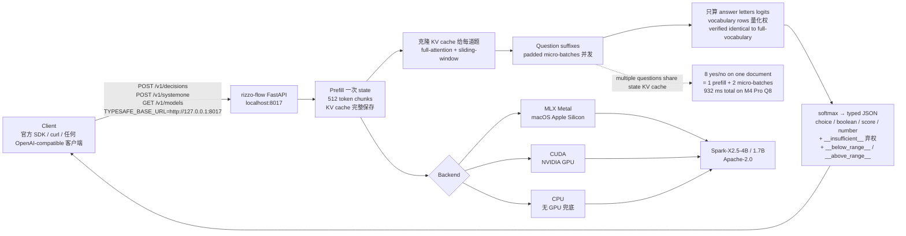

# Rizzo-AI-Academy/rizzo-flow

## 一句话定位
Jev 兼容 API 本地实现 + 0 generated tokens——基于 Spark-X2.5-4B Apache-2.0 开源权重 + MLX Metal / CUDA / CPU 三路径 + 1M tokens native context + 预填 KV cache 克隆给每道题 + 只算 answer letters logits 的「窄决策问题专用模型」严肃工程化。

## 它解决的问题
当前 Jev 决策模型在「**去 SaaS 化 + 自托管 drop-in**」赛道的痛点是「**Jev 是 closed hosted service + 用户希望 100% 本地 + 用户希望开源权重 + 用户希望修改模型 + 用户希望 0 generated tokens（不走解码循环）+ 用户希望 1M native context + 用户希望低内存 + 用户希望 MLX / CUDA / CPU 三路径 + 用户希望 KV cache 复用 + 用户希望 Jev-compatible API**」——rizzo-flow 把「**Spark-X2.5-4B / 1.7B Apache-2.0 开源权重 + MLX / CUDA / CPU 三路径 + 1M native context + ~250 ms / decision Q8 M4 Pro + ~5 GiB Q8 + 每个问题变多选 + 预填 KV cache 克隆给每道题 + 只算 answer letters logits + POST /v1/decisions + POST /v1/systemone + GET /v1/models**」做成 4770 KB Python 项目。

## 为什么值得关注（2026-09-22）
- **Stars:** 221（截至 2026-09-22），1 天新增 221⭐，fork 6
- **Forks:** 6（fork/star 2.7%，偏向观察收藏而非企业 fork）
- **Open Issues:** N/A（详情未抓取）
- **License:** Apache-2.0（明确许可可商用）
- **语言:** Python（3.11+）
- **规模:** 4770 KB（Python + Spark-X2.5 模型引用 + MLX / CUDA / CPU 后端 + Jev-compatible API）
- **活跃度:** created 2026-09-21，pushed 2026-09-21，1 天内快速迭代
- **Topics:** N/A（GitHub topics 未声明）
- **Homepage:** https://rizzo-ai-academy.github.io/rizzo-flow/
- **模型:** Spark-X2.5-4B / Spark-X2.5-1.7B（XHToken 出品，Apache-2.0）

## 热度来源判断
rizzo-flow 的热度是「**Jev 兼容 API 本地实现 + Spark-X2.5 Apache-2.0 + 0 generated tokens + KV cache 克隆 + 1M native context + MLX / CUDA / CPU 三路径 + uv 一键安装**」的强劲组合。Jev 决策模型从 09-15 ~ 09-21 的「**单点 API + SDK + 资源聚合 + 具身智能 + 可执行技能**」推到 09-22 的「**Spark-X2.5 Apache-2.0 开源权重 + Jev-compatible API + 0 generated tokens + 1M context + 多硬件**」严肃工程化，是「**Jev 去 SaaS 化从 GLiFormer encoder 到 Spark-X2.5 开源权重 + 多硬件兼容**」的演化。6 个 fork 反映「**Jev 兼容 API + 本地实现**」偏向观察收藏而非企业 fork（fork/star 2.7% 与昨日 thruwire/foreman 6.4% 相比偏低）。221⭐ / 1 天是 09-22 当日 GitHub Search created 2026-09-21..2026-09-22 stars>30 全站 trending 第二位。热度**真实且具备 Jev 兼容本地实现潜力**——但需警惕：Spark-X2.5 在 Jev 三类问题（noul / choice / score）的准确率与官方 Jev 的差距 + KV cache 克隆在多并发问题下的稳定性 + 1M native context 在大 state 上的实测表现。

## 关键技术亮点
1. **Spark-X2.5-4B / 1.7B Apache-2.0 开源权重:** 可商用可修改
2. **MLX Metal / CUDA / CPU 三路径:** macOS Apple Silicon / NVIDIA GPU / 无 GPU 全覆盖
3. **1M tokens native context:** 远超官方 Jev 的 32k state + 64k per request
4. **~250 ms / decision Q8 M4 Pro:** 单条决策延迟
5. **~5 GiB 内存 Q8:** 单卡可跑
6. **每个问题变多选:** A-Z 共 26 个 answer slots
7. **预填一次 + KV cache 克隆给每道题:** state 一次预填，每道题独立克隆 full-attention 和 sliding-window caches，question suffixes 在 padded micro-batches 跑
8. **只算 answer letters logits:** 只乘 answer letters 的 vocabulary rows（量化权），验证 identical to full-vocabulary projection
9. **0 generated tokens:** 不走解码循环，无 JSON 修复无类型错误
10. **4 类 typed decisions:** boolean / choice / score / numeric + 内置 `__insufficient__` 弃权 + `__below_range__` / `__above_range__` for numeric
11. **Jev 兼容三端点:** POST /v1/decisions native API + POST /v1/systemone Jev 兼容 + GET /v1/models
12. **TYPESAFE_BASE_URL=http://127.0.0.1:8017 即可替换官方:** drop-in replacement
13. **Bearer auth 仅当 RIZZO_API_KEY 设置时强制:** 默认开放
14. **`x_rizzo` 扩展字段:** timings + fingerprint
15. **Snake demo:** 140 步 25.6 秒 ≈ 5.5 / 秒 ≈ 150 ms / decision 真实速度未加速（RTX 5060 Ti CUDA Q8）
16. **uv sync --locked --extra mlx/cuda/cpu 一键安装:** macOS / Windows / Linux 全平台

## 架构师速览

| 决策问题 | 研究判断 | 证据边界 |
|---|---|---|
| 系统边界 | 自托管 Jev 兼容 API endpoint + Spark-X2.5 4B / 1.7B Apache-2.0 开源权重 + MLX / CUDA / CPU 后端 + 本地 LLM runtime；边界为本地网络端口 8017 + 本地 KV cache | 仅基于档案描述的 MLX / CUDA / CPU 三路径 + 1M context + Snake demo；三路径之间的实测性能差异、KV cache 跨路径兼容性未在档案中给出 |
| 主路径 | Client → POST /v1/decisions 或 /v1/systemone → Prefill state 一次（512 token chunks） → 克隆 KV cache 给每道题 → question suffixes 在 padded micro-batches 跑 → 只算 answer letters logits → softmax → typed JSON | 主路径为档案语义抽象；具体 micro-batch 调度、跨问题并行度、failure mode（KV cache OOM、token 超 cap）未在档案中给出 |
| 关键权衡 | 自托管 vs 官方 Jev（准确率差距）vs Spark-X2.5 开源权重（可商用）vs 0 generated tokens（不走解码）vs 1M context（远超官方 32k+64k）vs MLX / CUDA / CPU 多硬件兼容 vs README 三段明确边界 | 档案明示三段明确边界（Independent / Uncalibrated / Interface compatible, model not Jev）；具体 Spark-X2.5 vs 官方 Jev 在 reasoning-heavy tasks 的准确率 benchmark、企业部署案例未证实 |
| 最小 PoC | 单 Mac（Apple Silicon，M4 Pro）安装 `uv sync --locked --extra mlx` → 下载 Spark-X2.5-4B Q8 → 跑 Snake demo 验证 ~150 ms / decision → 跑 POST /v1/decisions boolean / choice / score / numeric 四类样本 → 设置 RIZZO_API_KEY 验证 Bearer auth → 跑多问题并发验证 KV cache 克隆稳定性 | PoC 范围、退出路径由档案「Snake demo + 四类 typed decisions + 三路径」建议推导；具体 Spark-X2.5 vs 官方 Jev 的对照表、企业部署 SLA 待核验 |

## 架构启发
rizzo-flow 的核心启发是「**窄决策问题专用模型可以从通用 LLM + KV cache 复用 + 0 generated tokens 路径实现**」。传统 LLM 走「token by token 串行解码 + JSON 修复」路线，对 narrow decision（boolean / choice / score）过度工程化。rizzo-flow 反向走「**预填一次 KV cache + 克隆给每道题 + 只算 answer letters logits + softmax → typed JSON**」路线——是「**窄决策 vs 通用生成**」的工程化对比。**更深层的启发是：Jev-compatible API 是「**Jev 决策模型从 closed hosted 推到 open source + 端到端本地**」的关键一步**——TYPESAFE_BASE_URL=http://127.0.0.1:8017 即可替换官方，是「**drop-in replacement**」的具体实现。**Spark-X2.5 Apache-2.0 开源权重 + 1M native context + ~5 GiB 内存 Q8 + MLX / CUDA / CPU 三路径**——是「**低门槛严肃本地化**」的工程化形式。**README 三段明确边界**——「Independent project, not affiliated with TypeSafe」+「Probabilities are uncalibrated unless you calibrate them」+「The interface is compatible, the model is not Jev」——是「**不冒认 + 不夸大 + 严肃表态**」的工程化形式。

## 架构图（MMD）

> 证据边界：此图只采用本档案已有可核验描述；「待核验」节点不应视为项目实现事实。

## 定位判断
**工具型项目（Jev 兼容 API 本地 drop-in）。** rizzo-flow 不仅是 API endpoint，更试图成为「**Jev 决策模型从 closed hosted 推到 open source + 端到端本地**」的具体实现——通过 Spark-X2.5 Apache-2.0 开源权重 + Jev-compatible API + 0 generated tokens + 1M native context + MLX / CUDA / CPU 三路径，把「**自托管严肃工程化**」做到极致。221⭐ + 6 fork 已显示社区初步关注。但「**平台化**」取决于一个关键问题：Spark-X2.5 在 Jev 三类问题（noul / choice / score）的准确率与官方 Jev 的差距是否能被「**完全本地 + 0 generated tokens + 1M context + 多硬件**」的优势抵消。目前定位是「**最有影响力的 Jev 兼容本地实现**」，向多模型 + 多平台 + 企业部署是合理路径。

## 风险 / 局限 / 泡沫点
- **Spark-X2.5 在 Jev 三类问题的准确率差距:** README 明示「The interface is compatible, the model is not Jev」，未给具体 benchmark 数字
- **Probabilities 未校准:** README 明示「Probabilities are uncalibrated unless you calibrate them」，confidence 数字需要用户自己校准
- **1M context 在大 state 上的实测表现:** 档案只测过 ~2000 token state，更大 state 表现未给出
- **多问题并发 + KV cache 克隆的内存压力:** 每个问题独立克隆 KV cache，N 个问题并发 = N × KV cache 内存
- **Jev-compatible API 的局限:** 某些官方 TypeSafe API 行为（abstain、specific confidence 公式）rizzo-flow 选择不实现
- **Spark-X2.5 模型维护:** 依赖 XHToken 持续维护 Spark-X2.5 模型权重
- **企业部署 SLA:** 单机本地 endpoint，无集群 / 高可用 / 监控
- **个人项目属性:** Rizzo-AI-Academy 组织维护，6 fork 但核心治理仍集中

## 与同类项目的关系
- **vs 官方 TypeSafe Jev endpoint:** 官方 closed hosted service + 32k state + 64k per request；rizzo-flow 是 Apache-2.0 + 1M native context + 完全本地
- **vs logan-markewich/jeff:** logan-markewich/jeff 是「**GLiFormer 400M encoder + typesafe-sdk 兼容 + 自托管 drop-in**」；rizzo-flow 是「**Spark-X2.5 4B Apache-2.0 + Jev-compatible API + 0 generated tokens + 1M context + MLX / CUDA / CPU 三路径**」——两者都做 Jev 去 SaaS 化但走不同技术路径
- **vs ekzhang/openjev-sglang:** openjev-sglang 是「**Jev-compatible API endpoint 基于开源模型 prefill-only**」；rizzo-flow 是「**Spark-X2.5 4B Apache-2.0 + 0 generated tokens + KV cache 克隆**」——同样 Jev-compatible API 但更严肃工程化
- **vs featherless-ai/simple-jev:** simple-jev 是「**开源模型转 classifier / jev endpoint**」；rizzo-flow 是「**Spark-X2.5 4B + 多硬件 + 多 typed decision**」——simple-jev 偏向单一转换，rizzo-flow 是完整 runtime
- **vs SemIf:** SemIf 是 rizzo-flow README 明示的灵感来源；rizzo-flow 是「**Spark-X2.5 + Apache-2.0 + 0 generated tokens + 1M context + Jev-compatible**」严肃化

## 是否值得持续跟踪
**值得跟踪（Jev 兼容本地实现候选）。** rizzo-flow 代表了「**Jev 决策模型从 closed hosted 推到 open source + 端到端本地**」的演化方向，无论其本身成败，这一方向是行业趋势。建议关注：Spark-X2.5 vs 官方 Jev 的准确率对照表、KV cache 克隆在多并发问题下的稳定性、1M native context 在大 state 上的实测、MLX / CUDA / CPU 三路径的实测性能、企业部署案例。对 Jev 决策模型应用开发者，这是「**Jev 兼容本地实现严肃工程化**」的具体样本，值得直接采用。对 AI 决策模型生态观察者，它是「**窄决策 vs 通用生成**」的头部样本。

## 后续观察点
- Spark-X2.5 vs 官方 Jev 在 reasoning-heavy tasks 的准确率对照表（决定本地化是否可行）
- KV cache 克隆在多并发问题下的内存压力与稳定性（决定多问题并发是否可用）
- 1M native context 在大 state（>2k token）上的实测表现（决定大 state 应用是否可行）
- MLX / CUDA / CPU 三路径的实测性能差异（决定多硬件兼容性）
- 概率校准工具链（解决 uncalibrated probabilities 问题）
- 企业部署案例（SLA / 监控 / 集群 / 容器化）
- 多模型支持（除 Spark-X2.5 外是否支持其他开源权重）
- 是否演化为 SaaS 产品（保持 Apache-2.0 严肃许可的同时提供托管服务）

---
> 数据来源: GitHub API (2026-09-22) | Stars: 221 | Forks: 6 | License: Apache-2.0 | 语言: Python | 创建: 2026-09-21 | 模型: Spark-X2.5-4B / 1.7B (Apache-2.0)