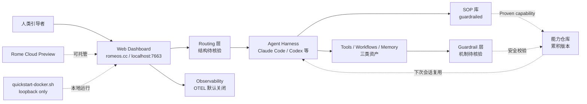

# rome-os/rome

## 一句话定位
自我标榜 "The agentic OS for humans and agents"——把 scaling axis 从模型参数转到**环境**（tools / workflows / memory / interfaces），让 agent 自己构建 harness、设计 SOP、编排工作流，并在引导下让"已验证的能力"留下累积；任何交互都会抬高下一次的天花板（README 原话："Every interaction raises the ceiling for the next"）。

## 它解决的问题
2026 年 agent 工具栈普遍有 3 个痛点：(1) **能力不累积**——每次新 session 都从空白 / AGENTS.md 开始，agent 学到的 SOP 散落在各 session 里，难以复用到下次；(2) **runtime 形态碎片化**——IDE 嵌入（Claude Code）/ 桌面客户端（herdrm）/ 聊天层（cumora）/ 独立计算机（OpenBot）各有用户群，没有统一抽象；(3) **agent 不能维护自己的工作流**——agent 可以执行 SOP 但不能修改 SOP，运维成本永远在 human side。Rome 把 scaling axis 从"模型参数"转到"环境"——把 tools / workflows / memory / interfaces 作为可被 agent 自身维护的资产。

## 为什么值得关注（2026-08-25）
- **2 天 278⭐**（GitHub API 可核验）：agentic-OS 赛道首个明确信号
- **License: MIT**：商用 / 企业内分发友好
- **首页 `romeos.cc` + Cloud Preview**：已有商业化路径（preview 阶段）
- **完整工程化模板**：Docker 一键启动 (`scripts/quickstart-docker.sh`，端口 7663 loopback only)、`pnpm dev:all` 启动 Rome + observability + routing + web dev server 全栈、Node 24+ / pnpm 11.6 依赖
- **topics 含 agent / agent-os / claude-code / codex / llm**：与主流 harness 兼容
- **README 11+ KB + docs/assets/ 含视频 demo**：产品形态相对完整
- **Discord / X 公开社区**：明确的开源治理信号

## 热度来源判断
Rome 的热度来自 **"agent 操作系统空白 + 大厂未官方化 + 完整产品形态"** 的组合：(1) agent runtime 当前主流形态（IDE 嵌入 / 桌面客户端 / 聊天层）已显碎片化，"OS 层"是公开的填空位；(2) Anthropic / OpenAI 官方 agent 工具尚未推出"官方 Agent OS"，给 Rome 留窗口；(3) Rome 不仅有 README，还有 Docker / Cloud / Discord / 全栈 dev 启动脚本——这是产品化团队（非 solo hobby）才会投入的工程。**主要泡沫点：** "agent 维护自己 SOP" 在技术上是否真的能跑通（涉及版本控制 / 冲突解决 / rollback）尚未在 README 中具体说明；与官方工具的竞争是产品战略级风险。

## 关键技术亮点
1. **"scaling environment not model" 作为核心哲学**：从 scaling laws 的对立面出发，把工具 / 流程 / 记忆作为增长轴
2. **agent 自己维护 harness / SOP / 编排流程**：在 guardrailed environment 下，agent 可以设计并迭代自己的工作流
3. **Docker 一键启动 + Cloud Preview 双轨**：降低试用门槛（loopback only 暗示安全默认）
4. **pnpm dev:all 全栈启动**：包括 Rome 本体 + observability + routing + web dev server——证明产品级集成
5. **Rome Cloud 已开放 preview**：意味着 Rome 不只是开源项目，还有 SaaS 商业路径
6. **明确 README 引用 VISION.md**：开源项目少有的"哲学文档独立于代码"的样本

## 架构师速览

| 决策问题 | 研究判断 | 证据边界 |
|---|---|---|
| 系统边界 | 包含 Rome runtime + observability + routing + web dev server 的全栈 agentic OS；本地用 Docker，远程用 Cloud；用户通过 web dashboard 与 agent 协作 | 边界由 README "Dashboard comes up at http://localhost:7663" + "pnpm dev:all starts Rome, observability, routing, and web development server" 描述确认；具体组件（router 是否独立服务？observability 是否 OTLP 协议？）需源码核验 |
| 主路径 | 人类引导 → agent 构建 harness / SOP / 编排 → guardrail 校验 → proven capability 入库 → 下次会话直接复用抬高天花板 | 主路径由 README "Agents build their own harnesses, design their own SOPs, and orchestrate workflows under your guidance. Proven capabilities stick." 描述确认；harness / SOP / 编排的具体数据结构、版本控制策略、guardrail 实现均待核验 |
| 关键权衡 | agent 自治 vs guardrail 安全（"guardrailed environment" 是 README 原话但未细化机制）；能力累积 vs 累积漂移（proved capability 长时间会否偏移？）；本地 vs Cloud（loopback only 是安全姿态但限制远程协作）；OS 抽象 vs IDE / 桌面嵌入 | 取舍由 README "guardrailed environment" / "loopback only" 描述确认；具体 guardrail 实现、漂移检测机制、远程协作模式均需源码核验 |
| 最小 PoC | 启动 Rome Docker → 在 web dashboard 创建一个 SOP 任务 → 让 agent 完成并保存为"proven capability" → 重启 Rome → 创建同类任务验证是否复用 | PoC 流程由 README "quickstart-docker.sh" + "Cloud preview" 描述推导；具体任务示例 / SOP 数据格式 / 复用机制均待核验 |
| 证据边界 | README + VISION.md + docker 脚本 + topics；具体 guardrail / SOP 累积实现、Cloud SLA、与官方 agent 工具的差异化战略均未公开 | 已核验事实来自 README 与 API；其他来自语义推断与产品哲学 |

## 架构图（MMD）

> 证据边界：此图只采用本档案已有可核验描述；"待核验"节点不应视为项目实现事实。

## 架构启发
Rome 的核心启发是 **"scaling 不只是模型参数的乘方，环境本身可以累积"**——这是把 RL 的"reward shaping"理念搬到工程层：让环境随每次交互变得更友好。更深层的启发：**agent 团队的能力上限由其可被维护的环境决定，而非单次 prompt 长度**——这与 backpass 的"AGENTS.md 自动改写"是同代产物，但 Rome 改的是整个工作流 / harness 库（不仅是 memory 文件）。再深一层：**"OS"这个抽象对 agent 时代的意义**——过去 30 年 OS 解决的是"应用与硬件的抽象层"，未来 agent OS 可能解决"agent 与业务目标的抽象层"——这是值得关注的范式转变。

## 定位判断
**平台候选（agentic OS 层）。** Rome 自定位与 OpenBot / cumora / herdrm 等"agent runtime"形成清晰层次差异——后者是"OS 之上的应用"，Rome 试图做"OS"。Star 2 天 278⭐、15 forks 已显示早期关注度。**主要竞争威胁：** Anthropic / OpenAI 官方 agent 工具的战略定位——若官方推出"官方 Agent OS"或收购类似项目，Rome 生态价值可能被快速吸收；Rome Cloud Preview 的商业模式需观察是否能撑起持续开发。**值得 6-12 月高频跟踪。**

## 风险 / 局限 / 泡沫点
- **与官方 agent 工具的正面竞争**：Anthropic Claude Code / OpenAI Codex 都在向"agent platform"演化，Rome 的 OS 层定位随时可能被官方反向整合
- **guardrail 实现细节未公开**：README 自述 "guardrailed environment" 但具体机制（谁阻止 agent 越权改 SOP？policy 表达？审计 trail？）未细化
- **proved capability 的版本控制 / 回滚策略缺失**：累积能力长时间运行可能 drift，回滚机制是关键问题
- **loopback only 限制远程协作**：默认绑定 loopback 是安全姿态，但远程团队需要显式 `--bind` 才能用，限制了"开箱即用"的远程协作
- **Rome Cloud Preview 阶段**：SLA / 数据驻留 / 计费模型未公开，企业内采用需等待 GA
- **2 天新项目，工程化承诺尚未经生产验证**：README 自述 "production multi-harness" 但具体"production 案例"未在 README 内嵌链接

## 与同类项目的关系
- **vs OpenBot / cumora / herdrm**：这些是"OS 之上的应用"（桌面 / 聊天 / 跨设备 harness），Rome 是 OS 层——层次差异
- **vs backpass（AGENTS.md 自动改写）**：backpass 切的是"memory 文件的元层"，Rome 切的是"workflow / harness 库的元层"——范围更广
- **vs Anthropic Skills / wshobson/agents**：这些是"skill 分发中心"，Rome 试图做"skill 执行环境 + 累积库"
- **vs MCP 协议生态**：MCP 是"agent 与 tool 的协议"，Rome 是"agent 与环境的整体抽象"
- **vs agent governance / agent audit 项目（如 Triad）**：Triad 解决"agent 不能给自己签字"，Rome 解决"agent 能给自己维护 SOP"——两个不同方向的问题

## 是否值得持续跟踪
**值得高频跟踪（agentic OS 层候选）。** 对所有关注 agent 基础设施的团队：**建议立即在 Docker 上跑 quickstart，观察 dashboard 与 agent 协作形态**；对做 agent 平台的产品经理：**这是判断"agent OS"是否会被大厂官方化的早期信号**；对企业 IT：**6-12 月内决定是否在 Rome Cloud Preview 上做 PoC**——若跑通，"agentic OS"可能成为企业 IT 标准层。

## 后续观察点
- guardrail 实现细节公开化（policy 表达、审计 trail）
- proved capability 的版本控制 / 回滚 / drift 检测机制
- Rome Cloud GA 时间表 / SLA / 数据驻留政策
- 与 Anthropic / OpenAI 官方 agent 工具的差异化战略调整
- 早期用户案例 / production 部署证据公开化
- 是否出现"agentic OS"层竞品（如 y combinator / 红杉投资的项目）

---
> 数据来源: GitHub API (2026-08-25) | Stars: 278 | Forks: 15 | License: MIT | 语言: TypeScript | 创建: 2026-08-23
