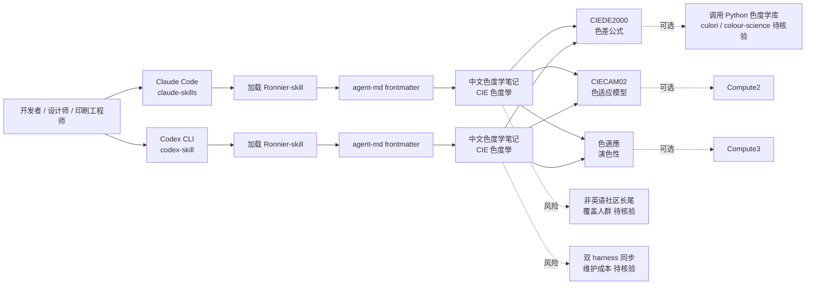

# Ayueh0102/Ronnier-skill

## 一句话定位
**色彩科學／色度學完整中文學習筆記，包装为 Claude Code skill + Codex skill**。README 自述涵盖 CIE 色度學、CIEDE2000、CIECAM02、色適應與演色性。**"领域专业知识 × Claude/Codex 双 harness skill"** 的标准化路径样本，延续 8-26 "非英语社区 skill 商品化"判断。

## 它解决的问题
色度学（colorimetry）是图像处理、显示设备、印刷、摄影等行业的核心技术，但面临两类痛点：(1) **学习门槛高**——CIEDE2000、CIECAM02 等色差公式复杂，公开教程碎片化；(2) **agent 时代缺乏领域知识封装**——coding agent 默认缺乏色度学专业计算能力。Ronnier-skill 直击这两点：**完整中文学习笔记 + Claude Code + Codex 双 harness skill 形态**。

## 为什么值得关注（2026-08-27）
- **1 天 49⭐ + 4 forks**：反映"非英语社区 × 垂直专业知识 × 双 harness skill"的市场窗口
- **完整的色度学覆盖**：topics 包含 ciecam02 / ciede2000 / cielab / color-appearance / color-science / colorimetry
- **双 harness 适配**：同时支持 Claude Code skill（claude-skills topic）和 Codex skill（codex-skill topic）
- **agent-md frontmatter**：遵循 agent skill frontmatter 标准
- **474 KB size**：笔记 + 文档 + 可能的计算脚本
- **延续 8-26 判断**：与 bam-bam-2/solo-skills（韩文一人企业）/ HanyuanWang（中文直播电商）/ Jordanwei1/jiaojie-skill（中文跨窗口交接）共同证明非英语社区 skill 的真实需求

## 热度来源判断
热度来自 **"非英语社区 × 垂直专业知识 × Claude/Codex 双 harness"** 的组合：(1) 色度学是图像处理 / 显示 / 印刷 / 摄影行业的核心技术，垂直深度足够；(2) 中文学习者缺乏系统化的色度学资源；(3) Claude Code + Codex 双 harness 适配扩大潜在用户群。**主要风险：** 49⭐ / 4 forks 仍属早期信号；无 license 阻碍 fork 与商用；色度学 skill 的真实使用场景（"agent 调用色度学计算" vs "人阅读色度学笔记"）需进一步核验；1 天新项目维护持续性待观察。

## 关键技术亮点
1. **完整的色度学覆盖**：CIE 色度學、CIEDE2000、CIECAM02、色適應、演色性等核心主题
2. **双 harness 适配**：Claude Code skill（claude-skills）+ Codex skill（codex-skill）——同一份笔记可被两类 coding agent 加载
3. **agent-md frontmatter**：遵循 agent skill frontmatter 标准
4. **中文笔记完整度**：topics 暗示笔记深度（ciecam02 / ciede2000 / cielab 等具体算法）
5. **颜色相关算法**：涵盖色差公式（CIEDE2000）、色适应模型（CIECAM02）、演色性评价等核心算法

## 架构师速览

| 决策问题 | 研究判断 | 证据边界 |
|---|---|---|
| 系统边界 | 一个 Markdown 笔记仓库 + Claude Code skill + Codex skill 三件套，仓库是适配产物而非运行时 | 仅基于 description 与 topics 的色度学覆盖与 Claude/Codex 双 harness 适配；具体 frontmatter 结构、内容深度（笔记 vs 计算代码）、是否提供 MCP server 形态均未在档案中明示（README 抓取超时） |
| 主路径 | 开发者安装 skill → Claude Code 或 Codex 加载 Ronnier-skill → 在色度学相关任务（色差计算 / 色适应转换 / 演色性评价）中调用 | 主路径来自 topics 的双 harness 适配与 description 的色度学覆盖；具体 skill 触发条件（关键词触发 vs 自动加载）、计算能力（是否可调用 Python 色度学库）需进一步核验 |
| 关键权衡 | 领域专业深度 vs agent skill 调用门槛 vs 双 harness 同步维护成本 vs 非英语社区的长尾价值 | 档案明示色度学覆盖与双 harness 适配；具体计算能力（vs 现有 culori / colour-science 库）、双 harness 同步维护成本、非英语社区的覆盖人群均待核验 |
| 最小 PoC | 在 Claude Code 安装 Ronnier-skill → 提 1 个色度学相关问题（如"用 CIEDE2000 计算两个 Lab 颜色的色差"） → 验证 agent 是否能调用 skill 给出正确结果 | PoC 范围由"先单 harness、单色度学问题、可对照 culori 库"原则推导；具体 skill 内容、调用接口、退出路径待核验 |

## 架构启发
Ronnier-skill 的核心启发是 **"领域专业知识 × Claude/Codex 双 harness skill" 的标准化路径** ——把小众硬核专业知识（色度学 / 法律 / 医学 / 化学）包装为 coding agent 可调用的 skill，是 12 月内最大的 skill 创业窗口。**与同类项目的启发：** 和 8-26 的 bam-bam-2/solo-skills（韩文一人企业）/ HanyuanWang（中文直播电商）/ Jordanwei1/jiaojie-skill（中文跨窗口交接）共同证明 **"非英语社区 × 垂直专业知识 × Claude/Codex 双 harness"** 是稀缺资产。**更深层的启发是：** "色度学"作为小众硬核专业，若 skill 化成功，将启发法律 / 医学 / 化学 / 建筑等其他垂直学科的 skill 化路径。

## 架构图（MMD）

> 证据边界：此图只采用本档案已有可核验描述；"待核验"节点不应视为项目实现事实。

## 定位判断
**工具型项目（domain-knowledge agent skill）。** Ronnier-skill 不做色度学计算（由 culori / colour-science 等 Python 库提供），只做"色度学领域知识 × Claude/Codex skill 形态"的封装——这是工具型定位。**核心竞争壁垒：** 完整色度学覆盖 + 中文笔记 + 双 harness 适配；与其他色彩相关 skill / 工具的差异化定位（"agent-friendly 色度学笔记"）。**主要风险：** 49⭐ / 4 forks 仍属早期信号；无 license 阻碍 fork 与商用；色度学 skill 的真实使用场景需进一步核验。若持续维护 + 验证使用场景，**6-12 月内有潜力成为"agent-friendly 垂直学科笔记"的标杆样本**。

## 风险 / 局限 / 泡沫点
- **早期信号**：49⭐ / 4 forks 仍属早期信号，社区关注度尚未形成
- **无 license**：阻碍企业 fork 与商用
- **使用场景待核验**：色度学 skill 的真实使用场景（"agent 调用色度学计算" vs "人阅读色度学笔记"）需进一步核验
- **1 天新项目**：维护持续性待观察
- **双 harness 同步成本**：Claude Code 与 Codex 双 harness 适配的同步维护成本
- **与现有色度学库的关系**：与 culori / colour-science / color-themes-py 等 Python 库的关系（互补 vs 重复）未明示
- **英文覆盖**：中文笔记对海外用户适用性有限，是否会翻译为英文待观察

## 与同类项目的关系
- **vs 8-26 bam-bam-2/solo-skills**：韩文一人企业生产力套件，Ronnier-skill 是中文色度学笔记，两者共同证明非英语社区 skill 商品化
- **vs 8-26 HanyuanWang/LiveStream-Agent-Studio**：中文直播电商，Ronnier-skill 是中文色度学，互补
- **vs 8-26 Jordanwei1/jiaojie-skill**：中文跨窗口交接，Ronnier-skill 是中文色度学，互补
- **vs culori / colour-science 等 Python 色度学库**：culori 是 JavaScript 色度学库，colour-science 是 Python 色度学库；Ronnier-skill 是 Claude/Codex skill 形态的色度学笔记，互补
- **vs 各类 awesome-xxx 列表**：awesome 列表是资源索引，Ronnier-skill 是可直接安装的 skill

## 是否值得持续跟踪
**值得跟踪（agent-friendly 垂直学科笔记的早期样本）。** Ronnier-skill 1 天 49⭐ + 4 forks 体现"非英语社区 × 垂直专业知识 × 双 harness skill"的早期市场窗口。**对独立开发者：** 12 月内"垂直学科（法律 / 医学 / 化学 / 建筑） × 中文/日文/韩文 × Claude/Codex 双适配 skill" 是最低门槛的 skill 创业路径。**对色度学用户：** 这是首个"色度学 agent skill"形态的封装。建议关注：(1) 使用场景是否清晰（agent 调用 vs 人阅读）；(2) 是否补上 license；(3) 是否扩展到更多垂直学科。

## 后续观察点
- 使用场景是否清晰（agent 调用色度学计算 vs 人阅读色度学笔记）
- 是否补上 OSI license（决定企业采用）
- 是否扩展到更多垂直学科（法律 / 医学 / 化学 / 建筑）
- 双 harness 同步维护的可持续性
- 是否提供英文版本（决定海外用户适用性）
- 与 culori / colour-science 等色度学库的关系（互补 vs 重复）

---
> 数据来源: GitHub API (2026-08-27) | Stars: 49 | Forks: 4 | License: 未声明 | 语言: PowerShell | 创建: 2026-08-26 | 数据截至 2026-08-27 19:30 UTC