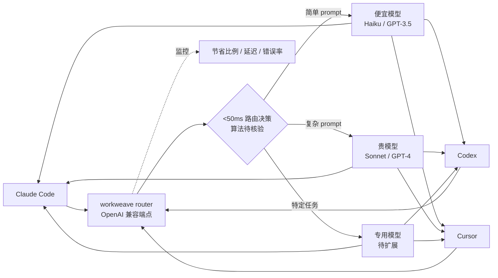

# workweave/router

## 一句话定位
面向 agentic 系统的多模型路由器——OpenAI 兼容端点切换，<50ms 决定每个 prompt 走哪个模型，宣称节省 40-70% 成本；4 个月 2,662⭐。

## 它解决的问题
企业部署 AI Coding Agent（Claude Code / Codex / Cursor / Copilot 等）时面临：(1) **模型成本高**——Sonnet / Opus / GPT-4 每次调用成本差异大，简单任务用大模型浪费；(2) **手动选模型繁琐**——开发者需根据任务复杂度决定用哪个模型；(3) **OpenAI 兼容协议壁垒**——Anthropic / OpenAI / Cohere 各有 API 协议，迁移成本高。workweave/router 直接把这三类问题工程化：作为 OpenAI 兼容代理层（用户无需改 base URL）+ 多模型支持（Anthropic / OpenAI / Cohare 等）+ 智能路由（按 prompt 复杂度 / 成本 / 延迟动态选择），让企业可以"在不改 Agent 配置的前提下"按 prompt 选模型。

## 为什么值得关注（2026-08-30）
- **Stars:** 2,662（截至 2026-08-30），**4 个月增长**——首次进入 GitHub Trending 日榜
- **Forks:** 77
- **License:** NOASSERTION——下游商业采用前必须读 LICENSE 文件
- **语言:** Go（推断）
- **活跃度:** created 2026-04-27，pushed 2026-08-29（近 24 小时活跃）
- **规模:** 19 MB
- **OpenAI 兼容端点：** 用户无需改 base URL——降低迁移门槛
- **多模型支持：** Topics 明示 `anthropic` / `claude-code` / `codex` / `openai-compatible`——明确指向 agentic coding
- **战略意义：** 与 8-29 acrylic 形成同期合流——"模型选择层"（router）和"harness 选择层"（acrylic）的中间件栈成型

## 热度来源判断
router 的热度是 **"AI Coding 成本压力 × OpenAI 兼容协议标准化 × 智能路由刚需 × Agentic Coding 部署真实需求"** 的组合。2,662⭐/4 个月 + 77 forks 在 AI Gateway 类项目中合理规模。热度**真实且具可持续性**——但需警惕：(1) "<50ms / 40-70%" 是 README 自述宣称，未经独立 benchmark 复现；(2) NOASSERTION License 增加商业采用门槛；(3) 与云厂商 AI Gateway（Cloudflare AI Gateway / AWS Bedrock 等）竞争风险。

## 关键技术亮点
1. **OpenAI 兼容端点**：用户无需改 base URL——降低迁移门槛，Topics 明示 `openai-compatible`
2. **<50ms 路由决策**：README 自述宣称，决策延迟极低
3. **多模型支持**：Anthropic / OpenAI / Cohere 等——Topics 明示 `anthropic` / `claude-code` / `codex`
4. **agentic coding 友好**：Topics 明示 `agentic-coding` / `claude-code` / `codex`——明确定位为 AI Coding 工具链中间件
5. **40-70% 成本节省宣称**：README 自述，需独立 benchmark
6. **19 MB 极小仓库**：轻量部署，单二进制（推断）

## 架构师速览

| 决策问题 | 研究判断 | 证据边界 |
|---|---|---|
| 系统边界 | OpenAI 兼容代理层（输入：用户 prompt）→ 路由决策（按 prompt / 成本 / 延迟）→ 目标模型 API（Anthropic / OpenAI / Cohere 等） | OpenAI 兼容 + 多模型是 Topics 明示；路由决策的具体算法（规则 / ML / embedding 相似度）需源码核验 |
| 主路径 | Agent 通过 OpenAI 兼容协议发请求 → router 解析 prompt → 路由决策（<50ms）→ 调目标模型 API → 返回响应 | OpenAI 兼容 + <50ms 是 README 明示；具体路由规则可配置性需独立核验 |
| 关键权衡 | 路由开销（<50ms）vs 决策质量 vs 多模型 API 稳定性 vs 缓存策略 vs 商业 license（NOASSERTION）vs 与云厂商 AI Gateway 竞争 | "40-70% 节省" 是 README 自述；具体节省场景与边界条件需 benchmark 复现 |
| 最小 PoC | 在 Claude Code 或 Codex 中把 base URL 指向 router → 验证简单 prompt 路由到便宜模型（如 Haiku）→ 验证复杂 prompt 路由到贵模型（如 Sonnet）→ 验证端到端延迟 <50ms + 整体节省比例 | OpenAI 兼容端点切换是 Topics 明示；具体路由规则可配置性需 README 独立核验 |

## 架构启发
router 的核心启发是 **"AI Gateway / Model Router 是 agentic 系统的必备中间层"**。随着 Claude Code / Codex / Cursor 等 Coding Agent 在企业普及，"按 prompt 选模型"的省钱 / 提质需求变成必备。router 的创新不在于"AI Gateway"（Cloudflare / AWS Bedrock 等已有），而在于"OpenAI 兼容端点切换 + agentic coding 专属优化"——这是把"AI Gateway"从"云厂商基础设施"做成"AI Coding 工具链中间件"的关键一步。更深层的启发是 **"agentic 系统的中间件栈正在形成"**——router（模型选择层）+ acrylic（harness 选择层）+ workweave-router 的组合说明："按 prompt 选模型"和"按 harness 选模型"形成完整栈，类似软件架构中的 API Gateway + Service Mesh 模式。下一波可能是按 prompt 选 embedding / RAG 引擎 / vector store 的"AI 工作流路由器"。

## 架构图（MMD）

> 证据边界：此图只采用本档案已有可核验描述；"待核验"节点不应视为项目实现事实。

## 定位判断
**基础设施候选项目（agentic 系统的模型路由中间件）。** router 定位明确——agentic 系统的模型路由器。2,662⭐/4 个月在 AI Gateway 类项目中合理规模。但"AI Coding 模型路由器"的护城河在于：(1) 路由决策算法精度（决定 40-70% 节省的真实性）；(2) 与云厂商 AI Gateway 的差异化（决定独立工具的价值）；(3) NOASSERTION License 后续是否明确为可商用许可。目前定位是"agentic 系统的 AI Coding 模型路由器代表"，向"agentic 系统中间件标准"演进是合理路径。

## 风险/局限/泡沫点
- **"<50ms / 40-70%" 宣称复现风险**：README 自述基准未经独立测试，若实际表现不达宣称，2,662⭐ 的早期采用可能回落
- **NOASSERTION License 商业风险**：下游商业采用前必须读 LICENSE 才能确定 SPDX 兼容性
- **与云厂商 AI Gateway 竞争风险**：Cloudflare AI Gateway / AWS Bedrock / Azure OpenAI 等云厂商 AI Gateway 已有成熟方案，独立工具需明确差异化
- **19 MB 极小仓库的内容有限**：可能仅覆盖核心路由功能，对冷门场景（多模态 / embedding / RAG 路由）覆盖不足
- **个人项目属性**：workweave 个人维护，77 forks 但核心治理集中，可持续性存疑
- **4 个月数据不足以判断长期采用曲线**：2,662⭐ 是早期增长，但 Model Router 类项目的长期价值取决于路由决策精度

## 与同类项目的关系
- **vs Cloudflare AI Gateway：** 云厂商 AI Gateway，router 是独立工具 + OpenAI 兼容端点切换
- **vs AWS Bedrock：** 云厂商 AI Gateway，router 是独立工具 + agentic coding 专属优化
- **vs 8-29 acrylic（agent-agnostic ADE）：** 同期合流——acrylic 走"harness 选择层"，router 走"模型选择层"
- **vs Portkey / Helicone：** 类似 AI Gateway 项目，router 是较新的进入者
- **vs LiteLLM：** LiteLLM 是统一 LLM API 库，router 是运行时路由代理

## 是否值得持续跟踪
**值得跟踪（agentic 系统的模型路由中间件）。** router 代表"AI Coding 工具链的模型路由层"方向，无论其本身成败，这一方向是行业趋势。建议关注：路由决策算法精度（决定 40-70% 节省的真实性）、是否被云厂商集成、是否扩展到 embedding / RAG / vector store 路由。对 AI Coding 部署团队，router 是当前最易用的 OpenAI 兼容模型路由器。对中间件观察者，它是"agentic 系统中间件栈"路径的成功样本。

## 后续观察点
- "<50ms / 40-70%" 宣称的独立 benchmark 复现
- NOASSERTION License 后续是否明确为 MIT / Apache-2.0 等可商用许可
- 是否被云厂商（Cloudflare / AWS / Azure）集成或参考
- 是否扩展到 embedding / RAG / vector store 路由
- 4 个月增长曲线能否在 6 个月后保持稳定
- 是否与 acrylic（harness 选择层）形成"模型 + harness 完整中间件栈"

---
*首次记录：2026-08-30*